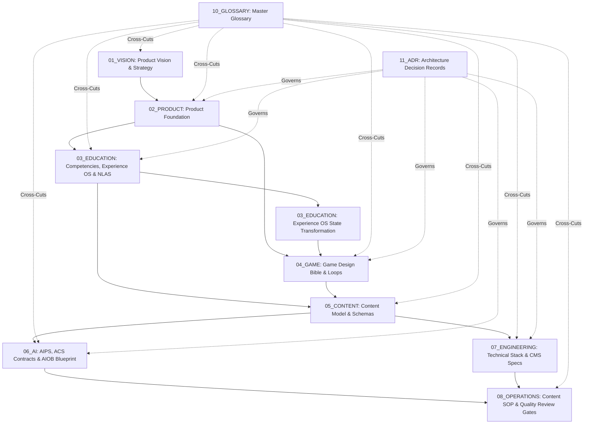

# NovaStars OS System Architecture Map

## Purpose
Provides a visual, graph-based topological representation of NovaStars OS, mapping directional data and dependency flow across Vision, Product, Education, Game, Content, AI, Engineering, Operations, Glossary, and ADR domains.

## Scope
Covers system-wide document linkages and knowledge propagation pathways.

## High-Level Topology Map

## Domain Flow Explanation
1. **Strategic Intent (`01_VISION` & `02_PRODUCT`)**: Establishes pedagogical goals and user experience boundaries.
2. **Pedagogical & Engagement Engine (`03_EDUCATION` & `04_GAME`)**: Defines learning mastery models and fun gameplay loops.
3. **Data Contracting (`05_CONTENT`)**: Translates education and game rules into machine-readable JSON/Zod schemas.
4. **Autonomous Production & Tech Execution (`06_AI` & `07_ENGINEERING`)**: Executes prompt pipelines and client app rendering.
5. **Quality Assurance & Distribution (`08_OPERATIONS`)**: Verifies content through 5 Review Gates before release.

## Dependencies & Upstream Links (`depends_on`)
- [Master Navigation Portal](file:///Users/thuy/Documents/apptieuhoc/00_HOME/index.md) (`ID: NS-HOM-INDX-001`)

## Governance & Metadata
- **Owner:** Chief Knowledge Architect
- **Status:** FROZEN
- **Version:** 1.0.0
- **Last Updated:** 2026-08-04
