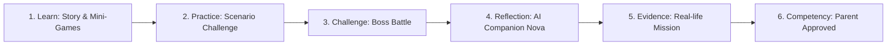
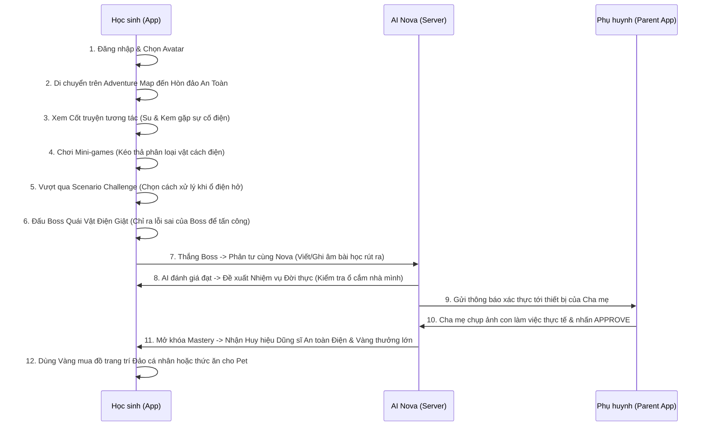

# 📁 TÀI LIỆU NỀN TẢNG SẢN PHẨM: NOVASTARS LIFE SKILLS ADVENTURE (EPIC 1 - PRODUCT FOUNDATION)
*Tài liệu Kỹ thuật Nội bộ của Product Team - Cấm Sao chép & Phổ biến Ngoài Dự án*

---

## 1. PRODUCT VISION (TẦM NHÌN SẢN PHẨM)

### Purpose
Định vị mục tiêu dài hạn, kim chỉ nam hành động và lý do tồn tại tối cao của sản phẩm EdTech NovaStars trên thị trường.

### Description
NovaStars Life Skills Adventure được xây dựng để trở thành nền tảng định hình hành vi và năng lực thực tế hàng đầu cho trẻ em.
*   **Vision (Tầm nhìn)**: Kiến tạo một thế giới nơi mọi trẻ em đều được trang bị đầy đủ năng lực thực tế và sự tự tin để tự chủ cuộc sống, ứng phó linh hoạt với mọi biến động.
*   **Mission (Sứ mệnh)**: Xây dựng cầu nối vững chắc giữa bài học số hóa và thực tiễn đời sống thông qua mô hình học tập tương tác sâu:
    $$\text{Competency} = \text{Story} + \text{Game} + \text{AI} + \text{Reflection} + \text{Practice} + \text{Real-life Mission} + \text{Evidence}$$
*   **Long-term Vision (Tầm nhìn Dài hạn)**: Phát triển từ một ứng dụng đơn lẻ tại Việt Nam thành hệ sinh thái Giáo dục Năng lực Quốc tế đa ngôn ngữ, tích hợp các công nghệ AR/IoT và kết nối đồng bộ giữa Gia đình - Nhà trường - Xã hội vào năm 2028.
*   **Success Definition (Định nghĩa Thành công)**: 
    *   *Về mặt Giáo dục*: Học sinh thay đổi hành vi thực tế, tỷ lệ Mastery đạt trên 75% số kỹ năng đăng ký.
    *   *Về mặt Sản phẩm*: Đạt mốc 500.000 người dùng hoạt động hàng tháng (MAU), tỷ lệ giữ chân D30 $> 40\%$, mức độ hài lòng của phụ huynh (NPS) $> 60$.

### Reasoning
Kỹ năng sống không thể được dạy bằng lý thuyết suông hay các bài kiểm tra trắc nghiệm áp đặt. Theo Thuyết kiến tạo sư phạm (Constructivism), trẻ chỉ thực sự tiếp thu và chuyển hóa kiến thức thành năng lực khi trực tiếp trải nghiệm, đưa ra quyết định trong bối cảnh cụ thể và áp dụng ngoài đời thực. Công nghệ AI Companion đóng vai trò cá nhân hóa tiến trình này để phù hợp với tốc độ phát triển tâm sinh lý độc bản của từng trẻ.

### Impact
*   **Thiết kế & Game**: Mọi tính năng game, cốt truyện và mỹ thuật bắt buộc phải phục vụ mục tiêu rèn luyện năng lực thực tế, không thiết kế tính năng giải trí thuần túy hoặc không có giá trị giáo dục.
*   **Kỹ thuật**: Hệ thống hạ tầng phải sẵn sàng cho việc tích hợp AI đa phương tiện (giọng nói, hình ảnh) và kiến trúc đa ngôn ngữ (i18n).

### Trade-off
Việc tập trung vào giá trị năng lực thực tế và yêu cầu xác thực từ phụ huynh khiến tốc độ hoàn thành màn chơi của học sinh chậm hơn rất nhiều so với các ứng dụng giải đố thông thường. Điều này có thể làm giảm lượng tương tác tức thì trong ngắn hạn nhưng xây dựng giá trị trung thành bền vững dài hạn.

### Future Dependency
*   Khung năng lực đa ngôn ngữ cho thị trường Global (Phase 5).
*   Hạ tầng AI Engine tự động phân tích hành vi phức tạp của học sinh.

---

## 2. PRODUCT POSITIONING (ĐỊNH VỊ SẢN PHẨM)

### Purpose
Xác định phân khúc người dùng mục tiêu, những vấn đề cốt lõi mà sản phẩm giải quyết và định hình vị thế cạnh tranh độc bản trên thị trường EdTech.

### Description
NovaStars tự định vị là **Competency Adventure Platform** (Nền tảng Phiêu lưu Năng lực) đầu tiên dành riêng cho học sinh tiểu học.
*   **Đối tượng (Target Persona)**: Học sinh Tiểu học (6 - 11 tuổi) là nhân vật trải nghiệm chính; Phụ huynh học sinh đóng vai trò người đồng hành, hướng dẫn và xác thực.
*   **Vấn đề (Problem)**: 
    *   Trẻ em thiếu hụt nghiêm trọng các kỹ năng sinh tồn, an toàn vật lý và quản lý cảm xúc do chương trình học thuật quá tải.
    *   Phụ huynh bận rộn, thiếu công cụ và phương pháp sư phạm khoa học để dạy con.
    *   Thị trường tràn ngập các Quiz App lý thuyết khô khan (gây áp lực học đường) hoặc Game thuần giải trí (gây lo ngại nghiện thiết bị).
*   **Giá trị (Value Proposition)**: Chuyển hóa thời gian sử dụng thiết bị điện tử của trẻ thành các hoạt động phát triển kỹ năng thực tế ngoài đời, gắn kết tình cảm gia đình mà không tạo áp lực điểm số.
*   **Khác biệt (USP)**:
    1.  Khung đánh giá năng lực đa tầng LSCAF (Tiers A-E).
    2.  Vòng lặp tương tác đời thực (Real-life Mission loop) buộc trẻ phải hành động ngoài màn hình.
    3.  AI Companion cá nhân hóa, thấu cảm, đóng vai trò người bạn thay vì người chấm điểm.
*   **Competitor Landscape (Bản đồ Cạnh tranh)**:

| Tiêu chí định vị | LMS & Quiz App Truyền thống | Game Giải trí Thuần túy | NovaStars |
| :--- | :--- | :--- | :--- |
| **Bản chất cốt lõi** | Kiểm tra kiến thức lý thuyết | Giải trí, giữ chân kiếm doanh thu | **Hình thành năng lực thực tế** |
| **Động lực thúc đẩy** | Điểm số, bảng xếp hạng thi đua | Vật phẩm ảo, tiền ảo | **Cốt truyện, AI Companion, Nhiệm vụ thực** |
| **Đầu ra giáo dục** | Ghi nhớ ngắn hạn | Phản xạ tay mắt | **Hành vi thực tế & Portfolio năng lực** |

### Reasoning
Mảng giáo dục kỹ năng sống cho trẻ tiểu học hiện là một "Đại dương xanh" (Blue Ocean) tại Việt Nam và Đông Nam Á. Phụ huynh sẵn sàng chi trả cho các sản phẩm giúp con tự lập và an toàn hơn, nhưng họ cực kỳ bài xích việc con dán mắt vào màn hình chỉ để chọn đáp án trắc nghiệm A, B, C vô ích.

### Impact
*   **Marketing**: Định hướng truyền thông tập trung vào giá trị "Con tự lập - Bố mẹ nhàn tênh" thay vì cam kết điểm số học thuật.
*   **Product Loop**: Chặn tiến trình game (Gated Progression) tại bước xác thực của phụ huynh là cơ chế bắt buộc.

### Trade-off
Sản phẩm kén chọn đối tượng phụ huynh hơn vì đòi hỏi họ phải bỏ ra 2-3 phút mỗi ngày để kiểm chứng con. Nếu phụ huynh hoàn toàn bỏ mặc con, Gameplay Loop sẽ bị nghẽn.

### Future Dependency
*   Các nghiên cứu khảo sát hành vi phụ huynh tại các thị trường Đông Nam Á (Indonesia, Thái Lan) phục vụ bản địa hóa.

---

## 3. PRODUCT PHILOSOPHY (TRIẾT LÝ SẢN PHẨM)

### Purpose
Xác lập các tư tưởng triết lý cốt lõi cấu thành nên linh hồn của sản phẩm, làm nền tảng cho mọi quyết định thiết kế tính năng.

### Description
Hệ thống triết lý của NovaStars dựa trên 5 trụ cột:
1.  **Competency First (Năng lực là số một)**: Học là để làm được, không phải để nhớ được. Mọi tính năng đều hướng tới việc thay đổi hành vi thực tế của trẻ ngoài đời thực.
2.  **AI First (Trợ lý thông minh đi đầu)**: AI không phải là công cụ phụ trợ, mà là người bạn đồng hành cá nhân hóa tiến trình học tập, phản tư và kích thích tư duy độc lập của trẻ.
3.  **Story First (Cốt truyện dẫn dắt)**: Học tập là một cuộc phiêu lưu. Trẻ tiếp thu kỹ năng tự nhiên thông qua việc nhập vai giải quyết các vấn đề của nhân vật hoạt họa.
4.  **Play First (Học qua trò chơi)**: Sử dụng các cơ chế Gamification sâu sắc để duy trì động lực tự thân (Intrinsic Motivation), khiến trẻ tự nguyện tham gia mà không cần ép buộc.
5.  **Parent Partnership (Đồng hành cùng cha mẹ)**: Ứng dụng là cầu nối thắt chặt tình cảm gia đình. Cha mẹ tham gia tích cực với vai trò là người chứng kiến sự trưởng thành của con.

### Reasoning
Học sinh tiểu học có độ tập trung ngắn hạn (15-20 phút). Mọi phương pháp giáo khoa truyền thống đều thất bại trong việc duy trì sự hứng thú của trẻ tại nhà. Bằng cách lồng ghép Cốt truyện (Story) và Trò chơi (Play), chúng ta mở khóa cánh cửa nhận thức của trẻ, sau đó dùng AI và Nhiệm vụ thực tế để củng cố năng lực bền vững.

### Impact
*   **Thiết kế Giao diện**: Tránh xa các UI kiểu dashboard bài học của trường học. Giao diện phải mang đậm tính phiêu lưu kỳ thú.
*   **Nội dung**: Soạn thảo kịch bản hội thoại AI Companion cực kỳ tỉ mỉ để thể hiện tính thấu cảm, động viên cao.

### Trade-off
Tích hợp hệ thống cốt truyện tương tác và AI thời gian thực làm tăng chi phí sản xuất nội dung mỹ thuật và phí API Gemini đáng kể.

### Future Dependency
*   Bộ quy chuẩn về phát triển hội thoại AI (AI Tone of Voice guidelines) cho trẻ em.

---

## 4. PRODUCT DNA (BẢN SẮC SẢN PHẨM)

### Purpose
Xác định những đặc tính di truyền bắt buộc phải xuất hiện trong mọi tế bào (tính năng, màn chơi, giao diện) của sản phẩm.

### Description
Bản sắc độc quyền của NovaStars được định nghĩa bằng 5 ký tự viết tắt: **A-S-C-R-A**:
*   **Adventure (Phiêu lưu)**: Người chơi khám phá một thế giới mở 2D gồm 6 hòn đảo năng lực. Việc học được chia thành các cột mốc khám phá bản đồ.
*   **Story (Cốt truyện tương tác)**: Luôn bắt đầu bằng tình huống truyện tranh tương tác của các nhân vật Su, Kem và Nova.
*   **Competency (Năng lực thực tế)**: Không có điểm số học thuật. Tiến trình được đo bằng Portfolio năng lực tích lũy qua các minh chứng thực tế.
*   **Real Life (Đời sống thực)**: Màn chơi bắt buộc phải dẫn đến hành động vật lý ngoài đời (Real-world Mission).
*   **AI (Trí tuệ nhân tạo)**: Có sự hiện diện của AI Companion Nova phản hồi, tương tác linh hoạt theo thời gian thực.

### Reasoning
Việc chuẩn hóa DNA sản phẩm giúp đội ngũ biên tập viên nội dung, thiết kế game và kỹ sư lập trình luôn đi đúng một hướng thống nhất. Nếu một tính năng được đề xuất không chứa ít nhất 3 trong 5 yếu tố DNA trên, tính năng đó sẽ bị loại bỏ khỏi backlog.

### Impact
*   **Content Production SOP**: Ràng buộc cứng trong quy trình biên soạn câu hỏi của Content Team. Mọi kỹ năng trong database bắt buộc phải có câu chuyện dẫn dắt và nhiệm vụ thực tế tương ứng.

### Trade-off
Giới hạn khả năng thiết kế các tính năng học nhanh, kiểm tra nhanh (micro-learning) thuần túy.

### Future Dependency
*   Hệ thống kiểm duyệt nội dung tự động dựa trên DNA sản phẩm (Content Validator script).

---

## 5. CORE PRINCIPLES (CÁC NGUYÊN TẮC CỐT LÕI)

### Purpose
Thiết lập các giới hạn đỏ, các nguyên tắc bắt buộc không được vi phạm trong quá trình thiết kế trải nghiệm người dùng và phương pháp sư phạm.

### Description
1.  **Không giảng bài trực diện (No Lectures)**: Tuyệt đối không có các video bài giảng kéo dài hay các trang tài liệu đọc lý thuyết khô khan. Kiến thức được truyền tải hoàn toàn qua cốt truyện và tương tác mini-game.
2.  **Không học thuộc lòng (No Rote Learning)**: Không kiểm tra khả năng nhớ định nghĩa chữ. Tất cả câu hỏi phải là câu hỏi tình huống mô phỏng thực tế trực quan.
3.  **Không trắc nghiệm đơn thuần (No Pure Quizzes)**: Hạn chế tối đa các câu hỏi trắc nghiệm chỉ có chữ. Thay thế bằng mini-games tương tác vật lý (kéo thả, phân loại, tìm điểm hazard, vẽ hình).
4.  **Không trừng phạt (Positive Reinforcement)**: Khi trẻ làm sai hoặc thua Boss, không trừ điểm, không phạt. Nova sẽ xuất hiện đỡ đòn, động viên và giải thích trực quan để trẻ thử lại.
5.  **An toàn là trên hết (Safety-First)**: 
    *   Mọi nhiệm vụ đời thực do AI đề xuất phải được kiểm duyệt an toàn vật lý tuyệt đối cho trẻ.
    *   Hệ thống AI Companion có guardrails bảo vệ, không trả lời các chủ đề nhạy cảm, không phù hợp lứa tuổi.
    *   Bảo mật thông tin hình ảnh/video minh chứng của trẻ trên Cloud Storage.

### Reasoning
Tâm lý học trẻ em chỉ ra rằng hình phạt và áp lực điểm số làm tắt nghẽn khả năng tiếp thu tự nhiên và tạo ra tâm lý đối phó ở trẻ nhỏ. An toàn thông tin và an toàn vật lý là điều kiện sống còn để xây dựng lòng tin ở phụ huynh khi cho con tiếp cận công nghệ.

### Impact
*   **UI/UX**: Không sử dụng màu đỏ cảnh báo thất bại, không có âm thanh trừng phạt nặng nề. Giao diện Boss Battle khi thua sẽ hiển thị hoạt ảnh Nova bay ra dùng khiên bảo vệ nhân vật và động viên trẻ.
*   **Database**: Lược đồ dữ liệu lưu trữ lịch sử làm bài không lưu các điểm số âm hoặc điểm số đánh giá thấp học lực của trẻ.

### Trade-off
Đội ngũ nội dung phải tốn nhiều thời gian hơn để nghĩ ra các hình thức tương tác thay thế trắc nghiệm truyền thống.

### Future Dependency
*   Hệ thống kiểm duyệt an toàn tự động (Automated Safety Guardrail System) tích hợp trong API Gateway.

---

## 6. LEARNING PHILOSOPHY (TRIẾT LÝ GIÁO DỤC)

### Purpose
Đặc tả chi tiết tiến trình sư phạm khoa học giúp chuyển hóa kiến thức sơ khai thành thói quen và năng lực thực tế ổn định ở trẻ.

### Description
NovaStars áp dụng chu trình học tập khép kín **6 bước tiến trình năng lực**:

$$\text{Learn} \rightarrow \text{Practice} \rightarrow \text{Challenge} \rightarrow \text{Reflection} \rightarrow \text{Evidence} \rightarrow \text{Competency}$$

1.  **Learn (Học ngữ cảnh)**: Tiếp thu khái niệm qua Interactive Story và củng cố kiến thức nền (Tiers A & B) bằng Mini-games trực quan.
2.  **Practice (Luyện tập đưa quyết định)**: Đứng trước các tình huống lựa chọn hành động tối ưu (Tier C - Scenario Challenge) trên ứng dụng.
3.  **Challenge (Đấu tranh nhận thức)**: Boss Battle (Tier D - Đánh giá) yêu cầu học sinh đóng vai người sửa sai cho Boss để thể hiện sự thấu suốt hành vi.
4.  **Reflection (Phản tư sâu sắc)**: Tương tác 1-1 với AI Nova (Tier E - Phản tư) bằng ngôn ngữ tự nhiên để tự kết nối bài học với cuộc sống của bản thân.
5.  **Evidence (Tạo lập bằng chứng)**: Thực hiện nhiệm vụ vật lý ngoài đời thực (Real-life Mission) và ghi lại minh chứng (chụp ảnh/video).
6.  **Competency (Hình thành năng lực)**: Phụ huynh kiểm chứng hành động thực tế của con và duyệt trên hệ thống để chính thức đóng vòng lặp năng lực (Unlock Mastery).

### Reasoning
Tiến trình này được thiết kế dựa trên sự kết hợp giữa **Thuyết học tập trải nghiệm của David Kolb** (Experiential Learning Theory) và **Khung phân loại tư duy Bloom cải tiến** dành riêng cho giáo dục tiểu học. Nó đảm bảo trẻ đi từ tầng nhận thức thấp (Biết, Hiểu) lên tầng tư duy cao (Phân tích, Đánh giá, Sáng tạo/Vận dụng đời thực).

### Impact
*   **Ứng dụng Client**: Giao diện tiến trình màn chơi bắt buộc phải khóa các bước tiếp theo cho đến khi hoàn thành bước trước đó (Linear Progression).
*   **Hệ thống Portfolio**: Nhật ký năng lực sẽ hiển thị đầy đủ hình ảnh thực hành (Evidence) và đoạn hội thoại phản tư (Reflection) làm chứng chỉ năng lực thực chất cho trẻ.

### Trade-off
Yêu cầu học sinh phải hoàn thành nhiệm vụ thực tế ngoài đời thực có thể gây gián đoạn trải nghiệm chơi game liên tục của trẻ. Trẻ không thể "phá đảo" game chỉ trong một ngày ngồi trên ghế sofa.

### Future Dependency
*   Công cụ AI Assessor chấm điểm tự động các minh chứng hình ảnh/video đầu vào trước khi gửi cho phụ huynh.

---

## 7. USER PERSONAS (HỒ SƠ NGƯỜI DÙNG)

### Purpose
Xác định rõ đặc điểm hành vi, tâm lý, mục tiêu và rào cản của mọi đối tượng tương tác trực tiếp hoặc gián tiếp với hệ thống để tối ưu hóa UI/UX phù hợp.

### Description

#### A. Học sinh Tiểu học nhỏ tuổi (6 - 8 tuổi - Lớp 1, 2) - *The Novice Adventurer*
*   **Đặc điểm**: Chưa thạo gõ bàn phím tiếng Việt, tư duy bằng hình ảnh trực quan sinh động, rất thích nuôi thú cưng (Pets) và các phần thưởng lấp lánh. Dễ nản chí nếu giao diện chứa quá nhiều chữ.
*   **Mục tiêu**: Vui chơi, nuôi Pet tiến hóa, đồng hành cùng sao nhỏ Nova.
*   **Rào cản**: Khó khăn trong việc trả lời phản tư bằng văn bản (Tier E).
*   **Mitigation**: Hệ thống hỗ trợ hoàn toàn cơ chế ghi âm giọng nói (Speech-to-Text) và câu hỏi gợi mở siêu ngắn từ AI.

#### B. Học sinh Tiểu học lớn tuổi (9 - 11 tuổi - Lớp 3, 4, 5) - *The Expert Adventurer*
*   **Đặc điểm**: Đã biết gõ phím nhanh, tư duy logic bắt đầu phát triển, yêu thích cá nhân hóa nhân vật (Skins), muốn thử thách có độ khó cao và cốt truyện có chiều sâu kịch tính.
*   **Mục tiêu**: Vượt qua các trận đấu Boss Battle khó, trang trí hòn đảo cá nhân độc đáo để chứng tỏ bản thân.
*   **Rào cản**: Dễ thấy nhàm chán nếu mini-games quá đơn giản, lặp đi lặp lại.
*   **Mitigation**: Thiết kế Boss Battle 5 HP với các tình huống lắt léo và độ hiếm vật phẩm trong Shop đa dạng hơn.

#### C. Phụ huynh Học sinh - *The Busy Guide & Verifier*
*   **Đặc điểm**: Rất bận rộn, quan tâm đến an toàn của con, sợ con nghiện thiết bị điện tử, mong muốn con hình thành thói quen tốt ngoài đời nhưng không có thời gian dạy con một cách bài bản.
*   **Mục tiêu**: Theo dõi tiến bộ thực tế của con thông qua các số liệu rõ ràng, xác thực con làm việc tốt một cách nhanh chóng.
*   **Rào cản**: Ngại sử dụng các ứng dụng quá phức tạp, không thích nhận thông báo spam liên tục.
*   **Mitigation**: Thiết kế luồng xác thực "One-click" trên thiết bị di động, gửi thông báo đẩy thông minh 1 lần/ngày vào khung giờ tối.

#### D. Content Team - *The Curriculum Builder*
*   **Đặc điểm**: Chuyên gia giáo dục/tâm lý học trẻ em. Không thành thạo lập trình nhưng cần đưa dữ liệu câu hỏi vào hệ thống một cách nhanh chóng và chính xác.
*   **Mục tiêu**: Sản xuất ngân hàng câu hỏi chuẩn LSCAF sạch lỗi cú pháp, nhanh chóng kiểm duyệt hiển thị trực quan của câu hỏi trên app.
*   **Rào cản**: Sợ làm lỗi định nghĩa JSON/Markdown gây crash game.
*   **Mitigation**: Sử dụng quy trình Content Production SOP với công cụ rà soát tự động `verify_questions.py` và dashboard trực quan `review.html`.

#### E. Administrator - *The System Overseer*
*   **Đặc điểm**: Đội ngũ vận hành kỹ thuật của dự án.
*   **Mục tiêu**: Giám sát hiệu năng hệ thống, chi phí API Gemini, tính bảo mật dữ liệu của trẻ em trên đám mây.
*   **Rào cản**: Nguy cơ rò rỉ hình ảnh trẻ em hoặc lạm phát chi phí vận hành database khi quy mô người dùng tăng nhanh.
*   **Mitigation**: Thiết kế kiến trúc CDN tĩnh kết hợp Firestore Dynamic DB, chạy các công cụ kiểm toán bảo mật Firestore định kỳ.

### Reasoning
Việc chia nhỏ đối tượng học sinh thành 2 nhóm tuổi (6-8 tuổi và 9-11 tuổi) là bắt buộc vì sự phát triển nhận thức và khả năng vận động tinh (gõ phím, tương tác UI) ở hai nhóm này có sự khác biệt rất lớn. Phụ huynh cũng cần một giao diện tách biệt hoàn toàn để tối ưu hóa thời gian thao tác.

### Impact
*   **UI/UX**: Thiết kế chế độ giao diện tùy biến (Kid Mode vs. Parent Mode).
*   **Kỹ thuật**: Tích hợp các thư viện xử lý âm thanh giọng nói (STT) cho trẻ nhỏ và thiết lập API phân quyền người dùng chặt chẽ.

### Trade-off
Tăng độ phức tạp của codebase client khi phải phát triển và duy trì nhiều giao diện màn hình cho các đối tượng khác nhau.

### Future Dependency
*   Cơ chế đồng bộ tài khoản gia đình (Family Account Management System).

---

## 8. USER JOURNEY (HÀNH TRÌNH NGƯỜI DÙNG)

### Purpose
Phác thảo trực quan các điểm chạm trải nghiệm của hai nhóm người dùng chính (Học sinh & Phụ huynh) để tối ưu hóa dòng chảy tương tác (flow) không tì vết.

### Description

#### A. Hành trình của Học sinh (Student Journey Map)

#### B. Hành trình của Phụ huynh (Parent Journey Map)
1.  **Đăng ký & Liên kết**: Phụ huynh cài đặt app, liên kết tài khoản với tài khoản của con bằng mã PIN gia đình.
2.  **Nhận Gợi ý**: Nhận thông báo hướng dẫn ngắn từ CLO về kỹ năng con đang học trên app để đồng hành ngoài đời.
3.  **Thực hiện Nhiệm vụ**: Cùng con thực hiện nhiệm vụ vật lý khi con yêu cầu (ví dụ: làm nước chanh, vẽ sơ đồ thoát hiểm).
4.  **Xác thực**: Nhận thông báo đẩy chứa hình ảnh minh chứng con đã nộp và nhận định sơ bộ từ AI Assessor. Phụ huynh nhấn nút **Approve** (Duyệt) hoặc **Feedback** (Yêu cầu con làm lại kèm lời nhắn động viên).
5.  **Theo dõi**: Xem biểu đồ Radar năng lực của con vào cuối tuần để nắm bắt điểm mạnh/yếu.

### Reasoning
Hành trình được thiết kế nhằm tối ưu hóa sự phối hợp nhịp nhàng giữa thế giới ảo của game và thế giới thực của gia đình. Các điểm chuyển giao (hand-off) giữa thiết bị của con và cha mẹ được quản lý qua API thời gian thực để giảm thiểu tối đa độ trễ.

### Impact
*   **Hạ tầng**: Hệ thống thông báo đẩy (FCM) phải hoạt động tức thời, đảm bảo cha mẹ nhận được thông báo nộp bài của con ngay lập tức.
*   **Client**: Thiết kế các hoạt ảnh chuyển tiếp hấp dẫn để trẻ cảm thấy phấn khích chờ đợi sự duyệt bài của cha mẹ như một sự kiện đặc biệt.

### Trade-off
Nếu cha mẹ tắt thông báo đẩy hoặc không có mạng, học sinh sẽ bị nghẽn hành trình dài hạn.

### Future Dependency
*   Cơ chế nhắc nhở tự động (Smart Reminder Engine) cho phụ huynh dựa trên phân tích thói quen thời gian rảnh.

---

## 9. SUCCESS METRICS (CHỈ SỐ THÀNH CÔNG)

### Purpose
Xác lập bộ chỉ số đo lường định lượng cụ thể để đánh giá khách quan sức khỏe sản phẩm và tiến bộ giáo dục của người dùng.

### Description
NovaStars quản lý chất lượng thông qua 6 nhóm chỉ số thành công chính:

1.  **Learning Metrics (Chỉ số Giáo dục)**:
    *   *LSCAF Progress Rate*: Tốc độ tiến tầng trung bình của học sinh (Target: Đạt Tier D trong vòng 7 ngày học một kỹ năng).
    *   *Concept Accuracy*: Tỷ lệ trả lời đúng câu hỏi trắc nghiệm tình huống lần đầu tiên (Target: $>70\%$).
2.  **Engagement Metrics (Chỉ số Tương tác)**:
    *   *DAU/MAU Ratio*: Tần suất quay lại thế giới game hàng ngày (Target: $>30\%$).
    *   *Average Session Length*: Thời lượng học tập lý tưởng mỗi phiên (Target: $15 - 20 \text{ phút/ngày}$ để bảo vệ thị lực trẻ).
    *   *Streak Retention*: Tỷ lệ trẻ duy trì chuỗi Streak học tập 7 ngày liên tiếp (Target: $>25\%$).
3.  **Retention Metrics (Chỉ số Giữ chân)**:
    *   *Day-7 Retention*: Tỷ lệ giữ chân người dùng sau 7 ngày (Target: $>50\%$).
    *   *Day-30 Retention*: Tỷ lệ giữ chân người dùng sau 30 ngày (Target: $>40\%$).
4.  **Competency Metrics (Chỉ số Năng lực Thực tế)**:
    *   *Real-life Mission Completion Rate*: Tỷ lệ học sinh thực hiện và nộp minh chứng nhiệm vụ đời thực (Target: $>70\%$ số học sinh vượt qua Boss Battle).
    *   *Portfolio Growth Rate*: Tỷ lệ tăng trưởng số lượng Huy hiệu năng lực được tích lũy hàng tháng.
5.  **Parent Metrics (Chỉ số Phụ huynh)**:
    *   *Parent Verification Rate (PVR)*: Tỷ lệ phụ huynh nhấn duyệt nhiệm vụ cho con trên tổng số yêu cầu gửi đi (Target: $>80\%$).
    *   *Parent NPS*: Chỉ số đo lường sự hài lòng và sẵn lòng giới thiệu sản phẩm của phụ huynh (Target: $>50$).
    *   *Response Latency*: Thời gian trung bình phụ huynh phản hồi yêu cầu xác thực của con (Target: $< 12 \text{ giờ}$).
6.  **AI Metrics (Chỉ số Kỹ thuật AI)**:
    *   *NLP Sentiment & Depth Accuracy*: Tỷ lệ AI Assessor đánh giá đúng chiều sâu câu trả lời phản tư (Target: $>90\%$ so với chuyên gia kiểm chứng).
    *   *API Response Latency*: Độ trễ gọi mô hình Gemini (Target: $< 2.0\text{ giây}$).
    *   *API Cost per Active User*: Chi phí gọi API trung bình trên một học sinh hoạt động hàng tháng (Target: $< 0.1\text{ USD/User/Tháng}$).

### Reasoning
Việc đo lường đa chiều đảm bảo sản phẩm không đi lệch hướng. Ví dụ: nếu DAU/MAU rất cao nhưng PVR (Parent Verification Rate) cực thấp, tức là sản phẩm đang bị lệch về tính giải trí thuần túy và thất bại trong việc tạo ra năng lực thực tế.

### Impact
*   **Kỹ thuật**: Tích hợp các bộ SDK phân tích dữ liệu (Google Analytics, BigQuery) vào sâu trong nhân ứng dụng.
*   **Vận hành**: Đội ngũ Customer Support sẽ theo dõi Parent NPS hàng tháng để có các can thiệp kịp thời.

### Trade-off
Thu thập lượng dữ liệu hành vi lớn đòi hỏi thiết lập hệ thống lưu trữ log tối ưu để tránh phát sinh chi phí Firestore ghi chép quá mức.

### Future Dependency
*   Hệ thống Dashboard phân tích dữ liệu thời gian thực (Real-time Analytics Dashboard) cho Ban quản trị.

---

## 10. NORTH STAR METRIC (CHỈ SỐ SAO BẮC ĐẨU)

### Purpose
Xác định một chỉ số duy nhất phản ánh chính xác nhất giá trị cốt lõi mà NovaStars mang lại cho khách hàng và sự phát triển bền vững của dự án.

### Description
Chỉ số Sao Bắc Đẩu của NovaStars Life Skills Adventure được định nghĩa là:
$$\text{PVCMR} = \text{Parent-Verified Competency Mastery Rate}$$
*(Tỷ lệ Hoàn thành Năng lực được Cha mẹ Xác thực)*

Công thức tính toán định kỳ hàng tháng:
$$\text{PVCMR} = \frac{\text{Tổng số nhiệm vụ đời thực được cha mẹ phê duyệt thành công trong tháng}}{\text{Số lượng tài khoản học sinh hoạt động hàng tháng (MAU)}}$$

*   **Mục tiêu (Target)**: $\text{PVCMR} \ge 1.5$ (Nghĩa là trung bình một học sinh hoạt động hàng tháng phải hoàn thành thực tế và được cha mẹ phê duyệt ít nhất 1.5 kỹ năng sống ngoài đời thực).

### Reasoning
Chỉ số này là sự giao thoa hoàn hảo của ba nhân tố thành công cốt lõi:
1.  **Học sinh gắn kết (Student Engagement)**: Trẻ phải yêu thích game thì mới kiên trì đi qua hết 5 bước trên app để mở khóa được Nhiệm vụ Đời thực.
2.  **Giá trị giáo dục thực chất (Educational Competency)**: Trẻ phải thực hành thực tế ngoài đời thì mới có bằng chứng (Evidence) gửi lên.
3.  **Phụ huynh hài lòng & tham gia (Parent Trust & Retention)**: Phụ huynh phải quan tâm và chứng kiến sự thay đổi hành vi của con thì mới nhấn nút duyệt.

Nếu chúng ta chỉ đo số lượng tải app hay số câu trả lời đúng trên màn hình, chúng ta không chứng minh được năng lực thực tế của trẻ đã được hình thành. PVCMR chính là thước đo giá trị thật của nền tảng.

### Impact
*   Mọi Sprint phát triển tính năng của đội ngũ kỹ sư và game designer đều phải trả lời câu hỏi: *“Tính năng này có giúp tăng chỉ số PVCMR lên không?”*
*   Tối ưu hóa quy trình xác thực của phụ huynh để loại bỏ mọi ma sát (friction) cản trở chỉ số này tăng trưởng.

### Trade-off
Chỉ số này phụ thuộc một phần vào hành vi ngoại tuyến của phụ huynh (họ bận rộn không bấm duyệt), khiến việc tối ưu hóa kỹ thuật thuần túy trên app khó tác động trực tiếp 100%.

### Future Dependency
*   Tính năng Parent Portal Auto-Approve Fallback (Dự phòng xác thực tự động bằng AI khi phụ huynh vắng mặt dài ngày).

---

## 11. PRODUCT SCOPE (PHẠM VI SẢN PHẨM)

### Purpose
Định rõ biên giới phát triển sản phẩm cho các giai đoạn Phase 1-4, nhằm kiểm soát hiện tượng phình to phạm vi (Scope Creep) và bảo đảm tiến độ Go-live.

### Description

#### A. In Scope (Trong Phạm vi Thực hiện - Phase 1-4)
*   **Hệ thống Nội dung**: Khóa cứng ngân hàng câu hỏi của **34 kỹ năng cốt lõi** chia làm 6 nhóm năng lực. Dữ liệu câu hỏi được biên dịch tĩnh sang JS và phân phối qua CDN.
*   **Ứng dụng Client (Student & Parent)**: Phát triển ứng dụng đa nền tảng bằng **Flutter** tối ưu giao diện máy tính bảng (Tablet/iPad) cho trẻ em và ứng dụng di động cho phụ huynh.
*   **Hệ thống AI**:
    *   AI Companion (Nova): Giao tiếp cơ bản giải thích lỗi sai của học sinh bằng giọng văn ấm áp.
    *   AI Assessor: Chấm điểm bài phản tư (Tier E) bằng xử lý ngôn ngữ tự nhiên thông qua Gemini 1.5 Flash.
    *   Real-life Mission Generator: Tạo nhiệm vụ đời thực an toàn dựa trên bối cảnh khai báo.
*   **Cơ chế Game**: Bản đồ Adventure Map 2D isometric phẳng; Vòng lặp gameplay 8 bước; Đấu Boss Battle 2D dạng turn-based; Cửa hàng (Shop) mua trang phục và đồ trang trí đảo cá nhân; Cơ chế Streak giữ chân người dùng.
*   **Hạ tầng Server**: Tích hợp Firebase Serverless (Auth, Cloud Functions, Firestore DB, Cloud Storage).

#### B. Out of Scope (Ngoài Phạm vi Thực hiện - Phase 1-4)
*   **Đồ họa 3D phức tạp**: Không thiết kế thế giới game 3D thế giới mở hay cơ chế vật lý thực tế phức tạp để tránh quá tải hiệu năng thiết bị di động tầm trung.
*   **Đấu trường Multiplayer thời gian thực**: Không phát triển tính năng nhiều người chơi co-op trực tuyến hoặc thách đấu trực tiếp tại Phase này.
*   **AI Xác thực tự động hoàn toàn thay thế Phụ huynh**: AI chỉ đóng vai trò phân tích minh chứng hỗ trợ, quyết định Mastery tối cao bắt buộc phải thuộc về Phụ huynh để duy trì triết lý Parent Partnership.
*   **Thương mại hóa hướng tới trẻ em**: Tuyệt đối không tích hợp quảng cáo của bên thứ ba hoặc các cơ chế mua hàng trong game (In-app Purchases) hướng tới tài khoản học sinh. Mọi giao dịch tài chính phải nằm trong Parent Portal được bảo vệ bằng Parent Gate.
*   **Phiên bản Web cho Học sinh**: Học sinh chỉ học trên Mobile/Tablet.

### Reasoning
Việc giới hạn phạm vi giúp tối ưu hóa nguồn lực khởi nghiệp của dự án, tập trung hoàn thiện vòng lặp tương tác thực-ảo (Real-life loop) và chất lượng thích ứng AI trước khi mở rộng sang các tính năng multiplayer hay đồ họa 3D tốn kém.

### Impact
*   **Project Management**: Mọi yêu cầu phát triển tính năng Multiplayer hay 3D từ các bên liên quan sẽ bị từ chối và đưa vào backlog tương lai (Future Expansion Backlog).

### Trade-off
Ứng dụng có thể trông kém hiện đại hơn các game 3D bom tấn trên thị trường, đòi hỏi thiết kế mỹ thuật 2D phải cực kỳ sắc nét và có phong cách hoạt họa riêng biệt (như Duolingo) để bù đắp.

### Future Dependency
*   Kế hoạch mở rộng phạm vi sản phẩm cho Phase 5 (Quốc tế hóa & Multiplayer).

---

## 12. ASSUMPTIONS (CÁC GIẢ ĐỊNH QUAN TRỌNG)

### Purpose
Liệt kê các tiền đề, giả định kỹ thuật và hành vi được coi là đúng để làm cơ sở xây dựng kế hoạch thiết kế sản phẩm.

### Description
1.  **Giả định Kỹ thuật (Technological Assumptions)**:
    *   Thiết bị di động của phụ huynh được kết nối Internet ổn định ít nhất 1 lần/ngày để đồng bộ tiến trình học tập của con và nhận thông báo xác thực.
    *   Mô hình ngôn ngữ lớn Google Gemini có khả năng đọc hiểu, xử lý ngữ nghĩa tiếng Việt ngây ngô, viết sai chính tả của trẻ em tiểu học với độ chính xác $> 90\%$.
    *   Flutter đảm bảo hiệu năng kết xuất đồ họa mượt mà (60 FPS) trên các dòng máy tính bảng/điện thoại giá rẻ phổ biến trên thị trường Việt Nam.
2.  **Giả định Hành vi (Behavioral Assumptions)**:
    *   Phụ huynh sẵn lòng dành ra từ **2 đến 3 phút mỗi ngày** để kiểm tra thực tế hành vi của con và nhấn Approve trên ứng dụng.
    *   Học sinh từ 6 tuổi trở lên có khả năng tương tác cơ bản với màn hình cảm ứng (kéo thả, vuốt chạm) và biết sử dụng tính năng ghi âm giọng nói.
    *   Trẻ em bị thu hút bởi cơ chế nuôi thú cưng (Pets) tiến hóa và mong muốn trang trí hòn đảo của riêng mình để chứng tỏ năng lực bản thân.

### Reasoning
Mọi thiết kế sản phẩm đều dựa trên các giả định này. Nếu trong quá trình thử nghiệm Beta diện hẹp, bất kỳ giả định nào bị chứng minh là sai (ví dụ: phụ huynh hoàn toàn từ chối bấm Approve vì quá bận), đội ngũ sản phẩm bắt buộc phải pivot thiết kế lập tức để cứu vãn Gameplay Loop.

### Impact
*   **Beta Test**: Thiết kế các câu hỏi khảo sát và kịch bản đo lường hành vi để kiểm chứng tính đúng đắn của các giả định này ngay trong Phase 4.

### Trade-off
Thiết kế dựa trên các giả định có tính rủi ro nhất định, đòi hỏi xây dựng các kịch bản dự phòng từ sớm.

### Future Dependency
*   Báo cáo nghiệm thu kết quả thử nghiệm Beta (Beta Test Verification Report).

---

## 13. RISKS & MITIGATION (RỦI RO & PHƯƠNG ÁN GIẢM THIỂU)

### Purpose
Nhận diện chủ động các nguy cơ đe dọa sự thành công của sản phẩm và vạch sẵn kế hoạch phòng ngừa, ứng phó kịp thời.

### Description
Dự án xác định 4 rủi ro trọng yếu sau:

#### Rủi ro 1: AI Companion bị Jailbreak hoặc đưa ra lời khuyên mất an toàn vật lý cho trẻ
*   **Mô tả**: Trẻ em tinh nghịch hỏi các câu hỏi nguy hiểm hoặc AI bị ảo tưởng (Hallucination), đề xuất các nhiệm vụ đời thực thiếu an toàn (ví dụ: kiểm tra ổ điện khi tay ướt).
*   **Mức độ**: Nghiêm trọng (Critical).
*   **Giảm thiểu**:
    *   Thiết lập hệ thống Prompt cứng với các lệnh cấm tuyệt đối (System Instructions).
    *   Chạy câu trả lời của AI qua một lớp lọc an toàn (Safety Filter Agent) trước khi xuất bản ra Client.
    *   Mọi nhiệm vụ đời thực phải được lấy từ thư viện nhiệm vụ tĩnh đã được **Hội đồng Y khoa & Sư phạm kiểm duyệt**, AI chỉ chọn lựa và tùy biến bối cảnh nhẹ nhàng chứ không tự sinh nhiệm vụ vật lý mới hoàn toàn.

#### Rủi ro 2: Nghẽn Gameplay Loop do Phụ huynh không phản hồi xác thực (Parent Inactivity)
*   **Mô tả**: Phụ huynh bận rộn bỏ bê không bấm duyệt bài, khiến trẻ bị khóa tiến trình game dài ngày, gây nản lòng và từ bỏ app.
*   **Mức độ**: Cao (High).
*   **Giảm thiểu**:
    *   Thiết kế cơ chế thông báo nhắc nhở thông minh (Smart Push Notification) kèm tin nhắn SMS/Zalo ZNS dự phòng.
    *   Áp dụng quy tắc ngoại lệ: Sau 24 giờ phụ huynh không phản hồi, hệ thống cho phép kích hoạt chế độ "Tạm duyệt bởi AI" hoặc "Duyệt bởi Giáo viên" để trẻ tiếp tục chơi, nhưng sẽ gắn nhãn cảnh báo "Chưa xác thực thực tế" trên Huy hiệu Mastery của trẻ.

#### Rủi ro 3: Chi phí vận hành đám mây tăng phi mã khi mở rộng quy mô (Cloud Cost Inflation)
*   **Mô tả**: Gọi API Gemini thời gian thực liên tục và số lượt đọc/ghi Firestore khổng lồ từ hàng trăm ngàn người dùng gây áp lực tài chính lớn cho start-up.
*   **Mức độ**: Trung bình (Medium).
*   **Giảm thiểu**:
    *   Áp dụng triệt để quyết định **DEC-2026-003**: lưu trữ và phân phối câu hỏi tĩnh qua CDN, tận dụng cache local tối đa.
    *   Sử dụng Gemini 1.5 Flash cho các tương tác hội thoại thông thường để tối ưu chi phí, chỉ gọi Gemini 1.5 Pro cho các tác vụ phân tích hình ảnh minh chứng phức tạp.

#### Rủi ro 4: Rò rỉ thông tin riêng tư và hình ảnh nhạy cảm của trẻ em
*   **Mô tả**: Hình ảnh/video nhiệm vụ đời thực của trẻ tải lên Cloud Storage bị tấn công rò rỉ ra ngoài, vi phạm luật an toàn mạng trẻ em.
*   **Mức độ**: Nghiêm trọng (Critical).
*   **Giảm thiểu**:
    *   Áp dụng phân quyền Firebase Security Rules cực kỳ nghiêm ngặt: Chỉ ID tài khoản Phụ huynh liên kết và tài khoản AI Assessor mới có quyền xem ảnh.
    *   Tự động mã hóa tệp tin khi upload lên Cloud Storage và tự động xóa vĩnh viễn dữ liệu hình ảnh cũ sau 30 ngày hoàn thành kỹ năng để bảo vệ quyền riêng tư.

### Reasoning
Việc lập kế hoạch quản trị rủi ro giúp bảo vệ sự phát triển lâu dài của thương hiệu EdTech, đảm bảo tính tuân thủ pháp lý cao và tránh các thảm họa vận hành đáng tiếc.

### Impact
*   **Phát triển Kỹ thuật**: Các kỹ sư bảo mật bắt buộc phải viết test-cases kiểm tra lỗ hổng bảo mật Firebase Rules trước khi release.

### Trade-off
Tích hợp các lớp lọc an toàn AI và mã hóa tệp tin làm tăng độ trễ xử lý hệ thống thêm khoảng $300\text{ms} - 500\text{ms}$.

### Future Dependency
*   Bản đánh giá kiểm toán an ninh mạng độc lập (Security Audit Report).

---

## 14. DECISION LOG (NHẬT KÝ QUYẾT ĐỊNH)

### Purpose
Lưu trữ các quyết định kiến trúc và sư phạm cốt lõi đã được phê duyệt đồng thuận, đóng vai trò căn cứ pháp lý để đội ngũ tuân thủ nhất quán.

### Description
Toàn bộ các quyết định dưới đây đã được thảo luận và đóng băng (Frozen) bởi ban sáng lập:

*   **📌 DEC-2026-001 [Pedagogy]**: Khóa Khung Chương trình 34 Kỹ năng Cốt lõi.
    *   *Nội dung*: Phân bổ nội dung thành 6 nhóm năng lực chính trên Adventure Map để định hướng sản xuất nội dung đồng đều.
*   **📌 DEC-2026-002 [Pedagogy]**: Áp dụng Khung Đánh giá Đa tầng LSCAF.
    *   *Nội dung*: Quy định cấu trúc 20 câu hỏi/kỹ năng tương ứng với 5 tầng nhận thức A-E. Tiến trình phải đi tuyến tính và bắt buộc có xác thực của phụ huynh để đạt trạng thái Mastery.
*   **📌 DEC-2026-003 [Tech Architecture]**: Phân phối Ngân hàng Câu hỏi Tĩnh qua CDN dưới dạng JavaScript File.
    *   *Nội dung*: Lưu trữ toàn bộ 680 câu hỏi tĩnh trong file `questions_data.js` tải qua CDN để tối ưu hóa chi phí Firestore Reads và loại bỏ độ trễ tải câu hỏi của người dùng.
*   **📌 DEC-2026-004 [UX Design]**: Thiết kế Turn-Based Boss Battle cho đánh giá năng lực Tier D.
    *   *Nội dung*: Trận đấu Boss phải được thiết kế dạng đối thoại turn-based nhẹ nhàng. Học sinh tấn công Boss bằng cách sửa chữa hành vi sai của Boss, tạo sự kịch tính kết thúc màn chơi lý thuyết.

### Reasoning
Lưu trữ nhật ký quyết định giúp ngăn ngừa tình trạng lãng phí thời gian tranh luận lại các vấn đề đã thống nhất, tạo sự nhất quán cao trong vận hành đội ngũ Agile lớn.

### Impact
*   Mọi sự thay đổi đối với 4 quyết định trên bắt buộc phải thông qua quy trình tái phê duyệt (Re-approval Process) chính thức bởi CPO, CLO và Tech Architect.

### Trade-off
Làm giảm tính linh hoạt thay đổi đột ngột cấu trúc lõi trong các đợt phát triển nước rút.

### Future Dependency
*   Cơ chế kiểm soát phiên bản tài liệu sản phẩm (Document Version Control).

---

## 15. OPEN QUESTIONS (CÂU HỎI MỞ)

### Purpose
Ghi nhận các vấn đề kỹ thuật hoặc nghiệp vụ chưa được giải quyết thấu đáo, cần thực hiện nghiên cứu chuyên sâu hoặc lấy ý kiến chuyên gia trong tương lai gần.

### Description
Dự án hiện có 4 câu hỏi mở cần giải quyết trước khi kết thúc Phase 2:

1.  **Môi trường Phân phối Ứng dụng**: Nên ưu tiên tối ưu hóa giao diện cho Máy tính bảng (Tablet/iPad) trước hay Điện thoại thông minh (Smartphone) trước? (Đề xuất: Tablet được phụ huynh ưu tiên cho con học tập tại nhà để bảo vệ mắt, nhưng Smartphone có độ phủ rộng hơn).
2.  **Cơ chế Xác thực Dự phòng**: Có nên tích hợp cơ chế cho phép Giáo viên chủ nhiệm hoặc Đại diện lớp xác thực nhiệm vụ đời thực cho con trong trường hợp cha mẹ hoàn toàn không sử dụng thiết bị di động?
3.  **Cân bằng Kinh tế Game (Replay mode)**: Trẻ có được phép chơi lại các bài học đã qua để kiếm thêm Vàng (Coins) không? Nếu có, tỷ lệ phần thưởng giảm dần như thế nào để tránh lạm phát mua sạch đồ trong Shop?
4.  **Bản địa hóa Văn hóa cho Kỹ năng Ứng xử**: Các nhóm kỹ năng mang tính văn hóa bản địa cao (ví dụ: chào hỏi ngày Tết, ứng xử bàn ăn gia đình Việt) sẽ được cấu trúc hóa như thế nào để dễ dàng thay thế nội dung khi xuất khẩu sang các nước có văn hóa khác?

### Reasoning
Việc minh bạch các câu hỏi mở giúp đội ngũ R&D tập trung nghiên cứu đúng trọng tâm, tránh đưa ra các giải pháp chắp vá, thiếu tính mở rộng về sau.

### Impact
*   **Nghiên cứu Người dùng**: Đội ngũ UX Director sẽ thiết kế các phiên bản phỏng vấn phụ huynh trong tuần tới để làm rõ Câu hỏi 1 và 2.
*   **Thiết kế Game**: Game Director cần xây dựng mô phỏng kinh tế trên bảng tính Excel để giải quyết Câu hỏi 3.

### Trade-off
Để mở các câu hỏi này có thể làm chậm quá trình đóng băng một số module giao diện chi tiết.

### Future Dependency
*   Kết quả phỏng vấn phụ huynh và bản mô phỏng kinh tế game (Game Economy Simulation Sheet).

---

## REVIEWS & SIGN-OFFS (ĐÁNH GIÁ & PHÊ DUYỆT)

### A. Review Checklist (Bảng kiểm Đánh giá của Đội ngũ Cấp cao)
*   [ ] **CPO (Chief Product Officer)**: Đảm bảo tài liệu định vị đúng phân khúc thị trường, USP rõ ràng, mô hình kinh doanh và giữ chân người dùng khả thi.
*   [ ] **CLO (Chief Learning Officer)**: Xác nhận triết lý giáo dục bám sát chuẩn CBE, khung LSCAF khoa học, các nhiệm vụ đời thực có giá trị sư phạm cao.
*   [ ] **Game Director**: Xác nhận Gameplay Loop 8 bước hấp dẫn, cơ chế đấu Boss Battle turn-based khả thi và hệ thống phần thưởng cân bằng.
*   [ ] **AI Architect**: Đảm bảo các đặc tả đa tác nhân AI hoạt động tối ưu, các phương án giảm thiểu rủi ro an toàn và guardrail khả thi.
*   [ ] **Technical Architect**: Xác nhận cấu trúc serverless kết hợp CDN tĩnh đảm bảo hiệu năng và tối ưu hóa chi phí vận hành database.
*   [ ] **Child Psychologist**: Đảm bảo các tương tác game, giọng điệu AI và cơ chế khen thưởng an toàn, tích cực cho tâm sinh lý trẻ em 6-11 tuổi.

### B. Definition of Done (DoD - Định nghĩa Hoàn thành của Epic 1)
Tài liệu Epic 1 được coi là hoàn thành khi đáp ứng đủ các tiêu chí:
1.  Đầy đủ 15 mục nội dung yêu cầu, không viết chung chung, không có nội dung kiểu marketing.
2.  Mỗi mục bắt buộc có đủ 6 phần cấu trúc chuẩn: Purpose, Description, Reasoning, Impact, Trade-off, Future Dependency.
3.  Vượt qua bài kiểm tra chéo về tính nhất quán, không có nội dung mâu thuẫn với Project Charter và Master Development Plan.
4.  Tất cả các liên kết markdown trong tài liệu hoạt động chính xác.

### C. Approval Checklist (Danh sách Phê duyệt)
*   **Người lập tài liệu (Author)**: AI Coding Agent (Antigravity) - *Signed*
*   **Người duyệt Sư phạm (CLO Approved)**: [Chờ phê duyệt]
*   **Người duyệt Kỹ thuật (Tech Approved)**: [Chờ phê duyệt]
*   **Người phê duyệt Tối cao (CPO Signed)**: [Chờ phê duyệt]

### D. Freeze Checklist (Điều kiện Đóng băng Tài liệu)
*   [ ] Toàn bộ các bên liên quan (CPO, CLO, Tech Leads) đã ký duyệt bản PRODUCT_FOUNDATION.md.
*   [ ] Không còn câu hỏi mở nào ảnh hưởng trực tiếp đến việc thiết kế giao diện Phase 2.
*   [ ] Tài liệu được commit chính thức lên nhánh chính `main` của repository và gắn tag phiên bản `v1.0.0-foundation`.
*   [ ] Kích hoạt quy trình Change Control: Kể từ thời điểm đóng băng, mọi chỉnh sửa đối với tài liệu này phải tạo phiếu yêu cầu thay đổi (Change Request) chính thức.
