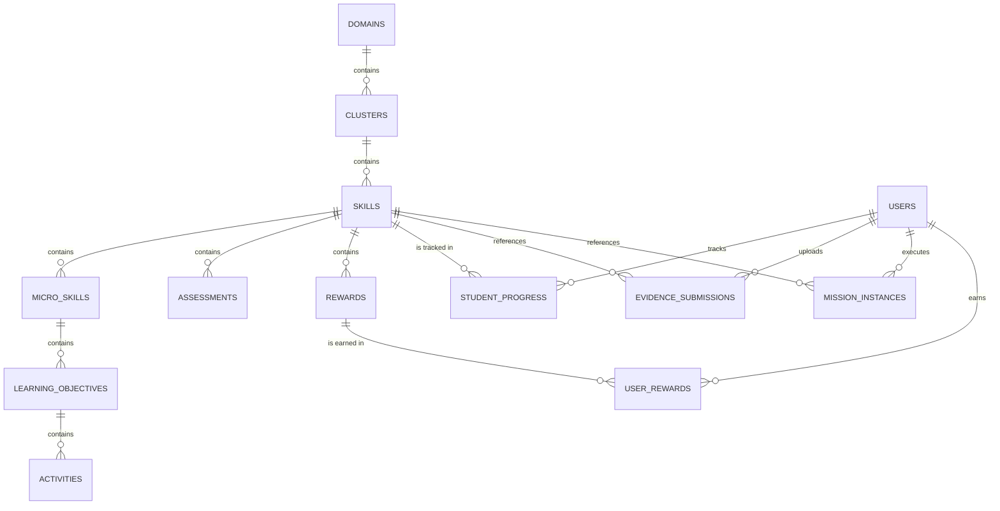

# 📁 KIẾN TRÚC DỮ LIỆU & LƯỢC ĐỒ CƠ SỞ DỮ LIỆU (DATABASE SCHEMA)
## THIẾT KẾ CƠ SỞ DỮ LIỆU TĨNH VÀ ĐỘNG CHO HỆ THỐNG NOVASTARS

---

## I. TRIẾT LÝ THIẾT KẾ CƠ SỞ DỮ LIỆU (DATABASE DESIGN DECISIONS)

### Purpose
Xác lập cấu trúc lưu trữ dữ liệu tối ưu cho cả phần nội dung giáo dục tĩnh (Static Content Metadata) và tiến trình học tập động của học sinh (Dynamic Student Progress & Telemetry), đảm bảo tính nhất quán dữ liệu, tốc độ truy vấn nhanh và khả năng mở rộng quy mô.

### Design Rationale
Chúng tôi sử dụng mô hình cơ sở dữ liệu phi quan hệ (NoSQL) **Cloud Firestore** kết hợp với phân phối tĩnh qua **CDN** cho các file dữ liệu tĩnh lớn. Dữ liệu tĩnh như danh mục kỹ năng, câu hỏi trắc nghiệm sẽ được đóng gói thành các file JSON tĩnh và tải cục bộ (Local Storage/Cache) trên thiết bị của học sinh để giảm thiểu chi phí đọc ghi database và độ trễ khi chơi game. Trong khi đó, dữ liệu động liên quan đến tài khoản người dùng, tiến trình học tập, bằng chứng hình ảnh/video và nhật ký phê duyệt của phụ huynh sẽ được lưu trữ thời gian thực trên Firestore để đồng bộ hóa ngay lập tức giữa ứng dụng của Học sinh và Dashboard của Phụ huynh.



### Educational Basis
* **Mastery-Based Data Modeling**: Dữ liệu phải lưu trữ ở mức độ hạt nhân (Granular level). Thay vì chỉ lưu trạng thái "Đạt kỹ năng điện giật", hệ thống phải lưu chính xác trẻ đã đạt những Micro-skills nào, làm sai câu hỏi nào nhiều nhất để AI có cơ sở dữ liệu phân tích lỗ hổng kiến thức chính xác.

### Trade-offs
* **Sự đánh đổi**: Cấu trúc dữ liệu phi quan hệ (NoSQL) sẽ dẫn đến việc lặp lại dữ liệu (Denormalization) ở một số bảng để tối ưu hóa tốc độ đọc. Ví dụ: trường `skillName` sẽ được lưu trực tiếp ở document `student_progress` thay vì chỉ lưu `skillId` rồi join bảng như SQL truyền thống.
* **Quyết định**: Chấp nhận tốn thêm dung lượng lưu trữ nhỏ để đạt tốc độ truy vấn cực nhanh thời gian thực và giảm thiểu chi phí gọi API.

### Advantages
* Tốc độ phản hồi ứng dụng mượt mà, không bị giật lag khi chuyển cảnh game.
* Tiết kiệm tới **60%** chi phí truy vấn database Firestore nhờ đẩy toàn bộ câu hỏi tĩnh sang CDN tĩnh.
* Đồng bộ hóa thời gian thực (Real-time listener) cực tốt giữa ứng dụng học sinh và phụ huynh.

### Risks
* Nguy cơ không đồng bộ dữ liệu (Data inconsistency) khi cập nhật tên của một Skill lớn ở bảng tĩnh nhưng các document cũ ở bảng động vẫn lưu tên cũ.
* *Biện pháp giảm thiểu*: Viết các Script Migration tự động cập nhật các trường trùng lặp trên database động khi có sự thay đổi ở CMS tĩnh.

### Dependencies
* Firebase SDK (Firestore, Storage, Auth) hoạt động ổn định trên client.

### Future Impact
Lược đồ dữ liệu này cho phép dễ dàng tích hợp các hệ thống phân tích dữ liệu lớn (như BigQuery) để thực hiện các nghiên cứu giáo dục quy mô lớn trong tương lai.

---

## II. CHI TIẾT CÁC COLLECTION TĨNH (STATIC DATA SCHEMA)

Các collection này lưu trữ nội dung chương trình học, do đội ngũ Content Production cập nhật qua CMS và được phân phối tĩnh tới Client.

### 1. Collection `domains` (Lĩnh vực năng lực)
Lưu trữ thông tin các Lĩnh vực lớn trong đời sống.

* **Schema**:
  - `domainId` (string, PK): Mã định danh (ví dụ: `self-care-safety`).
  - `name` (string): Tên tiếng Việt (ví dụ: `Tự chăm sóc & An toàn`).
  - `description` (string): Mô tả tổng quan.
  - `order` (number): Thứ tự hiển thị trên bản đồ thế giới.
  - `iconUrl` (string): Đường dẫn ảnh đại diện lĩnh vực.

### 2. Collection `clusters` (Nhóm năng lực)
Phân nhóm các kỹ năng trong cùng một lĩnh vực.

* **Schema**:
  - `clusterId` (string, PK): Mã định danh (ví dụ: `physical-safety`).
  - `domainId` (string, FK): Liên kết tới `domains`.
  - `name` (string): Tên nhóm (ví dụ: `An toàn thể chất`).
  - `description` (string): Mô tả nhóm.
  - `order` (number): Thứ tự hiển thị.

### 3. Collection `skills` (Kỹ năng cốt lõi)
Định nghĩa thông tin cơ bản của từng kỹ năng.

* **Schema**:
  - `skillId` (string, PK): Mã định danh (ví dụ: `electrical-safety`).
  - `clusterId` (string, FK): Liên kết tới `clusters`.
  - `domainId` (string, FK): Liên kết tới `domains`.
  - `name` (string): Tên kỹ năng (ví dụ: `Phòng tránh nguy cơ bị điện giật`).
  - `description` (string): Mô tả ngắn gọn.
  - `iconUrl` (string): Ảnh huy hiệu kỹ năng.
  - `gradeBracket` (array of numbers): Các khối lớp áp dụng (ví dụ: `[1, 2, 3, 4, 5]`).
  - `order` (number): Thứ tự học trên đảo kỹ năng.

### 4. Collection `micro_skills` (Kỹ năng vi mô)
Phân rã chi tiết của kỹ năng cốt lõi.

* **Schema**:
  - `microSkillId` (string, PK): Mã định danh (ví dụ: `dry-hands-rule`).
  - `skillId` (string, FK): Liên kết tới `skills`.
  - `name` (string): Tên kỹ năng vi mô (ví dụ: `Quy tắc lau tay khô trước khi cắm điện`).
  - `description` (string): Mô tả thao tác thực tế.

### 5. Collection `learning_objectives` (Mục tiêu học tập)
Chi tiết hóa kết quả kỳ vọng cho từng kỹ năng vi mô.

* **Schema**:
  - `objectiveId` (string, PK): Mã định danh (ví dụ: `understand-water-conductivity`).
  - `microSkillId` (string, FK): Liên kết tới `micro_skills`.
  - `description` (string): Phát biểu mục tiêu (ví dụ: `Học sinh giải thích được tại sao nước dẫn điện`).

### 6. Collection `activities` (Hoạt động học tập trong Game)
Mô tả các màn chơi và bối cảnh cốt truyện tương ứng.

* **Schema**:
  - `activityId` (string, PK): Mã định danh (ví dụ: `act-electrical-safety-story`).
  - `objectiveId` (string, FK): Liên kết tới `learning_objectives`.
  - `type` (string): Loại hoạt động (`STORY` | `MINI_GAME` | `CHALLENGE` | `BOSS_BATTLE`).
  - `gameplayType` (string): Kiểu gameplay (`hidden-object` | `drag-drop` | `visual-novel`...).
  - `contentPayload` (map): Chứa cấu hình cụ thể của màn chơi (ảnh nền, hội thoại, tọa độ vật phẩm).

### 7. Collection `assessments` (Ngân hàng câu hỏi tình huống LSCAF)
Lưu trữ 20 câu hỏi đánh giá đa tầng cho mỗi kỹ năng.

* **Schema**:
  - `questionId` (string, PK): Mã định danh (ví dụ: `q-electrical-safety-01`).
  - `skillId` (string, FK): Liên kết tới `skills`.
  - `microSkillId` (string, FK): Liên kết tới `micro_skills` (nếu có).
  - `tier` (string): Phân tầng LSCAF (`A` | `B` | `C` | `D` | `E`).
  - `questionText` (string): Nội dung câu hỏi tình huống.
  - `options` (map): Các phương án lựa chọn:
    - `A` (string)
    - `B` (string)
    - `C` (string)
    - `D` (string)
  - `correctAnswer` (string): Đáp án đúng (`A` | `B` | `C` | `D`).
  - `explanation` (string): Giải thích lý do sư phạm của đáp án đúng.

### 8. Collection `rewards` (Danh mục phần thưởng)
Định nghĩa các phần thưởng ảo có thể mở khóa.

* **Schema**:
  - `rewardId` (string, PK): Mã định danh (ví dụ: `badge-volt-o-slayer`).
  - `skillId` (string, FK): Liên kết tới `skills` (nếu gắn liền với kỹ năng).
  - `name` (string): Tên phần thưởng (ví dụ: `Huy hiệu Dũng sĩ diệt thần điện`).
  - `type` (string): Loại (`BADGE` | `AVATAR_ITEM` | `STORY_PIECE`).
  - `imageUrl` (string): Đường dẫn ảnh phần thưởng.

---

## III. CHI TIẾT CÁC COLLECTION ĐỘNG (DYNAMIC USER PROGRESS)

Các collection này lưu trữ trực tiếp trên Firestore để phục vụ cập nhật trạng thái thời gian thực và chạy logic AI Backend.

### 1. Collection `users` (Hồ sơ người dùng)
* **Schema**:
  - `uid` (string, PK): Firebase Auth UID.
  - `role` (string): Vai trò (`student` | `parent` | `teacher`).
  - `displayName` (string): Tên hiển thị.
  - `createdAt` (timestamp): Thời gian tạo tài khoản.
  - `linkedAccounts` (array of strings): UID của tài khoản liên kết (ví dụ: tài khoản student liên kết với UID parent).
  - `grade` (number): Khối lớp của học sinh (1-5).
  - `avatarConfig` (map): Cấu hình trang phục của avatar học sinh.
  - `starPoints` (number): Tổng điểm tích lũy hiện có (dùng để mở khóa đảo).
  - `coins` (number): Số vàng hiện tại (dùng để mua sắm trong shop).
  - `streakCount` (number): Số ngày học liên tục (Streak).
  - `lastActiveDate` (string): Ngày hoạt động gần nhất (định dạng `YYYY-MM-DD` để tính toán streak).
  - `dailyCoinsEarned` (number): Số vàng kiếm được trong ngày hiện tại (dùng để kiểm soát trần Daily Cap 150 Coins).

### 2. Collection `student_progress` (Tiến độ học tập chi tiết của học sinh)
Theo dõi vị trí học tập của học sinh trong từng kỹ năng và trạng thái Mastery.

* **Schema**:
  - `progressId` (string, PK): Cú pháp `uid_skillId` để tránh trùng lặp.
  - `uid` (string, FK): Liên kết tới `users`.
  - `skillId` (string, FK): Liên kết tới `skills`.
  - `status` (string): Trạng thái tiến độ (`STORY` | `MINI_GAMES` | `CHALLENGE` | `BOSS` | `REFLECTION` | `MISSION` | `VERIFICATION` | `MASTERED`).
  - `completedTiers` (array of strings): Các tầng LSCAF đã vượt qua (ví dụ: `["A", "B", "C", "D", "E"]`).
  - `correctAnswersCount` (number): Số câu trả lời đúng hiện tại.
  - `retryCount` (number): Tổng số lần phải làm lại câu hỏi của kỹ năng này.
  - `reflectionText` (string): Câu trả lời phản tư (Tier E) dạng chữ viết hoặc bản dịch từ giọng nói.
  - `reflectionAudioUrl` (string): Đường dẫn file ghi âm câu trả lời phản tư (nếu có).
  - `reflectionStatus` (string): Trạng thái duyệt của AI (`PENDING` | `APPROVED` | `REJECTED`).
  - `updatedAt` (timestamp): Thời gian cập nhật gần nhất.

### 3. Collection `mission_instances` (Nhiệm vụ thực tế được giao cho trẻ)
Lưu trữ thông tin nhiệm vụ đời thực do AI đề xuất riêng cho từng học sinh.

* **Schema**:
  - `missionId` (string, PK): Mã định danh.
  - `uid` (string, FK): Liên kết tới `users`.
  - `skillId` (string, FK): Liên kết tới `skills`.
  - `description` (string): Mô tả chi tiết nhiệm vụ do AI sinh ra phù hợp bối cảnh.
  - `safetyInstructions` (string): Các cảnh báo an toàn bắt buộc đi kèm.
  - `assignedAt` (timestamp): Thời gian giao nhiệm vụ.
  - `status` (string): Trạng thái (`ASSIGNED` | `SUBMITTED` | `APPROVED` | `REJECTED`).

### 4. Collection `evidence_submissions` (Bằng chứng năng lực do trẻ nộp)
Quản lý các file bằng chứng đa phương tiện tải lên từ thực tế.

* **Schema**:
  - `evidenceId` (string, PK): Mã định danh.
  - `missionId` (string, FK): Liên kết tới `mission_instances`.
  - `uid` (string, FK): Liên kết tới `users`.
  - `skillId` (string, FK): Liên kết tới `skills`.
  - `evidenceType` (string): Loại bằng chứng (`PHOTO` | `VIDEO` | `VOICE`).
  - `fileUrl` (string): Đường dẫn tải file trên Firebase Storage.
  - `aiSafetyScore` (number): Điểm số đánh giá độ an toàn và hợp lệ của ảnh từ AI (ví dụ: từ 0.0 đến 1.0).
  - `aiEvaluationText` (string): Nhận xét sơ bộ của AI Companion.
  - `parentVerificationStatus` (string): Phê duyệt của cha mẹ (`PENDING` | `APPROVED` | `REJECTED`).
  - `parentFeedback` (string): Nhận xét ngắn từ cha mẹ gửi cho con.
  - `submittedAt` (timestamp): Thời gian nộp bằng chứng.

### 5. Collection `user_rewards` (Kho phần thưởng của học sinh)
* **Schema**:
  - `userRewardId` (string, PK): Cú pháp `uid_rewardId`.
  - `uid` (string, FK): Liên kết tới `users`.
  - `rewardId` (string, FK): Liên kết tới `rewards`.
  - `unlockedAt` (timestamp): Thời gian mở khóa.

### 6. Collection `telemetry_logs` (Nhật ký hành vi hệ thống - Analytics)
Lưu trữ log thô phục vụ phân tích dữ liệu lớn.

* **Schema**:
  - `logId` (string, PK).
  - `uid` (string, FK).
  - `eventType` (string): Loại sự kiện (`click_button` | `retry_game` | `read_story` | `voice_reflection_length`).
  - `metadata` (map): Chứa thông tin bổ sung (ví dụ: `timeSpentSeconds`, `buttonId`, `deviceModel`).
  - `timestamp` (timestamp).

---

## IV. VÍ DỤ TÀI LIỆU JSON ĐIỂN HÌNH (SAMPLE JSON DATA)

### 1. Document mẫu trong collection `assessments` (Lý thuyết tĩnh)
```json
{
  "questionId": "q-electrical-safety-08",
  "skillId": "electrical-safety",
  "microSkillId": "dry-hands-rule",
  "tier": "B",
  "questionText": "Tại sao chúng ta tuyệt đối không được chạm tay ướt vào ổ điện?",
  "options": {
    "A": "Vì tay ướt sẽ làm bẩn ổ điện.",
    "B": "Vì nước dẫn điện rất tốt, tay ướt chạm vào điện rất dễ bị giật.",
    "C": "Vì nước sẽ làm rỉ sét ổ điện ngay lập tức.",
    "D": "Vì tay ướt sẽ làm trơn trượt phích cắm."
  },
  "correctAnswer": "B",
  "explanation": "Nước là chất dẫn điện cực kỳ tốt. Khi tay bị ướt, điện trở của da giảm mạnh, nếu có dòng điện rò rỉ, dòng điện sẽ truyền qua nước trực tiếp vào cơ thể gây giật điện nguy hiểm tính mạng."
}
```

### 2. Document mẫu trong collection `users` (Hồ sơ người dùng)
```json
{
  "uid": "user123",
  "role": "student",
  "displayName": "Nguyễn Văn An",
  "createdAt": "2026-07-01T08:00:00Z",
  "linkedAccounts": ["parent456"],
  "grade": 3,
  "avatarConfig": {
    "hat": "adventure_hat",
    "cape": "brave_cape",
    "pet": "star_pet_level_2"
  },
  "starPoints": 420,
  "coins": 350,
  "streakCount": 5,
  "lastActiveDate": "2026-07-31",
  "dailyCoinsEarned": 45
}
```

### 3. Document mẫu trong collection `student_progress` (Tiến trình động)
```json
{
  "progressId": "user123_electrical-safety",
  "uid": "user123",
  "skillId": "electrical-safety",
  "status": "MISSION",
  "completedTiers": ["A", "B", "C", "D"],
  "correctAnswersCount": 18,
  "retryCount": 3,
  "reflectionText": "Con đã hiểu điện rất nguy hiểm vì nước dẫn điện tốt. Con sẽ luôn dùng khăn lau tay thật khô trước khi cắm điện điện thoại.",
  "reflectionAudioUrl": "https://firebasestorage.googleapis.com/v0/b/novastars.appspot.com/o/reflections%2Fuser123_elec_ref.mp3",
  "reflectionStatus": "APPROVED",
  "updatedAt": "2026-07-31T03:30:00Z"
}
```

### 3. Document mẫu trong collection `evidence_submissions` (Bằng chứng động)
```json
{
  "evidenceId": "ev_electrical_safety_999",
  "missionId": "m_electrical_safety_001",
  "uid": "user123",
  "skillId": "electrical-safety",
  "evidenceType": "PHOTO",
  "fileUrl": "https://firebasestorage.googleapis.com/v0/b/novastars.appspot.com/o/evidence%2Fuser123_safety_stickers.jpg",
  "aiSafetyScore": 0.98,
  "aiEvaluationText": "AI phát hiện ảnh có chứa nhãn tự vẽ dán bên cạnh ổ cắm điện. Không phát hiện nội dung rác hoặc nguy hiểm.",
  "parentVerificationStatus": "APPROVED",
  "parentFeedback": "Con vẽ nhãn mặt cười rất đáng yêu, hôm nay con cũng đã biết tự lau tay khô trước khi đi cắm nồi cơm điện giúp mẹ. Mẹ rất tự hào về con!",
  "submittedAt": "2026-07-31T03:32:00Z"
}
```
