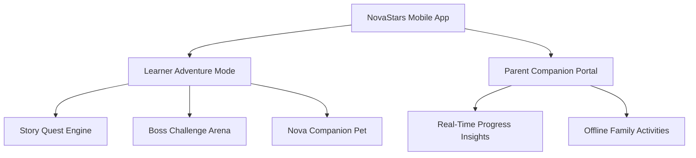

# NovaStars Product Foundation Blueprint

## Purpose
Defines the core product architecture, user personas, product pillars, and user experience flows for NovaStars Life Skills Adventure.

## Product Architecture Overview
NovaStars Life Skills Adventure is an interactive learning platform designed for children aged 6–12. It combines narrative-driven exploration, companion mini-games, competency-based mastery challenges, and parent visibility tools.

## User Personas

### 1. Primary Learner ("Leo", Age 8)
- **Goal:** Play fun games, unlock cool star companions, solve exciting mysteries.
- **Needs:** Intuitive tap-and-play UI, rich visual animations, immediate positive feedback, bite-sized 5-10 minute learning sessions.

### 2. Parent / Guardian ("Minh", Age 35)
- **Goal:** Help their child develop real-world life skills, financial responsibility, and emotional resilience without nagging.
- **Needs:** Clear mastery reporting, actionable offline family prompts, screen-time controls, privacy assurance.

## Core Product Pillars
1. **Interactive Quest System**: Narrative-driven learning modules where decisions influence story outcomes.
2. **Companion & Meta Progression**: Collecting, nurturing, and leveling up NovaStar companions through skill mastery.
3. **Adaptive Difficulty Engine**: AI-driven difficulty scaling to keep children in the optimal "Flow State".
4. **Parent Visibility & Offline Bridge**: Bridging digital learning with real-life family habits.

## Dependencies & Upstream Links (`depends_on`)
- [Product Philosophy](file:///Users/thuy/Documents/apptieuhoc/01_VISION/product_philosophy.md) (`ID: NS-VIS-CORE-001`)
- [Strategic Objectives](file:///Users/thuy/Documents/apptieuhoc/01_VISION/strategic_objectives.md) (`ID: NS-VIS-OKR-001`)

## Downstream Impact & Consumers (`used_by`)
- [Competency Framework](file:///Users/thuy/Documents/apptieuhoc/03_EDUCATION/competency_framework.md) (`ID: NS-EDU-COMP-001`)
- [Game Design Bible](file:///Users/thuy/Documents/apptieuhoc/04_GAME/game_design_bible.md) (`ID: NS-GAM-BIB-001`)
- [Technical Architecture](file:///Users/thuy/Documents/apptieuhoc/07_ENGINEERING/technical_architecture.md) (`ID: NS-ENG-ARCH-001`)

## Governance & Metadata
- **Owner:** Head of Product
- **Status:** FROZEN
- **Version:** 1.0.0
- **Last Updated:** 2026-08-04
