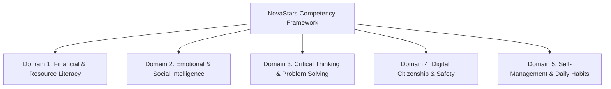

# NovaStars Competency Framework

## Purpose
Defines the canonical pedagogical framework governing all 10,000+ learning experiences in NovaStars. It establishes the 5 core Life Skill Domains, 25 Subdomains, and granular atomic competencies.

## Scope
Governs all curriculum modeling, assessment rubrics, learning object generation, and skill progress tracking.

## The 5 Core Life Skill Domains

### Domain 1: Financial & Resource Literacy (`DOM-FIN`)
- **Subdomain 1.1:** Earning & Value Understanding (`SUB-FIN-EARN`)
- **Subdomain 1.2:** Saving & Delayed Gratification (`SUB-FIN-SAVE`)
- **Subdomain 1.3:** Budgeting & Smart Spending (`SUB-FIN-BUDG`)
- **Subdomain 1.4:** Distinguishing Needs vs. Wants (`SUB-FIN-NEED`)
- **Subdomain 1.5:** Resource Stewardship & Ethics (`SUB-FIN-ETHC`)

### Domain 2: Emotional & Social Intelligence (`DOM-SEL`)
- **Subdomain 2.1:** Emotional Recognition & Labeling (`SUB-SEL-RECG`)
- **Subdomain 2.2:** Self-Regulation & Coping Strategies (`SUB-SEL-REGU`)
- **Subdomain 2.3:** Empathy & Perspective Taking (`SUB-SEL-EMPA`)
- **Subdomain 2.4:** Healthy Communication & Listening (`SUB-SEL-COMM`)
- **Subdomain 2.5:** Conflict Resolution & Collaboration (`SUB-SEL-CONF`)

### Domain 3: Critical Thinking & Problem Solving (`DOM-CRT`)
- **Subdomain 3.1:** Logical Reasoning & Deductive Logic (`SUB-CRT-LOGIC`)
- **Subdomain 3.2:** Information Evaluation & Fact vs. Opinion (`SUB-CRT-INFO`)
- **Subdomain 3.3:** Creative Problem Solving & Innovation (`SUB-CRT-CREA`)
- **Subdomain 3.4:** Cause-and-Effect Analysis (`SUB-CRT-CAUSE`)
- **Subdomain 3.5:** Decision-Making & Risk Assessment (`SUB-CRT-RISK`)

### Domain 4: Digital Citizenship & Safety (`DOM-DIG`)
- **Subdomain 4.1:** Privacy Protection & Personal Data (`SUB-DIG-PRIV`)
- **Subdomain 4.2:** Cyberbullying Recognition & Upstanding (`SUB-DIG-BULLY`)
- **Subdomain 4.3:** Healthy Screen Time & Balance (`SUB-DIG-TIME`)
- **Subdomain 4.4:** Evaluating Online Content Reliability (`SUB-DIG-EVAL`)
- **Subdomain 4.5:** Respectful Online Communication (`SUB-DIG-RESP`)

### Domain 5: Self-Management & Daily Habits (`DOM-HAB`)
- **Subdomain 5.1:** Goal Setting & Action Planning (`SUB-HAB-GOAL`)
- **Subdomain 5.2:** Time Management & Prioritization (`SUB-HAB-TIME`)
- **Subdomain 5.3:** Personal Hygiene & Wellness Habits (`SUB-HAB-WELL`)
- **Subdomain 5.4:** Growth Mindset & Persistence (`SUB-HAB-PERST`)
- **Subdomain 5.5:** Household Responsibility & Independence (`SUB-HAB-INDY`)

## Competency Level Hierarchy
1. **Domain**: Broad field (e.g. Financial Literacy)
2. **Subdomain**: Targeted focus area (e.g. Saving & Delayed Gratification)
3. **Competency Node**: Specific skill (e.g. `COMP-FIN-SAVE-001`: "Calculates time required to save for a target goal")
4. **Learning Object (LO)**: Atomic interactive challenge evaluating the competency.

## Dependencies & Upstream Links (`depends_on`)
- [Product Foundation Blueprint](file:///Users/thuy/Documents/apptieuhoc/02_PRODUCT/product_foundation.md) (`ID: NS-PRD-FND-001`)

## Downstream Impact & Consumers (`used_by`)
- [Experience OS](file:///Users/thuy/Documents/apptieuhoc/03_EDUCATION/experience_os.md) (`ID: NS-EDU-EXPOS-001`)
- [Lesson Architecture System (NLAS)](file:///Users/thuy/Documents/apptieuhoc/03_EDUCATION/nlas_framework.md) (`ID: NS-EDU-NLAS-001`)
- [Content Model Architecture](file:///Users/thuy/Documents/apptieuhoc/05_CONTENT/content_model.md) (`ID: NS-CNT-MOD-001`)
- [AI Production System (AIPS)](file:///Users/thuy/Documents/apptieuhoc/06_AI/aips_framework.md) (`ID: NS-AI-AIPS-001`)

## Governance & Metadata
- **Owner:** Lead Curriculum Architect
- **Status:** FROZEN
- **Version:** 1.0.0
- **Last Updated:** 2026-08-04
