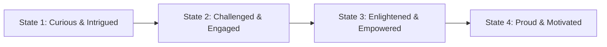

# NovaStars Experience OS & Emotion Engine

## Purpose
Defines the psychological and emotional framework governing child learning experiences. It models child state transformations, curiosity engines, emotional curves, and motivational states.

## Child State Transformation Architecture

Every NovaStars learning experience must explicitly guide the child through a 4-phase Emotional Transformation Cycle:

### State 1: Curious & Intrigued (Hook Phase)
- **Goal:** Spark natural curiosity through narrative mystery, relatable dilemmas, or surprising visual phenomena.
- **Child Feeling:** "Ooh! What happens next?"

### State 2: Challenged & Engaged (Active Learning Phase)
- **Goal:** Engage active decision-making, hypothesis testing, and interactive puzzle-solving.
- **Child Feeling:** "Let me try to solve this!"

### State 3: Enlightened & Empowered (Mastery Phase)
- **Goal:** Provide clear feedback showing *why* a solution worked, connecting action to real-world impact.
- **Child Feeling:** "Aha! Now I get it!"

### State 4: Proud & Motivated (Reflection & Reward Phase)
- **Goal:** Celebrate effort and growth mindset with companion rewards and offline family shareables.
- **Child Feeling:** "I did it! I want to try another quest!"

## Psychological Design Guidelines
1. **Zero Anxiety Design**: Avoid punishing timers, permanent score losses, or negative shaming language.
2. **Scaffolded Feedback**: Hints step down in abstraction gradually (Prompt -> Scaffold -> Direct Hint).
3. **Intrinsic Agency**: Allow choices that reflect personal style or values within narrative branches.

## Dependencies & Upstream Links (`depends_on`)
- [Competency Framework](file:///Users/thuy/Documents/apptieuhoc/03_EDUCATION/competency_framework.md) (`ID: NS-EDU-COMP-001`)
- [Product Foundation Blueprint](file:///Users/thuy/Documents/apptieuhoc/02_PRODUCT/product_foundation.md) (`ID: NS-PRD-FND-001`)

## Downstream Impact & Consumers (`used_by`)
- [Lesson Architecture System (NLAS)](file:///Users/thuy/Documents/apptieuhoc/03_EDUCATION/nlas_framework.md) (`ID: NS-EDU-NLAS-001`)
- [Game Design Bible](file:///Users/thuy/Documents/apptieuhoc/04_GAME/game_design_bible.md) (`ID: NS-GAM-BIB-001`)
- [Story Agent Specification](file:///Users/thuy/Documents/apptieuhoc/06_AI/agent_registry/story_agent.md) (`ID: NS-AI-AGNT-001`)

## Governance & Metadata
- **Owner:** Lead Learning Designer
- **Status:** FROZEN
- **Version:** 1.0.0
- **Last Updated:** 2026-08-04
