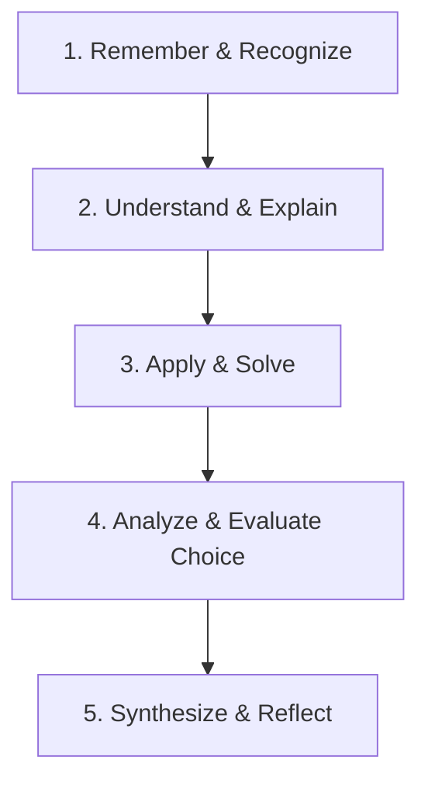

# NovaStars Educational Psychology & Mastery Learning Framework

## Purpose
Defines the psychological learning theories, Bloom's Taxonomy adaptations, mastery learning criteria, and zone of proximal development (ZPD) scaffolding models powering NovaStars.

## Scope
Governs curriculum design, question difficulty scaling, and automated hint generation.

## Pedagogical Foundations

### 1. Adaptation of Bloom's Taxonomy for Primary Life Skills

- **Level 1 (Remember):** Identify basic terms (e.g. Needs vs. Wants, Emotion labels).
- **Level 2 (Understand):** Explain why a choice leads to a specific consequence.
- **Level 3 (Apply):** Solve an interactive budget scenario or conflict simulation.
- **Level 4 (Analyze):** Evaluate trade-offs between immediate gratification and long-term saving.
- **Level 5 (Synthesize):** Apply cumulative learning during Stage 3 Boss Battles.

### 2. Mastery Criterion (80% Benchmark)
A learner achieves "Mastery Status" on a competency node when they achieve ≥80% accuracy across 3 independent assessment items without relying on Level 3 direct hints.

## Scaffolding Ladder Protocol
- **Level 1 (Prompt):** Re-read the question prompt with highlighted key terms.
- **Level 2 (Scaffold):** Eliminate 1 incorrect distractor choice.
- **Level 3 (Direct Hint):** Provide a visual clue or explicit concept explanation.

## Dependencies & Upstream Links (`depends_on`)
- [Competency Framework](file:///Users/thuy/Documents/apptieuhoc/03_EDUCATION/competency_framework.md) (`ID: NS-EDU-COMP-001`)

## Downstream Impact & Consumers (`used_by`)
- [NLAS Framework](file:///Users/thuy/Documents/apptieuhoc/03_EDUCATION/nlas_framework.md) (`ID: NS-EDU-NLAS-001`)

## Governance & Metadata
- **Owner:** Lead Curriculum Architect
- **Status:** FROZEN
- **Version:** 1.0.0
- **Last Updated:** 2026-08-04
