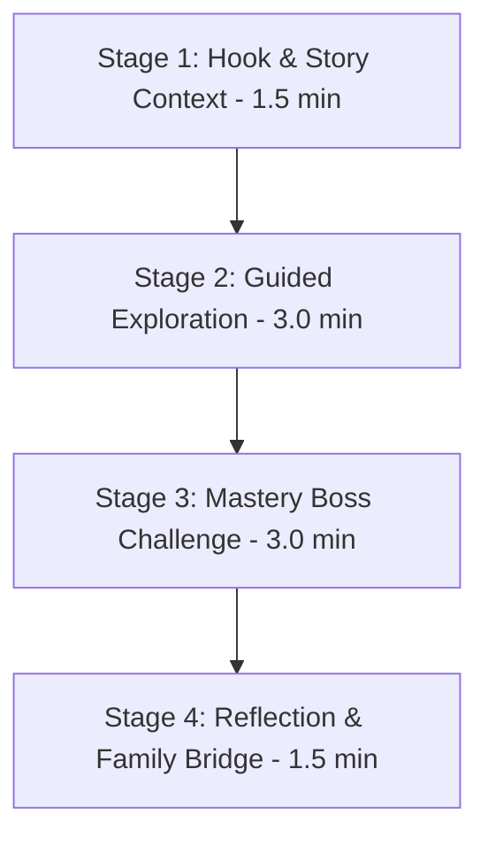

# NovaStars Lesson Architecture System (NLAS)

## Purpose
NLAS is the constitutional instructional operating system governing the structure, authoring rules, and execution of over 10,000 competency-based lessons in NovaStars.

## Scope
Defines lesson phase blueprints, learning object sequencing rules, assessment mechanics, and AI authoring parameters.

## The 4-Stage NLAS Lesson Blueprint

Every NLAS Lesson follows a standardized 4-Stage Pedagogical Flow (total duration: 6–10 minutes):

### Stage 1: Hook & Story Context (1.5 Minutes)
- **Goal:** Introduce story hook, present real-world dilemma, activate prior knowledge.
- **Components:** Story Card, NPC Dialogue, Core Choice Prompt.
- **Output Artifact:** Story Context Object (`LO-STORY`).

### Stage 2: Guided Exploration (3.0 Minutes)
- **Goal:** Interactive concept exploration using scaffolded mini-game mechanics.
- **Components:** 2-3 Interactive Puzzles (`LO-INTERACT`), Dynamic Scaffolding, Hint Engine.
- **Output Artifact:** Exploration Object (`LO-EXPLORE`).

### Stage 3: Mastery Boss Challenge (3.0 Minutes)
- **Goal:** Synthesize learning through cumulative high-stakes mini-boss battle.
- **Components:** Multi-step Boss Challenge (`LO-BOSS`), Evidence Evaluator, Real-time Rubric.
- **Output Artifact:** Boss Challenge Object (`LO-BOSS`).

### Stage 4: Reflection & Family Bridge (1.5 Minutes)
- **Goal:** Consolidate insight, record reflection badge, generate offline parent prompt.
- **Components:** Reflection Card (`LO-REFL`), Self-Evaluation Rubric, Family Bridge Prompt (`LO-FAM`).
- **Output Artifact:** Reflection & Bridge Object (`LO-REFL`).

## Quality Constraints for AI Generation
1. Maximum text length per dialogue bubble: **25 words** (Primary Grade readability).
2. Maximum choices per decision point: **3 options**.
3. Every incorrect choice MUST provide diagnostic, non-punitive feedback explaining *why* it was incorrect.

## Dependencies & Upstream Links (`depends_on`)
- [Competency Framework](file:///Users/thuy/Documents/apptieuhoc/03_EDUCATION/competency_framework.md) (`ID: NS-EDU-COMP-001`)
- [Experience OS](file:///Users/thuy/Documents/apptieuhoc/03_EDUCATION/experience_os.md) (`ID: NS-EDU-EXPOS-001`)

## Downstream Impact & Consumers (`used_by`)
- [Content Model Architecture](file:///Users/thuy/Documents/apptieuhoc/05_CONTENT/content_model.md) (`ID: NS-CNT-MOD-001`)
- [AI Production System (AIPS)](file:///Users/thuy/Documents/apptieuhoc/06_AI/aips_framework.md) (`ID: NS-AI-AIPS-001`)
- [Content Factory SOP](file:///Users/thuy/Documents/apptieuhoc/08_OPERATIONS/content_factory_sop.md) (`ID: NS-OPS-SOP-001`)

## Governance & Metadata
- **Owner:** Principal Instructional Designer
- **Status:** FROZEN
- **Version:** 1.0.0
- **Last Updated:** 2026-08-04
