# NOVASTARS GAME DESIGN BIBLE
*Tài liệu Hiến pháp Thiết kế Game & Cơ chế Gamification Phát triển Năng lực Trẻ em*
*Phiên bản: 2.0 (Constitutional Master Edition)*
*Lưu hành nội bộ - NovaStars Life Skills Adventure*

---

> [!IMPORTANT]
> **TẢM NHÌN & BẢN CHẤT CỦA TÀI LIỆU**
> 
> Đây **KHÔNG** phải là Game Design Document (GDD) thông thường, không phải giao diện UI, cũng không phải Product Requirement Document (PRD). 
> 
> Đây là **HIẾN PHÁP TỐI CAO** điều hành toàn bộ các hệ thống gameplay, động lực học, kinh tế game, nhịp độ học tập và thiết kế cảm xúc bên trong NovaStars.
> 
> Mục tiêu cốt lõi của NovaStars **KHÔNG GIỐNG** các trò chơi thương mại (vốn tối đa hóa thời gian onscreen để gây nghiện). 
> 
> Mục tiêu của NovaStars là **MEANINGFUL ENGAGEMENT (TƯƠNG TÁC CÓ Ý NGHĨA)** – tạo ra sự lặp lại tự nguyện, từ đó hình thành Năng lực sống thực tế và sự Tự tin bền vững cho trẻ em từ 6 đến 11 tuổi.
> 
> **TRIẾT LÝ VẬN HÀNH CỐT LÕI:**
> $$\text{Engagement} \longrightarrow \text{Repetition} \longrightarrow \text{Competency} \longrightarrow \text{Confidence} \longrightarrow \text{Life Transformation}$$

---

# MỤC LỤC CHI TIẾT

- [PART 0: NOVASTARS FUN FRAMEWORK (KHUNG KHÁI NIỆM "FUN")](#part-0-novastars-fun-framework-khung-khai-niem-fun)
- [PART 1: GAME DESIGN PHILOSOPHY (TRIẾT LÝ THIẾT KẾ GAME)](#part-1-game-design-philosophy-triet-ly-thiet-ke-game)
- [PART 2: CORE GAME LOOP (VÒNG LẶP GAMEPLAY CỐT LÕI 8 BƯỚC)](#part-2-core-game-loop-vong-lap-gameplay-cot-loi-8-buoc)
- [PART 3: META GAME LOOP (VÒNG LẶP META TOÀN DIỆN)](#part-3-meta-game-loop-vong-lap-meta-toan-dien)
- [PART 4: MOTIVATION FRAMEWORK (KHUNG ĐỘNG LỰC HỌC TẬP & HÀNH VI)](#part-4-motivation-framework-khung-dong-luc-hoc-tap--hanh-vi)
- [PART 5: PROGRESSION SYSTEM (HỆ THỐNG TIẾN TRÌNH & NĂNG LỰC)](#part-5-progression-system-he-thong-tien-trinh--nang-luc)
- [PART 6: ECONOMY SYSTEM (HỆ THỐNG KINH TẾ TRONG GAME)](#part-6-economy-system-he-thong-kinh-te-trong-game)
- [PART 7: REWARD SYSTEM (HỆ THỐNG PHẦN THƯỞNG Ý NGHĨA)](#part-7-reward-system-he-thong-phan-thuong-y-nghia)
- [PART 8: COLLECTION SYSTEM (HỆ THỐNG BỘ SƯU TẬP)](#part-8-collection-system-he-thong-bo-suu-tap)
- [PART 9: FAILURE DESIGN (THIẾT KẾ THẤT BẠI TÍCH CỰC & AN TOÀN)](#part-9-failure-design-thiet-ke-that-bai-tich-cuc--an-toan)
- [PART 10: BOSS BATTLE SYSTEM (HỆ THỐNG ĐẤU BOSS KỊCH TÍNH)](#part-10-boss-battle-system-he-thong-dau-boss-kich-tinh)
- [PART 11: DAILY HABIT ENGINE (ĐỘNG CƠ HÌNH THÀNH THÓI QUEN HÀNG NGÀY)](#part-11-daily-habit-engine-dong-co-hinh-thanh-thoi-quen-hang-ngay)
- [PART 12: FLOW DESIGN (THIẾT KẾ TRẠNG THÁI DÒNG CHẢY - FLOW STATE)](#part-12-flow-design-thiet-ke-trang-thai-dong-chay---flow-state)
- [PART 13: EMOTIONAL CURVE DESIGN (THIẾT KẾ ĐƯỜNG CONG CẢM XÚC)](#part-13-emotional-curve-design-thiet-ke-duong-cong-cam-xuc)
- [PART 14: REPLAYABILITY SYSTEM (KHẢ NĂNG CHƠI LẠI TRONG SÁNG)](#part-14-replayability-system-kha-nang-choi-lai-trong-sang)
- [PART 15: ETHICAL GAMIFICATION & SAFEGUARD BIBLE (GAMIFICATION VỊ NHÂN TRẮC)](#part-15-ethical-gamification--safeguard-bible-gamification-vi-nhan-trac)
- [PART 16: GAME DESIGN DNA & SUMMARY (GEN THIẾT KẾ NOVASTARS)](#part-16-game-design-dna--summary-gen-thiet-ke-novastars)

---

# PART 0: NOVASTARS FUN FRAMEWORK (KHUNG KHÁI NIỆM "FUN")

Trước khi xây dựng bất kỳ hệ thống game mechanic nào, Hội đồng Thiết kế Game NovaStars khẳng định định nghĩa cốt lõi về **"SỰ VUI VẺ" (FUN)**. Trong giáo dục trẻ em, Fun không phải là sự giải trí hời hợt hay kích thích dopamine ngắn hạn; Fun là **chất xúc tác thần kinh** giúp não bộ trẻ mở rộng khả năng tiếp thu và ghi nhớ lâu dài.

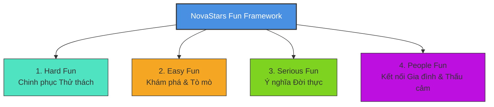

## 0.1. Tại sao NovaStars lại Vui? (Why NovaStars is Fun?)
NovaStars vui vì nó biến việc học kỹ năng sống khó khăn, khô khan thành một **hành trình làm chủ thế giới thực** (Real-World Mastery Adventure). Trẻ thấy vui khi:
1. **Trở thành nhân vật chính**: Trẻ không bị dạy bảo thụ động mà đóng vai Dũng sĩ Năng lực giải cứu các hành tinh.
2. **Cảm nhận sự tiến bộ rõ rệt**: Mỗi quyết định đúng mang lại hiệu ứng trực quan sinh động và làm tan biến "chướng ngại vật".
3. **Thất bại không bị trừng phạt**: Trẻ tự do thử sai trong môi trường an toàn tuyệt đối mà không sợ điểm kém hay sự phán xét.
4. **Hành động trong game tạo ra tác động thật**: Việc hoàn thành nhiệm vụ giúp đảo cá nhân đẹp hơn và được cha mẹ ghi nhận ngoài đời thực.

## 0.2. 4 Loại "Fun" NovaStars Tạo Ra Chủ Đích (4 Intentionally Created Funs)
Dựa trên Khung Nicole Lazzaro 4 Keys 2 Fun, NovaStars tùy biến 4 loại Fun phục vụ phát triển Năng lực:

1. **Hard Fun (Niềm vui Chinh phục & Thử thách)**: 
   - *Biểu hiện*: Cảm giác "Fiero" (vui sướng tột độ khi vượt qua Boss Battle hoặc giải quyết một tình huống hóc hiểm).
   - *Thiết kế*: Boss Battle theo lượt, Thử thách tình huống Tier D, giải quyết mâu thuẫn phức tạp.
2. **Easy Fun (Niềm vui Tò mò & Khám phá)**:
   - *Biểu hiện*: Thích thú khi mở rộng sương mù trên bản đồ, tùy biến Avatar, chăm sóc Pet Nova, tương tác với các vật thể bí ẩn.
   - *Thiết kế*: World Map mở rộng, Bộ sưu tập Linh thú, tùy biến Đảo cá nhân.
3. **Serious Fun (Niềm vui Ý nghĩa & Tác động Đời thực)**:
   - *Biểu hiện*: Niềm tự hào khi áp dụng kỹ năng trong app để làm một việc tốt thật ngoài đời (vẽ sơ đồ thoát hiểm, quản lý tiền mừng tuổi, tự hòa giải với bạn).
   - *Thiết kế*: Real-life Missions (Tier E), Xác nhận từ Cha mẹ, Chứng chỉ Năng lực.
4. **People Fun (Niềm vui Kết nối & Thấu cảm)**:
   - *Biểu hiện*: Cảm giác ấm áp khi chia sẻ thành tích với cha mẹ, cùng Nova tâm sự và được thấu hiểu cảm xúc.
   - *Thiết kế*: Co-op Parent Missions, AI Companion Reflection, Showcase Đảo gia đình.

## 0.3. Các loại "Fun" Cấm Đoán (Unethical & Distracting Funs to Avoid)
NovaStars **TUYỆT ĐỐI CẤM** các loại "Fun" gây hại cho tâm lý và sự phát triển của trẻ:
- ❌ **Gambling / Gacha Fun**: Không có hộp quà may mắn quay thưởng ngẫu nhiên bằng tiền thật, không tạo cảm giác cay cú may rủi.
- ❌ **Toxic Competitive Fun**: Không có bảng xếp hạng đối kháng đè bẹp người khác (PVP), không có cơ chế cướp tài nguyên của bạn bè.
- ❌ **Brainless Clicker Fun**: Không thiết kế các minigame bấm liên tục vô nghĩa để cày điểm (grinding).
- ❌ **FOMO / Panic Fun**: Không dùng đếm ngược thời gian gây hoảng loạn (ngoại trừ đếm ngược nhịp điệu bình tĩnh), không đe dọa mất đồ nếu không đăng nhập.

## 0.4. Ma trận Ánh xạ Mechanic - Fun - 4 Mục Mục Đích (Mechanic Mapping Matrix)

| Game Mechanic | Fun Category | Educational Purpose | Psychological Purpose | Behavioral Purpose | Competency Purpose |
| :--- | :--- | :--- | :--- | :--- | :--- |
| **Boss Battle theo lượt** | Hard Fun | Tự đánh giá và chọn hành vi đúng trong tình huống phức tạp (Tier D) | Kích hoạt cảm giác Fiero & xây dựng Sự kiên trì (Resilience) | Dừng lại suy nghĩ trước khi hành động (Impulse Control) | Năng lực Giải quyết vấn đề & Tư duy phản biện |
| **Phản tư với AI Nova** | Serious Fun / People Fun | Tự nhận thức, rút ra bài học sâu sắc từ trải nghiệm (Tier E) | Thỏa mãn nhu cầu được thấu hiểu và gọi tên cảm xúc | Hình thành thói quen Tự phản tư (Self-reflection) | Năng lực Quản lý cảm xúc & Tự nhận thức |
| **Nhiệm vụ Đời thực** | Serious Fun / People Fun | Chuyển hóa kiến thức số thành hành vi thực tế đời thực | Củng cố Locus of Control nội tại & Tự hào gia đình | Thực hành kỹ năng sống ngoài đời cùng cha mẹ | Chuyển hóa Năng lực lý thuyết thành Năng lực thực hành |
| **Tùy biến Đảo & Pet** | Easy Fun | Học cách quản lý tài nguyên và lập kế hoạch tiêu dùng | Thỏa mãn nhu cầu Tự chủ (Autonomy) & Sở hữu | Rèn luyện tính kiên nhẫn tích lũy Coins | Năng lực Quản lý tài chính cá nhân & Trách nhiệm |
| **Streak Thông Minh** | Easy Fun / Serious Fun | Hình thành thói quen học tập nhỏ nhưng đều đặn hàng ngày | Tạo động lực hoàn thành mục tiêu ngắn hạn mà không stress | Đăng nhập hàng ngày để rèn luyện | Năng lực Tự kỷ luật & Quản lý thời gian |

## 0.5. Cây Quyết Định Loại Bỏ Mechanic (Mechanic Rejection Filter Decision Tree)

Khi bất kỳ Game Designer nào đề xuất một cơ chế game mới, phải chạy qua Cây quyết định này. Nếu bị từ chối ở bất kỳ bước nào, Mechanic đó **BỊ LOẠI BỎ NGAY LẬP TỨC**.

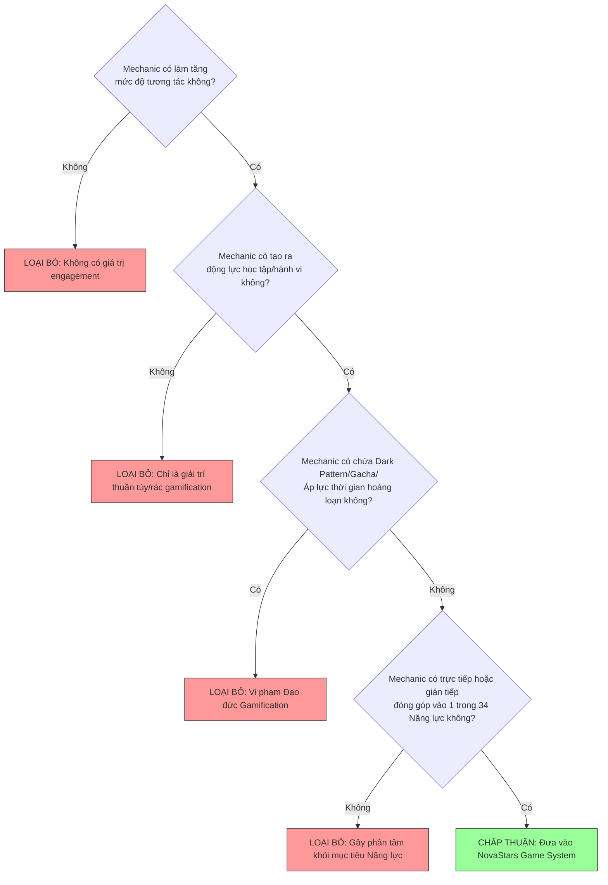

---

# PART 1: GAME DESIGN PHILOSOPHY (TRIẾT LÝ THIẾT KẾ GAME)

## 1.1. 12 Nguyên Tắc Chỉ Đạo Từ Hội Đồng Thiết Kế (The 12 Council Principles)

1. **Adventure-First, Study-Second**: Trẻ em không vào app để "làm bài tập". Trẻ vào app để dấn thân vào một cuộc phiêu lưu. Học tập là phương tiện để chiến thắng cuộc phiêu lưu đó.
2. **Competency Over Content**: Mục tiêu không phải là đọc hết nội dung mà là thành thục hành vi. Một bài học chỉ hoàn thành khi trẻ chứng minh được năng lực.
3. **Fail-Safe Environment**: Thất bại là thông tin phản hồi, không phải trừng phạt. Không bao giờ trừ điểm, không trừng phạt bằng cách bắt chờ thời gian, không có màn hình "Game Over" tiêu cực.
4. **Scaffolding Mastery**: Độ khó được điều chỉnh tự động theo vùng phát triển gần nhất (ZPD - Zone of Proximal Development) của từng trẻ.
5. **Intrinsic Motivation Priority**: Ngoại lực (Coins, Badges) chỉ là giàn giáo ban đầu. Mục tiêu cuối cùng là xây dựng Động lực nội tại (Niềm vui tự hào khi làm được việc khó).
6. **Real-World Bridge**: Mọi thành tựu trong game phải có dây nối với đời thực. Game không thay thế đời thực, game truyền cảm hứng cho trẻ sống tốt hơn ngoài đời thực.
7. **Empathetic Companion**: Companion Nova là người bạn đồng hành thấu cảm, không bao giờ phán xét, luôn lắng nghe và gợi mở tư duy.
8. **Self-Paced Autonomy**: Trẻ có quyền lựa chọn thứ tự khám phá, nhân vật, Pet và cách giải quyết vấn đề. Tự chủ tạo nên trách nhiệm.
9. **Visual & Emotional Clarity**: Mọi phản hồi UI/UX phải cực kỳ trực quan, rực rỡ, rõ ràng, phù hợp với tâm lý tiếp nhận hình ảnh của lứa tuổi 6-11.
10. **Parent as Co-Hero**: Cha mẹ không phải là "giám thị" mà là Đồng minh xác thực thành tích ngoài đời, cùng trẻ tận hưởng chiến thắng.
11. **Ethical Safeguards**: Nói KHÔNG với mọi cơ chế gây nghiện vô thức. Tôn trọng thời gian onscreen của trẻ (tối đa 20-30 phút/ngày).
12. **Long-Term Behavior Change**: Đo lường sự thành công của game bằng sự thay đổi hành vi tích cực của trẻ trong cuộc sống hàng ngày sau 30-90 ngày.

---

# PART 2: CORE GAME LOOP (VÒNG LẶP GAMEPLAY C CỐT LÕI 8 BƯỚC)

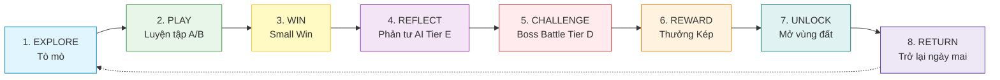

## 2.1. Phân Tích Rationale & Mục Đích 8 Bước Core Loop

### Bước 1: EXPLORE (Khám phá & Tò mò)
- **Mục đích**: Kích hoạt sự tò mò và tạo bối cảnh cốt truyện cho bài học.
- **Hành vi của trẻ**: Chạm vào nút mờ sương trên bản đồ Đảo, nghe Nova kể câu chuyện tương tác ngắn (2 phút) về tình huống rắc rối của bạn Su/Kem.
- **Tâm lý học**: Kích hoạt Curiosity Gap (Khoảng trống tò mò của Loewenstein). Trẻ muốn biết "Làm sao để giúp bạn Su giải quyết rắc rối này?".

### Bước 2: PLAY (Luyện tập Thao tác - Tier A & B)
- **Mục đích**: Tiếp thu khái niệm (Nhận biết & Thấu hiểu) qua các Mini-games kéo thả, phân loại, tìm điểm mất an toàn.
- **Hành vi của trẻ**: Tương tác trực tiếp với vật thể trên màn hình. Ví dụ: Kéo các vật dễ cháy ra xa ổ điện.
- **Giáo dục học**: Học qua trải nghiệm giác quan (Kinesthetic Learning). Thao tác trực tiếp giúp hình thành liên kết thần kinh nhanh gấp 3 lần đọc chữ.

### Bước 3: WIN (Chiến thắng Giai đoạn - Small Wins)
- **Mục đích**: Củng cố niềm tin "Mình có thể làm được" (Self-Efficacy).
- **Hành vi của trẻ**: Hoàn thành mini-game, nhận pháo hoa rực rỡ, Nova nhảy múa cổ vũ, nhận những đồng Coins đầu tiên.
- **Tâm lý học**: Tiết Dopamine tích cực, giải phóng căng thẳng nhẹ, chuẩn bị tâm lý cho bước phản tư sâu hơn.

### Bước 4: REFLECT (Phản tư cùng AI Nova - Tier E)
- **Mục đích**: Chuyển hóa thao tác tay thành nhận thức sâu sắc về bản thân.
- **Hành vi của trẻ**: Trả lời 1-2 câu hỏi gợi mở từ Nova bằng giọng nói hoặc nhập liệu (Ví dụ: "Nếu ở nhà một mình mà có người lạ gõ cửa, con cảm thấy thế nào và sẽ làm gì?").
- **Giáo dục học**: Khung Phản tư Kolb (Experiential Learning Cycle). Phản tư là bước bắt buộc để chuyển Trải nghiệm thành Tri thức thực thụ.

### Bước 5: CHALLENGE (Thử thách Tình huống & Boss Battle - Tier C & D)
- **Mục đích**: Đánh giá năng lực ra quyết định trong tình huống phức tạp có yếu tố kịch tính.
- **Hành vi của trẻ**: Tham gia trận đấu Boss theo lượt. Tấn công Boss bằng cách chỉ ra hành vi sai của Boss và chọn giải pháp an toàn/đúng đắn nhất.
- **Tâm lý học**: Kích hoạt Hard Fun (Fiero). Khi đánh bại Boss, trẻ cảm thấy mình là một anh hùng thực sự chứ không chỉ là học sinh làm xong bài tập.

### Bước 6: REWARD (Thưởng Kép: In-Game + Real-World)
- **Mục đích**: Ghi nhận toàn diện nỗ lực của trẻ.
- **Hành vi của trẻ**: Nhận Star Points mở khóa bản đồ, Coins mua đồ, và nhận **Nhiệm vụ Đời thực (Real-Life Mission)** để thực hiện cùng bố mẹ.
- **Kinh tế học hành vi**: Cơ chế Thưởng biến đổi (Variable Reward) kết hợp Thưởng chắc chắn (Fixed Reward) tạo sự thỏa mãn tròn trịa.

### Bước 7: UNLOCK (Mở Khóa Vùng Đất / Nội Dung Mới)
- **Mục đích**: Mở rộng tầm mắt và tạo mục tiêu tiếp theo.
- **Hành vi của trẻ**: Sương mù trên bản đồ tan biến, tiết lộ vùng đất mới (ví dụ: Đảo An Toàn Điện -> Đảo Quản Lý Cảm Xúc).
- **Động lực học**: Thỏa mãn nhu cầu Mastery và Progress. Trẻ nhìn thấy hành trình chinh phục của mình kéo dài trực quan.

### Bước 8: RETURN TOMORROW (Gieo Mầm Tò Mò & Trở Lại Hàng Ngày)
- **Mục đích**: Kết thúc phiên chơi trong trạng thái vui vẻ, không kiệt sức và háo hức cho ngày mai.
- **Hành vi của trẻ**: Nova chào tạm biệt, nhắc nhở nhiệm vụ đời thực nhẹ nhàng, hiển thị "Hạt giống bí ẩn ngày mai".
- **Tâm lý học**: Hiệu ứng Zeigarnik (Nhớ những công việc chưa hoàn thành). Trẻ rời app với sự háo hức tự nhiên thay bị ức chế.

---

# PART 3: META GAME LOOP (VÒNG LẶP META TOÀN DIỆN)

Hệ thống Meta Game Loop lồng ghép các chu kỳ thời gian để duy trì sự gắn kết bền vững từ ngày này sang tháng khác.

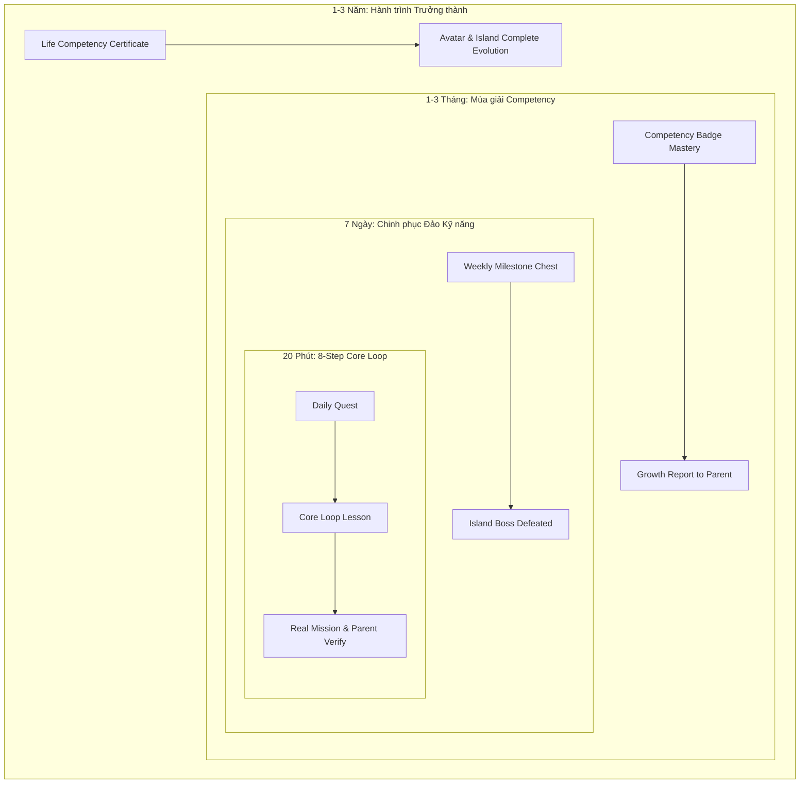

## 3.1. Chi tiết Các Cấp Độ Meta Loop

| Chu kỳ | Mục tiêu Chính | Động lực Cốt lõi | Trải nghiệm Người dùng | Phần thưởng Đầu ra |
| :--- | :--- | :--- | :--- | :--- |
| **Daily Loop** (20 phút/ngày) | Hoàn thành 1 Nút bài học & 1 Nhiệm vụ Đời thực | Habit Loop, Curiosity, Immediate Reward | 8-Step Core Loop + Tương tác Nova + Thực hành tại nhà | Coins, SP, Daily Streak Count |
| **Weekly Loop** (7 ngày) | Chinh phục trọn vẹn 1 Đảo Kỹ năng (3-4 bài học) | Mastery, Progress, Ownership | Đánh bại Đại Boss Đảo, Mở Rương Tuần, Nhận phản hồi cha mẹ | Rương Vàng Tuần, Pet Food, Trang phục Rare |
| **Monthly Loop** (30 ngày) | Làm chủ 1 Nhóm Năng lực lớn (Competency Cluster) | Status, Purpose, Long-term Achievement | Báo cáo Năng lực Tháng, Lễ trao Huy hiệu Năng lực 3D | Huy hiệu 3D Độc bản, Skin Đảo Mùa Giải |
| **Long-Term Loop** (1-3 năm) | Hoàn thành 34 Năng lực cốt lõi tiểu học | Identity Transformation, Real Confidence | Tốt nghiệp Các Thế giới Năng lực, Nhận Chứng chỉ Năng lực Sống | Chứng chỉ Năng lực Đời thực, Full Avatar Evolution |

---

# PART 4: MOTIVATION FRAMEWORK (KHUNG ĐỘNG LỰC HỌC TẬP & HÀNH VI)

NovaStars kết hợp **Thuyết Tự Quyết (Self-Determination Theory - SDT)** của Deci & Ryan và Khung Gamification Octalysis của Yu-kai Chou để thiết kế động lực.

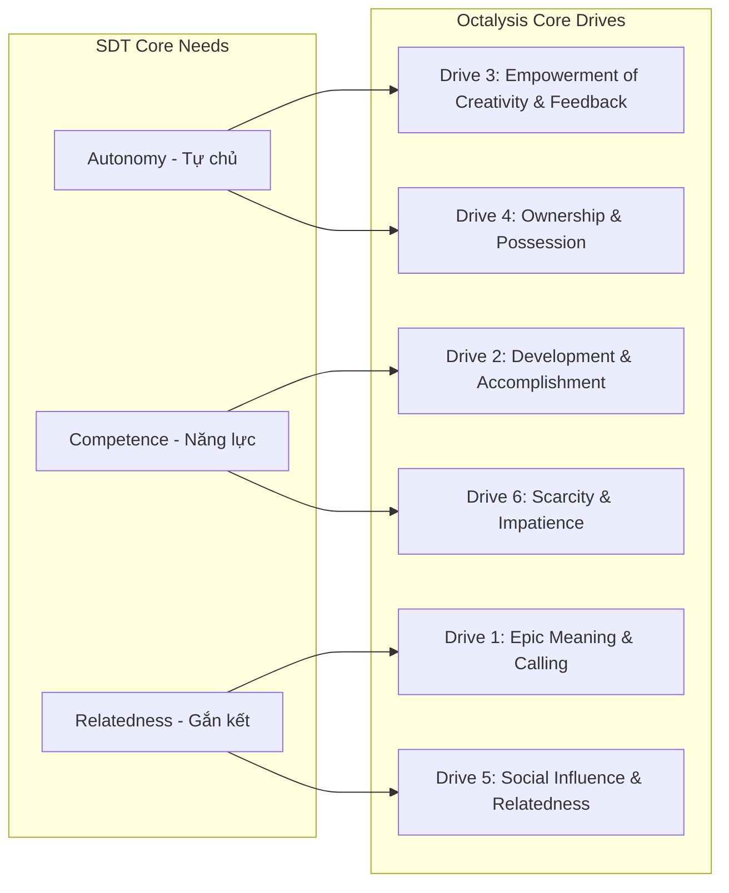

## 4.1. Phân Tích 6 Động Lực Cốt Lõi Tác Động Vào Trẻ

1. **Curiosity (Sự Tò mò)**: Kích thích não bộ muốn tìm hiểu nguyên nhân - kết quả. 
   - *Ứng dụng*: Sương mù bản đồ, câu hỏi gợi mở từ Nova, hộp quà bí ẩn ngày mai.
2. **Mastery (Kh khao Làm chủ)**: Cảm giác mình ngày càng giỏi hơn, vượt qua những việc trước đây không làm được.
   - *Ứng dụng*: Competency Tree tiến trình rõ ràng, Boss Battle tăng dần độ khó, thanh HP Boss tụt xuống khi chọn đúng.
3. **Ownership (Quyền Sở hữu)**: Trẻ trân trọng những gì mình tự tay xây dựng và trang trí.
   - *Ứng dụng*: Tùy biến Avatar, nuôi và tiến hóa Pet Nova, trang trí Đảo cá nhân bằng Coins tự kiếm được.
4. **Purpose (Ý nghĩa Thượng thượng)**: Trẻ thấy mình đang làm việc có ích, giúp đỡ bạn bè và bảo vệ hành tinh.
   - *Ứng dụng*: Cốt truyện giải cứu thế giới Nova, giúp đỡ bạn Su/Kem, làm việc tốt giúp bố mẹ ngoài đời.
5. **Autonomy (Quyền Tự chủ)**: Trẻ được tự mình lựa chọn, không bị ép buộc khuôn mẫu.
   - *Ứng dụng*: Cho phép chọn thứ tự làm bài trên Đảo, chọn cách trả lời với Nova (Nói/Gõ), chọn vật phẩm mua trong Shop.
6. **Achievement (Cảm giác Thành tựu)**: Sự công nhận xứng đáng cho nỗ lực vượt khó.
   - *Ứng dụng*: Huy hiệu Năng lực 3D, Lời khen chân thành từ AI Nova, Sự tự hào xác nhận từ Cha mẹ.

---

# PART 5: PROGRESSION SYSTEM (HỆ THỐNG TIẾN TRÌNH & NĂNG LỰC)

## 5.1. Cấu Trúc Tiến Trình 5 Cấp Độ (Macro-to-Micro Architecture)

$$\text{World (Thế giới)} \longrightarrow \text{Island (Hòn đảo)} \longrightarrow \text{Skill Node (Nút Kỹ năng)} \longrightarrow \text{Lesson (Bài học)} \longrightarrow \text{Boss Battle}$$

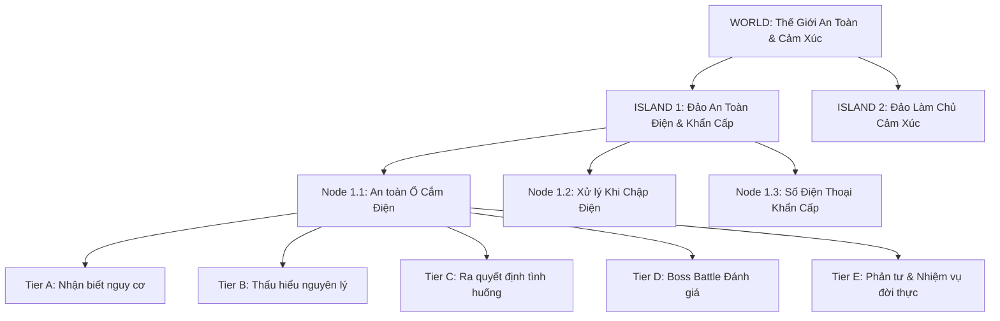

## 5.2. Tiêu Chuẩn Phân Biệt: Completion vs. Mastery (SOP)

> [!IMPORTANT]
> **QUY TRÌNH CHUẨN (SOP) ĐÁNH GIÁ ĐẠT NĂNG LỰC (MASTERY STANDARD)**
> 
> - **Completion (Hoàn thành bài học)**: Trẻ xem hết cốt truyện, làm xong minigame Tier A/B và thắng Boss Battle trong app. Trạng thái: `LESSON_COMPLETED`.
> - **Mastery (Làm chủ Năng lực)**: Trẻ hoàn thành bước Phản tư Tier E với AI Nova + Thực hiện Nhiệm vụ Đời thực + Được Cha mẹ xác thực trên Parent App. Trạng thái: `COMPETENCY_MASTERED`.
> - **Nguyên tắc**: Chỉ có `COMPETENCY_MASTERED` mới cấp Huy hiệu 3D và tính vào Báo cáo Năng lực chính thức của trẻ.

---

# PART 6: ECONOMY SYSTEM (HỆ THỐNG KINH TẾ TRONG GAME)

Nền kinh tế NovaStars được thiết kế theo mô hình **Tiền tệ Kép (Dual-Currency Economy)** với các quy tắc cân bằng nghiêm ngặt nhằm tránh lạm phát và lồng ghép bài học Quản lý tài chính cho trẻ.

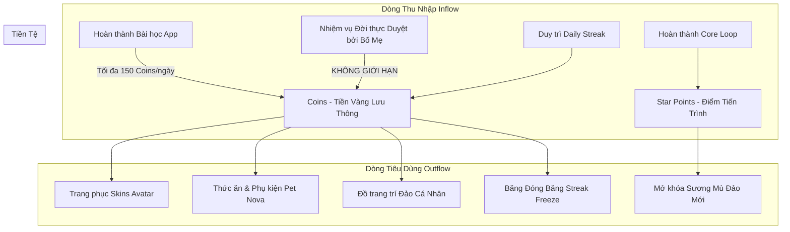

## 6.1. Công Thức Cân Bằng Dòng Tiền (Mathematical Economy Balance)

### 1. Giới Hạn Thu Nhập Hàng Ngày (Daily Earn Cap Formula):
$$Earn_{max\_app} = 150 \text{ Coins/ngày}$$
$$Earn_{real\_mission} = \text{Uncapped (Tùy thuộc duyệt từ Cha mẹ: 50-100 Coins/nhiệm vụ)}$$

- *Lý do*: Ngăn chặn trẻ cày cuốc (grinding) quá nhiều thời gian trên app. Muốn có nhiều Coins hơn để mua đồ đẹp, trẻ **BẮT BUỘC** phải ra ngoài đời thực làm nhiệm vụ giúp đỡ gia đình.

### 2. Mô Hình Giá Cả Vật Phẩm (Pricing & Savings Balance):

| Danh mục Vật phẩm | Độ hiếm | Giá (Coins) | Thời gian Tích lũy Trung bình | Bài học Tài chính cho Trẻ |
| :--- | :---: | :---: | :---: | :--- |
| **Thức ăn Pet Cơ bản** | Common | 30 | 1 ngày học in-app | Tiêu dùng thiết yếu hàng ngày |
| **Mũ Thám Hiểm Avatar** | Common | 200 | 2 ngày học + 1 Nhiệm vụ đời thực | Tiết kiệm ngắn hạn |
| **Áo Choàng Dũng Sĩ Hào Quang** | Rare | 600 | 4-5 ngày học & thực hành | Lập kế hoạch tiết kiệm trung hạn |
| **Lâu Đài Đa Sắc Đảo** | Legendary | 2,000 | 2-3 tuần kiên trì tích lũy | Tiết kiệm dài hạn & Hoãn sự sung sướng (Delayed Gratification) |
| **Băng Đóng Băng Streak** | Consumable | 300 | 2 ngày học | Quản lý rủi ro & Bảo hiểm |

---

# PART 7: REWARD SYSTEM (HỆ THỐNG PHẦN THƯỞNG Ý NGHĨA)

Hệ thống phần thưởng áp dụng Khung **SAPs (Status, Access, Power, Stuff)** của Gabe Zichermann:

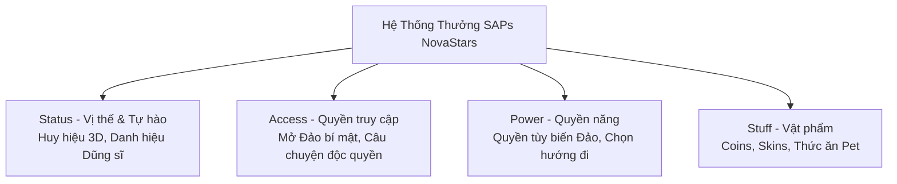

## 7.1. Bảng Quy Tắc Trao Thưởng (Reward Triggers & Matrix)

| Sự kiện Kích hoạt (Trigger) | Phần thưởng In-App | Phần thưởng Đời thực / Tinh thần | Rationale Tâm lý & Giáo dục |
| :--- | :--- | :--- | :--- |
| **Trả lời đúng câu hỏi ngay lần đầu** | $+5$ Coins, Hiệu ứng pháo hoa | Nova nhảy múa khen ngợi | Khuyến khích sự tập trung |
| **Thử lại & Sửa sai thành công** | $+5$ Coins (Bằng lần đầu!), Hiệu ứng "Tư duy Tăng trưởng" | Nova khen: "Con kiên trì tuyệt vời!" | **QUAN TRỌNG**: Không trừ điểm khi sai. Thưởng bằng điểm trả lời đúng để khuyến khích thử sai. |
| **Kiên trì làm lại bài khó (Persistence)** | Huy hiệu "Dũng Sĩ Kiên Trì" | Nova trao ôm ấm áp | Rèn luyện Grit (Lòng kiên trì) |
| **Duy trì Streak 7 ngày** | Rương Gỗ Tuần ($+100$ Coins + 1 Skin Common) | Thiệp khen gửi đến Parent App | Hình thành Thói quen (Habit Formation) |
| **Hoàn thành Nhiệm vụ Đời thực** | $+100$ Coins (Duyệt bởi Bố mẹ) | Lời khen trực tiếp từ Bố mẹ | Chuyển hóa Năng lực vào Đời thực |
| **Đánh bại Boss Battle** | $+50$ SP, $+30$ Coins, Mở vùng đất mới | Cắt cảnh mừng chiến thắng kịch tính | Kích hoạt Fiero (Cảm giác chiến thắng) |

---

# PART 8: COLLECTION SYSTEM (HỆ THỐNG BỘ SƯU TẬP)

## 8.1. Tại Sao Trẻ Em Thích Thu Thập? (Psychology of Collection)
Trẻ em từ 6-11 tuổi có bản năng thu thập tự nhiên (Psychological Endowment Effect & Nesting Instinct). Bộ sưu tập cung cấp:
1. **Bằng chứng trực quan cho sự trưởng thành**: "Mình đã sưu tập được 15 Huy hiệu Năng lực!".
2. **Thể hiện cá tính độc đáo**: Đảo cá nhân và Avatar phản ánh sở thích của riêng trẻ.
3. **Niềm tự hào lành mạnh**: Thắt chặt tình cảm khi khoe bộ sưu tập với cha mẹ.

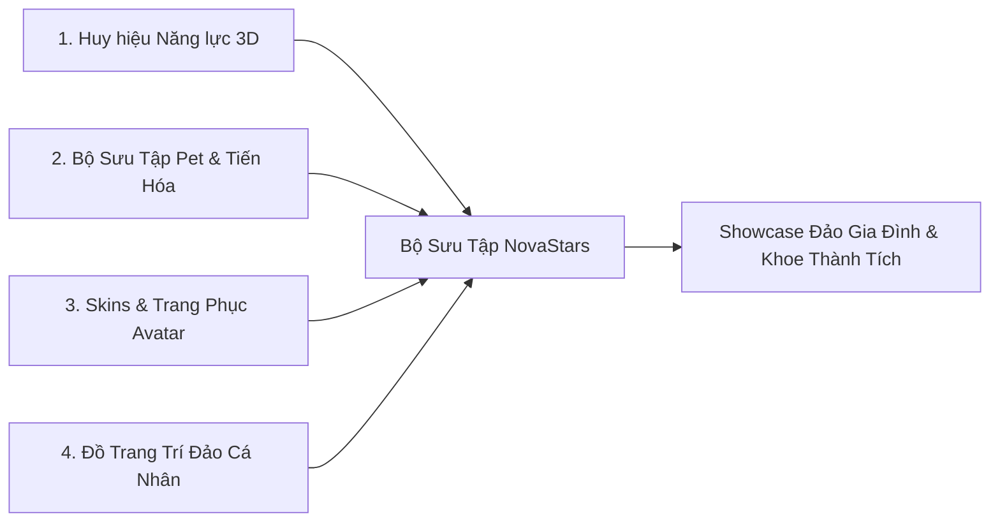

---

# PART 9: FAILURE DESIGN (THIẾT KẾ THẤT BẠI TÍCH CỰC & AN TOÀN)

> [!CAUTION]
> **NGUYÊN TẮC VÀNG: KHÔNG TRỪ ĐIỂM - KHÔNG TRỪ MẠNG - KHÔNG TRỪ MÁU**
> 
> Trong NovaStars, thất bại không bao giờ là kết thúc. Thất bại chỉ đơn giản là **"Thông tin phản hồi để học tốt hơn"**.

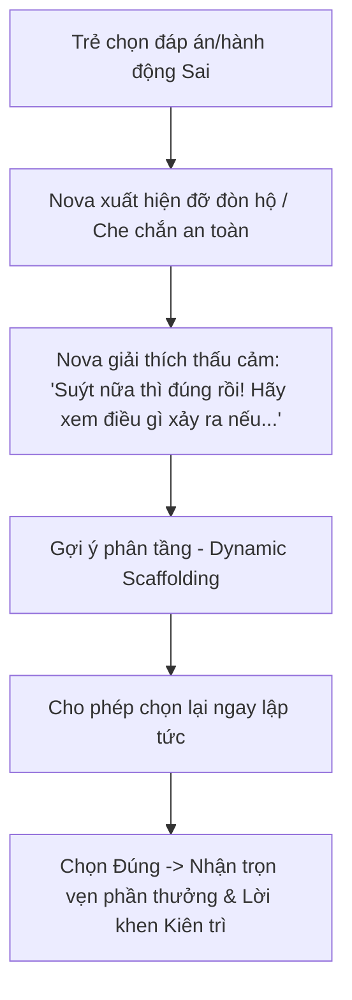

## 9.1. Khung Phản Hồi Phân Tầng Khi Trẻ Trả Lời Sai (Scaffolding Recovery SOP)
- **Lần sai 1**: Nova gợi ý nhẹ bằng hình ảnh hoặc loại bỏ 1 phương án sai nhất.
- **Lần sai 2**: Nova giải thích nguyên lý ngắn gọn bằng hoạt hình minh họa.
- **Lần sai 3**: Nova cùng trẻ phân tích và dẫn dắt đến đáp án đúng. Trẻ bấm chọn lại đáp án đúng và vẫn nhận đủ Coins + Lời khen kiên trì.

---

# PART 10: BOSS BATTLE SYSTEM (HỆ THỐNG ĐẤU BOSS KỊCH TÍNH)

## 10.1. Triết Lý Thiết Kế Boss Battle
Boss Battle không phải là quái vật đáng sợ gieo rắc ác mộng. Boss trong NovaStars là **"Đại diện cho Thói quen xấu / Nguy cơ mất an toàn / Cảm xúc bốc đồng"** (ví dụ: Quái Vật Ổ Cắm Điện Lơ Đễnh, Quái Vật Nổi Giận Nóng Nảy, Quái Vật Tin Người Lạ).

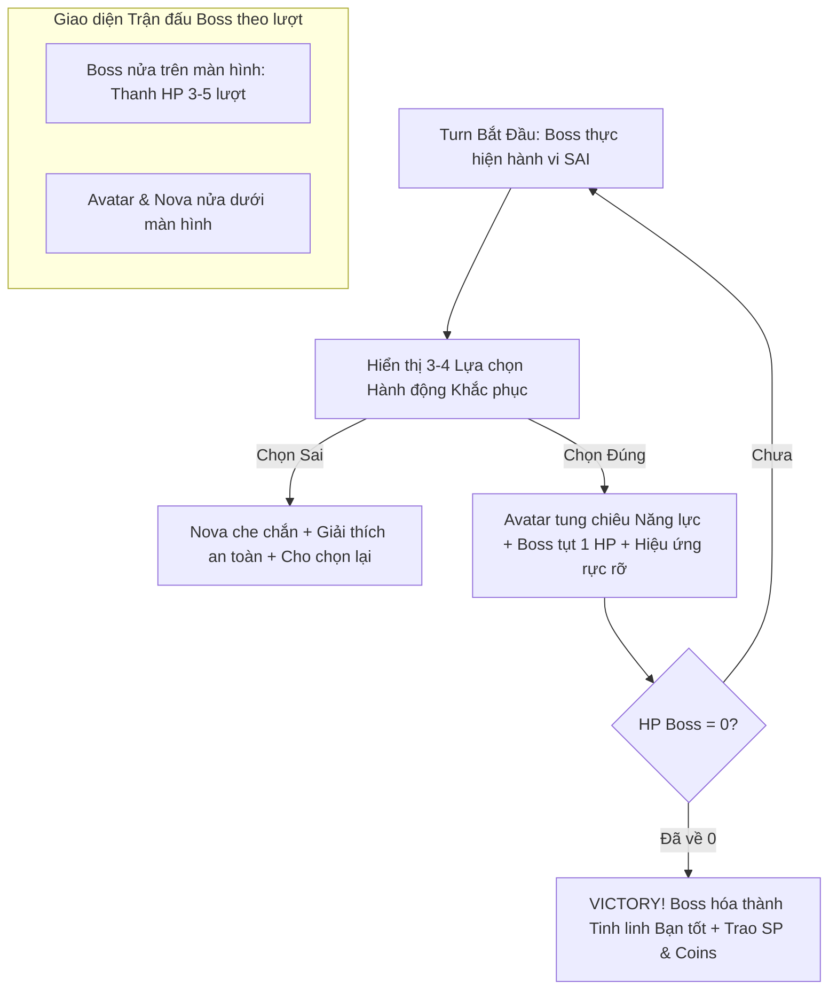

---

# PART 11: DAILY HABIT ENGINE (ĐỘNG CƠ HÌNH THÀNH THÓI QUEN HÀNG NGÀY)

Áp dụng Khung **The Hook Model** của Nir Eyal để hình thành thói quen rèn luyện kỹ năng sống tích cực:

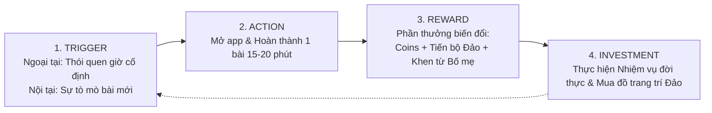

## 11.1. Cơ Chế Streak Thông Minh & Nhân Văn (Smart Protection Streak)
- **Streak Freeze (Băng đóng băng)**: Trẻ có thể mua bằng Coins để bảo vệ chuỗi khi bận học ở trường hoặc đi du lịch.
- **Streak Recovery Mission**: Nếu lỡ đứt chuỗi, trẻ không bị mất trắng. Trẻ có thể làm một Nhiệm vụ Đời thực đặc biệt (giúp đỡ cha mẹ) để khôi phục toàn bộ chuỗi Streak cũ.

---

# PART 12: FLOW DESIGN (THIẾT KẾ TRẠNG THÁI DÒNG CHẢY - FLOW STATE)

Áp dụng Khung **Flow Theory** của Mihaly Csikszentmihalyi để giữ trẻ luôn ở trong vùng trải nghiệm tối ưu:

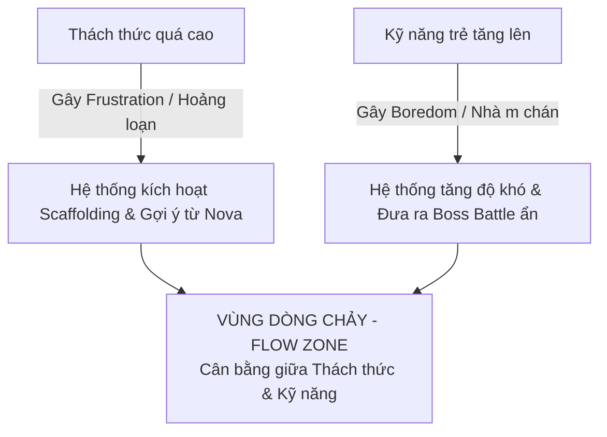

## 12.1. Dynamic Difficulty Adjustment (DDA Engine)
- Thuật toán AI theo dõi tỷ lệ trả lời đúng ngay lần đầu ($Accuracy_{first}$).
- Nếu $Accuracy_{first} > 90\%$ qua 3 bài: Tự động nhảy cấp sang các tình huống lồng ghép phức tạp hơn (Tier C/D nâng cao).
- Nếu $Accuracy_{first} < 50\%$: Tự động chèn các minigame mô phỏng bổ trợ thị giác (Tier B) để củng cố nền tảng trước khi tái đấu Boss.

---

# PART 13: EMOTIONAL CURVE DESIGN (THIẾT KẾ ĐƯỜNG CONG CẢM XÚC)

Mỗi phiên chơi 20 phút được thiết kế như một **Bản hòa tấu cảm xúc (Emotional Symphony)**:

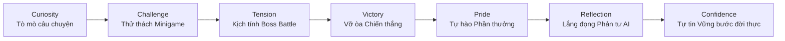

---

# PART 14: REPLAYABILITY SYSTEM (KHẢ NĂNG CHƠI LẠI TRONG SÁNG)

Tại sao trẻ lại thích chơi lại các bài học đã qua mà không nhàm chán?

1. **AI Generative Variation Engine**: Mỗi lần chơi lại, AI tự động thay đổi bối cảnh, nhân vật phụ, và chi tiết câu hỏi tình huống (chỉ giữ nguyên nguyên lý năng lực cốt lõi).
2. **Mastery Leveling (Hệ thống Cấp độ Thành thục)**: 
   - Lần 1: Đạt Huy hiệu Đồng (Bronze Star)
   - Lần 2 (Sau 7 ngày - Spaced Repetition): Đạt Huy hiệu Bạc (Silver Star)
   - Lần 3 (Sau 30 ngày): Đạt Huy hiệu Kim Cương (Diamond Star)
3. **Time-Trial & Creative Modes**: Cho phép trẻ thử nghiệm các lựa chọn khác nhau để xem các kịch bản diễn biến khác nhau (Sandbox Scenario).

---

# PART 15: ETHICAL GAMIFICATION & SAFEGUARD BIBLE (GAMIFICATION VỊ NHÂN TRẮC)

NovaStars cam kết tuân thủ tiêu chuẩn cao nhất về an toàn và đạo đức cho trẻ em:

```text
[CHECKLIST NGUYÊN TẮC ĐẠO ĐỨC NOVASTARS]
[✓] NÓI KHÔNG với Gacha / Hộp quà may mắn mất phí hoặc tạo tâm lý cay cú.
[✓] NÓI KHÔNG với Bảng xếp hạng PVP đè bẹp bạn bè.
[✓] NÓI KHÔNG với Thông báo đẩy (Push Notification) đe dọa hoặc thao túng cảm xúc tiêu cực.
[✓] NÓI KHÔNG với Quảng cáo từ bên thứ ba hoặc mua hàng trong app (In-App Purchase) hướng đến trẻ em.
[✓] NÓI CÓ với Giới hạn thời gian chơi an toàn (Tự động nhắc nhở nghỉ ngơi sau 25 phút).
[✓] NÓI CÓ với Sự minh bạch tuyệt đối và quyền kiểm soát của Cha mẹ.
```

---

# PART 16: GAME DESIGN DNA & SUMMARY (GEN THIẾT KẾ NOVASTARS)

## 16.1. 6 Tuyên Bố DNA Cốt Lõi (The 6 Core DNA Statements)

1. **Children return because...** *(Trẻ em quay lại hàng ngày vì...)*
   Háo hức muốn biết câu chuyện tiếp theo, muốn chăm sóc chú Pet Nova đáng yêu và muốn tự tay trang trí hòn đảo mơ ước bằng thành quả lao động của chính mình.

2. **Children replay because...** *(Trẻ em chơi lại vì...)*
   Mỗi lần chơi lại đều mang đến những thử thách mới lạ từ AI, cảm giác ngày càng làm chủ kỹ năng tốt hơn và khao khát nâng cấp Huy hiệu Kim Cương rực rỡ.

3. **Children fail without frustration because...** *(Trẻ em thất bại mà không nản lòng vì...)*
   NovaStars là một thế giới an toàn tuyệt đối, không có hình phạt, không bị trừng phạt điểm số; thất bại chỉ là bước đệm để Nova đến bên cạnh che chắn và cùng trẻ khám phá ra giải pháp đúng.

4. **Children build competency because...** *(Trẻ em phát triển năng lực vì...)*
   Mọi hành động trong game đều liên kết trực tiếp với các tình huống sống thực tế, buộc trẻ phải nhận diện, ra quyết định, phản tư sâu sắc và mang bài học ra thực hành ngoài đời thực cùng cha mẹ.

5. **Parents trust gameplay because...** *(Cha mẹ tin tưởng trò chơi vì...)*
   Họ nhìn thấy con mình không chỉ giải trí lành mạnh mà còn ngoan hơn, biết tự giác làm việc nhà, biết quản lý cảm xúc và chủ động chia sẻ những bài học ý nghĩa mỗi ngày.

6. **Teachers value gameplay because...** *(Thầy cô trân trọng trò chơi vì...)*
   NovaStars chuẩn hóa 34 năng lực cốt lõi theo khung giáo dục hiện đại, biến những bài học kỹ năng sống lý thuyết thành các trải nghiệm hành vi đo lường được và có tính giáo dục sâu sắc.

---

## 16.2. Tuyên Ngôn DNA Game NovaStars (The One-Sentence Game DNA Manifesto)

> [!TIP]
> **NOVASTARS GAME DNA MANIFESTO**
> 
> *"NovaStars là một hệ điều hành trò chơi vị nhân trắc, biến hành trình rèn luyện kỹ năng sống thành một cuộc phiêu lưu làm chủ bản thân rực rỡ, nơi mọi niềm vui tương tác đều chuyển hóa thành năng lực thực tế, sự kiên trì tích cực và sự tự tin thay đổi cuộc đời trẻ."*

---

# PHỤ LỤC: MA TRẬN ĐÁNH GIÁ & QUY TRÌNH DUYỆT GAME MECHANIC

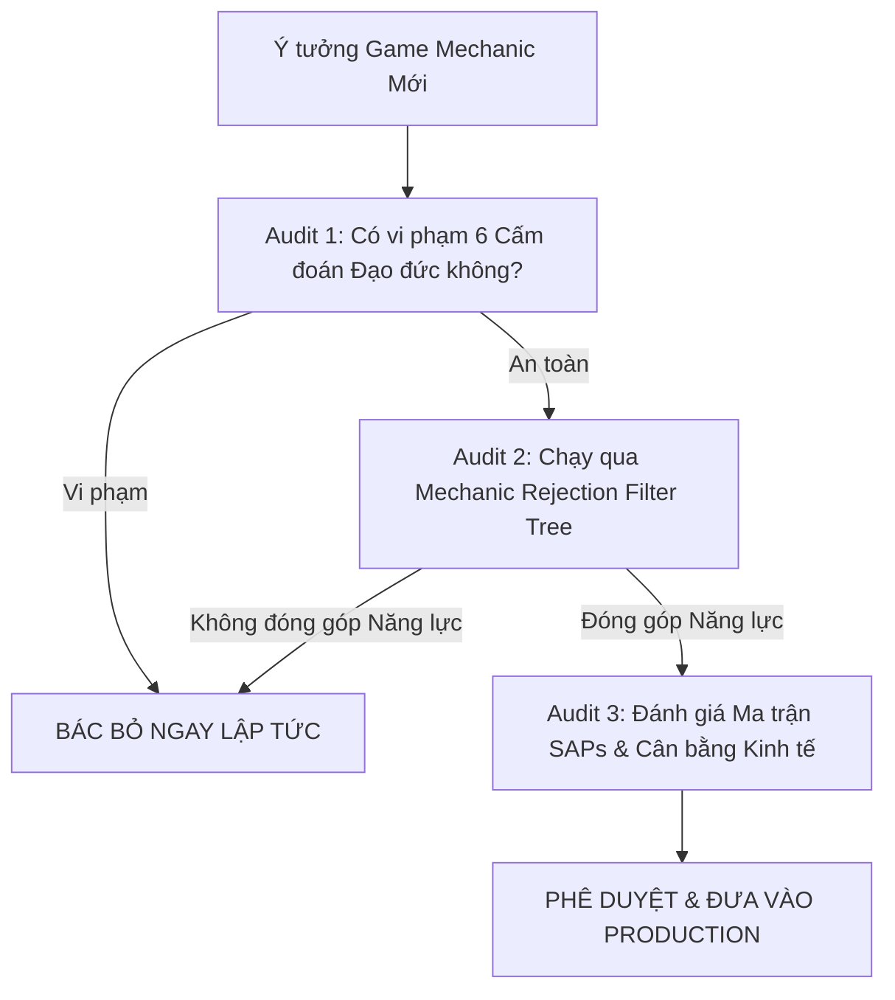
