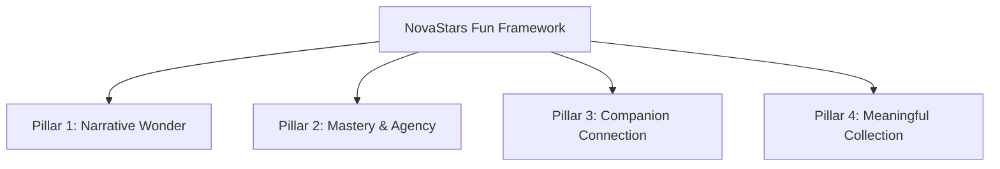

# NovaStars Game Design Bible & Fun Framework

## Purpose
The constitutional Game Design Bible governing game mechanics, engagement systems, progression models, reward loops, and safe failure design across the NovaStars ecosystem.

## Scope
Defines game design philosophy, core mechanics, progression curves, companion mechanics, and gamification constraints.

## The NovaStars Fun Framework

Game design in NovaStars operates at the intersection of 4 core engagement pillars:

### Pillar 1: Narrative Wonder
- **Concept:** Every learning module takes place in an enchanting world (e.g. Star Haven, Echo City) where solving challenges restores harmony to the universe.
- **Rule:** Story is never just a wrapper; story progression requires pedagogical mastery.

### Pillar 2: Mastery & Agency
- **Concept:** Children experience genuine competence. Progression is unlocked by demonstrating skill, not paywalls or luck.
- **Rule:** Give players meaningful choices in how they approach problems (e.g., spending vs. saving in a financial simulation).

### Pillar 3: Companion Connection
- **Concept:** NovaStar Companions act as learning partners, celebrating wins and offering scaffolded advice when players struggle.
- **Rule:** Companions never lecture; they explore *with* the player.

### Pillar 4: Meaningful Collection & Rewards
- **Concept:** Players earn Star Shards, Nova Badges, and Companion Costumes for completing lessons and demonstrating real-world habits.
- **Rule:** No pay-to-win mechanics or loot boxes. All rewards are tied directly to learning milestones and effort.

## Safe Failure Design
- Mistakes trigger playful "Oops!" animations rather than red alert warnings.
- The system offers a "Try Again" opportunity with progressive hint scaffolding.
- Completing a challenge after failure awards full mastery credit, reinforcing growth mindset.

## Dependencies & Upstream Links (`depends_on`)
- [Product Foundation Blueprint](file:///Users/thuy/Documents/apptieuhoc/02_PRODUCT/product_foundation.md) (`ID: NS-PRD-FND-001`)
- [Experience OS](file:///Users/thuy/Documents/apptieuhoc/03_EDUCATION/experience_os.md) (`ID: NS-EDU-EXPOS-001`)

## Downstream Impact & Consumers (`used_by`)
- [Core & Meta Gameplay Loops](file:///Users/thuy/Documents/apptieuhoc/04_GAME/gameplay_loops.md) (`ID: NS-GAM-LOOP-001`)
- [Content Model Architecture](file:///Users/thuy/Documents/apptieuhoc/05_CONTENT/content_model.md) (`ID: NS-CNT-MOD-001`)
- [Boss Agent Specification](file:///Users/thuy/Documents/apptieuhoc/06_AI/agent_registry/boss_agent.md) (`ID: NS-AI-AGNT-002`)

## Governance & Metadata
- **Owner:** Lead Game Designer
- **Status:** FROZEN
- **Version:** 1.0.0
- **Last Updated:** 2026-08-04
