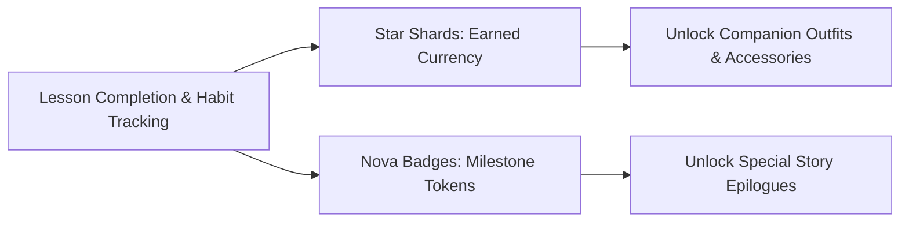

# NovaStars Virtual Economy & Companion Reward Mechanics

## Purpose
Defines the virtual currencies, reward drop rates, companion level progression curves, and ethical gamification constraints governing the NovaStars economy.

## Currency Architecture

### 1. Star Shards (Earned Daily Currency)
- **Earn Mechanism:** Awarded for completing quest stages (+10 Shards/stage) and maintaining daily streaks (+5 bonus/day).
- **Sink Mechanism:** Used in the Companion Closet to unlock hats, glasses, and color themes.
- **Ethical Rule:** Zero microtransactions. Star Shards CANNOT be purchased with real money.

### 2. Nova Badges (Competency Milestones)
- **Earn Mechanism:** Awarded upon demonstrating 80%+ mastery on a Subdomain (5 badges per Domain).
- **Display:** Displayed on the Learner's Star Shield and sent to the Parent Companion Dashboard.

## Companion Progression Curves
- **Level 1 → 5**: Requires 500 XP (approx. 5 completed lessons).
- **Level 5 → 10**: Requires 1,500 XP (unlocks Special Aura effect).
- **Level 10 (Max)**: Requires 5,000 XP (unlocks Golden Star Crown).

## Dependencies & Upstream Links (`depends_on`)
- [Game Design Bible](file:///Users/thuy/Documents/apptieuhoc/04_GAME/game_design_bible.md) (`ID: NS-GAM-BIB-001`)

## Governance & Metadata
- **Owner:** Lead Game Designer
- **Status:** FROZEN
- **Version:** 1.0.0
- **Last Updated:** 2026-08-04
