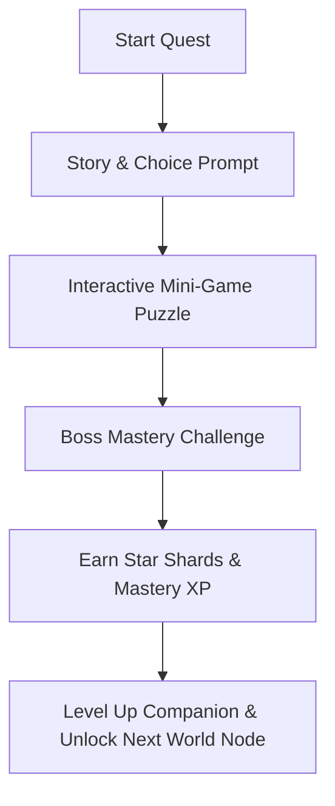

# NovaStars Core & Meta Gameplay Loops

## Purpose
Defines the micro, macro, and meta engagement loops driving daily player retention, progression, skill mastery, and companion nurturing.

## Core Gameplay Loop (Session Level: 5–10 Minutes)

1. **Prompt & Hook**: Player accepts a daily quest node on the Star Map.
2. **Interactive Puzzle**: Completes 2-3 interactive competency challenges.
3. **Boss Synthesis**: Defeats the Mini-Boss using cumulative learning.
4. **Reward & Level Up**: Earns Star Shards, levels up Companion, unlocks new customization items.

## Meta Progression Loop (Long-Term: Weeks/Months)
- **World Node Conquest**: Clearing 5 Quest Nodes unlocks a World Boss.
- **Companion Evolution**: Nurturing Companions through consistent daily learning streaks.
- **Mastery Showcase**: Unlocking mastery badges displayed in the Learner Profile and Parent Dashboard.

## Dependencies & Upstream Links (`depends_on`)
- [Game Design Bible](file:///Users/thuy/Documents/apptieuhoc/04_GAME/game_design_bible.md) (`ID: NS-GAM-BIB-001`)

## Downstream Impact & Consumers (`used_by`)
- [Content Model Architecture](file:///Users/thuy/Documents/apptieuhoc/05_CONTENT/content_model.md) (`ID: NS-CNT-MOD-001`)
- [Technical Architecture](file:///Users/thuy/Documents/apptieuhoc/07_ENGINEERING/technical_architecture.md) (`ID: NS-ENG-ARCH-001`)

## Governance & Metadata
- **Owner:** Lead Game Designer
- **Status:** FROZEN
- **Version:** 1.0.0
- **Last Updated:** 2026-08-04
