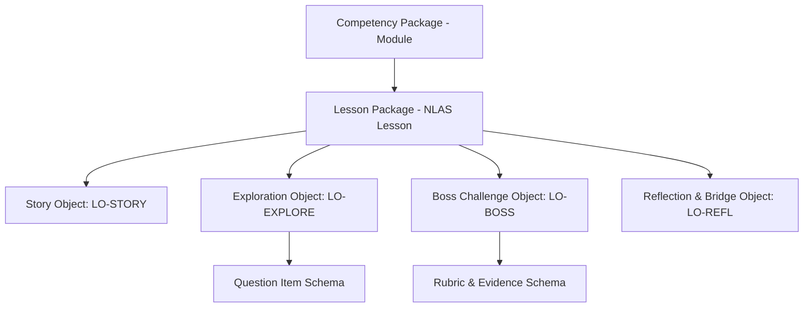

# NovaStars Content Model Architecture & Schemas

## Purpose
The single source of truth defining content schemas, atomic learning objects, data structures, and JSON validation specifications for all 10,000+ learning experiences in NovaStars.

## Content Hierarchy Architecture



## Atomic Learning Objects

### 1. Story Context Object (`LO-STORY`)
Contains story world setting, character dialogues, NPC illustrations, and narrative hook choices.

### 2. Guided Exploration Object (`LO-EXPLORE`)
Contains interactive mini-game mechanics, question stems, distractors, diagnostic feedback strings, and scaffolded hint progression.

### 3. Boss Challenge Object (`LO-BOSS`)
Multi-step mini-boss battle structure requiring cumulative synthesis of target competencies.

### 4. Reflection & Family Bridge Object (`LO-REFL`)
Self-reflection prompt, mastery badge ID, and offline parent-child conversation activity.

## Master JSON Schema Definition (Lesson Package)

```json
{
  "$schema": "http://json-schema.org/draft-07/schema#",
  "title": "NovaStarsLessonPackage",
  "type": "object",
  "required": ["lesson_id", "competency_id", "title", "grade_level", "stages"],
  "properties": {
    "lesson_id": { "type": "string", "pattern": "^NS-LES-[0-9]{5}$" },
    "competency_id": { "type": "string", "pattern": "^COMP-[A-Z]{3}-[A-Z]{3}-[0-9]{3}$" },
    "title": { "type": "string", "maxLength": 80 },
    "grade_level": { "type": "integer", "minimum": 1, "maximum": 5 },
    "estimated_duration_minutes": { "type": "number", "default": 8.0 },
    "stages": {
      "type": "array",
      "minItems": 4,
      "maxItems": 4,
      "items": {
        "type": "object",
        "required": ["stage_number", "stage_type", "object_id", "content_data"],
        "properties": {
          "stage_number": { "type": "integer", "minimum": 1, "maximum": 4 },
          "stage_type": { "type": "string", "enum": ["LO-STORY", "LO-EXPLORE", "LO-BOSS", "LO-REFL"] },
          "object_id": { "type": "string" },
          "content_data": { "type": "object" }
        }
      }
    }
  }
}
```

## Dependencies & Upstream Links (`depends_on`)
- [Lesson Architecture System (NLAS)](file:///Users/thuy/Documents/apptieuhoc/03_EDUCATION/nlas_framework.md) (`ID: NS-EDU-NLAS-001`)
- [Game Design Bible](file:///Users/thuy/Documents/apptieuhoc/04_GAME/game_design_bible.md) (`ID: NS-GAM-BIB-001`)

## Downstream Impact & Consumers (`used_by`)
- [AI Production System (AIPS)](file:///Users/thuy/Documents/apptieuhoc/06_AI/aips_framework.md) (`ID: NS-AI-AIPS-001`)
- [CMS Specifications](file:///Users/thuy/Documents/apptieuhoc/07_ENGINEERING/cms_specifications.md) (`ID: NS-ENG-CMS-001`)
- [Content Factory SOP](file:///Users/thuy/Documents/apptieuhoc/08_OPERATIONS/content_factory_sop.md) (`ID: NS-OPS-SOP-001`)

## Governance & Metadata
- **Owner:** Lead Content Architect
- **Status:** FROZEN
- **Version:** 1.0.0
- **Last Updated:** 2026-08-04
