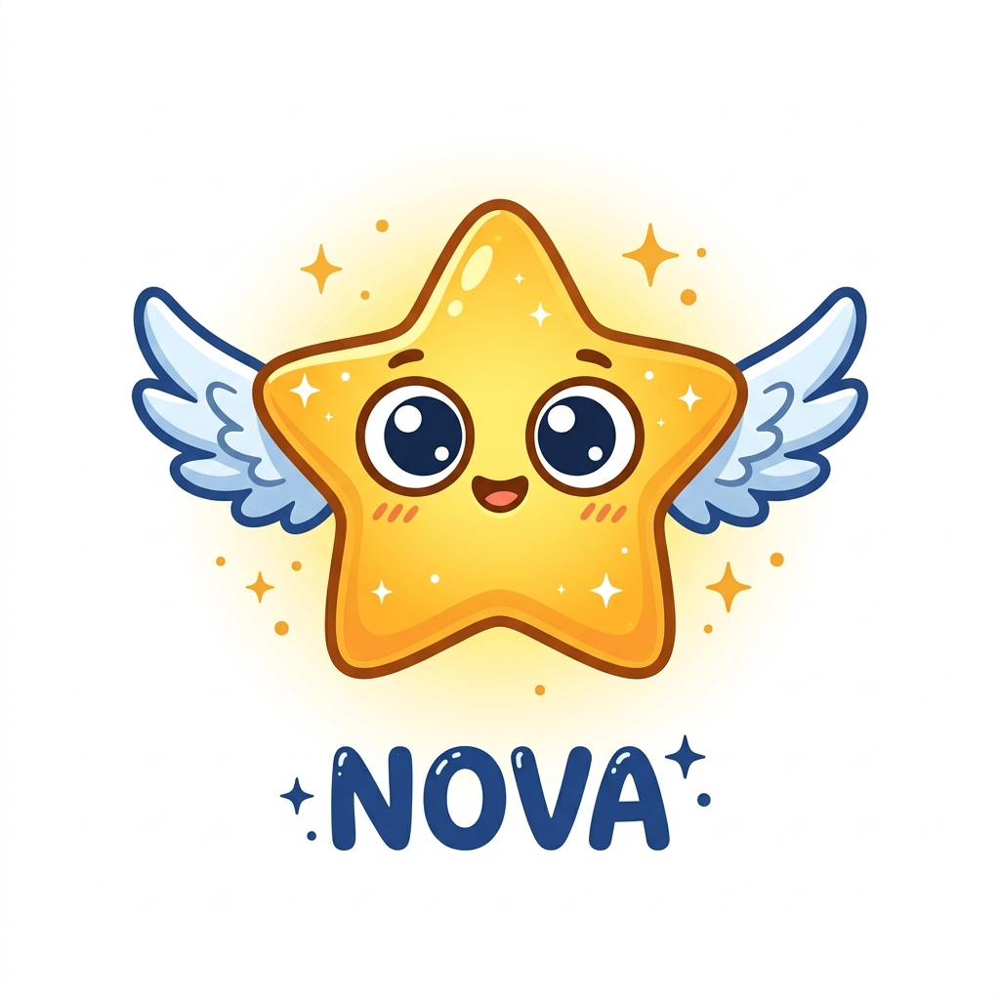

# 📁 05_Design System: Ngôn ngữ Thiết kế, Nhân vật & UI Component

Tài liệu này quy chuẩn hóa ngôn ngữ thiết kế trực quan, hướng dẫn nghệ thuật (Art Direction), hệ thống màu sắc, nhân vật đại diện và các thành phần giao diện (UI Components) của nền tảng Novastars.

---

## 1. Hướng nghệ thuật & Cảm hứng (Art Direction & Inspiration)
Novastars hướng tới phong cách thiết kế **vui nhộn, thân thiện, tràn đầy năng lượng và không áp lực**.
Chúng tôi lấy cảm hứng thiết kế từ:
*   **Duolingo**: Giao diện tối giản, hình ảnh minh họa vector sắc nét, phẳng hóa, sử dụng linh vật tương tác động.
*   **Nintendo & Pokemon**: Thiết kế bản đồ thế giới phiêu lưu dạng isometric (3D giả lập), màu sắc tươi sáng, thế giới động vật/sinh vật huyền bí kích thích sự khám phá.
*   **Disney & Pixar**: Cách thổi hồn vào nhân vật, biểu cảm đa dạng, sinh động, mang tính giáo dục và nhân văn cao.

---

## 2. Hệ thống Màu sắc & Typography (Colors & Typography)
Chúng tôi tránh sử dụng các gam màu gốc đơn điệu (đỏ thuần, xanh thuần) dễ gây cảm giác nặng nề. Thay vào đó, chúng tôi sử dụng bảng màu HSL được tinh chỉnh hài hòa, kích thích thị giác trẻ nhỏ mà không gây mỏi mắt.

### A. Bảng màu Chủ đạo (Color Palette)
*   **Màu xanh hy vọng (Primary Green - Duolingo-like)**: `#58CC02` (HSL: $94^\circ, 98\%, 40\%$) - Dành cho các nút hành động chính, hoàn thành thử thách.
*   **Màu vàng phiêu lưu (Adventure Yellow)**: `#FFC800` (HSL: $47^\circ, 100\%, 50\%$) - Dành cho hệ thống điểm thưởng, sao vàng, mở khóa đảo.
*   **Màu xanh đại dương (Ocean Blue)**: `#1899D6` (HSL: $199^\circ, 80\%, 47\%$) - Dành cho bản đồ nước, các thông tin hướng dẫn của AI.
*   **Màu cam năng động (Energy Orange)**: `#FF9600` (HSL: $35^\circ, 100\%, 50\%$) - Dành cho Boss Battle, các cảnh báo nhẹ nhàng.
*   **Màu chữ & Nền (Text & Background)**:
    *   Nền tối/Glassmorphism nhẹ nhàng để tăng tính cao cấp.
    *   Chữ chính: `#3C3C3C` (Xám đậm dịu mắt) hoặc `#FFFFFF` trên nền màu.

### B. Phông chữ (Typography)
*   **Font tiêu đề**: **Outfit** hoặc **Fredoka One** (Google Fonts). Các góc bo tròn tạo cảm giác mềm mại, thân thiện với trẻ nhỏ.
*   **Font nội dung**: **Inter** hoặc **Nunito**. Đảm bảo khả năng đọc tốt trên màn hình thiết bị di động của trẻ, độ lớn tối thiểu là $16\text{px}$.

---

## 3. Thiết kế Nhân vật & Linh vật (Character Design)
Nhân vật là linh hồn kết nối học sinh với thế giới game:
*   **Linh vật AI Companion (Nova)**: Một chú sao nhỏ có cánh, cơ thể lấp lánh có thể thay đổi biểu cảm tùy thuộc vào kết quả của trẻ. Nova sẽ bay nhảy trên màn hình để cổ vũ hoặc suy nghĩ cùng trẻ.
    
    
    
*   **Nhân vật Boss**: Được thiết kế đáng yêu, nghịch ngợm (ví dụ: *Quái vật Lười Biếng*, *Ngọn lửa Tinh Nghịch*) thay vì đáng sợ, hung dữ, nhằm tránh gây tâm lý hoảng sợ cho trẻ nhỏ.

---

## 4. Quy chuẩn UI Components & Giao diện Màn hình (UI/UX Spec)
Mọi component trong Novastars phải được bo tròn góc mềm mại (Border Radius tối thiểu $12\text{px} - 20\text{px}$).

### 4.1. Các Component Cốt lõi
*   **Nút bấm 3D (3D Bouncy Buttons)**: Nút bấm có viền bóng dưới tạo cảm giác nhấn thực tế như trên máy chơi game cầm tay.
*   **Thanh tiến trình (Progress Bar)**: Dạng bo góc, màu xanh lá cây sáng, chuyển động mượt mà khi tăng phần trăm.
*   **Hộp hội thoại (Speech Bubble Dialog)**: AI Companion nói chuyện qua các bong bóng thoại giống như trong truyện tranh.
*   **Thẻ kỹ năng (Quest Cards)**: Thiết kế dạng kính mờ (Glassmorphism), hiển thị hình ảnh minh họa kỹ năng, độ khó và trạng thái khóa/mở.

### 4.2. Đặc tả Giao diện Màn hình cho UX Designer
1. **Màn hình Bản đồ Phiêu lưu (Adventure Map)**:
   * Bản đồ cuộn dọc hoặc ngang theo 6 hòn đảo.
   * Hiển thị các chấm kỹ năng (Node) kết nối tuyến tính. Node đã hoàn thành có màu xanh lục, Node đang học lấp lánh ánh sao, Node bị khóa có ổ khóa xám.
2. **Màn hình Cốt truyện Tương tác (Interactive Comic)**:
   * Chia khung tranh dạng ô (Comic grid).
   * Có nút "Tiếp tục" bouncy và bóng thoại text/voice.
3. **Màn hình Đấu Boss (Boss Battle)**:
   * Bố cục dọc: Boss ở trên, Avatar ở dưới.
   * Thanh máu HP của Boss là các hình trái tim đỏ.
   * Khu vực hiển thị 4 nút phương án lựa chọn sửa sai dạng 3D bouncy.
4. **Màn hình Phản tư (Reflection Chat)**:
   * Bong bóng chat từ Nova ở bên trái, câu trả lời của trẻ ở bên phải.
   * Nút bấm biểu tượng Micro lớn màu Ocean Blue ở giữa để trẻ dễ dàng chạm và ghi âm giọng nói.
5. **Cổng Phụ huynh (Parent Portal)**:
   * Thiết kế tối giản, sạch sẽ, phân tách rõ ràng với giao diện game của trẻ.
   * Biểu đồ Radar thể hiện 6 nhóm năng lực.
   * Danh sách các nhiệm vụ chờ phê duyệt dạng thẻ card có nút "Approve" (Xác nhận) và nút xem hình ảnh/video minh chứng.

---

## 5. Hiệu ứng & Micro-animations (Hiệu ứng vi mô)
*   **Hiệu ứng Pháo hoa (Confetti)**: Tự động bắn pháo hoa giấy rực rỡ khi trẻ hoàn thành một đảo kỹ năng hoặc Boss Battle.
*   **Bouncing (Nảy nhẹ)**: Nút bấm nảy nhẹ khi di chuột qua (hover) hoặc khi được nhấn để phản hồi tương tác tức thì.
*   **View Transitions**: Chuyển cảnh mượt mà giữa bản đồ thế giới phiêu lưu và màn hình làm nhiệm vụ, tạo cảm giác di chuyển liên tục, không bị đứt gãy trải nghiệm.

