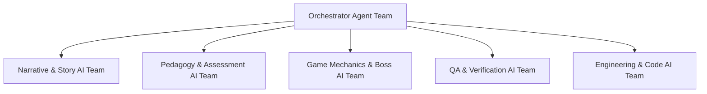

# NovaStars AI Organization Blueprint (AIOB)

## Purpose
Defines the organizational structure, division of labor, RACI governance matrix, and communication protocols for the 100+ AI Agents operating within NovaStars.

## AI Team Structure

## Team Roles & Division of Labor
1. **Orchestrator Division**: Manages task distribution, pipeline scheduling, and dependency resolution.
2. **Narrative Division**: Story Agent, Character Dialogue Agent, World Lore Agent.
3. **Pedagogy Division**: Competency Alignment Agent, Assessment Agent, Hint Scaffolding Agent.
4. **Game Design Division**: Mini-Game Puzzle Agent, Boss Challenge Agent, Reward Economy Agent.
5. **QA Division**: Schema Validation Agent, Safety Filter Agent, Grade-Level Readability Agent.

## RACI Governance Matrix (AI-Human Collaboration)

| Production Stage | Lead Agent | Supporting Agent | Human Reviewer | Accountable Owner |
| :--- | :--- | :--- | :--- | :--- |
| **Competency Mapping** | Orchestrator Agent | Curriculum Agent | Lead Curriculum Architect | Lead Curriculum Architect |
| **Story Hook Generation**| Story Agent | Lore Agent | Narrative Editor | Chief Product Officer |
| **Interactive Puzzles** | Exploration Agent | Assessment Agent | Game Designer | Lead Game Designer |
| **Boss Battle Spec** | Boss Agent | Mechanics Agent | Instructional Designer | Lead Learning Designer |
| **Final Freeze Gate 5** | QA Agent | Schema Validator | Senior QA Lead | Head of Content Operations |

## Dependencies & Upstream Links (`depends_on`)
- [AI Production System (AIPS)](file:///Users/thuy/Documents/apptieuhoc/06_AI/aips_framework.md) (`ID: NS-AI-AIPS-001`)
- [Agent Contract Standard (ACS)](file:///Users/thuy/Documents/apptieuhoc/06_AI/acs_standard.md) (`ID: NS-AI-ACS-001`)

## Downstream Impact & Consumers (`used_by`)
- [Content Factory SOP](file:///Users/thuy/Documents/apptieuhoc/08_OPERATIONS/content_factory_sop.md) (`ID: NS-OPS-SOP-001`)

## Governance & Metadata
- **Owner:** AI Operations Lead
- **Status:** FROZEN
- **Version:** 1.0.0
- **Last Updated:** 2026-08-04
