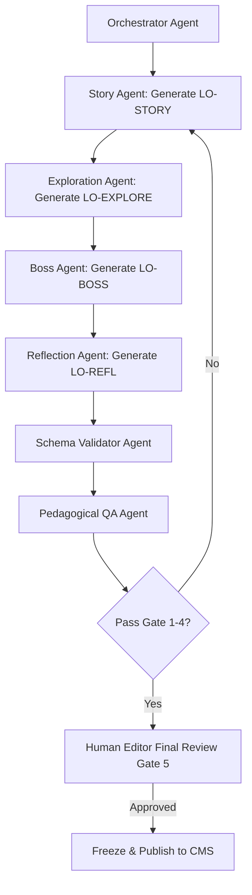

# NovaStars AI Production System (AIPS) Blueprint

## Purpose
AIPS governs how specialized AI agent teams and human domain experts collaborate to produce, review, freeze, publish, and continuously improve 10,000+ competency-based learning experiences at scale.

## Scope
Defines agent pipeline orchestration, human-in-the-loop gates, automated schema validation, and prompt pipeline execution.

## AIPS Multi-Agent Production Pipeline

## Core Production Pillars
1. **Multi-Agent Specialization**: Rather than one monolithic LLM call, specialized agents handle distinct stages (Story, Puzzle, Boss, QA).
2. **Schema-Enforced Generation**: All agent output is parsed against Zod / JSON schemas defined in [Content Model](file:///Users/thuy/Documents/apptieuhoc/05_CONTENT/content_model.md).
3. **Deterministic Review Gates**: 4 automated AI review gates + 1 human domain lead gate ensure 100% safety and pedagogical accuracy.

## Dependencies & Upstream Links (`depends_on`)
- [Content Model Architecture](file:///Users/thuy/Documents/apptieuhoc/05_CONTENT/content_model.md) (`ID: NS-CNT-MOD-001`)
- [Lesson Architecture System (NLAS)](file:///Users/thuy/Documents/apptieuhoc/03_EDUCATION/nlas_framework.md) (`ID: NS-EDU-NLAS-001`)

## Downstream Impact & Consumers (`used_by`)
- [Agent Contract Standard (ACS)](file:///Users/thuy/Documents/apptieuhoc/06_AI/acs_standard.md) (`ID: NS-AI-ACS-001`)
- [AI Organization Blueprint (AIOB)](file:///Users/thuy/Documents/apptieuhoc/06_AI/aiob_blueprint.md) (`ID: NS-AI-AIOB-001`)
- [Content Factory SOP](file:///Users/thuy/Documents/apptieuhoc/08_OPERATIONS/content_factory_sop.md) (`ID: NS-OPS-SOP-001`)

## Governance & Metadata
- **Owner:** AI System Architect
- **Status:** FROZEN
- **Version:** 1.0.0
- **Last Updated:** 2026-08-04
