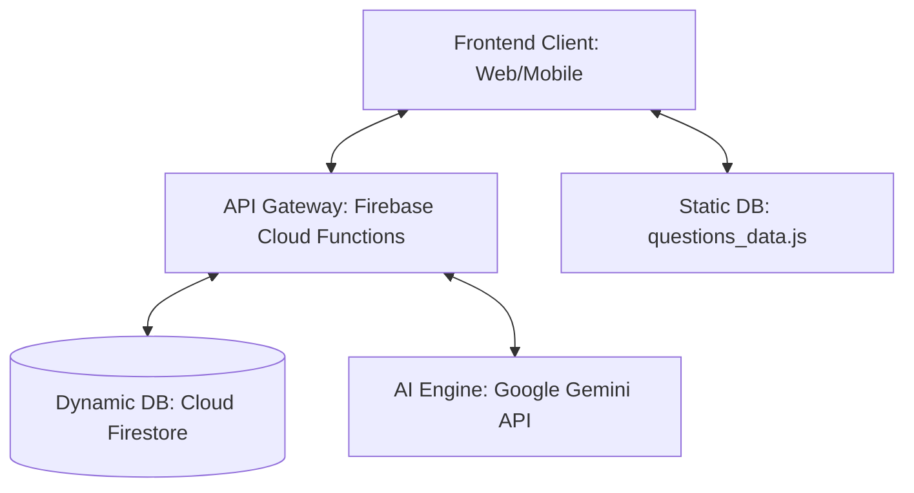

# 📁 06_Technical Architecture: Kiến trúc Hệ thống & Cơ sở Dữ liệu

Tài liệu này đặc tả thiết kế kỹ thuật, kiến trúc phân tầng (Client-Server), lược đồ cơ sở dữ liệu (Database Schema), luồng dữ liệu API và cơ chế hoạt động của Content Compiler trong dự án Novastars.

---

## 1. Kiến trúc Hệ thống Tổng quan (Technical Architecture Overview)
Hệ thống Novastars được thiết kế theo mô hình Client-Server hiện đại, tận dụng sức mạnh của các dịch vụ đám mây không máy chủ (Serverless) để tối ưu chi phí và tăng khả năng mở rộng.



*   **Frontend**: 
    *   *Hiện tại*: Trang Web tĩnh (`review.html`, `review_standalone.html`) viết bằng HTML/JS/CSS thuần phục vụ việc rà soát dữ liệu.
    *   *Production*: Ứng dụng Web phát triển bằng React/Vite hoặc ứng dụng di động đa nền tảng (Flutter / React Native).
*   **Backend & Infrastructure**:
    *   Sử dụng **Firebase Authentication** để quản lý tài khoản Học sinh và Phụ huynh.
    *   Sử dụng **Firebase Cloud Functions (Node.js)** để xử lý logic nghiệp vụ và gọi API bảo mật.
    *   Sử dụng **Firebase AI Logic** để kết nối trực tiếp với mô hình Gemini của Google một cách an toàn.
*   **Database**:
    *   *Dữ liệu tĩnh (Static)*: Ngân hàng câu hỏi trắc nghiệm (680 câu hỏi của 34 kỹ năng) được biên dịch sẵn thành file JavaScript tĩnh (`questions_data.js`) và phân phối qua CDN để tối ưu hóa tốc độ tải và giảm chi phí truy vấn.
    *   *Dữ liệu động (Dynamic)*: Lưu trữ trên **Cloud Firestore** để theo dõi thời gian thực tiến trình của học sinh.

---

## 2. Lược đồ Cơ sở Dữ liệu (Database Schema)

### A. Lược đồ Tĩnh (Static Data - Local Client)
Mỗi câu hỏi trong file `questions_data.js` tuân thủ cấu trúc JSON:
```json
{
  "id": "Kien_thuc_ve_dien_giat_1",
  "skill": "Kĩ năng phòng tránh nguy cơ bị điện giật",
  "group": "Tự chăm sóc & An toàn",
  "number": 1,
  "tier": "A - Knowledge (Biết)",
  "question": "Tại sao chúng ta không được dùng tay ướt để cắm điện?",
  "options": {
    "A": "Vì tay ướt làm bẩn ổ điện.",
    "B": "Vì nước dẫn điện rất tốt, tay ướt chạm vào điện rất dễ bị giật.",
    "C": "Vì làm như thế ổ điện sẽ bị rỉ sét.",
    "D": "Vì tay ướt sẽ làm trơn phích cắm."
  },
  "answer": "B",
  "explanation": "Nước là chất dẫn điện. Khi tay ướt, điện trở của da giảm mạnh, nếu có dòng điện rò rỉ sẽ truyền qua nước vào cơ thể gây điện giật nguy hiểm."
}
```

### B. Lược đồ Động (Dynamic Data - Cloud Firestore)
Chúng tôi quản lý dữ liệu người dùng qua 4 Collections chính:

1.  **Collection `users`**:
    *   `uid` (string, Primary Key): ID định danh từ Firebase Auth.
    *   `role` (string): "student" hoặc "parent".
    *   `displayName` (string): Tên hiển thị.
    *   `grade` (number): Lớp học (1 - 5).
    *   `starPoints` (number): Tổng số sao tích lũy.

2.  **Collection `progress`**:
    *   `progressId` (string, PK): `uid_skillId`.
    *   `uid` (string, FK): ID học sinh.
    *   `skillId` (string): Tên hoặc mã định danh kỹ năng.
    *   `completedTiers` (array of strings): Các tầng đã hoàn thành (e.g., `["A", "B", "C", "D"]`).
    *   `reflectionText` (string): Câu trả lời phản tư của học sinh.
    *   `status` (string): Trạng thái (`LEARN`, `PRACTICE`, `COMPETENT`, `REAL_LIFE`, `MASTERY`).
    *   `updatedAt` (timestamp).

3.  **Collection `real_life_missions`**:
    *   `missionId` (string, PK).
    *   `uid` (string, FK): ID học sinh.
    *   `skillId` (string).
    *   `description` (string): Mô tả nhiệm vụ do AI sinh ra.
    *   `evidenceUrl` (string): Đường dẫn ảnh/video minh chứng của trẻ gửi lên.
    *   `parentVerified` (boolean): Trạng thái xác thực của cha mẹ.
    *   `createdAt` (timestamp).

---

## 3. Đặc tả Luồng API Chính (Core API Spec)

### API 1: Nộp câu Phản tư & Khởi tạo Nhiệm vụ Thực tế
*   **Endpoint**: `/api/reflection/submit`
*   **Method**: `POST`
*   **Request Body**:
    ```json
    {
      "uid": "user_123",
      "skillId": "Kynang_phongtranh_diengiat",
      "reflectionText": "Em hứa sẽ luôn lau khô tay trước khi chạm vào các phích cắm điện ở nhà."
    }
    ```
*   **Response Body**:
    ```json
    {
      "status": "success",
      "isApproved": true,
      "feedback": "Tuyệt vời lắm! Phản tư rất thực tế.",
      "suggestedMission": "Hãy cùng bố mẹ kiểm tra xem nhà mình có ổ cắm nào ở tầm thấp không và dùng nút bịt ổ điện để bảo vệ an toàn nhé."
    }
    ```

### API 2: Xác nhận Nhiệm vụ từ Phụ huynh
*   **Endpoint**: `/api/parent/verify`
*   **Method**: `POST`
*   **Request Body**:
    ```json
    {
      "uid": "parent_456",
      "studentUid": "user_123",
      "missionId": "mission_789",
      "approve": true,
      "comment": "Con đã thực hiện rất nghiêm túc và dán nhãn cảnh báo cùng bố."
    }
    ```
*   **Response Body**:
    ```json
    {
      "status": "success",
      "unlockedBadge": "Badge_AnToanDien",
      "rewardPoints": 100
    }
    ```
---

## 4. Cơ chế Biên dịch Nội dung Hiện tại (Content Compiler)
Tại môi trường local, nội dung ngân hàng câu hỏi được quản lý dưới dạng Markdown trong thư mục `question_bank/`. 
Quy trình biên dịch tĩnh:
1.  **Bước 1**: Chạy `verify_questions.py` để kiểm tra định dạng cú pháp Markdown của từng file nhóm kỹ năng (phải có đủ Options A-D, đáp án đúng, giải thích).
2.  **Bước 2**: Chạy `compile_database.py` để đọc và phân tích cú pháp (parse) các file markdown này, tự động gắn ID, nhóm và phân chia Tiers (A đến E) dựa trên số thứ tự câu hỏi (câu 1-4 là Tier A, 5-8 là Tier B, v.v.). Kết quả được xuất ra file `/question_bank/questions_data.js`.
3.  **Bước 3**: File `review.html` sẽ nhúng `questions_data.js` để hiển thị giao diện kiểm duyệt cục bộ vô cùng trực quan cho biên tập viên.
