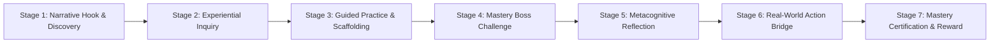
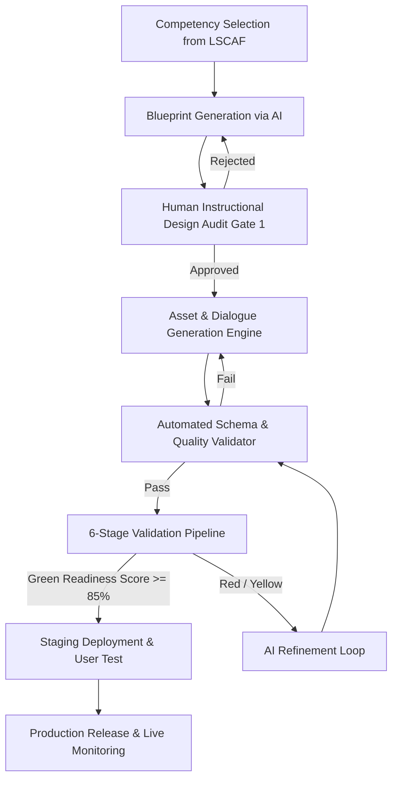
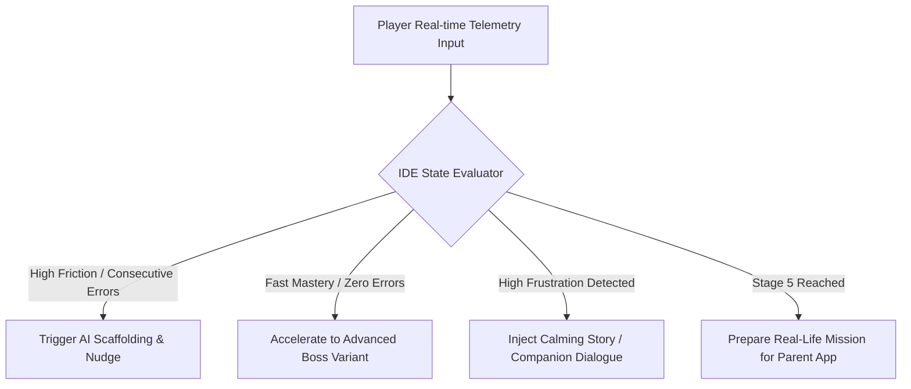

# NOVASTARS LESSON ARCHITECTURE SYSTEM (NLAS)
## The Constitutional Instructional Operating System of NovaStars

---

> [!IMPORTANT]
> **Document Purpose**: This is NOT a single lesson plan, curriculum syllabus, UI spec, or game design doc. NLAS is the master **Instructional Operating System** of NovaStars. It dictates how over 10,000 competency-based lessons will be designed, generated by AI, validated, dynamically executed, and continuously improved over the next decade.

---

## TABLE OF CONTENTS
1. [SECTION 1: Lesson Design Philosophy](#section-1-lesson-design-philosophy)
2. [SECTION 2: Universal Lesson Architecture](#section-2-universal-lesson-architecture)
3. [SECTION 3: Lesson Blueprint Specification](#section-3-lesson-blueprint-specification)
4. [SECTION 4: Lesson Production Workflow & Pipeline](#section-4-lesson-production-workflow--pipeline)
5. [SECTION 5: Learning Pattern System](#section-5-learning-pattern-system)
6. [SECTION 6: Reusable Learning Objects Catalog](#section-6-reusable-learning-objects-catalog)
7. [SECTION 7: Instructional Decision Engine](#section-7-instructional-decision-engine)
8. [SECTION 8: Lesson Quality Framework & Rubric](#section-8-lesson-quality-framework--rubric)
9. [SECTION 9: Validation & Safety Framework](#section-9-validation--safety-framework)
10. [SECTION 10: Authoring Guide & Anti-Patterns](#section-10-authoring-guide--anti-patterns)
11. [SECTION 11: AI Authoring Rules & System Prompts](#section-11-ai-authoring-rules--system-prompts)
12. [SECTION 12: Architectural Scalability System](#section-12-architectural-scalability-system)
13. [SECTION 13: The NovaStars Lesson DNA](#section-13-the-novastars-lesson-dna)

---

## SECTION 1: Lesson Design Philosophy

NLAS is built upon **11 Immutable Design Principles**. Every lesson built in NovaStars must strictly enforce these principles. Below is the operational translation of each principle into system constraints, educational rationales, trade-offs, dependencies, risks, scalability impact, and concrete examples.

```
       +-------------------------------------------------------------------+
       |                       CORE CONSTRAINTS                            |
       |  1 Primary Competency per Lesson  |  0 Passive Reading Screens    |
       |  Safe Failure Loops Mandatory     |  Parent Transfer Required     |
       +-------------------------------------------------------------------+
```

### 1.1 The 11 Core Principles Operationalized

#### 1. Competency before Content
*   **Purpose**: Prevent lesson bloat and ensure every interactive element directly serves skill acquisition rather than passive information intake.
*   **Educational Rationale**: Information retention without operational capability produces cognitive overload without behavior change. Skill acquisition requires focused trial and error.
*   **System Constraint**: Every lesson must target exactly **one primary competency** from the NovaStars Life Skills Competency Architecture (LSCAF). Secondary skills are background context only.
*   **Trade-offs**: Sacrifices broad thematic coverage in a single lesson for deep, measurable mastery of a single skill.
*   **Dependencies**: Requires a fully mapped LSCAF taxonomy.
*   **Risks**: Oversimplification if the primary competency is too granularly fragmented.
*   **Scalability**: High. Granular competencies allow modular mixing and re-sequencing across grades.
*   **Example**: Instead of teaching "All about Financial Literacy", a lesson focuses solely on `FIN-EMOTION-01: Identifying emotional triggers that cause impulse buying`.

#### 2. Experience before Explanation
*   **Purpose**: Build intuitive mental models before introducing formal vocabulary or rules.
*   **Educational Rationale**: Constructivist learning theory (Piaget, Bruner) proves that concrete experience precedes abstract symbolic representation.
*   **System Constraint**: Stage 1 & 2 must present an interactive scenario or puzzle *before* any NPC or guide provides explicit rules or terms.
*   **Trade-offs**: Takes 2-3 minutes longer per lesson than direct text instruction.
*   **Dependencies**: Game engine interactive mechanics.
*   **Risks**: Children may misinterpret the experience if the game mechanics are ambiguous.
*   **Scalability**: High. Universal mechanics (balancing, sorting, matching) work across languages without text.
*   **Example**: In a lesson on emotional regulation, the child first experiences a balloon expanding and bursting under pressure before learning the term "Emotional Overwhelm".

#### 3. Play before Teaching
*   **Purpose**: Secure intrinsic motivation and emotional buy-in before presenting learning challenges.
*   **Educational Rationale**: Play lowers the affective filter (Krashen), activating dopamine pathways that enhance neuroplasticity and memory encoding.
*   **System Constraint**: The first 60 seconds of any lesson must involve gameplay interactions (exploring, customizing, maneuvering) with zero instructional text.
*   **Trade-offs**: Requires upfront game assets and animation work.
*   **Dependencies**: High-performance client UI engine.
*   **Risks**: Children might treat the experience purely as an arcade game if the transition to learning is abrupt.
*   **Scalability**: Reusable core mini-game templates lower per-lesson art costs.
*   **Example**: Steering a spaceship through an asteroid field to collect glowing crystals before learning how to prioritize tasks under time limits.

#### 4. Discovery before Instruction
*   **Purpose**: Foster curiosity, agency, and inductive reasoning.
*   **Educational Rationale**: Self-discovered rules are retained 4x longer than memorized direct commands (Kirschner et al., counter-balanced with scaffolded discovery).
*   **System Constraint**: The child must fail or experiment with at least 2 hypotheses before an NPC offers a hint or explanation.
*   **Trade-offs**: Pacing varies across children depending on discovery speed.
*   **Dependencies**: Adaptive AI hint timing system.
*   **Risks**: Frustration if discovery hints are too subtle.
*   **Scalability**: Requires parameterized hint matrices for AI generation.
*   **Example**: In a time-management puzzle, the child discovers that doing short tasks first clears room for larger tasks, rather than reading a rulebook on time blocking.

#### 5. Learning by Doing
*   **Purpose**: Ensure active kinesthetic and cognitive engagement throughout 100% of the lesson.
*   **Educational Rationale**: Experiential learning cycle (Kolb) requires active experimentation to internalize knowledge into procedural memory.
*   **System Constraint**: Max continuous passive screen time (dialogue/animation) is limited to **15 seconds for Grades 1-2** and **25 seconds for Grades 3-5**.
*   **Trade-offs**: Cannot use long animated narrative cutscenes.
*   **Dependencies**: Micro-interaction UI engine.
*   **Risks**: Mechanics must directly mirror the real-world cognitive skill, not just be superficial clicking.
*   **Scalability**: High; procedural interactive widgets scale across thousands of content variations.
*   **Example**: Dragging stress-relief tools into a character's backpack during a simulated crisis instead of tapping "Next" on slides explaining stress management.

#### 6. Positive Reinforcement
*   **Purpose**: Cultivate growth mindset, self-efficacy, and sustained engagement.
*   **Educational Rationale**: Operant conditioning and self-determination theory (Deci & Ryan) show that reinforcing effort and strategy choice increases internal locus of control.
*   **System Constraint**: Feedback must praise **effort, strategy, and reflection**, never static intelligence or luck.
*   **Trade-offs**: Excludes simple "Great job! You are so smart!" voice lines in favor of specific feedback.
*   **Dependencies**: Dynamic dialogue generation engine.
*   **Risks**: Over-praising trivial actions can diminish reward value.
*   **Scalability**: Fully templated feedback variables (e.g., `Praise(Strategy_Used, Resilience_Shown)`).
*   **Example**: "You tried three different calm-down techniques before finding the right one! That shows great perseverance!"

#### 7. Safe Failure
*   **Purpose**: Remove fear of failure and encourage risk-taking, experimentation, and resilience.
*   **Educational Rationale**: Error-based learning triggers neural adaptation. Eliminating penalizing game-over states maintains psychological safety.
*   **System Constraint**: No "Game Over" or lost progress. Failure routes directly to a "Learning Loop" (Debug state) where the game environment adapts to provide extra scaffolding.
*   **Trade-offs**: Reduces tension from artificial scarcity/lives.
*   **Dependencies**: Branching state machine in the lesson runtime.
*   **Risks**: Children might guess randomly if failure carries zero cost.
*   **Scalability**: Requires standardized retry & scaffold logic.
*   **Example**: Failing a conflict resolution dialogue doesn't reset the level; the NPC says, "Hmm, that made me feel defensive. Let's rewind 5 seconds and try a different tone."

#### 8. Mastery Learning
*   **Purpose**: Guarantee that every child achieves true competence before progressing, preventing cumulative learning deficits.
*   **Educational Rationale**: Bloom's Learning for Mastery demonstrates that 90% of learners reach high achievement when given flexible time and targeted corrective instruction.
*   **System Constraint**: A child cannot complete a lesson until demonstrating $\ge 80\%$ competency accuracy on the Boss Battle and completing the Metacognitive Reflection.
*   **Trade-offs**: Session length varies per child.
*   **Dependencies**: Competency mastery tracking database.
*   **Risks**: Fast learners might feel slowed down without fast-track pathways.
*   **Scalability**: High; mastery criteria are programmatically evaluated.
*   **Example**: If a child misses a decision point in the Boss Challenge, the engine dynamically generates a parallel scenario variant targeting that specific micro-skill.

#### 9. Behavior Change
*   **Purpose**: Bridge the gap between in-game performance and real-world daily behavior.
*   **Educational Rationale**: Behavior modification requires intention formation, situational cues, and real-world environmental triggers (Fogg Behavior Model).
*   **System Constraint**: Every lesson must generate a specific, actionable **Real-Life Mission (RLM)** for the child to execute outside the app.
*   **Trade-offs**: Success requires external parent/guardian engagement.
*   **Dependencies**: Parent App sync and verification pipeline.
*   **Risks**: Lower completion rates for un-engaged parents if not designed with low friction.
*   **Scalability**: RLM templates can be auto-localized and adapted to home environments.
*   **Example**: After learning empathy in-game, the RLM asks the child: "Notice when someone at home looks tired today, and offer them a cup of water or a hug."

#### 10. Reflection before Completion
*   **Purpose**: Consolidate short-term episodic game memory into long-term declarative and procedural memory.
*   **Educational Rationale**: Metacognition (Flavell) is essential for schema formation and transfer of learning to new contexts.
*   **System Constraint**: The lesson reward is locked behind Stage 6 (Metacognitive Reflection). The child must articulate *why* their strategy worked.
*   **Trade-offs**: Adds 1-2 minutes of reflective dialogue at the end of active gameplay.
*   **Dependencies**: Audio/Text reflection input interface with sentiment/keyword checking.
*   **Risks**: Children might give superficial answers to bypass the check.
*   **Scalability**: Standardized reflection prompts based on cognitive depth levels.
*   **Example**: The AI Companion asks: "When your character felt angry, what clue told you it was time to take a deep breath?"

#### 11. Real-Life Transfer
*   **Purpose**: Ensure skills learned in NovaStars' fantasy world seamlessly transfer to school, home, and social settings.
*   **Educational Rationale**: Near and far transfer of learning (Salomon & Perkins) require explicit bridge-building between abstract game analogies and real-life situations.
*   **System Constraint**: Stage 6 must explicitly showcase the real-life counterpart of the game mechanic (e.g., Game Shield $\rightarrow$ Saying "No" politely).
*   **Trade-offs**: Temporarily breaks narrative immersion to ground the lesson in real life.
*   **Dependencies**: Visual mapping UI components.
*   **Risks**: Loss of fantasy atmosphere if real-life bridges feel preachy.
*   **Scalability**: Reusable real-life bridge visual widgets.
*   **Example**: Showing an animation of how using "I-statements" in the game spaceship works when resolving a playground dispute over a soccer ball.

---

## SECTION 2: Universal Lesson Architecture

Every NovaStars lesson follows a universal 7-stage sequential architecture. This guarantees structural consistency across thousands of lessons while preserving flexibility in thematic presentation.



### Stage Specifications

#### STAGE 1: Narrative Hook & Discovery
*   **Purpose**: Establish emotional stakes, introduce the adventure context, and trigger natural curiosity.
*   **Target Duration**: 60 - 90 seconds.
*   **Inputs**: Lesson Blueprint, Character Profile, World Location State.
*   **Outputs**: Player Emotional Buy-in, Initial Curiosity Baseline, Goal Acceptance.
*   **Dependencies**: Narrative Engine, World Map Assets.
*   **Success Criteria**: Player engages with primary interactive object within 15 seconds; accepts quest.
*   **Failure Criteria**: Player skips or drops out before quest engagement ($>20\%$ bounce rate triggers redesign).

#### STAGE 2: Experiential Inquiry (Play & Discover)
*   **Purpose**: Allow unguided exploration where the child experiences the core problem space and tests initial intuitive hypotheses.
*   **Target Duration**: 120 - 180 seconds.
*   **Inputs**: Interactive Mini-Game Environment, Parameterized Trial Variables.
*   **Outputs**: Baseline Skill Performance, Identified Misconceptions, Triggered Cognitive Conflict.
*   **Dependencies**: Game Mechanics Engine, Physics/Logic Rules.
*   **Success Criteria**: Player attempts at least 2 distinct problem-solving strategies.
*   **Failure Criteria**: Player gets stuck without taking action for $>30$ seconds (triggers AI subtle nudge).

#### STAGE 3: Guided Practice & Scaffolding
*   **Purpose**: Provide targeted scaffolding, explicit strategy modeling, and progressive difficulty adjustment based on Stage 2 performance.
*   **Target Duration**: 180 - 240 seconds.
*   **Inputs**: Stage 2 Diagnostic Data, Scaffolding Level Rules, Companion AI Persona.
*   **Outputs**: Demonstrated Strategy Adoption, Reduced Error Rate, High Confidence.
*   **Dependencies**: Scaffolding Engine, Hint Engine.
*   **Success Criteria**: Player successfully executes the target strategy across 3 consecutive practice trials with decreasing hint support.
*   **Failure Criteria**: Failure to execute strategy after 4 scaffolded attempts (triggers Scaffolding Reset to simpler sub-skill).

#### STAGE 4: Mastery Boss Challenge
*   **Purpose**: Evaluate unassisted mastery of the primary competency in a high-stakes, highly engaging narrative climax.
*   **Target Duration**: 180 - 300 seconds.
*   **Inputs**: Mastery Threshold Matrix, Boss Behavior Pattern, Multi-Variable Scenario.
*   **Outputs**: Competency Score ($CS$), Diagnostic Metric Log, Evidence Data.
*   **Dependencies**: Boss Battle Engine, Assessment Engine.
*   **Success Criteria**: Player resolves the complex multi-step scenario with $\ge 80\%$ competency accuracy without hints.
*   **Failure Criteria**: Performance $<80\%$ routes player to Stage 4B (Safe Failure / Strategy Debugging Loop).

#### STAGE 5: Metacognitive Reflection
*   **Purpose**: Guide the child to reflect on their decision-making process, emotions, and strategies used during the lesson.
*   **Target Duration**: 90 - 120 seconds.
*   **Inputs**: Player's Boss Battle Choice History, Reflection Prompt Matrix.
*   **Outputs**: Self-Assessment Rating, Formulated Strategy Statement, Metacognitive Evidence.
*   **Dependencies**: Metacognitive UI, Audio Recording / Choice Tagging Module.
*   **Success Criteria**: Player selects or voices a valid reflection connecting action to outcome.
*   **Failure Criteria**: Random/invalid selection (detected via response time $<2s$ or keyphrase mismatch) prompts gentle follow-up question.

#### STAGE 6: Real-World Action Bridge (Parent Transfer)
*   **Purpose**: Translate the virtual lesson into a concrete, observable real-world behavior and transmit a mission card to the Parent App.
*   **Target Duration**: 60 - 90 seconds in-app (Execution occurs offline over 24-48 hours).
*   **Inputs**: Real-Life Mission Template, Home Environment Context.
*   **Outputs**: Accepted Real-Life Mission Card, Sync Event to Parent Dashboard.
*   **Dependencies**: Parent App Sync Pipeline, Push Notification Service.
*   **Success Criteria**: Child reviews mission and taps "I'm Ready!"; Parent receives notification with guidance.
*   **Failure Criteria**: Parent declines or mission expires (triggers alternative child-solo reflection task).

#### STAGE 7: Mastery Certification & Reward
*   **Purpose**: Celebrate mastery, award competency tokens, update character progression, and unlock new adventure paths.
*   **Target Duration**: 45 - 60 seconds.
*   **Inputs**: Verification Signal, Competency Badge Metadata, XP/Star Formulas.
*   **Outputs**: Updated User Profile, Unlocked Inventory Items, Progression Visuals.
*   **Dependencies**: Reward Engine, Economy API, User Profile Store.
*   **Success Criteria**: Reward animation plays; mastery state persisted to database.
*   **Failure Criteria**: Network disconnect (handled via offline local state sync and retry queue).

---

## SECTION 3: Lesson Blueprint Specification

The **Lesson Blueprint** is the formal contract for every lesson. It defines all parameters required by AI generators, human authors, and engine runtimes.

### 3.1 Standard Blueprint Schema (YAML / JSON Spec)

```yaml
$schema: "https://novastars.io/schemas/v1/lesson-blueprint.json"
lesson_id: "LES-SEL-EMO-0042"
version: "1.0.0"
metadata:
  title: "Taming the Volcano: Calming Frustration in High-Pressure Moments"
  grade_band: "G3_G5" # G1_G2 | G3_G5
  domain: "Social_Emotional_Learning"
  sub_domain: "Self_Management"
  target_age_range: [8, 10]
  estimated_duration_minutes: 15

competency_definition:
  primary_competency_code: "SEL-SELF-03"
  competency_name: "Emotional Self-Regulation Under Stress"
  micro_skills:
    - "Recognizing physical signs of frustration"
    - "Selecting an appropriate pause strategy (Box Breathing / Tactical Counting)"
    - "Re-framing negative self-talk"
  
learning_outcomes:
  knowledge_goal: "Understand that frustration is a bodily signal that requires a pause before action."
  skill_goal: "Execute the '4-7-8 Breathing' or 'Count to 10' strategy when frustration triggers occur."
  mindset_goal: "View frustration not as a failure, but as a temporary signal that can be mastered."
  behavior_goal: "Pause for at least 5 seconds before responding when encountering a frustrating obstacle at home or school."

evidence_and_completion:
  evidence_metrics:
    - metric_id: "EM_PAUSE_LATENCY"
      description: "Time elapsed between frustration trigger presentation and first corrective action."
      target_threshold: ">= 3.0 seconds (indicates non-impulsive reaction)"
    - metric_id: "EM_STRATEGY_ACCURACY"
      description: "Correct sequence execution of calming technique in Boss Battle."
      target_threshold: ">= 85%"
  completion_criteria:
    min_boss_score: 80
    reflection_completed: true
    real_life_mission_dispatched: true

pattern_assignments:
  experience_pattern: "SIMULATION_PUZZLE"
  boss_pattern: "TIME_ATTACK_DILEMMA"
  reflection_pattern: "DECISION_REWIND"
  challenge_pattern: "SCAFFOLDING_FADE"
  reward_pattern: "NARRATIVE_ARTIFACT_AND_PERK"
```

---

## SECTION 4: Lesson Production Workflow & Pipeline

The production pipeline automates and standardizes the transformation of a raw competency code into a validated, deployable NovaStars lesson.



### Production Decision Tree & Stage Gates

1.  **Gate 1: Blueprint Validation (Human / AI Hybrid)**
    *   *Check*: Does the blueprint target exactly 1 primary competency? Are micro-skills measurable?
    *   *Decision*: If YES $\rightarrow$ Proceed to Asset/Content Gen. If NO $\rightarrow$ Reject back to Prompt Engine.
2.  **Gate 2: Automated Structural Integrity Check**
    *   *Check*: Do all 7 stages exist? Are JSON schemas valid? Are token limits respected?
    *   *Decision*: If PASS $\rightarrow$ Proceed to 6-Stage Validation. If FAIL $\rightarrow$ Auto-fix schema syntax errors.
3.  **Gate 3: Readiness Score Audit ($RS \ge 85\%$)**
    *   *Check*: Evaluate lesson using the Quality Scoring Matrix (Section 8).
    *   *Decision*: If $RS \ge 85\%$ $\rightarrow$ Deploy to Staging. If $80\% \le RS < 85\%$ $\rightarrow$ Human polish. If $RS < 80\%$ $\rightarrow$ Full regeneration.

---

## SECTION 5: Learning Pattern System

The Learning Pattern System provides the decision logic that pairs a specific competency type with the optimal game, boss, reflection, challenge, and reward patterns.

```
+-----------------------------------------------------------------------------------+
|                            PATTERN SELECTION ENGINE                               |
|                                                                                   |
|   Competency Domain       ===>   Experience Pattern   ===>   Boss Pattern         |
|   (SEL, STEM, Ethics)            (Simulation, Puzzle)        (Dilemma, Resource)  |
+-----------------------------------------------------------------------------------+
```

### 5.1 Pattern Taxonomies & Selection Matrix

| Competency Type | Recommended Experience Pattern | Recommended Boss Pattern | Recommended Reflection Pattern | Recommended Reward Pattern |
| :--- | :--- | :--- | :--- | :--- |
| **Emotional Regulation (SEL)** | `SIMULATION_PUZZLE` | `TIME_ATTACK_DILEMMA` | `DECISION_REWIND` | `CHARACTER_PERK` |
| **Problem Solving (STEM/Logic)** | `SYSTEM_BUILDER` | `RESOURCE_CONSTRAINT` | `SELF_ASSESSMENT_MATRIX` | `NARRATIVE_ARTIFACT` |
| **Empathy & Ethics** | `BRANCHING_ROLEPLAY` | `SOCIAL_EMPATHY_TEST` | `EMOTION_MAPPING` | `COMMUNITY_BADGE` |
| **Physical/Safety Habits** | `ACTION_INVESTIGATION` | `MULTI_STEP_CRISIS` | `AUDIO_JOURNAL` | `REAL_WORLD_COUPON` |
| **Communication Skills** | `DIALOGUE_TACTICIAN` | `CONFLICT_MEDIATION` | `DECISION_REWIND` | `SOCIAL_TITLE` |

### 5.2 Pattern Decision Logic (Algorithmic Pseudocode)

```python
def select_lesson_patterns(competency):
    patterns = {}
    
    if competency.domain == "SEL":
        if "regulation" in competency.tags or "stress" in competency.tags:
            patterns['experience'] = "SIMULATION_PUZZLE"
            patterns['boss'] = "TIME_ATTACK_DILEMMA"
            patterns['reflection'] = "DECISION_REWIND"
        else:
            patterns['experience'] = "BRANCHING_ROLEPLAY"
            patterns['boss'] = "SOCIAL_EMPATHY_TEST"
            patterns['reflection'] = "EMOTION_MAPPING"
            
    elif competency.domain == "COGNITIVE_STEM":
        patterns['experience'] = "SYSTEM_BUILDER"
        patterns['boss'] = "RESOURCE_CONSTRAINT"
        patterns['reflection'] = "SELF_ASSESSMENT_MATRIX"
        
    elif competency.domain == "ETHICS_CITIZENSHIP":
        patterns['experience'] = "BRANCHING_ROLEPLAY"
        patterns['boss'] = "SOCIAL_EMPATHY_TEST"
        patterns['reflection'] = "EMOTION_MAPPING"
        
    patterns['challenge'] = "SCAFFOLDING_FADE"
    patterns['reward'] = "NARRATIVE_ARTIFACT_AND_PERK"
    return patterns
```

---

## SECTION 6: Reusable Learning Objects Catalog

Learning Objects are modular, standardized components assembled by AI or authors to form a lesson. Below is the specification for all 12 core objects.

### 6.1 Learning Objects Specification Table

| Object ID | Name | Purpose | Standard Input Schema | Standard Output Schema | Rules & Constraints |
| :--- | :--- | :--- | :--- | :--- | :--- |
| `OBJ-01` | **Story** | Establish narrative context & emotional stakes | `WorldState, CharacterID, Theme` | `CutsceneScript, AudioEvents` | Max 15s (G1-2), Max 25s (G3-5). No passive text dumps. |
| `OBJ-02` | **Dialogue** | Interactive conversation node | `NPC_Profile, PlayerState, Emotion` | `DialogueTree, ChoiceBranchMap` | Max 3 choice options per node. Max 12 words per speech bubble. |
| `OBJ-03` | **NPC** | Guide, adversary, or bystander avatar | `NPC_ID, PersonaTraits, VoiceID` | `NPC_State, ExpressionTriggers` | Must reflect child-friendly archetypes. Never scold or shame. |
| `OBJ-04` | **Mini Game** | Interactive core mechanic for skill trial | `GamePattern, DifficultyLevel` | `TelemetryLog, CompletionScore` | Must execute in $<60$ fps without lag. Controls must be intuitive ($<5$s learning time). |
| `OBJ-05` | **Question** | Formative probe / Decision point | `PromptText, OptionsList, SkillRef` | `SelectedOption, TimeToRespond` | Distractors must represent common real-world child misconceptions. |
| `OBJ-06` | **Hint** | Scaffolding nudge during friction | `AttemptCount, ErrorType, Context` | `HintBubble, VisualHighlight` | Level 1: Gentle nudge. Level 2: Partial clue. Level 3: Direct strategy modeling. |
| `OBJ-07` | **Feedback** | Actionable response after player choice | `ChoiceResult, StrategyUsed` | `FeedbackAudio, AnimationState` | Focus 100% on effort/strategy (Growth Mindset). Zero generic praise. |
| `OBJ-08` | **Boss Battle** | High-stakes multi-variable climax | `MasteryThreshold, BossPattern` | `FinalCompetencyScore, Analytics` | Unassisted. No hints allowed during active trial. Safe failure loop on loss. |
| `OBJ-09` | **Reflection** | Metacognitive processing prompt | `ReflectionPattern, HistoryLog` | `ReflectionPayload, MetacognitionRating` | Must allow multi-modal input (tap visual tags, audio recording, or simple text). |
| `OBJ-10` | **Challenge** | Scaffolding fade mechanism | `TrialIndex, SuccessHistory` | `AdjustedParameters` | Dynamically increases speed/complexity as success streak increases. |
| `OBJ-11` | **Reward** | Reinforce completion & progression | `RewardPattern, MasteryLevel` | `ItemGranted, XP_Granted, UI_Burst` | Never grant pay-to-win mechanics. Rewards must be narrative/cosmetic. |
| `OBJ-12` | **Evidence** | Data payload for mastery engine | `TelemetryLog, ChoiceHistory` | `FormattedCompetencyRecord` | Encrypted, PIPPA/COPPA compliant telemetry payload sent to backend. |

---

## SECTION 7: Instructional Decision Engine

The **Instructional Decision Engine (IDE)** operates dynamically during runtime, making real-time adjustments to lesson flow based on player state, performance telemetry, and emotional signals.



### 7.1 Dominance Switching Logic

The IDE manages which modal engine dominates the player's screen based on explicit thresholds:

*   **Story Dominance**: Triggered at Stage 1 and Stage 7. Controls $100\%$ of screen visual focus. Automatically surrenders dominance to Gameplay as soon as narrative hook completes ($<90$s).
*   **Gameplay Dominance**: Dominates Stages 2, 3, and 4. Dialogue engines are demoted to overlay banners. If the player makes 2 consecutive errors, Gameplay pauses to grant **Dialogue Dominance** for scaffolding.
*   **Reflection Dominance**: Dominates Stage 5. All game timer mechanics freeze. Screen dims game background and brings Metacognitive Prompt to $80\%$ visual focus.
*   **Parent Participation Trigger**: Executes at Stage 6. Sends encrypted payload to Parent Mobile App API with a 24-hour expiration countdown timer.

---

## SECTION 8: Lesson Quality Framework & Rubric

Every lesson must be evaluated against the **NovaStars 10-Dimension Quality Matrix**. The score determines whether a lesson is cleared for deployment.

### 8.1 The 10-Dimension Scoring Matrix

| # | Dimension | Weight ($W_i$) | Excellent (10 pts) | Satisfactory (7 pts) | Poor (3 pts) |
| :--- | :--- | :--- | :--- | :--- | :--- |
| 1 | **Educational Quality** | 0.15 | Clear alignment to LSCAF; distinct micro-skills. | Aligned to broad skill, vague micro-skills. | Misaligned; factual inaccuracies present. |
| 2 | **Competency Focus** | 0.15 | Targets exactly 1 primary competency cleanly. | Targets 1 main skill but includes distracting sub-skills. | Tries to teach multiple competing skills. |
| 3 | **Experience Quality** | 0.10 | Highly immersive, intuitive, smooth animations. | Decent visual flow, minor UI clunkiness. | Confusing UI, jarring transitions, low polish. |
| 4 | **Gameplay Integration**| 0.10 | Game mechanic *is* the cognitive skill. | Mechanic is loosely related to skill. | Gamification added as superficial overlay. |
| 5 | **Story Alignment** | 0.10 | Story drives learning dilemma naturally. | Story is pleasant background decoration. | Story contradicts or distracts from learning. |
| 6 | **Boss Challenge** | 0.10 | Rigorous multi-step unassisted trial. | Simple single-choice assessment. | Trivial question with obvious answer. |
| 7 | **Reflection Depth** | 0.10 | Prompts deep metacognition and strategy breakdown. | Surface-level "did you like this?" prompt. | Missing reflection; direct reward exit. |
| 8 | **Real-World Transfer** | 0.10 | Actionable, safe, inspiring home mission. | Generic home advice; hard to verify. | Impractical, unsafe, or preachy mission. |
| 9 | **Behavior Change Potential** | 0.05 | High habit-formation potential (Fogg model). | Medium behavioral trigger; weak habit hook. | Zero connection to long-term habit formation. |
| 10| **Replayability** | 0.05 | Dynamic procedural scenario variants. | Fixed choices but fun to re-try. | Linear script; zero reason to replay. |

### 8.2 Mathematical Readiness Score ($RS$) Formula

The Readiness Score ($RS$) is calculated as the weighted sum of all 10 normalized scores:

$$RS = \left( \sum_{i=1}^{10} W_i \times S_i \right) \times 10$$

Where:
*   $W_i$ is the weight of dimension $i$ ($\sum W_i = 1.0$).
*   $S_i$ is the score for dimension $i$ ($3, 7, \text{or } 10$).

#### Release Readiness Thresholds:
*   **Green Light ($RS \ge 85\%$)**: Approved for immediate production release.
*   **Yellow Light ($75\% \le RS < 85\%$)**: Requires targeted human polish (AI revision loop).
*   **Red Light ($RS < 75\%$)**: Rejected. Complete redesign required.

---

## SECTION 9: Validation & Safety Framework

Prior to release, every lesson must pass through a strict 6-Layer Automated and Human Audit Protocol.

```
[Layer 1: Educational Integrity Audit]
                 |
[Layer 2: Psychological Safety & Trauma Check]
                 |
[Layer 3: Age Appropriateness & Vocabulary Gate]
                 |
[Layer 4: Bias, Diversity & Inclusion Check]
                 |
[Layer 5: Instructional Consistency Audit]
                 |
[Layer 6: AI Quality & Hallucination Gate]
```

### 9.1 Audit Protocol Rules

1.  **Educational Integrity**: Verify that correct choices reflect evidence-based psychological/pedagogical best practices.
2.  **Psychological Safety**: Screen out triggers related to violence, fear, shame, parental conflict, or body shaming. Safe failure must be guaranteed.
3.  **Age Appropriateness**: Word difficulty checked against standard grade-level lexicons (e.g., Lexile Framework). Sentence length strictly constrained (Max 8 words for G1-2, 12 words for G3-5).
4.  **Bias & Inclusion**: Ensure gender, racial, cultural, and socio-economic representations are diverse, non-stereotypical, and inclusive of diverse family structures.
5.  **Instructional Consistency**: Ensure UI mechanics and NPC behaviors match established NovaStars lore and interaction standards.
6.  **AI Quality & Hallucination Gate**: Automated unit tests verify that generated dialogue trees have no dead-end nodes, broken state triggers, or AI hallucinated terms.

---

## SECTION 10: Authoring Guide & Anti-Patterns

This guide provides practical guidelines for human content creators and AI prompt engineers.

```
       +---------------------------------------------------------------+
       |                   AUTHORING RULE NUMBER ONE                   |
       |  NEVER LECTURE. SHOW, DO, REFLECT, AND CELEBRATE EFFORT.     |
       +---------------------------------------------------------------+
```

### 10.1 Do's and Don'ts

#### DO:
*   **DO** ground abstract concepts in tangible, visual metaphors (e.g., Anger = Boiling Kettle; Focus = Flashlight Beam).
*   **DO** praise strategy and effort ("You tested three combinations!") instead of static talent ("You're a genius!").
*   **DO** ensure every failure node provides a meaningful clue about *why* the attempt failed.
*   **DO** write dialogue that sounds like natural speech between young explorers.

#### DON'T:
*   **DON'T** include long text walls or un-skippable 30-second speeches.
*   **DON'T** create quiz questions that test simple memorization of terms instead of decision-making.
*   **DON'T** use negative reinforcement, scolding, or countdown timers that create artificial panic for young learners.
*   **DON'T** make the parent mission feel like burdensome homework.

### 10.2 Common Anti-Patterns & Transformations

#### Anti-Pattern 1: The "Textbook in a Game Engine"
*   *Bad*: An NPC pops up and presents 4 paragraphs of text explaining what empathy means, followed by a 3-choice quiz.
*   *Fix*: The player plays a mini-game where they must select the correct tool to help a crying alien creature fix its broken starship based on observing its facial expressions.

#### Anti-Pattern 2: The "Trial-and-Error Guessing Game"
*   *Bad*: The player faces 3 doors with zero clues, randomly guessing until clicking the right one.
*   *Fix*: The player uses a scanning device (Inquiry tool) to gather environmental clues before choosing which door to unlock.

---

## SECTION 11: AI Authoring Rules & System Prompts

To scale to 10,000+ lessons without human bottlenecking, AI agents must follow deterministic generation rules.

### 11.1 Master System Prompt Template for AI Generation Agent

```text
YOU ARE THE NOVASTARS LESSON GENERATOR AGENT (NLAS-GEN-v1).

YOUR TASK: Generate a fully structured NovaStars Lesson Blueprint and Object Manifest in valid JSON format based on the provided Primary Competency.

STRICT CONSTRAINTS:
1. Target Age: {TARGET_AGE_BAND}. Readability must match Lexile level {LEXILE_TARGET}.
2. Primary Competency: {PRIMARY_COMPETENCY_CODE} - {COMPETENCY_NAME}.
3. NO LECTURING: Max text length per dialogue node = 12 words.
4. SAFE FAILURE MANDATORY: Every incorrect choice node MUST route to a constructive learning loop node with specific strategy hints.
5. GROWTH MINDSET FEEDBACK: All praise text MUST target effort, perseverance, or specific strategy choices.
6. OUTPUT FORMAT: Output ONLY valid JSON conforming to the Lesson Blueprint Schema. No conversational filler or markdown wrapper outside the JSON block.

REQUIRED OBJECTS TO GENERATE:
- 1 Narrative Hook Script (Max 90s)
- 1 Guided Practice Mini-Game Configuration
- 1 Boss Battle Multi-Step Scenario (3 decision nodes minimum)
- 1 Metacognitive Reflection Prompt
- 1 Real-Life Mission Card for Parent App
```

### 11.2 Anti-Repetition & Variety Guardrails

To prevent 10,000 lessons from feeling repetitive:
*   **Narrative World Rotation**: AI must cycle across 5 core NovaStars thematic realms (Astral Forest, Crystal Archipelago, Cyber-Tech Citadel, Deep Ocean Trench, Ancient Time-Temple).
*   **Mechanic Parametrization**: Mini-games must dynamically vary parameters (e.g., sorting vs balancing vs timing vs maze navigation) rather than reusing identical UI widgets consecutively.
*   **NPC Personality Matrix**: AI must inject distinct character voices (e.g., the Over-Cautious Robot, the Impulsive Young Dragon, the Wise Old Explorer) to keep dialogue interactions fresh.

---

## SECTION 12: Architectural Scalability System

The NLAS architecture is built to support **10,000+ lessons** across multiple dimensions without structural refactoring.

```
                       +-------------------------------+
                       |    NLAS SCALABILITY ENGINE    |
                       +---------------+---------------+
                                       |
       +-------------------+-----------+-----------+-------------------+
       |                   |                       |                   |
[Grade Scaling]    [Curriculum Adapter]    [i18n / Localization]    [AI CI/CD]
 (G1-5 Bands)      (US, UK, VN, IB)        (JSON Locale Bundles)   (Auto-Build)
```

### 12.1 Scaling Dimensions

1.  **Multi-Grade Adaptation (G1 to G5)**:
    *   *Mechanism*: The core competency blueprint remains identical; the runtime parameters scale in complexity.
    *   *Grade 1-2*: High visual abstraction, voice-over audio for all text, 2-choice options, 10-minute total session length.
    *   *Grade 4-5*: Rich text options, multi-variable branching, 3-choice options, 18-minute total session length.
2.  **Multi-Curriculum Mapping Engine**:
    *   *Mechanism*: LSCAF competency codes map via a crosswalk database table to national curricula (US CCSS/NGSS, UK National Curriculum, Vietnam GDPT 2018, IB PYP). A single NovaStars lesson satisfies multiple standards simultaneously.
3.  **Internationalization (i18n) & Localization (l10n)**:
    *   *Mechanism*: All text, voice audio keys, and cultural visual assets are decoupled from logic into strict JSON localization files (`locales/en-US.json`, `locales/vi-VN.json`).
4.  **Zero-Breaking-Change Schema Versioning**:
    *   *Mechanism*: Blueprints utilize semantic schema versioning (`version: "1.0.0"`). New learning object types can be added to the engine registry without invalidating legacy lesson files.

---

## SECTION 13: The NovaStars Lesson DNA

### 13.1 Core Identity Statements

*   **A NovaStars lesson is unique because** it transforms theoretical competency frameworks into an active, immersive story adventure where gameplay mechanics *are* the real-world skills.
*   **Children learn because** they are empowered to explore, test hypotheses, and fail safely without judgment or preachy lectures.
*   **Children remember because** learning occurs through emotionally resonant narrative experiences, dopamine-rewarded play, and active metacognitive reflection.
*   **Children change because** every virtual victory bridges directly to a concrete, parent-verified real-world mission in their daily lives.
*   **Teachers trust it because** every single lesson is rigorously grounded in evidence-based learning science and mapped cleanly to universal competency frameworks.
*   **Parents trust it because** it turns passive screen time into meaningful character growth and strengthens the parent-child bond through shared real-life accomplishments.
*   **AI can generate it because** the entire instructional design logic is codified into deterministic blueprints, structured learning objects, and strict validation guardrails.

### 13.2 Unified NovaStars Lesson DNA Summary

> **"A NovaStars lesson is an emotionally captivating play-driven adventure where a child discovers, practices, and reflects upon a single vital life competency in a safe virtual world, seamlessly translating that mastery into positive, real-world behavior change."**

---

*End of NovaStars Lesson Architecture System (NLAS) Master Specification.*
