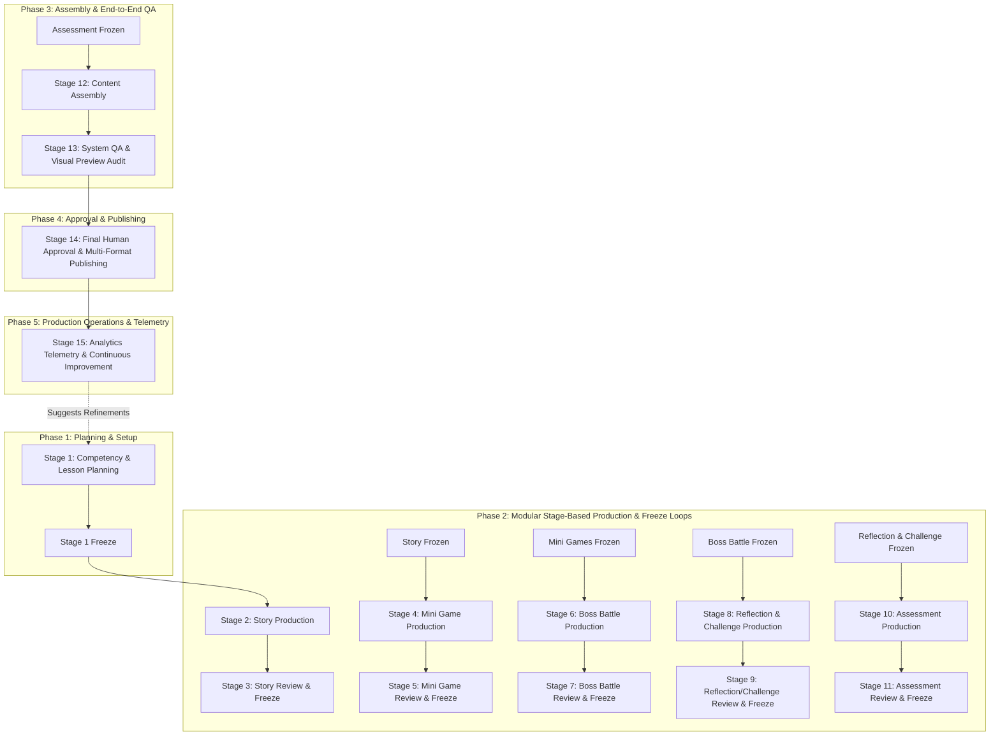

# NOVASTARS AI PRODUCTION SYSTEM (AIPS)
## Master Architecture & Operational Specification

---

## EXECUTIVE SUMMARY & SYSTEM PURPOSE

The **NovaStars AI Production System (AIPS)** is the governing operating system for producing, reviewing, refining, and publishing over 10,000 competency-based learning experiences for elementary students. AIPS orchestrates autonomous AI subagents, deterministic validation pipelines, and human subject-matter experts (Curriculum Designers, QA Editors, and Product Owners) into a high-throughput, quality-guaranteed content factory.

AIPS acts as the execution bridge between frozen architectural frameworks (**Competency Framework**, **Experience Framework**, **NovaStars Lesson Architecture System (NLAS)**, **NovaStars Content Model**, and **Game Design Bible**) and production-ready digital learning experiences.

---

## PART 1: PRODUCTION PHILOSOPHY

### 1.1 Purpose
AIPS exists to scale content production to 10,000+ individual learning experiences without diluting educational efficacy, child safety, narrative coherence, or gamified engagement. It replaces ad-hoc prompt engineering with a deterministic, stage-gated assembly line.

### 1.2 Design Principles
1. **Human-in-the-Loop Authority**: AI proposes; humans inspect, approve, and authorize publication. AI is never granted automated publish privileges.
2. **Stage-Based Production**: Production proceeds horizontally across stages (e.g., all stories generated, reviewed, and frozen before mini-game creation begins) rather than vertically lesson-by-lesson.
3. **Immutability via Freeze Principle**: Upon human approval of a stage, its output artifacts are frozen. Upstream edits invalidate dependent downstream stages and trigger targeted regeneration.
4. **Competency Invariance**: Narrative and gamified wrappers are dynamic; learning objectives, rubric criteria, and assessment targets are absolute and non-negotiable invariants.
5. **Quality-over-Speed Mandate**: Throughput metrics are secondary to pedagogic integrity, story coherence, and game balance.

### 1.3 Educational Principles
* **Evidence-Centered Design (ECD)**: Every generated element (dialogue, mini-game mechanic, boss challenge) must directly manifest evidence of competency mastery.
* **Scaffolded Cognitive Flow**: Experience curves must maintain an optimal balance between challenge and skill (Flow State) using LSCAF (Learn, Scaffolding, Challenge, Assessment, Feedback) progression.
* **Child-Centric Engagement**: Content must maintain child safety, age-appropriate reading levels, positive reinforcement, and high agency.

### 1.4 Operational Principles
* **Determinism & Traceability**: Every AI prompt, raw completion, lint result, human feedback log, and published binary is versioned and traceable via cryptographic hashes.
* **Modular Decoupling**: Components are generated as independent Learning Objects (LOs) adhering to strict JSON Schema contracts defined in the NovaStars Content Model.
* **Graceful Degradation & Retry Escalation**: Failed AI outputs trigger auto-retry loops with feedback prompts before escalating to human reviewers.

### 1.5 Success Criteria & Key Performance Indicators (KPIs)

| Metric | Target | Operational Rationale |
| :--- | :--- | :--- |
| **First-Pass QA Approval Rate** | ≥ 85% | Minimizes human review iteration overhead. |
| **Competency Alignment Rate** | 100% | Zero tolerance for drift from frozen Competency Packages. |
| **Human Review Time per Stage** | ≤ 15 mins/lesson | Ensures scalable editor workload across 10,000+ lessons. |
| **Cascading Invalidation Accuracy** | 100% | Prevents stale downstream artifacts from persisting after upstream edits. |
| **Production Throughput** | 250 lessons/week | Meets target deployment schedule for global multi-grade rollout. |

---

## PART 2: PRODUCTION PIPELINE

### 2.1 Complete Production Lifecycle Workflow

The AIPS lifecycle consists of 14 discrete stages organized into 6 core phases: Planning, Modular Production & Freeze Loops, Assembly & System QA, Approval & Publishing, and Telemetry Feedback.



### 2.2 Stage Detailed Specifications

#### Stage 1: Competency & Lesson Planning
* **Inputs**: Competency Package JSON (Objectives, Skill Tiers, Rubrics), Grade Level Metadata, Theme Guidelines.
* **AI Action**: `Planning Agent` analyzes competency requirements, selects NLAS Lesson Blueprint (e.g., Exploration, Problem-Solving, Role-Play), and generates a `Lesson Production Plan`.
* **Human Gate**: Curriculum Designer verifies blueprint fit and learning objective mapping.
* **Exit Criteria & Freeze**: `Lesson Production Plan` signed off and assigned immutable SHA-256 hash `HASH_PLAN`.

#### Stage 2: Story Production & Stage 3: Story Review & Freeze
* **Inputs**: `HASH_PLAN`, Story Arc Templates, Character Profiles.
* **AI Action**: `Story Agent` and `Dialogue Agent` generate narrative framing, character dialogue, choice points, and emotional hook scripts.
* **Human Gate**: QA Editor inspects narrative tone, reading level, age-appropriateness, and alignment with theme.
* **Exit Criteria & Freeze**: Story Package approved, saved as `HASH_STORY`. Downstream tasks unlocked.

#### Stage 4: Mini Game Production & Stage 5: Review & Freeze
* **Inputs**: `HASH_STORY`, Game Mechanics Library, Competency Sub-skills.
* **AI Action**: `Mini Game Agent` generates 2 to 3 mini-game configurations matching the story context and practicing core sub-skills.
* **Human Gate**: Game Designer / QA Editor verifies mechanic-skill alignment and difficulty tuning.
* **Exit Criteria & Freeze**: Mini-Game Package frozen as `HASH_GAME`.

#### Stage 6: Boss Battle Production & Stage 7: Review & Freeze
* **Inputs**: `HASH_GAME`, `HASH_STORY`, Boss Design Specs, Evidence Schema.
* **AI Action**: `Boss Agent` generates multi-phase boss encounter with escalating challenge tiers, visual prompts, and diagnostic mistake logic.
* **Human Gate**: Curriculum Expert verifies boss tests high-tier synthesis without frustration.
* **Exit Criteria & Freeze**: Boss Package frozen as `HASH_BOSS`.

#### Stage 8: Reflection & Challenge Production & Stage 9: Review & Freeze
* **Inputs**: `HASH_BOSS`, Real-World Transfer Framework.
* **AI Action**: `Reflection Agent` and `Challenge Agent` generate metacognitive reflection prompts and home/offline real-world quests.
* **Human Gate**: QA Editor checks feasibility of home quests and parent guidance clarity.
* **Exit Criteria & Freeze**: Reflection & Challenge frozen as `HASH_REFLECT`.

#### Stage 10: Assessment Production & Stage 11: Review & Freeze
* **Inputs**: `HASH_PLAN`, Competency Rubrics, Question Taxonomy.
* **AI Action**: `Assessment Agent` creates 5-tier diagnostic items with distractor rationale and remedial feedback.
* **Human Gate**: Curriculum Designer reviews psychometric integrity and answer key accuracy.
* **Exit Criteria & Freeze**: Assessment frozen as `HASH_ASSESS`.

#### Stage 12: Content Assembly
* **Inputs**: `HASH_STORY`, `HASH_GAME`, `HASH_BOSS`, `HASH_REFLECT`, `HASH_ASSESS`.
* **AI Action**: `Assembly Agent` bundles all frozen learning objects into a single unified `Learning Experience Bundle (LEB)` JSON conforming to the NovaStars Content Model schema.

#### Stage 13: System QA & Visual Preview Audit
* **Inputs**: `LEB` JSON.
* **AI Action**: `QA Agent` executes automated schema validation, broken link checks, readability linter, and media asset verifications.
* **Human Gate**: QA Editor tests full interactive playback on `review.html` visual engine.

#### Stage 14: Final Approval & Publishing
* **Inputs**: Validated `LEB` JSON, QA Sign-off Log.
* **Human Gate**: Product Owner approves deployment.
* **Action**: `Publishing Agent` compiles exports for CMS, JSON runtime API, Google Sheets, and Word documentation formats.

---

## PART 3: AI AGENT ARCHITECTURE

AIPS employs 15 specialized AI Agents working in concert under strict orchestration rules.

```
                                  ┌────────────────────────┐
                                  │   CENTRAL ORCHESTRATOR │
                                  └───────────┬────────────┘
                                              │
       ┌──────────────────────────────────────┼──────────────────────────────────────┐
       │                                      │                                      │
┌──────┴─────────┐                    ┌───────┴────────┐                    ┌────────┴────────┐
│ PLANNING AGENT │                    │   STORY AGENT  │                    │ DIALOGUE AGENT  │
└──────┬─────────┘                    └───────┬────────┘                    └────────┬────────┘
       │                                      │                                      │
┌──────┴─────────┐                    ┌───────┴────────┐                    ┌────────┴────────┐
│MINIGAME AGENT  │                    │   BOSS AGENT   │                    │REFLECTION AGENT │
└──────┬─────────┘                    └───────┬────────┘                    └────────┬────────┘
       │                                      │                                      │
┌──────┴─────────┐                    ┌───────┴────────┐                    ┌────────┴────────┐
│CHALLENGE AGENT │                    │ASSESSMENT AGENT│                    │  REWARD AGENT   │
└──────┬─────────┘                    └───────┬────────┘                    └────────┬────────┘
       │                                      │                                      │
┌──────┴─────────┐                    ┌───────┴────────┐                    ┌────────┴────────┐
│ ASSEMBLY AGENT │                    │    QA AGENT    │                    │PUBLISHING AGENT │
└──────┬─────────┘                    └───────┴────────┘                    └────────┬────────┘
       │                                      │                                      │
┌──────┴─────────┐                    ┌───────┴────────┐                             │
│ANALYTICS AGENT │                    │IMPROVEMENT AGENT                      │
└────────────────┘                    └────────────────┘                             ┘
```

### 3.1 Detailed Agent Specifications

#### 1. Planning Agent
* **Purpose**: Deconstructs Competency Packages into lesson production blueprints.
* **Inputs**: `CompetencyPackageJSON`, `GradeMetadata`.
* **Outputs**: `LessonProductionPlanJSON`.
* **Responsibilities**: Select NLAS blueprint archetype, map sub-skills to lesson phases, set target difficulty parameters.
* **Constraints**: Cannot alter competency objectives or target skill definitions.
* **Dependencies**: External Competency Framework repository.
* **Communication Rules**: Emits event `PLAN_GENERATED` to Orchestrator.
* **Version Rules**: Writes plan schema v1.0.
* **Failure Conditions**: Invalid competency mapping schema or missing grade metadata.

#### 2. Story Agent
* **Purpose**: Authors narrative arcs and environmental settings.
* **Inputs**: `LessonProductionPlanJSON`, `StoryBible`.
* **Outputs**: `StoryArcManifestJSON`.
* **Responsibilities**: Establish plot, setting, character roles, emotional beats, and conflict.
* **Constraints**: Must align with NovaStars Game Design Bible character lore; zero unsafe/inappropriate content.
* **Dependencies**: Stage 1 Plan freeze.
* **Communication Rules**: Emits `STORY_GENERATED`.
* **Failure Conditions**: Narrative length out of bounds (> 500 words total narrative text per phase).

#### 3. Dialogue Agent
* **Purpose**: Generates age-tailored character dialogue and choice branch text.
* **Inputs**: `StoryArcManifestJSON`, `Flesch-Kincaid Target Readability Grade`.
* **Outputs**: `DialogueTreeJSON`.
* **Responsibilities**: Character voicing, line length optimization, vocabulary checking for target grade.
* **Constraints**: Dialogue lines ≤ 12 words per speech bubble for Elementary Grade 1-3; ≤ 20 words for Grade 4-5.
* **Dependencies**: Stage 2 Story freeze.
* **Failure Conditions**: Readability metric exceeds grade limit by > 0.5 grade levels.

#### 4. Mini Game Agent
* **Purpose**: Configures game loop parameters for skill practice.
* **Inputs**: `StoryArcManifestJSON`, `GameMechanicsRegistry`.
* **Outputs**: `MiniGameSpecJSON`.
* **Responsibilities**: Map learning actions to game mechanics (sorting, matching, sequencing, spatial puzzle).
* **Constraints**: Mechanics must use pre-approved engine component templates.
* **Dependencies**: Stage 3 Story freeze.
* **Failure Conditions**: Referencing unapproved interactive mechanic ID.

#### 5. Boss Battle Agent
* **Purpose**: Designs multi-tier synthesis boss encounters.
* **Inputs**: `MiniGameSpecJSON`, `CompetencyRubric`.
* **Outputs**: `BossBattleSpecJSON`.
* **Responsibilities**: Construct 3-stage boss fight, set health/timer parameters, define diagnostic feedback for wrong choices.
* **Constraints**: Failure must be non-punitive (safe failure design from Game Design Bible).
* **Dependencies**: Stage 5 Mini Game freeze.
* **Failure Conditions**: Hard fail condition without clear hint scaffold.

#### 6. Reflection Agent
* **Purpose**: Crafts metacognitive reflection prompts.
* **Inputs**: `BossBattleSpecJSON`, `ReflectionTaxonomy`.
* **Outputs**: `ReflectionSpecJSON`.
* **Responsibilities**: Prompt self-evaluation, emotional check-in, and skill synthesis discussion.
* **Constraints**: Max 3 reflection screens per lesson.
* **Dependencies**: Stage 7 Boss freeze.
* **Failure Conditions**: Missing diagnostic rubrics for reflection entries.

#### 7. Challenge Agent
* **Purpose**: Generates real-world offline quests (Home Challenges).
* **Inputs**: `CompetencyPackageJSON`, `ParentGuideTemplate`.
* **Outputs**: `HomeChallengeSpecJSON`.
* **Responsibilities**: Craft safe, engaging real-life activities for children to perform with parent verification.
* **Constraints**: Must not require expensive materials or unsafe physical actions.
* **Dependencies**: Stage 7 Boss freeze.
* **Failure Conditions**: Action flagged for potential household hazard.

#### 8. Assessment Agent
* **Purpose**: Generates diagnostic 5-tier items with distractor logic.
* **Inputs**: `LessonProductionPlanJSON`, `TaxonomyRules`.
* **Outputs**: `AssessmentBankJSON`.
* **Responsibilities**: Write questions covering LSCAF Tiers A through E, distractor explanations, and correct answer keys.
* **Constraints**: 100% objective alignment; exactly 4 choices (A, B, C, D) per question.
* **Dependencies**: Stage 1 Plan freeze.
* **Failure Conditions**: Duplicate choice options or missing explanation fields.

#### 9. Reward Agent
* **Purpose**: Configures reward economy drops, badges, and star rewards.
* **Inputs**: `LessonProductionPlanJSON`, `EconomyRules`.
* **Outputs**: `RewardPackageJSON`.
* **Responsibilities**: Assign star allocations, collectible item IDs, avatar unlock triggers.
* **Constraints**: Must strictly follow NovaStars Game Design Bible economy caps (max 3 stars, max 50 Nova Gems per lesson).
* **Dependencies**: Stage 12 Assembly.
* **Failure Conditions**: Reward economy overflow exceeding daily economy caps.

#### 10. Assembly Agent
* **Purpose**: Bundles all frozen stage artifacts into a master Learning Experience Bundle (LEB).
* **Inputs**: All Stage Hash Files (`HASH_PLAN` through `HASH_ASSESS`).
* **Outputs**: Unified `LearningExperienceBundle.json`.
* **Responsibilities**: Link cross-object references, resolve asset paths, assign global identifiers.
* **Constraints**: Zero missing dependency links.
* **Dependencies**: All upstream stage freezes complete.
* **Failure Conditions**: Schema validation error against NovaStars Content Model JSON Schema.

#### 11. QA Agent
* **Purpose**: Runs automated quality checks and static analysis.
* **Inputs**: `LearningExperienceBundle.json`.
* **Outputs**: `QAAuditReportJSON`.
* **Responsibilities**: Execute linting rules, reading grade level validation, broken link detection, distractor sanity checks.
* **Constraints**: Deterministic execution; zero false negatives on schema checks.
* **Dependencies**: Stage 12 Assembly complete.
* **Failure Conditions**: Any critical lint error blocks production progression.

#### 12. Publishing Agent
* **Purpose**: Converts approved LEB into target platform distributions.
* **Inputs**: Approved `LearningExperienceBundle.json`.
* **Outputs**: Production JSON, CMS Payload, Google Sheets format, Word Document format.
* **Responsibilities**: Execute transformation scripts, push to staging/production CMS APIs.
* **Constraints**: Requires cryptographic proof of Product Owner sign-off.
* **Dependencies**: Human approval gate passed.
* **Failure Conditions**: Target publishing API endpoint error or missing signature.

#### 13. Analytics Agent
* **Purpose**: Aggregates runtime student telemetry and performance metrics.
* **Inputs**: Production Telemetry Logs, Analytics DB.
* **Outputs**: `LessonPerformanceReportJSON`.
* **Responsibilities**: Track completion rate, boss drop-off rates, question item discrimination index, parent verification completion.
* **Constraints**: Privacy compliant (zero PII processing).
* **Dependencies**: Live published lesson in Production.
* **Failure Conditions**: Telemetry pipeline ingestion error.

#### 14. Improvement Agent
* **Purpose**: Recommends targeted content refactors based on telemetry and QA logs.
* **Inputs**: `LessonPerformanceReportJSON`, `QAAuditReportJSON`.
* **Outputs**: `RefactorProposalJSON`.
* **Responsibilities**: Identify underperforming questions (high fail rate, negative discrimination), narrative drop-off points, and suggest prompt/content modifications.
* **Constraints**: Refactor proposals must be submitted as pending proposals for human approval.
* **Dependencies**: Analytics output.
* **Failure Conditions**: Generating refactor without empirical telemetry evidence.

---

## PART 4: ORCHESTRATOR DESIGN

The **Central AIPS Orchestrator** is a deterministic, event-driven Directed Acyclic Graph (DAG) execution engine built to manage subagent workflows, stage freezes, retry loops, and human approval gates.

```
                           ┌──────────────────────────┐
                           │   STATE & DAG ENGINE     │
                           │   (Directed Acyclic Graph│
                           └─────────────┬────────────┘
                                         │
        ┌────────────────────────────────┼────────────────────────────────┐
        │                                │                                │
┌───────┴────────┐              ┌────────┴────────┐              ┌────────┴────────┐
│ TASK SCHEDULER │              │ APPROVAL GATES  │              │ FREEZE CONTROL  │
└───────┬────────┘              └────────┬────────┘              └────────┬────────┘
        │                                │                                │
┌───────┴────────┐              ┌────────┴────────┐              ┌────────┴────────┐
│  RETRY ENGINE  │              │ VERSION TRACKER │              │ EXCEPTION ROUTER│
└────────────────┘              └─────────────────┘              └─────────────────┘
```

### 4.1 Core Orchestrator Capabilities

1. **DAG Task Scheduling**: Computes execution order based on stage dependencies. Parallelizes independent tasks (e.g., Reflection generation and Challenge generation execute concurrently after Boss freeze).
2. **Workflow & Freeze Control**: Maintains state machine for every lesson package (`DRAFT` → `STAGE_N_GENERATED` → `STAGE_N_APPROVED` → `STAGE_N_FROZEN` → ... → `PUBLISHED`). Blocks downstream agent execution until upstream stage is `FROZEN`.
3. **Automated Retry & Prompt Escalation Logic**:
   * **Level 1 (Auto Retry)**: On agent output syntax/schema failure, re-query agent with error stack snippet (max 3 retries).
   * **Level 2 (Param Adjust)**: Adjust temperature/top_p parameters and retry (max 2 retries).
   * **Level 3 (Human Routing)**: If failures persist, state changes to `FLAGGED_HUMAN_ATTENTION` and routes to QA Editor queue.
4. **Approval Gate Integration**: Intercepts stage transitions requiring human sign-off. Pauses DAG execution and sends webhook alerts to the Human Review Dashboard.
5. **Version Tracking & Invalidation Engine**: Computes SHA-256 hashes of all input and output artifacts. If a human editor modifies `HASH_STORY_v1`, the orchestrator marks `HASH_STORY_v1` as `SUPERSEDED`, calculates downstream dependency impact, invalidates downstream frozen states (`GAME`, `BOSS`, `ASSEMBLY`), and schedules targeted regeneration.

---

## PART 5: HUMAN REVIEW SYSTEM

Humans hold absolute decision authority in AIPS. AI accelerates generation, while humans guarantee quality, tone, and safety.

### 5.1 Roles and Responsibilities (RACI Matrix)

| Production Stage | Curriculum Designer | QA Editor | Product Owner | AI Subagent Engine |
| :--- | :---: | :---: | :---: | :---: |
| **1. Competency & Planning** | **A / R** | C | I | R (Drafting) |
| **2-3. Story & Dialogue** | C | **A / R** | I | R (Drafting) |
| **4-5. Mini Games** | C | **A / R** | I | R (Drafting) |
| **6-7. Boss Battles** | **A / R** | R | I | R (Drafting) |
| **8-9. Reflection & Challenge**| C | **A / R** | I | R (Drafting) |
| **10-11. Assessment** | **A / R** | R | I | R (Drafting) |
| **12-13. Assembly & System QA**| I | **A / R** | I | R (Linting) |
| **14. Final Approval & Publish**| I | C | **A / R** | R (Export) |
| **15. Continuous Improvement** | **A / R** | R | C | R (Analytics) |

* **R (Responsible)**: Executes the work/review.
* **A (Accountable)**: Single decision-maker who approves/rejects.
* **C (Consulted)**: Provides domain feedback.
* **I (Informed)**: Receives status updates.

### 5.2 Review Timings & SLAs

* **Stage Review SLA**: Human editors must process submitted stage artifacts within 24 hours of notification.
* **Micro-Review Interface**: Reviews are conducted via granular component diff views (e.g., viewing dialogue lines side-by-side with target reading scores) rather than reviewing monolithic text.

### 5.3 Conflict Resolution & Escalation Rules

```
[Agent Output Flagged] ──> [QA Editor Review] ──(Disagreement)──> [Curriculum Lead Review] ──(Unresolved)──> [Product Owner Final Ruling]
```

1. If QA Editor disagrees with AI output, editor may **Directly Edit**, **Trigger Regenerate with Custom Prompt**, or **Reject to Planning**.
2. If QA Editor and Curriculum Designer disagree on educational content fit, the **Curriculum Designer** holds final authority for competency/assessment issues.
3. For product positioning, story tone, or brand conflicts, the **Product Owner** holds absolute override authority.

---

## PART 6: QUALITY ASSURANCE SYSTEM

AIPS implements a 9-layer Quality Assurance System. Every stage must clear its specific QA subsystem before freeze approval.

```
       ┌────────────────────────────────────────────────────────┐
       │             9-LAYER AIPS QUALITY ASSURANCE             │
       └───────────────────────────┬────────────────────────────┘
                                   │
┌──────────────────────────────────┼──────────────────────────────────┐
│ Layer 1: Educational QA          │ Layer 4: Boss QA                 │ Layer 7: Assessment QA
│ - Objective Mapping              │ - Scaffolded Phases              │ - Distractor Analysis
│ - LSCAF Tier Compliance          │ - Safe Failure Checks            │ - Key Accuracy Check
├──────────────────────────────────┼──────────────────────────────────┼──────────────────────────────────┐
│ Layer 2: Story & Dialogue QA     │ Layer 5: Reflection QA           │ Layer 8: Assembly & Schema QA    │
│ - Flesch-Kincaid Readability     │ - Metacognitive Prompt Depth     │ - JSON Schema Validation         │
│ - Safety & Sentiment Check       │ - Self-Assessment Rubric Fit     │ - Cross-Reference Integrity      │
├──────────────────────────────────┼──────────────────────────────────┼──────────────────────────────────┤
│ Layer 3: Gameplay QA             │ Layer 6: Challenge QA            │ Layer 9: Publishing QA           │
│ - Mechanic-Skill Alignment       │ - Real-World Safety Verification │ - Multi-Format Export Visual Audit│
│ - Difficulty Scaling Audit       │ - Parent Guidance Clarity        │ - Runtime Simulator Verification │
└──────────────────────────────────┴──────────────────────────────────┴──────────────────────────────────┘
```

### 6.1 The 9 QA Subsystems

1. **Educational QA**: Verifies 100% mapping of content elements to target sub-skill competencies. Validates cognitive depth across LSCAF Tiers A-E.
2. **Story QA**: Runs automated NLP checks for sentiment, age-appropriate vocabulary (Flesch-Kincaid Elementary Grade index), tone consistency, and zero safety policy violations.
3. **Gameplay QA**: Validates mini-game configuration JSONs against engine rules. Ensures game mechanics directly exercise the cognitive task required by the sub-skill.
4. **Boss QA**: Verifies multi-stage boss combat rules, diagnostic error feedback, visual asset specifications, and non-punitive re-try mechanics.
5. **Reflection QA**: Checks metacognitive reflection prompts for depth, age appropriateness, and self-assessment rubric fit.
6. **Challenge QA**: Audits home challenge activities for child safety, accessibility without specialized materials, and clear parent verification steps.
7. **Assessment QA**: Evaluates test item psychometrics: distractor plausibility, clear non-ambiguous correct answers, and zero clueing across questions.
8. **Assembly QA**: Performs strict automated JSON schema validation, cross-object UUID reference verification, asset link checking, and structural integrity audits.
9. **Publishing QA**: Audits final visual rendering in `review.html` runtime simulator and validates export integrity across JSON, CMS, Word, and Google Sheets format adapters.

---

## PART 7: VERSION MANAGEMENT

To ensure absolute determinism across 10,000+ lessons, AIPS enforces cryptographic content versioning and dependency tracking.

### 7.1 Cryptographic Versioning Architecture

* Every content artifact is immutable once generated and hashed using **SHA-256**.
* Content Addressable Storage (CAS) format: `[ObjectType]_[UUID]_v[Major].[Minor]_[SHA256_HASH]`.
  * Example: `STORY_8f3a921d_v1.0_a9f4c2e...json`

### 7.2 Dependency Mapping & Cascading Invalidation

AIPS maintains a live **Dependency Graph (DAG)** connecting all artifacts within a Learning Experience:

```
[CompetencyPackage] (v1.0)
       │
       ▼
[LessonPlan] (v1.0) ──► [Assessment] (v1.0)
       │
       ▼
  [Story] (v1.0)
       │
       ▼
[MiniGames] (v1.0)
       │
       ▼
  [Boss] (v1.0)
       │
       ▼
[Reflection & Challenge] (v1.0)
       │
       ▼
[LearningExperienceBundle] (v1.0)
```

#### Invalidation Rules:
1. **Upstream Mutation**: If an editor updates `Story` from `v1.0` to `v1.1`, the Orchestrator marks downstream artifacts (`MiniGames v1.0`, `Boss v1.0`, `Reflection v1.0`, `LEB v1.0`) as **STALE / INVALIDATED**.
2. **Targeted Regeneration**: The Orchestrator automatically queues Stage 4 (Mini Games), Stage 6 (Boss), Stage 8 (Reflection), and Stage 12 (Assembly) for regeneration using `Story v1.1` as input.
3. **Frozen Invariance**: Unrelated branches (e.g., `Assessment v1.0`, which depends directly on `LessonPlan` and `CompetencyPackage`) remain **UNTOUCHED** and frozen, saving compute and human review time.

---

## PART 8: PUBLISHING SYSTEM

### 8.1 Lifecycle State Machine

A Learning Experience progresses through 7 strictly defined states:

```stateDiagram-v2
    [*] --> DRAFT : Initialize Lesson
    DRAFT --> AI_GENERATED : AI Agents Complete Production
    AI_GENERATED --> HUMAN_REVIEW : Automated QA Passed
    HUMAN_REVIEW --> APPROVED : Human Review Sign-Off
    HUMAN_REVIEW --> DRAFT : Human Rejects / Requests Edit
    APPROVED --> PILOT : Deployed to Test Cohort
    PILOT --> PRODUCTION : Pilot Success Criteria Met
    PILOT --> HUMAN_REVIEW : Pilot Issues Identified
    PRODUCTION --> ARCHIVED : Lesson Deprecated / Replaced
```

### 8.2 State Transition Rules

| Transition | Trigger | Required Approver | Automated Action |
| :--- | :--- | :--- | :--- |
| `DRAFT` → `AI_GENERATED` | All stage agents complete | System Orchestrator | Runs Assembly & QA Agent |
| `AI_GENERATED` → `HUMAN_REVIEW` | 100% Assembly QA Pass | System QA Agent | Notifies QA Editor Queue |
| `HUMAN_REVIEW` → `APPROVED` | Stage freeze sign-offs complete | QA Editor & Curriculum Lead | Issues SHA-256 Release Sign-off |
| `APPROVED` → `PILOT` | Deploy to staging pilot | Product Owner | Triggers Publishing Agent (Staging API) |
| `PILOT` → `PRODUCTION` | Pilot metrics pass telemetry thresholds | Product Owner | Triggers Publishing Agent (Production API) |
| `PRODUCTION` → `ARCHIVED` | Lesson supersession command | Curriculum Director | Pushes archive payload to CMS |

### 8.3 Multi-Format Export Adapters

The `Publishing Agent` generates 4 production export formats simultaneously from the approved `LEB` JSON:
1. **JSON Runtime Payload**: Optimized, compressed JSON consumed directly by the mobile/web game client.
2. **CMS-Ready Payload**: Relational payload with media references formatted for direct API insertion into the NovaStars Content Management System.
3. **Google Sheets Export**: Formatted tabular representation for curriculum review spreadsheets.
4. **Word Document Export (.docx)**: Cleanly formatted printable document containing full narrative scripts, question banks, parent guides, and answer keys.

---

## PART 9: ANALYTICS & CONTINUOUS IMPROVEMENT

Production does not end at publishing. AIPS uses live runtime student data to drive continuous, data-informed content optimization.

```
┌────────────────────────┐      ┌────────────────────────┐      ┌────────────────────────┐
│ STUDENT TELEMETRY LOGS │ ───> │ ANALYTICS AGENT        │ ───> │ IMPROVEMENT AGENT      │
│ - Boss Failure Rates   │      │ Aggregates performance │      │ Generates refactor     │
│ - Replay & Drop-Offs   │      │ anomalies              │      │ proposals              │
└────────────────────────┘      └────────────────────────┘      └───────────┬────────────┘
                                                                            │
┌────────────────────────┐      ┌────────────────────────┐                  │
│ CMS PRODUCTION RE-STAGE│ <─── │ HUMAN APPROVAL GATE    │ <────────────────┘
│ Targeted deployment    │      │ Curriculum Owner signs │
└────────────────────────┘      └────────────────────────┘
```

### 9.1 Tracked Telemetry Metrics

1. **Completion Rate**: Percentage of students starting who finish the lesson. (Target: ≥ 90%).
2. **Boss Failure Rate**: High failure rates (> 35% on Phase 1) indicate difficulty spikes or broken hint scaffolds.
3. **Replay Rate**: High replay rates signal strong engagement; zero replays suggest low fun factor.
4. **Item Discrimination Index (Assessment)**: Identifies bad questions where high-performing students answer incorrectly.
5. **Parent Challenge Verification Rate**: Measures real-world home activity engagement.

### 9.2 Closed-Loop Improvement Process

1. **Anomaly Detection**: `Analytics Agent` flags lessons falling outside normal performance parameters (e.g., Boss Battle failure rate = 52%).
2. **Diagnosis & Proposal**: `Improvement Agent` analyzes telemetry logs, identifies specific problematic dialogue lines or boss health values, and outputs a `RefactorProposalJSON`.
3. **Human Approval**: The `RefactorProposalJSON` is routed to the Curriculum Designer with a visual diff.
4. **Targeted Re-freeze & Publish**: Upon human approval, the Orchestrator executes a targeted stage regeneration, updates the version, and publishes the patch.

---

## PART 10: AI CREATIVITY RULES

To balance narrative engagement with pedagogic rigor, AIPS enforces strict boundaries on AI agent agency.

### 10.1 Permitted AI Actions (What AI MAY Do)
* Generate creative story lines, world settings, and fictional scenarios.
* Create diverse character dialogue options adapted to grade reading levels.
* Produce multiple creative variations of mini-game theme wrappers (e.g., sorting trash vs. sorting space debris).
* Propose alternative distractor options and contextual explanations.
* Suggest activity refinements based on analytics telemetry.

### 10.2 Strictly Forbidden AI Actions (What AI MAY NOT Do)
* **Modify Competency Objectives**: AI must NEVER alter, add, or drop targeted learning outcomes or skill rubrics.
* **Publish Directly**: AI has zero authority to transition any content object to `APPROVED`, `PILOT`, or `PRODUCTION`.
* **Override Human Edits**: If a human editor manually edits text, AI agents may NOT overwrite the edit during subsequent processing.
* **Bypass Frozen Stages**: AI agents cannot modify upstream frozen stage outputs without triggering formal invalidation pipelines.
* **Violate Safety Invariants**: AI must never output content containing inappropriate language, scary themes for young kids, violence, or dangerous home activities.

---

## PART 11: SCALABILITY

AIPS is designed from the ground up to scale seamlessly from 100 to 10,000+ lessons across multiple international markets.

```
               ┌────────────────────────────────────────────────────────┐
               │              AIPS SCALABILITY ARCHITECTURE             │
               └───────────────────────────┬────────────────────────────┘
                                           │
┌──────────────────────────────────────────┼──────────────────────────────────────────┐
│ Micro-Batch Horizontal Scaling           │ Multi-Model AI Router                    │ Internationalization (i18n) Engine
│ - Stage-based parallel execution         │ - Tier 1: High Reasoning (GPT-4o/Gemini Pro)│ - Cultural Adaptation Layer
│ - Worker pool auto-scaling               │ - Tier 2: Speed/Cost (Flash/Mini)        │ - Localization Memory & Glossary Sync
└──────────────────────────────────────────┴──────────────────────────────────────────┴──────────────────────────────────────────┘
```

### 11.1 Scaling Pathways (100 → 1,000 → 10,000 Lessons)

* **100 Lessons (Initial Launch)**: Single Orchestrator instance, synchronous agent execution, manual human review for all stages.
* **1,000 Lessons (Regional Expansion)**: Distributed Orchestrator worker queue (Celery/Redis DAG engine), parallel stage generation micro-batches, automated linting filtering out 80% of human review noise.
* **10,000 Lessons (Global Factory Scale)**: Fully asynchronous microservices agent architecture, automated confidence scoring (high-confidence stages fast-tracked to expedited human review queue), multi-region production clusters.

### 11.2 Multi-Model AI Routing Framework

To optimize compute cost, latency, and output quality, AIPS utilizes a **Multi-Model Router**:

| Production Task | Selected Model Tier | Selection Rationale |
| :--- | :--- | :--- |
| **Stage 1: Planning & Blueprinting** | High Reasoning (e.g., Gemini 1.5 Pro / GPT-4o) | Requires complex structural reasoning & competency mapping. |
| **Stage 2-3: Story & Dialogue** | Creative High Reasoning | Requires rich character voice, humor, and narrative flow. |
| **Stage 8 & 10: Reflection & Assessment** | Standard Reasoning / Fast Tier (e.g., Gemini Flash / GPT-4o-mini) | High throughput item generation following strict schema rules. |
| **Stage 13: QA & Schema Verification** | Deterministic Code / Micro-Model | Fast, low-cost syntax and rule linter checks. |

### 11.3 Multi-Country & Multi-Language Localization Engine

* **Core Narrative Decoupling**: Culture-neutral core competency logic is preserved while story assets pass through a **Cultural Adaptation Agent**.
* **Localization Memory**: Maintains persistent translation glossaries ensuring consistent character names, game terminology, and educational terms across languages.

---

## PART 12: STANDARD OPERATING PROCEDURES (SOP)

This section details step-by-step procedures for the 8 core operational workflows in AIPS.

---

### SOP-01: Creating a New Competency Package

* **Purpose**: Initialize production of a brand-new skill topic from raw curriculum specs.
* **Trigger**: Curriculum Lead uploads approved `CompetencyPackageJSON` to repository.
* **Actor**: Curriculum Designer & Planning Agent.
* **Procedure**:
  1. Upload `CompetencyPackageJSON` to AIPS Workspace (`/competencies/`).
  2. Execute CLI Command: `aips init-package --file competency_group3_safety.json`.
  3. `Planning Agent` validates schema, generates `LessonProductionPlanJSON` across target grade levels (L1 to L5).
  4. Curriculum Designer opens AIPS Dashboard, reviews proposed lesson blueprints, and verifies LSCAF tier distribution.
  5. Curriculum Designer clicks **Approve & Freeze Plan**.
  6. AIPS Orchestrator registers `HASH_PLAN` and automatically spawns Stage 2 (Story Production) worker tasks.

---

### SOP-02: Updating an Existing Lesson

* **Purpose**: Perform minor updates (typo fix, dialogue tweak, question clarification) on an existing lesson.
* **Trigger**: QA alert or user feedback report.
* **Actor**: QA Editor.
* **Procedure**:
  1. Open AIPS Editor Dashboard and search for Lesson ID (`LESSON_SEC_042`).
  2. Select target component (e.g., Stage 3 Dialogue Tree).
  3. Click **Unlock Stage** (requires entering justification note).
  4. Perform manual text edit or input prompt directive: *"Make dialogue more encouraging for Grade 2"*.
  5. Click **Save & Re-Freeze Stage**.
  6. **Automated System Action**: Orchestrator detects update to `HASH_STORY`, marks downstream components (`HASH_GAME`, `HASH_BOSS`, `HASH_ASSEMBLY`) as STALE, and displays dependency impact alert.
  7. Click **Confirm & Run Downstream Regeneration**.
  8. Orchestrator regenerates only downstream objects, submits completed bundle to Stage 13 System QA.

---

### SOP-03: Replacing a Story Line/Theme

* **Purpose**: Completely replace a lesson's narrative framing (e.g., change theme from "Space Exploration" to "Underwater Adventure") while retaining educational competency logic.
* **Trigger**: Product decision or seasonal refresh request.
* **Actor**: Product Owner & Story Agent.
* **Procedure**:
  1. Select Lesson ID in AIPS Dashboard.
  2. Click **Execute Theme Swap**.
  3. Select new target theme preset from Story Library or enter custom theme descriptor.
  4. System retains Stage 1 `HASH_PLAN` (Competency Plan remains 100% frozen).
  5. Orchestrator executes `Story Agent` and `Dialogue Agent` to draft new narrative arc under new theme.
  6. QA Editor reviews narrative for tone and safety, clicks **Freeze Story**.
  7. Orchestrator cascades updates through Mini Games, Boss, and Reflection, re-skinning game assets to match underwater theme while preserving skill mechanics.
  8. Final bundle passes QA and is released under new version tag (`v2.0`).

---

### SOP-04: Adding a Seasonal / Event Version

* **Purpose**: Generate a limited-time seasonal variant (e.g., Halloween, Lunar New Year) of an active lesson.
* **Trigger**: Marketing / Product seasonal calendar event.
* **Actor**: QA Editor & Publishing Agent.
* **Procedure**:
  1. Select base lesson `LESSON_FIN_012`.
  2. Click **Create Variant** → Select **Seasonal Event** → Choose *"Lunar New Year"*.
  3. AIPS creates child branch `LESSON_FIN_012_LNY`.
  4. `Story Agent` applies seasonal overlay parameters (e.g., decorating environment with lanterns, replacing reward drops with Red Envelopes).
  5. Core competency objectives, assessment items, and boss battle mechanics remain strictly inherited from base parent branch.
  6. QA Editor conducts visual verification in `review.html`.
  7. Product Owner signs off on seasonal release window (e.g., Feb 1 - Feb 15).
  8. `Publishing Agent` schedules automated publish and deprecation dates.

---

### SOP-05: Fixing QA Issues (Fast-Track Patch vs. Full Regeneration)

* **Purpose**: Resolve QA flags raised during Stage 13 System QA or Visual Preview.
* **Trigger**: System QA Agent output containing error flags.
* **Actor**: QA Editor.
* **Procedure**:
  1. Open AIPS QA Queue and select flagged lesson task.
  2. Inspect QA Audit Report error classification:
     * **Class A (Minor Syntax / Typo / Formatting Error)**: Choose **Fast-Track Patch**. Edit field directly in inline editor. Click **Apply Patch**. System bypasses upstream stage regeneration and re-runs Stage 13 QA linter directly.
     * **Class B (Major Pedagogic / Pedagogy Alignment Failure)**: Choose **Stage Regeneration**. Input feedback directive explaining failure (e.g., *"Boss difficulty curve fails Stage 2 challenge requirement"*). Click **Reject Stage to Agent**.
  3. If Class B is selected, Orchestrator routes task back to responsible Stage Agent with feedback payload, incrementing attempt counter.

---

### SOP-06: Publishing to Production

* **Purpose**: Authorize and execute release of approved Learning Experience Bundles to live student app.
* **Trigger**: Successful completion of Stage 13 System QA and visual audit.
* **Actor**: Product Owner.
* **Procedure**:
  1. Open AIPS Release Manager dashboard.
  2. Filter lessons by status `APPROVED_READY_FOR_PUBLISH`.
  3. Review release batch summary report (validating 100% QA sign-off logs, checksum matches, and green linter status).
  4. Authenticate using hardware key/MFA sign-off signature.
  5. Click **Publish Batch to Production**.
  6. `Publishing Agent` executes deployment pipeline:
     * Writes JSON runtime payloads to Production CDN.
     * Ingests CMS relational entities into live database.
     * Generates updated Word/Sheet documentation archives.
  7. System status transitions from `APPROVED` to `PRODUCTION`. Releases automated notification to content operations team.

---

### SOP-07: Archiving Obsolete Content

* **Purpose**: Safely deprecate outdated or superseded learning experiences without breaking student progress tracking.
* **Trigger**: Curriculum refresh or skill framework restructuring.
* **Actor**: Curriculum Director.
* **Procedure**:
  1. Locate target lesson in Content Registry.
  2. Click **Initiate Archival Process**.
  3. System performs active user impact audit (checking if any active student cohorts are currently mid-lesson).
  4. Select Archival Strategy:
     * **Soft Deprecation**: Lesson remains playable for active enrolled students, but hidden from new catalog discovery.
     * **Hard Archival**: Immediate removal from active catalog; student historical completion records preserved.
  5. Enter replacement Lesson ID if applicable (`SUPERSING_LESSON_ID`).
  6. Click **Confirm Archival**.
  7. Status updates to `ARCHIVED`. `Publishing Agent` updates CMS flags.

---

### SOP-08: Emergency Rollback

* **Purpose**: Instantly revert a live production lesson to its previous stable release in event of runtime client crash or critical error.
* **Trigger**: P1 runtime bug report or crash spike detected by telemetry.
* **Actor**: Product Owner / On-Call System Engineer.
* **Procedure**:
  1. Access AIPS Emergency Command Center.
  2. Enter impacted Lesson ID (`LESSON_SCI_009`).
  3. View version deployment history.
  4. Select last known stable version tag (`v1.4_RELEASE`).
  5. Click **EXECUTE EMERGENCY ROLLBACK**.
  6. System prompts for confirmation master key. Confirm action.
  7. Orchestrator immediately rewires Production CDN routing table to point to `v1.4` static payload within < 30 seconds.
  8. Production state of `v1.5` automatically changes to `ROLLED_BACK_MUTATED` and opens P1 investigation ticket in QA Editor queue.

---

## PART 13: RISK MANAGEMENT

AIPS incorporates proactive risk management to prevent, detect, and recover from operational and educational failures.

```
       ┌────────────────────────────────────────────────────────┐
       │             AIPS RISK MANAGEMENT MATRIX                │
       └───────────────────────────┬────────────────────────────┘
                                   │
┌──────────────────────────────────┼──────────────────────────────────┐
│ Risk 1: Broken Dependencies      │ Risk 3: AI Hallucinations        │ Risk 5: Human Review Bottlenecks
│ - Auto DAG State Tracking        │ - Strict Schema & NLP Linting    │ - Micro-Review Interfaces
│ - Cascading Invalidation Engine  │ - Human Gate Inspection          │ - Automated SLA Alerting
├──────────────────────────────────┼──────────────────────────────────┼──────────────────────────────────┐
│ Risk 2: Version Conflicts        │ Risk 4: Low Quality Outputs      │ Risk 6: Inconsistent QA Reviews  │
│ - Cryptographic SHA-256 Hashes   │ - Multi-Stage Retry Escalation   │ - Objective QA Rubric Guidelines │
│ - Immutable Artifact Storage     │ - Temperature Tuning Router      │ - Periodic Inter-Rater Audits    │
└──────────────────────────────────┴──────────────────────────────────┴──────────────────────────────────┘
```

### 13.1 Detailed Risk Matrix

| Risk Category | Risk Description | Detection Mechanism | Prevention Strategy | Recovery Procedure |
| :--- | :--- | :--- | :--- | :--- |
| **1. Broken Dependencies** | Downstream object references obsolete or missing UUIDs after upstream edit. | Stage 12 Assembly QA schema cross-reference linter. | Automated DAG dependency tracking; mandatory state invalidation on upstream edit. | Orchestrator automatically re-queues broken downstream stages for regeneration. |
| **2. Version Conflicts** | Editors working on out-of-date artifact drafts concurrently. | Optimistic locking & SHA-256 hash validation upon save attempt. | Immutable content addressable storage; branch locking during active editor sessions. | Rebind edit session to latest hash; present visual side-by-side diff merge tool. |
| **3. AI Hallucinations** | AI agent generates inaccurate factual statements, unsafe scenarios, or invalid options. | Stage 13 NLP safety linter & automated factual verification model. | Strict temperature caps (T=0.2 for assessment); strict system prompt guardrails. | Flag task for human QA review; trigger level 2 agent retry with error feedback prompt. |
| **4. Low Quality Outputs** | AI generated story or dialogue feels bland, repetitive, or unengaging. | Flesch-Kincaid & vocabulary diversity score monitoring. | Fine-tuned prompt templates featuring rich narrative examples and character personas. | QA Editor executes "Regenerate with Directive" command or manually refines text. |
| **5. Human Bottlenecks** | Review queues back up, delaying lesson deployment timelines. | Automated SLA monitoring dashboard alerting queue status > 24 hrs. | Micro-review diff interfaces reducing editor review time; workload auto-balancing. | Re-assign pending tasks to backup editor pool; escalate to Lead Editor. |
| **6. Inconsistent Reviews** | Different QA Editors apply non-standardized approval criteria. | Periodic inter-rater reliability audits comparing editor sign-off rates. | Standardized QA checklists built directly into sign-off UI modal. | Lead Editor conducts calibration review sessions and updates QA rubric documentation. |

---

## PART 14: GOVERNANCE

AIPS operates under a formal governance structure ensuring accountability, auditability, and data security.

### 14.1 Governance Structure & Authority

```
┌────────────────────────────────────────────────────────┐
│             PRODUCT ARCHITECTURE COUNCIL               │
│     Sets overall production policies & standards       │
└───────────────────────────┬────────────────────────────┘
                            │
        ┌───────────────────┴───────────────────┐
        │                                       │
┌───────┴────────────────┐             ┌────────┴────────────────┐
│ CURRICULUM BOARD       │             │ PRODUCT & QA LEADERSHIP │
│ Owns Competency Package│             │ Owns Release Sign-off   │
│ & Pedagogic Standards  │             │ & Platform Operations   │
└────────────────────────┘             └─────────────────────────┘
```

### 14.2 Audit Trail & End-to-End Traceability
* **Immutable Event Log**: Every system action, agent execution, prompt payload, API completion, lint result, human click, and state change is appended to a write-only, cryptographically linked audit log.
* **Lineage Mapping**: For any live published lesson, operators can query the full historical lineage tree down to the exact prompt template version, AI model ID, temperature setting, and human editor ID responsible for approving each individual sentence.

### 14.3 Change Management & Documentation Standards
* **Framework Freezing**: Changes to foundational frameworks (Competency, Experience, NLAS, Game Design Bible) require formal sign-off from the Product Architecture Council.
* **Schema Evolution Protocol**: Content Model JSON Schemas follow semantic versioning (`vMAJOR.MINOR.PATCH`). Backward-incompatible schema changes require updating all downstream export adapters before system-wide deployment.

---

## PART 15: NOVASTARS PRODUCTION DNA

The identity and core commitments of the NovaStars AI Production System are defined by five fundamental truths:

1. **NovaStars produces high-quality lessons because** our production system enforces stage-by-stage freezing, deterministic quality assurance, and unyielding alignment to frozen Competency Packages.
2. **AI and humans collaborate because** AI provides speed, scale, and endless creative iteration, while humans provide pedagogical wisdom, emotional resonance, child safety oversight, and final authority.
3. **Educational quality remains consistent because** quality is built into every stage gate through automated schema linting, psychometric validation, and strict adherence to evidence-centered design.
4. **The production system scales because** production is decoupled into modular stages, orchestrated by an event-driven DAG engine, and optimized through dynamic multi-model routing.
5. **Human expertise remains essential because** true learning experiences require human empathy, storytelling nuance, and ethical accountability that no artificial intelligence can substitute.

---

### NOVASTARS PRODUCTION DNA STATEMENT

> **"The NovaStars AI Production System harmonizes autonomous multi-agent intelligence with uncompromising human editorial authority, transforming rigorous competency frameworks into inspiring, world-class learning experiences at scale."**

---
