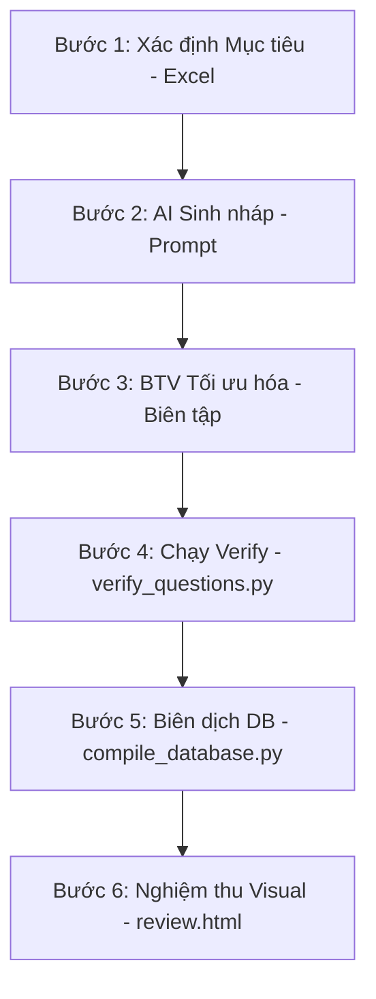

# 📁 07_Content Production SOP: Quy trình Biên soạn Nội dung (AI + Biên tập viên)

Tài liệu này đặc tả Quy trình Vận hành Tiêu chuẩn (Standard Operating Procedure - SOP) trong việc xây dựng và phát triển nội dung tại NovaStars, bao gồm Hệ điều hành Sản xuất AI (NovaStars AI Production System - AIPS), Hệ thống Kiến trúc Bài học (NLAS), và Mô hình Nội dung (NovaStars Content Model).

---

## 📌 Master Architecture Specifications

1. 🚀 **[NovaStars AI Production System (AIPS) Master Specification](file:///Users/thuy/Documents/apptieuhoc/07_Content%20Production%20SOP/NOVASTARS_AIPS_MASTER_SPECIFICATION.md)**
   * *Hệ điều hành vận hành toàn bộ quy trình sản xuất nội dung quy mô 10,000+ bài học, bao gồm 15 Agent AI, Orchestrator DAG, Stage Freeze, 9-Layer QA, Cryptographic Version Control, Publishing Adapters, và SOPs.*
2. 📐 **[NovaStars Lesson Architecture System (NLAS) Specification](file:///Users/thuy/Documents/apptieuhoc/07_Content%20Production%20SOP/NLAS_MASTER_SPECIFICATION.md)**
   * *Khung kiến trúc bài học chuẩn hóa 5 tầng LSCAF, 6 Lesson Blueprints, và quy tắc thiết kế trải nghiệm.*
3. 📦 **[NovaStars Content Model Specification](file:///Users/thuy/Documents/apptieuhoc/07_Content%20Production%20SOP/NOVASTARS_CONTENT_MODEL.md)**
   * *Mô hình cấu trúc dữ liệu Single Source of Truth cho toàn bộ Learning Objects (LOs), JSON Schemas, và CMS Data Contracts.*

---

## 1. Luồng Quy trình 6 Bước (The 6-Step Workflow)
Để sản xuất một chủ đề kỹ năng đạt chuẩn chất lượng cao đưa lên ứng dụng, đội ngũ nội dung phải trải qua 6 bước nghiêm ngặt sau:



### Bước 1: Thiết lập Mục tiêu & Chuẩn Năng lực (Curriculum Setup)
*   **Hành động**: Biên tập viên truy cập file `Hệ thống kiến thức kỹ năng tiểu học.xlsx` để tra cứu nhóm kỹ năng, tên kỹ năng và mục tiêu tương ứng của từng khối lớp (từ Lớp 1 đến Lớp 5).
*   **Đầu ra**: Tài liệu tóm tắt mục tiêu kỹ năng làm đầu vào cho AI (ví dụ: Kỹ năng an toàn điện có mục tiêu tránh cắm điện tay ướt, nhận biết ổ cắm hở).

### Bước 2: AI Generate Bản nháp (AI Drafting)
*   **Hành động**: Sử dụng AI Agent được thiết lập theo chuẩn **AI Bible** để tự động sinh ra 20 câu hỏi trắc nghiệm dưới dạng bản nháp Markdown.
*   **Yêu cầu**: Phân chia chính xác 5 tầng LSCAF (từ câu 1 đến 20) và tuân thủ định dạng Markdown chuẩn (có Options A-D, Đáp án đúng, Giải thích).

### Bước 3: Biên tập viên Tối ưu hóa Nội dung (Editor Optimization)
*   **Hành động**: Biên tập viên (Chuyên gia giáo dục/Tâm lý trẻ em) tiến hành đọc rà soát bản nháp của AI:
    *   *Giọng điệu*: Đảm bảo không quá khô khan, phù hợp tâm lý lứa tuổi tiểu học.
    *   *Độ dài*: Đảm bảo các lựa chọn A, B, C, D ngắn gọn, trực quan.
    *   *Tính thực tế*: Các tình huống và giải thích phải thực tế và mang tính hướng dẫn tích cực.
*   **Đầu ra**: File Markdown đã qua chỉnh sửa được lưu vào thư mục `question_bank/` (ví dụ: `group1_self_care_safety.md`).

### Bước 4: Kiểm thử Cú pháp Tự động (Automated Verification)
*   **Hành động**: Chạy script kiểm thử cú pháp để đảm bảo định dạng file Markdown không có lỗi trước khi nạp vào hệ thống.
*   **Câu lệnh**:
    ```bash
    python3 /Users/thuy/Documents/apptieuhoc/question_bank/verify_questions.py
    ```
*   **Quy tắc kiểm tra**:
    *   Mỗi câu hỏi phải bắt đầu bằng định dạng `### Câu [Số]:`.
    *   Phải có đủ 4 lựa chọn bắt đầu bằng `*   A.`, `*   B.`, `*   C.`, `*   D.`.
    *   Phải có dòng `*   **Đáp án đúng:** [A/B/C/D]`.
    *   Phải có dòng `*   **Giải thích:** [Nội dung giải thích]`.

### Bước 5: Biên dịch sang Cơ sở Dữ liệu (Database Compilation)
*   **Hành động**: Sau khi vượt qua bước kiểm thử cú pháp, chạy script biên dịch để tự động chuyển đổi từ file Markdown sang cơ sở dữ liệu JavaScript (`questions_data.js`).
*   **Câu lệnh**:
    ```bash
    python3 /Users/thuy/Documents/apptieuhoc/question_bank/compile_database.py
    ```
*   **Logic tự động**: Script sẽ tự động gán ID duy nhất cho từng câu hỏi, tự động map nhóm kỹ năng và phân loại tầng nhận thức (Tiers A đến E) cho từng câu.

### Bước 6: Nghiệm thu Giao diện Trực quan (Visual QA)
*   **Hành động**: Biên tập viên mở file `review.html` (hoặc `review_standalone.html`) trên trình duyệt để kiểm tra hiển thị trực quan của ngân hàng câu hỏi.
*   **Tiêu chí nghiệm thu**: 
    *   Giao diện hiển thị đúng font chữ, màu sắc theo quy chuẩn.
    *   Các câu hỏi được phân nhóm rõ ràng, dễ đọc, không bị lỗi hiển thị ký tự tiếng Việt.
    *   Học sinh thử click chọn đáp án hoạt động trơn tru.

---

## 2. Bảng Phân công Trách nhiệm (RACI Matrix)

| Giai đoạn | AI Agent | Biên tập viên (Editor) | Curriculum Expert | Kỹ sư Hệ thống |
| :--- | :---: | :---: | :---: | :---: |
| **1. Xác định Mục tiêu** | I | I | **A** / R | O |
| **2. Sinh nháp Nội dung** | **R** | I | I | O |
| **3. Tối ưu & Chỉnh sửa** | O | **R** / **A** | R | O |
| **4. Chạy Verify Script** | O | R | O | **A** |
| **5. Biên dịch Database** | O | O | O | **R** / **A** |
| **6. Nghiệm thu Visual** | O | **R** / **A** | R | R |

*   **R** (Responsible): Người thực hiện.
*   **A** (Accountable): Người chịu trách nhiệm cao nhất và phê duyệt.
*   **C** (Consulted): Người được tham vấn ý kiến.
*   **I** (Informed): Người được thông báo kết quả.
*   **O** (Omitted): Không tham gia trực tiếp.
