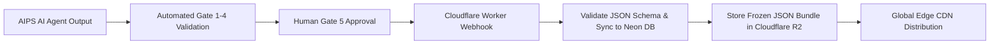

# NovaStars Headless CMS & Cloudflare R2 Pipeline Specifications

## Purpose
Defines the headless content data structures, ingestion pipelines, webhook triggers, and automated Cloudflare R2 storage distribution protocols for publishing frozen lesson packages.

## Content Ingestion & Freeze Pipeline

## Content API Contract (Cloudflare Workers API)
- `GET /api/v1/lessons/{lesson_id}`: Returns frozen JSON Lesson Package from Cloudflare R2 Cache.
- `GET /api/v1/competencies`: Returns current Competency Tree directly from Neon PostgreSQL.
- `POST /api/v1/content/webhook/freeze`: Ingests approved lesson package from AIPS, stores record in Neon DB, and uploads bundle to Cloudflare R2.

## Dependencies & Upstream Links (`depends_on`)
- [Technical Architecture](file:///Users/thuy/Documents/apptieuhoc/07_ENGINEERING/technical_architecture.md) (`ID: NS-ENG-ARCH-001`)
- [Content Model Architecture](file:///Users/thuy/Documents/apptieuhoc/05_CONTENT/content_model.md) (`ID: NS-CNT-MOD-001`)

## Downstream Impact & Consumers (`used_by`)
- [Content Factory SOP](file:///Users/thuy/Documents/apptieuhoc/08_OPERATIONS/content_factory_sop.md) (`ID: NS-OPS-SOP-001`)

## Governance & Metadata
- **Owner:** Lead Systems Engineer
- **Status:** FROZEN
- **Version:** 2.0.0
- **Last Updated:** 2026-08-20
