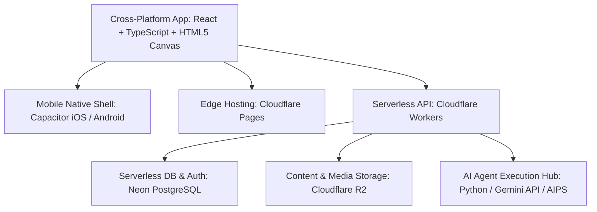

# NovaStars Technical Platform Architecture

## Purpose
Defines the technical infrastructure, software architecture, mobile client stack, database schemas, and AI agent execution environment for NovaStars.

## Tech Stack Overview

## System Components
1. **Client App**: Web-First Single Page Application (SPA) built on **React 19/18 + TypeScript + Vite + Tailwind CSS**, featuring an embedded **HTML5 Canvas 2D / Web Audio Engine** for 60 FPS interactive gameplay and learning objects.
2. **Mobile Shell (Capacitor)**: Cross-platform native container via **Capacitor v6** delivering iOS and Android distribution, offline local caching, and native device hardware access (Haptics, Screen Orientation, Preferences).
3. **Edge Hosting & API Gateway**: **Cloudflare Pages** for global static asset distribution and **Cloudflare Workers** for high-performance, low-latency serverless API routes.
4. **Database & Authentication**: **Neon Serverless PostgreSQL** (accessed via `@neondatabase/serverless` over WebSockets/HTTP) and **Neon Auth** for secure student and parent identity management.
5. **Object Storage & Content CDN**: **Cloudflare R2 Storage** hosting frozen lesson packages (JSON), audio cues, and visual assets without egress fees.
6. **AI Content Production Pipeline (AIPS)**: Multi-agent generation orchestrator generating, validating, and publishing frozen competency learning objects directly to Cloudflare R2 and Neon DB.

## Dependencies & Upstream Links (`depends_on`)
- [Product Foundation Blueprint](file:///Users/thuy/Documents/apptieuhoc/02_PRODUCT/product_foundation.md) (`ID: NS-PRD-FND-001`)
- [Content Model Architecture](file:///Users/thuy/Documents/apptieuhoc/05_CONTENT/content_model.md) (`ID: NS-CNT-MOD-001`)

## Downstream Impact & Consumers (`used_by`)
- [CMS Specifications](file:///Users/thuy/Documents/apptieuhoc/07_ENGINEERING/cms_specifications.md) (`ID: NS-ENG-CMS-001`)

## Governance & Metadata
- **Owner:** Chief Technology Officer
- **Status:** FROZEN
- **Version:** 2.0.0
- **Last Updated:** 2026-08-20
