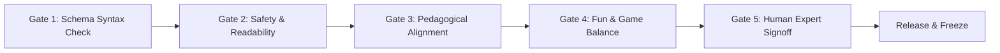

# NovaStars Content Production Factory SOP & Review Gates

## Purpose
Standard Operating Procedure (SOP) governing content creation, quality verification, review gates, and release protocols across the AI Content Production Factory.

## The 5 Quality Review Gates

Every lesson package generated by AIPS MUST pass through 5 sequential Quality Review Gates before being tagged as `FROZEN` and published:

### Gate 1: JSON Schema Syntax Check (Automated AI)
- Verifies exact match against [Content Model JSON Schema](file:///Users/thuy/Documents/apptieuhoc/05_CONTENT/content_model.md).
- Rejects missing fields, invalid IDs, or malformed JSON.

### Gate 2: Safety & Readability Audit (Automated AI)
- Evaluates grade-level readability (Flesch-Kincaid index for target grade 1-5).
- Scans for inappropriate content, gender stereotypes, or violent terminology.

### Gate 3: Pedagogical & Evidence Alignment (Automated AI)
- Verifies that assessment items measure the exact target competency node (`COMP-XXX`).
- Ensures hint scaffolding aligns with NLAS 4-stage flow.

### Gate 4: Fun & Game Balance Audit (Automated AI)
- Checks choice diversity, boss challenge difficulty scaling, and estimated lesson completion time (6–10 mins).

### Gate 5: Human Domain Expert Review & Approval (Human-in-the-Loop)
- Final sign-off by a Senior Curriculum Lead or Narrative Editor.
- One-click approval triggers automated CMS deployment.

## Dependencies & Upstream Links (`depends_on`)
- [AI Organization Blueprint (AIOB)](file:///Users/thuy/Documents/apptieuhoc/06_AI/aiob_blueprint.md) (`ID: NS-AI-AIOB-001`)
- [Content Model Architecture](file:///Users/thuy/Documents/apptieuhoc/05_CONTENT/content_model.md) (`ID: NS-CNT-MOD-001`)

## Governance & Metadata
- **Owner:** Head of Content Operations
- **Status:** FROZEN
- **Version:** 1.0.0
- **Last Updated:** 2026-08-04
