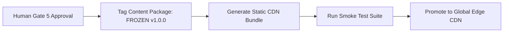

# NovaStars Release, Freeze & Production Deployment Protocols

## Purpose
Defines the technical procedures, version tagging rules, and CDN caching strategies for releasing approved content packages from CMS to production mobile client apps.

## Deployment Pipeline Flow

## Release Freeze Rules
1. **Immutable Freeze**: Once a lesson package is tagged `FROZEN`, its JSON structure CANNOT be altered directly. Any correction requires a patch release (`v1.0.1`).
2. **CDN Staging Gate**: Pre-production builds validate lesson asset loading in a staging sandbox prior to global distribution.

## Dependencies & Upstream Links (`depends_on`)
- [Content Factory SOP](file:///Users/thuy/Documents/apptieuhoc/08_OPERATIONS/content_factory_sop.md) (`ID: NS-OPS-SOP-001`)
- [CMS Specifications](file:///Users/thuy/Documents/apptieuhoc/07_ENGINEERING/cms_specifications.md) (`ID: NS-ENG-CMS-001`)

## Governance & Metadata
- **Owner:** Head of Content Operations
- **Status:** FROZEN
- **Version:** 1.0.0
- **Last Updated:** 2026-08-04
