# 🚀 NOVASTARS BUILD MODE — MVP EXECUTION PLAN

> **Role**: NovaStars Chief Product Officer, Chief Technology Officer, AI Orchestrator Architect, & Program Manager  
> **Status**: APPROVED ARCHITECTURE EXECUTION — BUILD MODE ONLY  
> **Foundation Baseline**: Product Foundation, Competency Framework, Experience Framework, NLAS, Game Design Bible, Content Model, AIPS, AIOB, ACS (All Frozen)

---

## 1. OVERALL MVP ROADMAP & PIPELINE ARCHITECTURE

The goal of the NovaStars Build Mode MVP is to construct and validate the **first production-ready AI Content Pipeline** capable of deterministically generating complete, high-quality, competency-aligned Learning Experiences from an approved Competency Package.

```mermaid
flowchart TD
    CP[Competency Package Ingestion] --> CO[Chief Orchestrator Engine]
    
    subgraph Stage1[Stage 1: Lesson Planning]
        CO --> PA[Planning Agent]
        PA --> PQA[Planning QA]
        PQA --> HR1{Human Review Gate 1}
        HR1 -- Approved --> F1[Freeze Plan v1.0]
        HR1 -- Rejected --> PA
    end

    subgraph Stage2[Stage 2: Narrative Story]
        F1 --> SA[Story Agent]
        SA --> SQA[Story QA]
        SQA --> HR2{Human Review Gate 2}
        HR2 -- Approved --> F2[Freeze Story v1.0]
        HR2 -- Rejected --> SA
    end

    subgraph Stage3[Stage 3: Interactive Mini-Game]
        F2 --> MGA[Mini Game Agent]
        MGA --> MGQA[Mini Game QA]
        MGQA --> HR3{Human Review Gate 3}
        HR3 -- Approved --> F3[Freeze Mini-Game v1.0]
        HR3 -- Rejected --> MGA
    end

    subgraph Stage4[Stage 4: Boss Battle]
        F3 --> BA[Boss Agent]
        BA --> BQA[Boss QA]
        BQA --> HR4{Human Review Gate 4}
        HR4 -- Approved --> F4[Freeze Boss v1.0]
        HR4 -- Rejected --> BA
    end

    subgraph Stage5[Stage 5: Reflection Engine]
        F4 --> RA[Reflection Agent]
        RA --> RQA[Reflection QA]
        RQA --> HR5{Human Review Gate 5}
        HR5 -- Approved --> F5[Freeze Reflection v1.0]
        HR5 -- Rejected --> RA
    end

    subgraph Stage6[Stage 6: Real-World Challenge]
        F5 --> CA[Challenge Agent]
        CA --> CQA[Challenge QA]
        CQA --> HR6{Human Review Gate 6}
        HR6 -- Approved --> F6[Freeze Challenge v1.0]
        HR6 -- Rejected --> CA
    end

    subgraph Stage7[Stage 7: Master Assembly & Packaging]
        F6 --> AA[Assembly Agent]
        AA --> FQA[Final Pipeline QA]
        FQA --> HR7{Human Sign-Off & Publish Gate}
        HR7 -- Approved --> PUB[Published Learning Experience Package v1.0]
        HR7 -- Rejected --> CO
    end
```



---

## 2. HIGH-LEVEL SPRINT ROADMAP OVERVIEW

| Sprint | Focus Area | Primary Deliverables | Key AI Agents Involved | Complexity |
| :--- | :--- | :--- | :--- | :---: |
| **Sprint 1** | Pipeline Core & Planning Engine | Orchestrator Workflow Engine, Ingestion Schema, Planning Agent & QA | Chief Orchestrator, Planning Agent, Planning QA | **High** |
| **Sprint 2** | Narrative Story Engine | Story Generation Engine, Narrative QA, Story Freeze Gate | Story Agent, Story QA | **Medium** |
| **Sprint 3** | Interactive Mini-Game Engine | Game Mechanic Engine, Mechanics QA, Mini-Game Freeze Gate | Mini Game Agent, Mini Game QA | **High** |
| **Sprint 4** | Boss & Reflection Engines | Boss Battle Generator, Metacognitive Reflection Engine, QA Gates | Boss Agent, Reflection Agent, QA Agents | **High** |
| **Sprint 5** | Challenge Engine & Master Assembly | Real-world Challenge Engine, Package Assembly Agent, Packaging QA | Challenge Agent, Assembly Agent, Final QA | **Medium** |
| **Sprint 6** | End-to-End Pilot Batch Production | Full Pipeline E2E Execution on 5 Competency Packages, Final Freeze | All Agents, Human Review Board | **High** |

---

## 3. SPRINT 1: IN-DEPTH EXECUTION PACKAGE

### 3.1 Sprint Objectives & Goals
* **Sprint Goal**: Build the core Orchestrator state machine, ingestion contracts, and the Planning Agent capable of outputting a validated Lesson Structural Blueprint.
* **Business Goal**: Establish a repeatable, automated baseline pipeline infrastructure that eliminates manual blueprint creation.
* **Educational Goal**: Ensure every generated lesson blueprint maps 100% to the target Competency Package and NLAS pedagogical specifications.
* **AI Goal**: Implement deterministic JSON schema enforcement for agent outputs with zero schema hallucination.

### 3.2 Key AI Agents Involved
1. **Chief Orchestrator (Workflow Engine)**: Manages state transitions, schema validation, dependency resolution, versioning, and human review signals. (Non-generative).
2. **Planning Agent**: Generates the structural lesson plan, learning objective breakdown, and emotional curve mapping based on the input Competency Package.
3. **Planning QA Agent**: Validates structural compliance, competency alignment, Bloom's taxonomy levels, and time constraints.

### 3.3 Inputs & Outputs
* **Inputs**:
  * `CompetencyPackage.json` (Target Skill, LSCAF mapping, sub-competencies, target age 6–11).
  * `NLAS_Blueprint_Rules.json` (Lesson Architecture constraints: 5-stage structure, time allocations, cognitive load targets).
* **Outputs**:
  * `LessonPlan_v1.0.json` (Structured blueprint containing lesson metadata, narrative hook direction, learning beats, skill assessment checkpoints).
  * `PlanningQA_Report.json` (QA score, compliance checklist, pass/fail status).

### 3.4 Workflow & Human Review Gates
```
[Competency Package] ➔ [Orchestrator Ingestion] ➔ [Planning Agent] ➔ [Planning QA Agent]
                                                                         │
                                                                   (Pass QA?)
                                                                  /          \
                                                             YES /            \ NO
                                                                v              v
                                                       [Human Review Gate 1] ➔ [Retry / Revise]
                                                                │
                                                            (Approved?)
                                                           /           \
                                                      YES /             \ NO
                                                         v               v
                                             [Freeze Plan v1.0.0] ➔ [Feedback Loop]
```

### 3.5 Freeze Rules & Versioning Strategy
* **Freeze Trigger**: Explicit Human Approval at Gate 1.
* **State Lock**: `LessonPlan_v1.0.0.json` becomes read-only and receives a cryptographic SHA-256 hash.
* **Downstream Contract**: Sprints 2–6 MUST consume `LessonPlan_v1.0.0.json` as an immutable input.
* **Change Protocol**: If human review mandates changes post-freeze, `v1.0.0` is archived and execution restarts as `v1.1.0`.

### 3.6 Acceptance Criteria & QA Checklist
- [ ] Orchestrator successfully ingests `CompetencyPackage.json` without runtime exceptions.
- [ ] Planning Agent produces valid `LessonPlan.json` strictly matching `LessonPlanSchema.json`.
- [ ] Planning QA Agent conducts automated checks for:
  - 100% coverage of target sub-skills.
  - Strict adherence to NLAS time allocations (15-20 min total).
  - Appropriate emotional curve trajectory (Curiosity -> Challenge -> Triumph -> Reflection).
- [ ] Human Review UI allows editors to inspect, comment, approve, or reject the plan.
- [ ] Freeze engine successfully locks approved JSON state with immutable versioning.

### 3.7 Known Risks & Mitigations
* **Risk**: Planning Agent produces overly generic or repetitive narrative hook ideas.
  * **Mitigation**: Inject explicit genre/theme seeds (e.g., Space Exploration, Ocean Rescue, Magic Academy) into the prompt context.
* **Risk**: Schema validation failure due to LLM response format deviations.
  * **Mitigation**: Implement automatic retries with structured output enforcement (Pydantic / JSON Schema repair middleware).

---

## 4. SPRINT 2–6 EXECUTABLE SUMMARIES

### 4.1 Sprint 2: Narrative Story Engine & Story QA Gate
* **Sprint Goal**: Build and integrate the Story Agent and Story QA Agent to transform the frozen `LessonPlan_v1.0.0.json` into an engaging, age-appropriate interactive narrative.
* **Primary AI Agents**: Story Agent, Story QA Agent.
* **Inputs**: `LessonPlan_v1.0.0.json`, `ExperienceFramework_NarrativeRules.json`.
* **Outputs**: `StoryPackage_v1.0.0.json` (Character dialogue, world setting, narrative choices, emotional beats).
* **Human Review Gate 2**: Educational and Story Editor inspects vocabulary level (age 6-11), tone, moral safety, and narrative engagement.
* **Freeze Rule**: `StoryPackage_v1.0.0.json` is frozen upon Human Approval.
* **Complexity**: Medium.

### 4.2 Sprint 3: Interactive Mini-Game Engine & Game QA Gate
* **Sprint Goal**: Build the Mini Game Agent and Mini Game QA Agent to generate core skill-practice mechanics aligned with the story context.
* **Primary AI Agents**: Mini Game Agent, Mini Game QA Agent.
* **Inputs**: Frozen `LessonPlan_v1.0.0.json`, Frozen `StoryPackage_v1.0.0.json`, `GameDesignBible_Mechanics.json`.
* **Outputs**: `MiniGamePackage_v1.0.0.json` (Game mechanic specs, interactive prompt sequences, feedback logic, failure safety rules).
* **Human Review Gate 3**: Game Design Lead & Pedagogy Specialist verify game mechanics, fun factor, and direct competency alignment.
* **Freeze Rule**: `MiniGamePackage_v1.0.0.json` locked upon approval.
* **Complexity**: High.

### 4.3 Sprint 4: Boss Battle & Reflection Engines & QA Gates
* **Sprint Goal**: Build the Boss Agent and Reflection Agent along with their respective QA agents to handle mastery synthesis and metacognitive evaluation.
* **Primary AI Agents**: Boss Agent, Boss QA, Reflection Agent, Reflection QA.
* **Inputs**: Frozen Lesson Plan, Story, and Mini-Game packages.
* **Outputs**: `BossBattlePackage_v1.0.0.json` (Multi-stage mastery challenge, boss dialogue, adaptive difficulty hooks), `ReflectionPackage_v1.0.0.json` (Self-assessment prompts, AI companion dialogue, emotional grounding).
* **Human Review Gates 4 & 5**: Assessment Specialist approves mastery challenge rigor and metacognitive prompt safety.
* **Freeze Rule**: Independent freeze of Boss and Reflection packages upon human approval.
* **Complexity**: High.

### 4.4 Sprint 5: Real-World Challenge Engine & Master Assembly Agent
* **Sprint Goal**: Implement the Challenge Agent for real-world application tasks and the Master Assembly Agent to package all frozen components into a single deployable unit.
* **Primary AI Agents**: Challenge Agent, Challenge QA, Assembly Agent, Final Pipeline QA.
* **Inputs**: All previously frozen stage packages (`v1.0.0`).
* **Outputs**: `RealWorldChallengePackage_v1.0.0.json`, `MasterLearningExperience_v1.0.0.json` (Unified single-file bundle).
* **Human Review Gates 6 & 7**: Final sign-off by CPO / Pedagogy Director on full package integrity.
* **Freeze Rule**: Complete Learning Experience frozen for production release.
* **Complexity**: Medium.

### 4.5 Sprint 6: End-to-End Pipeline Validation & Pilot Batch Production
* **Sprint Goal**: Execute the full end-to-end pipeline across 5 distinct Competency Packages (e.g., Financial Literacy, Time Management, Emotional Regulation, Critical Thinking, Team Communication).
* **Primary AI Agents**: All 14 pipeline agents in full sequence orchestrated by Chief Orchestrator.
* **Inputs**: 5 Raw Competency Packages.
* **Outputs**: 5 Complete, Published, Production-Ready Learning Experiences.
* **Human Review**: Full Review Board evaluating pipeline speed, error rates, and content quality consistency.
* **Freeze Rule**: Final pipeline freeze and operational handbook baseline release.
* **Complexity**: High.

---

## 5. AI AGENT IMPLEMENTATION ORDER

To maintain architectural stability, agents MUST be constructed in exact dependency order:

```
1. Chief Orchestrator (Pipeline State Machine Engine)
   └── 2. Planning Agent & Planning QA Agent
       └── 3. Story Agent & Story QA Agent
           └── 4. Mini Game Agent & Mini Game QA Agent
               └── 5. Boss Agent & Boss QA Agent
                   └── 6. Reflection Agent & Reflection QA Agent
                       └── 7. Challenge Agent & Challenge QA Agent
                           └── 8. Assembly Agent & Final QA Agent
```

---

## 6. HUMAN RESPONSIBILITIES & RACI MATRIX

Human intervention is mandatory at every stage gate. The Orchestrator CANNOT proceed without explicit human sign-off.

| Stage Gate | Human Role | Responsibilities | SLA |
| :--- | :--- | :--- | :---: |
| **Gate 1: Lesson Plan** | Lead Pedagogical Editor | Inspect competency mapping, time balance, cognitive flow. | 4 hrs |
| **Gate 2: Story** | Narrative / Content Editor | Check dialogue tone, age-appropriateness, engagement, moral safety. | 4 hrs |
| **Gate 3: Mini-Game** | Game Design Specialist | Validate interactive mechanics, feedback clarity, fun factor. | 4 hrs |
| **Gate 4: Boss Battle** | Assessment Specialist | Ensure boss battle tests true skill mastery without frustration. | 4 hrs |
| **Gate 5: Reflection** | Child Psychologist / Educator | Validate metacognitive prompt safety and self-reflection guidance. | 4 hrs |
| **Gate 6: Challenge** | Parent & Life Skills Specialist | Verify real-world mission practicality and safety for family execution. | 4 hrs |
| **Gate 7: Publishing** | Chief Product Officer / CLO | Final sanity check and publish authorization. | 2 hrs |

---

## 7. RISKS & MITIGATION MATRIX

| Risk | Severity | Root Cause | Mitigation Strategy |
| :--- | :---: | :--- | :--- |
| **Prompt Drift** | High | LLM provider model updates changing response structure or tone. | Pin exact LLM model versions; run daily regression tests on prompt templates. |
| **State Synchronization Failure** | High | Downstream agent reading out-of-date upstream JSON specs. | Orchestrator enforces strict SHA-256 hash checking on all frozen input files. |
| **Human Review Bottleneck** | Medium | Editors overwhelmed by pipeline output velocity. | Provide clean review UI with diff highlighting and single-click approval/feedback. |
| **Educational Misalignment** | High | Story or game elements overshadowing learning goals. | QA agents execute strict semantic similarity scoring between content and competency targets. |

---

## 8. KEY SUCCESS METRICS (KPIs)

1. **Pipeline First-Pass QA Yield**: ≥ 85% of agent outputs pass automated QA checks on the first run.
2. **Human Revision Turnaround**: Average human review & approval completed in < 4 hours per gate.
3. **Schema Compliance**: 100% zero JSON schema validation errors across all agent outputs.
4. **End-to-End Production Time**: Single complete Learning Experience produced (AI + Human Review) in < 24 hours (vs. weeks of traditional manual creation).
5. **Educational Fidelity Score**: 100% audit pass rate for competency coverage verified by human pedagogical experts.

---

## 9. RECOMMENDED PROJECT MANAGEMENT WORKFLOW

* **Daily Cadence**: 15-minute Standup focusing strictly on pipeline blocking issues and pending Human Review Gates.
* **Git Repository Structure**:
  ```text
  /content-pipeline
  ├── /schemas           # JSON Schemas for each stage input/output
  ├── /prompts           # Version-controlled system prompts & ACS contracts
  ├── /orchestrator      # Workflow engine source code
  ├── /packages          # Competency packages & frozen learning objects
  └── /tests             # Automated QA suite and regression tests
  ```
* **Git Branching & Freeze Strategy**:
  * Main branch represents frozen, published content packages (`v1.0.0`).
  * Feature branches map to active Sprint developments.
  * Human approval triggers automated Git tagging and immutable release builds.

---

## 10. IMMEDIATE NEXT ACTIONS AFTER SPRINT 1 APPROVAL

1. **Initialize Workspace Infrastructure**: Create `/content-pipeline` structure with Pydantic JSON schemas for `CompetencyPackage` and `LessonPlan`.
2. **Implement Chief Orchestrator Core**: Write state machine engine in Node.js/Python with file-system state locking capabilities.
3. **Develop Planning Agent & QA Agent Prompts**: Draft and test ACS contracts for Planning Agent against `Hệ thống kiến thức kỹ năng tiểu học.xlsx`.
4. **Run First Mock Execution**: Test ingest of 1 sample competency package (e.g., Financial Literacy - Basic Savings) through Orchestrator -> Planning Agent -> Planning QA.
