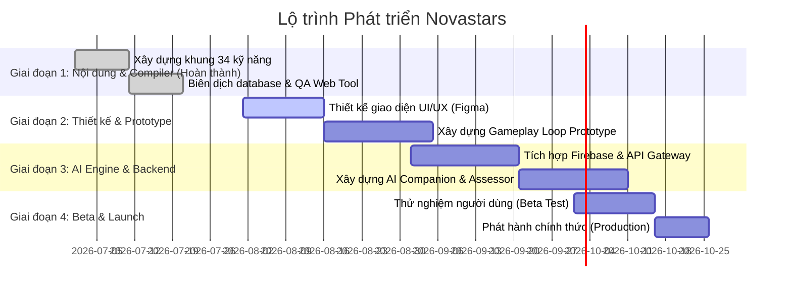

# 📁 09_Roadmap: Lộ trình Phát triển, Cột mốc & Backlog

Tài liệu này xác định các giai đoạn phát triển (Phases) của dự án EdTech Novastars, các cột mốc quan trọng (Milestones) và danh sách các hạng mục công việc tồn đọng (Backlog) để điều phối nguồn lực tối ưu.

---

## 1. Các Giai đoạn Phát triển (Development Phases)

Dự án được chia làm 4 giai đoạn cuốn chiếu chính nhằm đảm bảo khả năng kiểm soát chất lượng ở từng mốc:

### 🎯 Giai đoạn 1: Thiết lập Khung Chương trình & Biên soạn Nội dung (Hiện tại - Đã Hoàn Thành)
*   **Mục tiêu**: Định hình toàn bộ khung 34 kỹ năng và hoàn thành ngân hàng 680 câu hỏi trắc nghiệm thực tế bám sát chuẩn LSCAF.
*   **Kết quả**: 
    *   6 file Markdown nhóm câu hỏi hoàn thiện trong thư mục `question_bank/`.
    *   Hệ thống kiểm thử cú pháp `verify_questions.py` và biên dịch `compile_database.py`.
    *   Trang Dashboard rà soát trực quan `review.html` hoạt động trơn tru.

### 🎨 Giai đoạn 2: Thiết kế UI/UX & Phát triển Game Client Prototype (Tiếp theo)
*   **Mục tiêu**: Hiện thực hóa thế giới phiêu lưu dưới dạng giao diện đồ họa sống động, bắt mắt và tối ưu cho trẻ nhỏ.
*   **Nhiệm vụ trọng tâm**:
    *   Thiết kế Figma cho 6 hòn đảo kỹ năng lớn và giao diện đấu Boss.
    *   Xây dựng Game Client Prototype bằng công nghệ Flutter hoặc React Native.
    *   Nạp ngân hàng câu hỏi tĩnh từ file `questions_data.js` chạy offline trên client.

### 🤖 Giai đoạn 3: Tích hợp AI Companion Engine & Hệ thống Backend (Q3/2026)
*   **Mục tiêu**: Kết nối AI Companion thời gian thực và xây dựng hệ thống đồng bộ đám mây Firebase.
*   **Nhiệm vụ trọng tâm**:
    *   Xây dựng Cloud Functions xử lý API nộp bài, lưu trữ tiến trình học tập động trên Cloud Firestore.
    *   Tích hợp Gemini API thông qua Firebase AI Logic để xử lý phần Phản tư (Reflection - Tier E) và đề xuất Nhiệm vụ Đời thực.
    *   Xây dựng Cổng thông tin Phụ huynh (Parent Portal) để theo dõi và xác thực nhiệm vụ của con.

### 🚀 Giai đoạn 4: Kiểm thử Beta, Tối ưu & Phát hành (Q4/2026)
*   **Mục tiêu**: Nghiệm thu thực tế và đưa ứng dụng lên các cửa hàng App Store & Google Play.
*   **Nhiệm vụ trọng tâm**:
    *   Chạy thử nghiệm Beta diện hẹp (Beta Test) với sự tham gia của 100 học sinh tiểu học và phụ huynh để đánh giá mức độ hấp dẫn của game và tính hiệu quả của AI.
    *   Đánh giá và tối ưu hóa hiệu năng ứng dụng, bảo mật cơ sở dữ liệu (Firestore Security Rules Audit).
    *   Phát hành chính thức (Go-live).

---

## 2. Các Cột mốc Quan trọng (Key Milestones)
*   **MS-1 (Đạt được)**: Hoàn thành biên dịch thành công Ngân hàng 680 câu hỏi trắc nghiệm sạch lỗi cú pháp sang `questions_data.js`.
*   **MS-2**: Đóng băng thiết kế giao diện (UI/UX Design Freeze) cho cả ứng dụng Học sinh và Phụ huynh.
*   **MS-3**: Hoàn thành bản dựng game client đầu tiên chạy trơn tru vòng lặp Gameplay (Story $\rightarrow$ Mini Game $\rightarrow$ Boss Battle) sử dụng dữ liệu cục bộ.
*   **MS-4**: Tích hợp thành công API AI Companion chấm điểm Phản tư và trả ra nhiệm vụ đời thực.
*   **MS-5**: Go-live và đạt mốc 10.000 người dùng hoạt động đầu tiên.

---

## 3. Danh sách Hạng mục Công việc Tồn đọng (Product Backlog)

| ID | Hạng mục Công việc | Nhóm phụ trách | Giai đoạn | Trạng thái |
| :--- | :--- | :---: | :---: | :---: |
| **BL-001** | Thiết kế linh vật AI Companion (Gấu Nova) với các hoạt ảnh cảm xúc. | Game / Art | Phase 2 | **To Do** |
| **BL-002** | Phát triển khung sườn mã nguồn của ứng dụng Client (Flutter). | Tech | Phase 2 | **To Do** |
| **BL-003** | Thiết kế bộ Mini-game tương tác tĩnh trên ứng dụng di động. | Game Design | Phase 2 | **To Do** |
| **BL-004** | Viết Prompt chuẩn cho AI Assessor chấm điểm câu trả lời tự do. | AI Team | Phase 3 | **To Do** |
| **BL-005** | Thiết lập cấu trúc bảo mật Cloud Firestore Security Rules. | Tech | Phase 3 | **To Do** |
| **BL-006** | Xây dựng hệ thống thông báo đẩy (Push Notifications) cho phụ huynh. | Tech | Phase 3 | **To Do** |
| **BL-007** | Biên dịch tài liệu hướng dẫn và tổ chức chương trình thử nghiệm Beta. | CLO / Ops | Phase 4 | **To Do** |
