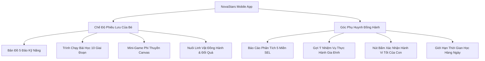

# 01. TẦM NHÌN SẢN PHẨM & CHÂN DUNG NGƯỜI DÙNG (Product Vision & Personas)

> **Mã Tài Liệu**: `NS-DOC-01-PRD`  
> **Tổng Hợp Từ**: `00_HOME/`, `01_VISION/`, `02_PRODUCT/` và Hiến chương dự án.  
> **Trạng Thái**: Chuẩn Hóa & Hợp Nhất (Unified Canonical Spec)

---

## 1. TRIẾT LÝ SẢN PHẨM & KIM CHỈ NAM (Product Philosophy & North Star)

NovaStars là **Nền tảng Phiêu lưu Năng lực (Competency Adventure Platform)** dành cho học sinh tiểu học (6–11 tuổi), kết hợp giữa giáo dục kỹ năng sống, trò chơi nhập vai tương tác và trợ lý AI đồng hành.

### 5 Nguyên Tắc Cốt Lõi (Canonical Principles)
1. **Năng Lực Thực Tế Thay Vì Học Vẹt (Life Skills Over Rote Memorization)**: Xây dựng năng lực xử lý tình huống thực tế (tài chính, cảm xúc, an toàn, kỹ năng số) thay vì chỉ nhớ định nghĩa lý thuyết.
2. **Học Tập Vui Vẻ & Làm Chủ Tự Thân (Joyful Mastery)**: Gamification không phải là điểm thưởng giả tạo bên ngoài, mà là động lực nội tại gắn liền với sự tò mò và trải nghiệm chinh phục thử thách.
3. **Cá Nhân Hóa Bằng AI (AI-Powered Personalization)**: Trợ lý AI đồng hành thích ứng với tốc độ và tâm lý riêng của từng em.
4. **Môi Trường An Toàn Để Thử Sai (Safe Failure & Growth Mindset)**: Sai sót là cơ hội học hỏi; tuyệt đối không phạt nặng hay chê bai trẻ.
5. **Cầu Nối Gia Đình (Parent-Child Bridge)**: Chuyển hóa bài học từ màn hình di động thành thói quen tốt ngoài đời thực dưới sự khích lệ của cha mẹ.

$$\text{Công Thức Năng Lực} = \text{Cốt Truyện (Đồng Cảm)} + \text{Trò Chơi (Luyện Tập)} + \text{AI (Gợi Ý)} + \text{Phản Tư (Đúc Kết)} + \text{Nhiệm Vụ Đời Thực (Thói Quen)} + \text{Bố Mẹ Xác Nhận (Minh Chứng)}$$

---

## 2. MỤC TIÊU CHIẾN LƯỢC & OKRs (2026–2027)

- **Mục Tiêu 1: Khung Chương Trình Chuẩn Quốc Tế**:
  - Biên soạn và chuẩn hóa 125 kỹ năng nguyên tử qua 5 khối lớp (Lớp 1 đến Lớp 5).
  - Đạt tỷ lệ thành thục kỹ năng được phụ huynh xác nhận $>85\%$.
- **Mục Tiêu 2: Tự Động Hóa Sản Xuất Bằng AI (AIPS)**:
  - Giảm chi phí tạo 1 gói bài học hoàn chỉnh xuống $<\$0.50$ với chất lượng kiểm duyệt $100\%$.
- **Mục Tiêu 3: Độ Gắn Kết Người Dùng Cao (High Retention)**:
  - Tỷ lệ giữ chân người học D30 $>45\%$ nhờ cơ chế nuôi thú đồng hành và chuỗi học tập hàng ngày.
  - Tỷ lệ hoàn thành mỗi phiên học 6-10 phút đạt $>90\%$.

---

## 3. CHÂN DUNG NGƯỜI DÙNG (User Personas)

### 👧 1. Học Sinh Tiểu Học ("Bé Su / Bé Leo" - 6 đến 11 tuổi)
- **Mục tiêu**: Chơi game vui nhộn, phiêu lưu cùng linh vật Sao Nova, mở khóa huy chương và trang phục phi thuyền.
- **Nhu cầu trải nghiệm**: 
  - Giao diện nút bấm to, nảy 3D, hỗ trợ cảm ứng ngón cái.
  - Câu thoại ngắn gọn ($\le 25$ từ/lượt), hình ảnh minh họa sinh động.
  - Được khích lệ ngay lập tức khi chọn đúng, có hướng dẫn nhẹ nhàng khi chọn chưa đúng.
- **Thời lượng phiên học**: Tối ưu trong khoảng **6 – 10 phút/bài** để không gây mỏi mắt.

### 👨‍👩‍👧 2. Phụ Huynh / Người Giám Hộ ("Bố Minh / Mẹ Lan" - 30 đến 45 tuổi)
- **Mục tiêu**: Rèn luyện cho con tính tự lập, an toàn, biết quản lý tiền bạc và kiềm chế cảm xúc mà không cần phải nhắc nhở gắt gao.
- **Nhu cầu trải nghiệm**:
  - Bảng báo cáo năng lực 5 miền trực quan (Parent Dashboard).
  - Lời gợi ý trò chuyện gia đình hàng ngày (Family Bridge Prompts).
  - Công cụ quản lý thời gian sử dụng màn hình (Screen Time Limit: 15-30 phút/ngày).
  - Bảo mật tuyệt đối dữ liệu trẻ nhỏ (tuân thủ COPPA/GDPR Kids).

---

## 4. HỆ THỐNG TÍNH NĂNG CỐT LÕI (Feature Catalog)

