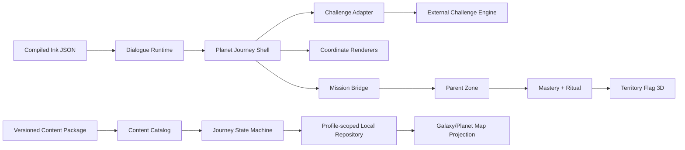
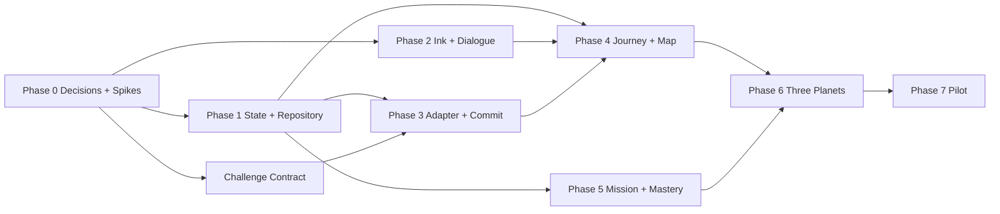

# IMPLEMENTATION PLAN — GALAXY, PLANET & MASTERY JOURNEY

> **Phiên bản kế hoạch:** v0.1.0 — Proposed  
> **Ngày lập:** 22/08/2026  
> **PRD nguồn:** `docs/PRD_GALAXY_PLANET_MASTERY_SYSTEM.md` v0.10.0  
> **Phạm vi:** Vertical slice 3 Planet thuộc 3 Galaxy, từ Opening Story đến Parent Verification và Flag Ritual  
> **Không thuộc phạm vi:** Xây lại challenge game engine, Advanced Challenge/Posttest, toàn bộ catalog Planet, multiplayer và generative AI runtime

---

## 0. TÓM TẮT THỰC THI

Không nên sửa trực tiếp `TenStageLessonRunner` để nhồi thêm sáu giai đoạn mới. Hướng triển khai đề xuất là dựng một phân hệ `masteryJourney` song song với lesson cũ, đưa ba Planet pilot qua phân hệ mới, giữ toàn bộ nội dung cũ hoạt động sau feature flag. Khi vertical slice đạt tiêu chí pilot, các Planet còn lại mới được migration dần.

Kế hoạch chia thành 8 phase:

1. Chốt quyết định kỹ thuật và dựng contract/test foundation.
2. Xây content schema, local progress repository và state machine.
3. Tích hợp InkJS và `DialoguePlayer`.
4. Tích hợp challenge engine qua adapter cho Challenge Test và Final Boss.
5. Xây journey shell, Training Coordinates và map state mới.
6. Nối Real-world Mission, Parent Verification, mastery và Flag Ritual.
7. Sản xuất ba Planet pilot và migration question bank.
8. Hardening, playtest, rollout và đo pilot.

Ước lượng engineering tuần tự: **65–97 dev-days**. Với hai frontend engineers làm song song, một content engineer/curriculum designer và challenge engine đã có API ổn định, lịch mục tiêu hợp lý là **8–12 tuần**. Ước lượng này không gồm sản xuất art/video/audio lớn hoặc thời gian chuyên gia duyệt nội dung an toàn.

### Bộ ba pilot đề xuất để lập kế hoạch

| Pilot | Galaxy | Skill/Planet | Bloom đích đề xuất | Lý do chọn |
| :--- | :--- | :--- | :--- | :--- |
| `PILOT-SAF-FIRE` | `GAL-SAF` | Thoát hiểm khi có hỏa hoạn | `ANALYZE` | Có 20 câu LSCAF sẵn; kiểm thử sequence, safety review và transfer |
| `PILOT-SELF-EMOTION` | `GAL-SELF` | Quản lý cảm xúc và làm chủ cơn giận | `EVALUATE` | Kiểm thử branching story, phản tư và lựa chọn hành vi không nhị phân |
| `PILOT-COM-TEAM` | `GAL-COM` | Làm việc nhóm | `CREATE` | Kiểm thử phân vai, xây kế hoạch, đánh giá phương án và nhiệm vụ nhóm đời thực |

Đây là bộ ba mặc định để estimate và thiết kế contract, chưa phải quyết định nội dung cuối. Product/curriculum có thể thay Planet thứ ba nhưng nên giữ ba mức Bloom và ba loại tương tác khác nhau.

---

## 1. MỤC TIÊU VÀ ĐIỀU KIỆN THÀNH CÔNG

### 1.1. Mục tiêu MVP

- Ba Planet thuộc ba Galaxy chạy end-to-end trên web và ít nhất một native target.
- Một child profile có progress độc lập, offline-first và resume đúng node sau khi đóng app.
- Challenge Test chỉ khóa lượt khi kết quả submit đã commit thành công.
- Challenge Test pass đi thẳng tới Real-world Mission; chưa đạt đi qua 3–5 Training Coordinates rồi Final Boss.
- Challenge Test và Final Boss dùng cùng question pool/blueprint; thứ tự câu và đáp án có thể khác nhưng scoring ổn định.
- Mỗi Training route có `REMEMBER` và `UNDERSTAND`, sau đó tăng tới `targetBloomLevel` của skill.
- Dialogue có nhánh, hội tụ, save/resume và command allowlist.
- Planet chỉ chuyển `MASTERED` sau Parent Verification; Flag Ritual chỉ mở sau mastery.
- Không phá dữ liệu lesson cũ, Parent Zone, wallet hoặc personalization.

### 1.2. Chỉ số pilot cần đo

- Opening Story completion và dialogue resume success.
- Challenge Test start → submit, pass rate, abandon/resume rate và score distribution.
- Tỷ lệ trẻ đi đường tắt so với training route.
- Completion và thời gian theo Coordinate/Bloom level.
- Final Boss first-attempt pass, eventual pass và remediation success.
- Mission opened → child done → parent reviewed trong 1/3/7 ngày.
- Tỷ lệ `needs_practice`, `deferred`, `approved` và Flag Ritual completion.
- Số lỗi mất progress, duplicate mission/reward hoặc consume nhầm Challenge attempt phải bằng 0.

### 1.3. Non-goals kỹ thuật

- Không thay lõi challenge engine được chuyển từ dự án khác.
- Không đưa child progress, raw answer, dialogue state, ảnh/video mission lên server trong MVP.
- Không migration toàn bộ `PLANETS_DATA` hoặc toàn bộ 1.070 câu nguồn trong phase pilot.
- Không dùng timer làm mastery gate cho skill an toàn.
- Không xây runtime AI tự sinh câu hỏi, dialogue hoặc hướng dẫn an toàn.

---

## 2. BASELINE CODEBASE VÀ KHOẢNG TRỐNG

### 2.1. Thành phần có thể tái sử dụng

| Thành phần hiện có | File chính | Cách tái sử dụng |
| :--- | :--- | :--- |
| App shell và navigation | `client/src/App.tsx` | Mount journey mới sau feature flag; giữ lesson cũ |
| Bản đồ/hành tinh 3D | `WorldMap.tsx`, `Planet3DView.tsx`, `PlanetMesh.tsx` | Tái sử dụng renderer và camera; thay data adapter/state badge |
| Marker và modal tọa độ | `LessonCoordinatesMarker.tsx`, `CoordinatePreviewModal.tsx` | Bổ sung loại node và trạng thái journey |
| Quiz/minigame renderer | `InteractiveQuizPlayer.tsx`, `CanvasMiniGame.tsx` | Bọc bằng Coordinate activity contract; không để tự commit journey |
| Local transaction utility | `localGameStateRepository.ts` | Tái sử dụng pattern write-verified, journal và migration |
| Parent missions | `useParentZoneStore.ts`, `ParentDashboard.tsx` | Mở rộng mission state/rubric và giữ reward idempotency |
| Parent reward API | `parentApi.ts`, server wallet/reward transfer | Tái sử dụng, không thêm backend progress |
| Flag review và 3D flag | `usePersonalizationStore.ts`, `TerritoryFlag3D.tsx` | Dùng approved asset/preset cho ritual |
| Audio/haptic | `audio.ts`, `interaction.ts` | Trigger qua allowlisted UI command, tôn trọng audio safety |
| Question bank | `question_bank/questions_data.js`, 6 thematic Markdown banks | Làm seed cho pool sau retag/dedupe/QA |

### 2.2. Khoảng trống bắt buộc xử lý

| Baseline hiện tại | Vấn đề với PRD mới | Hướng thay đổi |
| :--- | :--- | :--- |
| `DomainId` có 5 domain | PRD có 6 Galaxy canonical | Thêm taxonomy riêng; không đổi nghĩa `DomainId` âm thầm |
| `PlanetData.nodes` + star unlock | Không biểu diễn Opening/Challenge/Training/Boss/Mission/mastery | Thêm `PlanetTrackDefinition` và progress state machine |
| `completedNodes/nodeStars` | Không lưu attempt, dialogue, Bloom, mission hoặc version | Dùng repository progress riêng; legacy chỉ làm compatibility view |
| `TenStageLessonRunner` monolithic | Tuyến tính, dialogue mảng tĩnh, Boss/mission hard-code | Không mở rộng; thay bằng `PlanetJourneyShell` cho pilot |
| `PLANETS_DATA` là 5 fantasy planet | Một Planet chưa tương ứng một skill | Tạo canonical content catalog; art skin là field riêng |
| Mission status chỉ có `suggested/done_by_child/approved` | Thiếu `needs_practice/deferred` và rubric | Version schema Parent Zone, migration tương thích |
| Flag hiển thị theo completed node | PRD yêu cầu chỉ sau `MASTERED` | Territory placement lấy từ mastery record |
| Dialogue tuyến tính | Không có branch, save/resume, static validation | InkJS runtime + compiled JSON + wrapper |
| Quiz tự xử lý UI/result | Không có adapter contract và one-attempt commit | Challenge adapter + progress command idempotent |

### 2.3. Nguyên tắc migration

- Không reinterpret `completedNodes` thành mastery; dữ liệu cũ tiếp tục là legacy achievement.
- Ba Planet pilot dùng ID mới và không trùng với `bravery_prime`, `aqua_nova` hoặc node cũ.
- Art có thể tái sử dụng bằng `artThemeId`, nhưng content ID không phụ thuộc asset ID.
- Feature flag off phải đưa user về journey cũ mà không xóa progress pilot.
- Profile switch/delete phải xử lý cả legacy game state và mastery repository mới.

---

## 3. QUYẾT ĐỊNH KIẾN TRÚC

### ADR-GPM-001 — Dựng journey engine song song, không sửa monolith

`TenStageLessonRunner` được giữ cho content cũ. Ba Planet pilot chạy qua `PlanetJourneyShell`. Sau pilot, từng lesson cũ mới được migration bằng content package, tránh một lần thay toàn bộ game loop.

### ADR-GPM-002 — Content definition và child progress tách biệt

- Definition là versioned JSON/Ink đã compile, read-only, không chứa PII.
- Progress là dữ liệu local theo `profileId + planetTrackId + contentVersion`.
- Không lưu definition lặp lại trong Zustand/localStorage.

### ADR-GPM-003 — Progress dùng pure state machine

Mọi chuyển trạng thái đi qua `transitionJourney(current, event)`. UI, dialogue và challenge engine không được tự set `MASTERED` hoặc tự mở node.

### ADR-GPM-004 — Challenge engine chỉ giao tiếp qua adapter

NovaStars sở hữu blueprint, attempt policy, state transition và progress persistence. Engine bên ngoài sở hữu assembly, randomization, interaction rendering và scoring. Mock adapter được dùng trước khi code engine được chuyển sang.

### ADR-GPM-005 — Ink được compile ở build/content pipeline

Client chỉ tải JSON đã compile và chạy `Story` từ `inkjs`; không compile `.ink` trong runtime production. `DialoguePlayer` wrap runtime thay vì kế thừa, lưu bằng `story.state.ToJson()` và resume bằng `LoadJson()`.

InkJS hỗ trợ npm/runtime, compiled JSON, state save/load và compiler CLI; tài liệu Ink chính thức cũng khuyến nghị precompile và wrap runtime. Tham khảo [inkjs README](https://github.com/y-lohse/inkjs) và [Ink runtime documentation](https://github.com/inkle/ink/blob/master/Documentation/RunningYourInk.md).

### ADR-GPM-006 — Commands từ dialogue là allowlisted và idempotent

Ưu tiên Ink tags cho speaker, portrait, emotion, background, SFX và navigation intent. Không cho Ink thực thi JavaScript tùy ý. Command thay đổi state phải có `commandId` và được progress service dedupe.

### ADR-GPM-007 — Pilot offline-first, backend chỉ giữ boundary hiện có

Journey progress, raw answer, Ink state và mission rubric ở local device. Server chỉ tham gia auth/child slot/wallet/reward transfer theo Parent Zone hiện tại. Không thêm endpoint sync progress trong MVP.

### ADR-GPM-008 — Repository riêng thay vì tăng schema monolithic ngay

Dùng key profile-scoped dạng `novastars_mastery_progress_v1:<profileId>`. Repository có transaction journal và migration riêng. Sau pilot mới quyết định hợp nhất với game state v4 hay giữ bounded store.

---

## 4. KIẾN TRÚC MỤC TIÊU



### 4.1. Quyền sở hữu state

| State | Owner | Không được owner bởi |
| :--- | :--- | :--- |
| Galaxy/Planet/Track/Coordinate definition | Content catalog | Zustand mutable state |
| Current journey state, attempts, completion | Journey repository | UI component |
| Ink runtime state | Dialogue session trong journey record | Global dialogue array |
| Challenge assembly/run | Challenge adapter/engine | Planet map |
| Mission review/reward | Parent Zone | Challenge engine |
| Flag asset approval | Personalization | Journey engine |
| Planet flag placement/mastery | Journey progress | Flag asset review state |

### 4.2. Cấu trúc file mục tiêu

```text
client/src/features/masteryJourney/
  types/
    content.ts
    progress.ts
    challenge.ts
    dialogue.ts
  content/
    catalog.ts
    schemas.ts
    generated/
      catalog.v1.json
      pilot-saf-fire/
      pilot-self-emotion/
      pilot-com-team/
  engine/
    journeyStateMachine.ts
    journeySelectors.ts
    journeyCommands.ts
    migration.ts
  repositories/
    masteryProgressRepository.ts
    memoryMasteryProgressRepository.ts
  dialogue/
    inkRuntime.ts
    dialogueCommandRegistry.ts
    DialoguePlayer.tsx
  challenge/
    challengeEnginePort.ts
    challengeEngineAdapter.ts
    mockChallengeEngineAdapter.ts
    challengeResultCommit.ts
  coordinates/
    CoordinateActivityHost.tsx
    rendererRegistry.ts
  missions/
    masteryMissionBridge.ts
  ritual/
    MasteryRitual.tsx
  views/
    GalaxyMapView.tsx
    PlanetJourneyView.tsx
    PlanetJourneyShell.tsx
  analytics/
    masteryEvents.ts

client/scripts/mastery-content/
  compile-ink.mjs
  validate-content.mjs
  build-catalog.mjs
  check-question-pools.mjs

client/tests/masteryJourney/
client/e2e/masteryJourney/
content/masteryJourney/
  catalog/
  planets/
  dialogue/
  questions/
  missions/
```

Tên folder có thể điều chỉnh theo convention repo, nhưng boundary `content / engine / adapters / UI / repository` cần giữ nguyên.

---

## 5. DATA CONTRACT TỐI THIỂU

### 5.1. Content definition

```ts
type BloomLevel =
  | 'remember' | 'understand' | 'apply'
  | 'analyze' | 'evaluate' | 'create';

interface PlanetTrackDefinition {
  id: string;
  planetId: string;
  learningBand: 1 | 2 | 3 | 4 | 5;
  contentVersion: string;
  objectiveIds: string[];
  targetBloomLevel: BloomLevel;
  openingStoryRef: string;
  challengeBlueprintId: string;
  requiredCoordinateIds: string[];
  optionalCoordinateIds: string[];
  bossBlueprintId: string;
  reflectionStoryRef: string;
  realMissionId: string;
}

interface CoordinateDefinition {
  id: string;
  planetTrackId: string;
  type: string;
  objectiveIds: string[];
  bloomLevels: BloomLevel[];
  rendererKey: string;
  packageRef: string;
  completionRule: {
    interactionRequired: true;
    minimumAccuracy?: number;
  };
  required: boolean;
}
```

### 5.2. Progress record

```ts
type JourneyState =
  | 'opening_story'
  | 'challenge_available'
  | 'challenge_in_progress'
  | 'training_in_progress'
  | 'final_boss_available'
  | 'final_boss_defeated'
  | 'reflection_complete'
  | 'real_mission_available'
  | 'pending_parent'
  | 'needs_practice'
  | 'mastered'
  | 'flag_planted';

interface PlanetTrackProgress {
  profileId: string;
  planetTrackId: string;
  contentVersion: string;
  state: JourneyState;
  dialogueStates: Record<string, {
    storyVersion: string;
    stateJson: string;
    completed: boolean;
  }>;
  challengeAttempt?: ChallengeAttemptSummary;
  coordinateProgress: Record<string, CoordinateProgress>;
  bossAttempts: BossAttemptSummary[];
  missionInstanceId?: string;
  masteredAt?: number;
  flagPlacement?: { assetId: string | null; presetId: string | null; plantedAt: number };
  processedCommandIds: string[];
  updatedAt: number;
}
```

### 5.3. Question metadata sau migration

Mỗi item pilot bắt buộc có:

- stable `questionId`, `optionId` và version;
- `planetId`, `planetTrackIds`, `objectiveIds`;
- `bloomLevel`, legacy LSCAF tier và difficulty;
- interaction type và context tags;
- safety review status;
- human QA status;
- exposure/retire metadata;
- explanation dùng cho training/remediation, nhưng không trả ra UI của scored run.

### 5.4. Compatibility với Parent Zone

Mở rộng `RealLifeMission`:

```ts
status: 'suggested' | 'done_by_child' | 'needs_practice' | 'deferred' | 'approved';
planetTrackId: string;
contentVersion: string;
rubricId: string;
review?: { criterionId: string; result: 'observed' | 'not_yet' }[];
```

Migration giữ nguyên mission cũ; field mới optional cho record legacy. Reward chỉ commit khi `approved` và tiếp tục dùng `rewardRequestId` idempotent.

---

## 6. STATE MACHINE VÀ INVARIANTS

### 6.1. Event tối thiểu

```text
OPENING_COMPLETED
CHALLENGE_STARTED
CHALLENGE_CHECKPOINTED
CHALLENGE_SUBMITTED
COORDINATE_COMPLETED
FINAL_BOSS_STARTED
FINAL_BOSS_SUBMITTED
REFLECTION_COMPLETED
MISSION_CREATED
MISSION_MARKED_DONE
PARENT_NEEDS_PRACTICE
PARENT_DEFERRED
PARENT_APPROVED
FLAG_RITUAL_COMPLETED
```

### 6.2. Invariants phải có unit test

1. Chỉ `CHALLENGE_SUBMITTED` commit thành công mới tiêu one-attempt.
2. Retry cùng `runId` trả cùng kết quả và không chuyển state hai lần.
3. Challenge pass mở đúng một mission instance; không tạo Training/Boss requirement.
4. Challenge chưa đạt mở Coordinate bắt buộc đầu tiên và không cho submit Challenge lần hai cùng content version.
5. Final Boss chỉ mở khi toàn bộ required Coordinate và objective evidence hoàn tất.
6. Boss chưa đạt không trừ energy/HP/streak và có thể retry sau remediation.
7. Mission chỉ mở sau `CHALLENGE_PASSED` hoặc `FINAL_BOSS_DEFEATED + REFLECTION_COMPLETED`.
8. `MASTERED` chỉ đến từ Parent approval; reward amount không ảnh hưởng mastery.
9. Flag Ritual chỉ chạy ở `MASTERED`; chạy lại không trao reward lần hai.
10. Optional Coordinate không chặn Boss.
11. Content version mới không xóa mastery cũ; migration policy quyết định giữ track cũ hay mở route nâng cao.
12. Profile A không thể đọc/ghi progress của profile B.

### 6.3. Commit transaction

Mỗi action thay đổi state chạy theo chuỗi:

```text
validate event
→ derive next state bằng pure reducer
→ write journal
→ persist next record
→ verify read-back
→ emit local domain event
→ clear journal
```

Side effect như tạo mission, reward hoặc audio chạy sau commit và phải retry được bằng idempotency key.

---

## 7. CHALLENGE ENGINE INTEGRATION

### 7.1. Port do NovaStars định nghĩa

```ts
interface ChallengeEnginePort {
  createRun(request: ChallengeRunRequest): Promise<ChallengeRunSession>;
  resumeRun(runId: string): Promise<ChallengeRunSession>;
  checkpoint(runId: string): Promise<void>;
  submit(runId: string): Promise<ChallengeRunResult>;
}
```

Request bắt buộc có `runId`, `profileLocalId`, `planetTrackId`, mode, blueprint, question pool version, content version, locale, threshold và attempt policy.

Result bắt buộc có `correctCount`, `totalCount`, `scorePercent`, `classification`, `passed`, objective scores, assembly version và submission timestamp.

### 7.2. Phân chia trách nhiệm

| NovaStars | Challenge engine |
| :--- | :--- |
| Chọn PlanetTrack/blueprint/version | Lắp run theo constraint |
| Cấp `runId` và attempt policy | Random question/option order |
| Persist attempt/checkpoint/result | Render interaction và thu response |
| Chuyển journey state | Chấm bằng stable IDs |
| Quyết định UI feedback được phép | Trả result contract |

### 7.3. Mock-first strategy

Trước khi chuyển engine thật, implement `MockChallengeEngineAdapter` với fixture deterministic để hoàn thành UI/state/E2E. Engine thật chỉ được merge khi pass cùng contract test suite với mock.

### 7.4. Contract test bắt buộc

- Cùng seed + blueprint + pool version tạo cùng assembly.
- Random option order không đổi `optionId` hoặc kết quả chấm.
- Không lặp question trong cùng run.
- Submit retry cùng `runId` idempotent.
- Mất mạng trước submit resume được và không tiêu lượt.
- Scored run không trả correct answer/explanation trong child-facing payload.
- Challenge và Boss cùng objective coverage/pass threshold theo blueprint.

---

## 8. INKJS VÀ DIALOGUE PIPELINE

### 8.1. Dependencies

- Thêm `inkjs` vào client runtime; pin exact version sau Phase 0 spike.
- Candidate đã kiểm tra tại thời điểm lập kế hoạch là InkJS `v2.4.0`; lockfile là nguồn version thực thi.
- Dùng compiler CLI/full build trong script content, không import compiler vào production bundle.

### 8.2. Authoring convention

```ink
=== opening ===
# node: fire.opening.001
# speaker: nova
# emotion: worried
# background: smoke_station
Trạm Khói Mù vừa phát tín hiệu lạ!

* [Mình kiểm tra lối ra trước.] # choice: inspect_exit
  ~ readiness += 1
  -> converge
* [Mình gọi các bạn lại cùng bàn.] # choice: gather_team
  -> converge

=== converge ===
# command: OPEN_CHALLENGE
Chúng ta thử xem em đã sẵn sàng đến đâu nhé.
-> END
```

### 8.3. Build pipeline

```text
.ink source
→ compile JSON
→ parse tags/command references
→ validate stable node/choice IDs
→ dead-end/unreachable/allowlist checks
→ content manifest + checksums
→ generated package bundled vào app
```

Build production thất bại khi compile error, duplicate ID, command ngoài allowlist, branch cụt không chủ ý hoặc story không có đường tới node kết thúc hợp lệ.

### 8.4. DialoguePlayer responsibilities

- Render một turn, speaker, portrait, emotion, background và 2–3 choice trên mobile.
- Dùng `Continue()`, `currentChoices` và stable tags.
- Save `story.state.ToJson()` sau choice/command boundary; resume bằng `LoadJson()`.
- Tách render và state command: player phát intent, journey engine quyết định có chấp nhận hay không.
- Tôn trọng caption, narration optional, reduced motion và touch target 48×48dp.

### 8.5. Không làm trong Ink

- Không chấm mastery.
- Không tự trao reward.
- Không chứa JavaScript hoặc URL tùy ý.
- Không tự tạo instruction an toàn ở runtime.
- Không lưu raw voice/photo hoặc PII trong story variables.

---

## 9. CONTENT VÀ QUESTION MIGRATION CHO BA PLANET

### 9.1. Quy mô pool tối thiểu

Bộ LSCAF hiện có 20 câu/skill là seed tốt nhưng chưa đủ để hạn chế việc trẻ nhớ câu giữa Challenge Test và Final Boss. Gate pilot đề xuất cho mỗi Planet:

- tối thiểu 30 approved items;
- đủ coverage tất cả required objective;
- tối thiểu 6 item ở `REMEMBER/UNDERSTAND` kết hợp;
- tối thiểu 12 scenario/sequence/judgment/transfer item;
- tối thiểu 8 item ở target Bloom hoặc ngay dưới target;
- không item nào vừa xuất hiện trong Training và scored run cùng route;
- ưu tiên loại item không lặp giữa Challenge run và Boss run; nếu pool thiếu phải ghi exposure risk.

### 9.2. Route mẫu

| Planet | Required Coordinates đề xuất | Final evidence | Real-world Mission |
| :--- | :--- | :--- | :--- |
| Hỏa hoạn | C1 nhận diện tín hiệu; C2 hiểu nguy cơ; C3 xếp quy trình; C4 phân tích hai lối thoát | Scenario + sequence + transfer | Cùng phụ huynh lập bản đồ lối ra/điểm tập kết, không tạo lửa/khói |
| Quản lý cảm xúc | C1 gọi tên tín hiệu cơ thể; C2 hiểu trigger; C3 chọn kỹ thuật bình tĩnh; C4 đánh giá cách phản hồi | Branch judgment + reflection | Thực hành một kỹ thuật bình tĩnh trong tình huống thật và kể lại |
| Làm việc nhóm | C1 nhận diện vai trò; C2 hiểu phối hợp; C3 phân công; C4 đánh giá kế hoạch; C5 tạo kế hoạch nhóm | Role assignment + plan builder | Hoàn thành việc gia đình/nhóm nhỏ với vai trò và phản tư |

Mọi hướng dẫn safety/health/emotion nhạy cảm phải được SME duyệt. Tên mission và rubric cuối cùng do curriculum owner sở hữu.

### 9.3. Workflow một Planet

```text
mastery promise
→ objectives
→ target Bloom
→ Challenge/Boss blueprint
→ question migration + authoring gap
→ Coordinate blueprint
→ Ink opening/reflection
→ mission + rubric
→ curriculum review
→ SME review nếu cần
→ playtest theo learning band
→ HUMAN_APPROVED
→ FROZEN contentVersion
```

### 9.4. Content lint/checks

- IDs và aliases duy nhất.
- Bloom route không giảm và có `REMEMBER/UNDERSTAND`.
- Objective coverage đủ ở training và assessment.
- Challenge/Boss blueprint cùng mastery promise.
- Question/option stable IDs; answer key và explanation đầy đủ nội bộ.
- Scored payload không lộ answer/explanation.
- Mission có supervision, prohibited actions và rubric 2–4 tiêu chí.
- Safety status phải `approved` trước production build.

---

## 10. KẾ HOẠCH THEO PHASE

## Phase 0 — Decision lock, spike và test foundation

**Estimate:** 4–6 dev-days  
**Phụ thuộc:** Product phê duyệt các quyết định tại PRD Mục 23.

| ID | Task | Deliverable/evidence |
| :--- | :--- | :--- |
| `GPM-000` | Chốt ba Planet pilot, band đầu tiên và mastery promise | Decision record có owner |
| `GPM-001` | Nhận source/API challenge engine và lập compatibility matrix | Adapter gap report |
| `GPM-002` | Spike InkJS: compile, render choice, save/resume, tags | Demo story + unit test |
| `GPM-003` | Chốt repository key, profile lifecycle và data boundary | ADR + migration cases |
| `GPM-004` | Thêm feature flags `mastery_journey`, `mastery_pilot_content`, `mastery_real_engine` | Flags off mặc định production |
| `GPM-005` | Tạo test fixture cho hai nhánh Challenge pass/fail | Deterministic fixtures |
| `GPM-006` | Chốt analytics event allowlist, không raw child answer/dialogue | Event schema review |

**Exit criteria:** Ink spike resume pass; mock challenge contract chạy được; ba pilot có owner; không còn quyết định kiến trúc chặn Phase 1–3.

## Phase 1 — Canonical content schema, repository và state machine

**Estimate:** 8–12 dev-days  
**Phụ thuộc:** Phase 0 repository/ID decisions.

| ID | Task | Deliverable/evidence |
| :--- | :--- | :--- |
| `GPM-100` | Thêm Galaxy/Planet/Track/Coordinate/question/mission types | Typecheck pass |
| `GPM-101` | Build-time content schema validation | Invalid fixture làm build fail |
| `GPM-102` | Implement pure journey reducer và selectors | Invariant unit tests |
| `GPM-103` | Implement profile-scoped local repository + journal | Write/read/recovery tests |
| `GPM-104` | Implement migration/version policy v1 | Legacy/new version cases |
| `GPM-105` | Hook profile switch/delete/reset | Cross-profile isolation tests |
| `GPM-106` | Tạo compatibility projection cho map | Pilot state → marker state tests |

**Exit criteria:** toàn bộ state transition chạy không UI; crash/retry không duplicate; profile isolation pass.

## Phase 2 — Ink content pipeline và DialoguePlayer

**Estimate:** 7–10 dev-days  
**Phụ thuộc:** Phase 0 spike; có thể chạy song song cuối Phase 1.

| ID | Task | Deliverable/evidence |
| :--- | :--- | :--- |
| `GPM-200` | Thêm compiler/build scripts và generated manifest | `.ink` → JSON reproducible |
| `GPM-201` | Implement `inkRuntime` wrapper | Continue/choice/save/load tests |
| `GPM-202` | Implement tag parser + command registry | Unknown command bị reject |
| `GPM-203` | Implement `DialoguePlayer` mobile-first | Component tests/a11y |
| `GPM-204` | Persist/resume đúng story version/node | Close/reopen E2E |
| `GPM-205` | Static checks dead end, duplicate IDs, unreachable | CI gate |

**Exit criteria:** Opening và Reflection fixture có branch/hội tụ, resume sau restart, không command ngoài allowlist.

## Phase 3 — Challenge Test và Final Boss adapter

**Estimate:** 8–12 dev-days  
**Phụ thuộc:** Phase 1 state machine; engine source/API hoặc mock.

| ID | Task | Deliverable/evidence |
| :--- | :--- | :--- |
| `GPM-300` | Định nghĩa port/request/result/error model | Shared contract tests |
| `GPM-301` | Implement mock adapter deterministic | Pass/fail/resume fixtures |
| `GPM-302` | Implement engine adapter thật | Same contract suite pass |
| `GPM-303` | One-attempt start/checkpoint/submit commit | AC-GPM-03/04 |
| `GPM-304` | Result UI điểm `x/y`, percent, classification | AC-GPM-05/06 |
| `GPM-305` | Chặn feedback/answer trong scored run | Payload/UI assertion |
| `GPM-306` | Boss retry + remediation hook | No energy/HP penalty test |
| `GPM-307` | Seed/assembly/exposure logging local | Reproducibility test |

**Exit criteria:** engine/mock hoán đổi bằng flag; randomization không đổi scoring; one-attempt không bị tiêu do crash/mất mạng.

## Phase 4 — Journey shell, Coordinates và map integration

**Estimate:** 10–15 dev-days  
**Phụ thuộc:** Phase 1–3.

| ID | Task | Deliverable/evidence |
| :--- | :--- | :--- |
| `GPM-400` | Implement `PlanetJourneyShell` orchestration | Cả pass/fail path chạy fixture |
| `GPM-401` | Implement renderer registry/activity host | Unknown renderer fail-safe |
| `GPM-402` | Adapt quiz, sort/drag, sequence và interactive story | 3+ renderer contracts |
| `GPM-403` | Coordinate completion/evidence/remediation | Threshold tests |
| `GPM-404` | Add Galaxy/Planet catalog views hoặc adapter vào renderer cũ | 6 Galaxy definitions, 3 pilot visible |
| `GPM-405` | Marker/card states mới | Locked/available/completed/Boss/mastered |
| `GPM-406` | Bỏ star/energy làm gate cho pilot | Regression test legacy unaffected |
| `GPM-407` | Session resume giữa Coordinates | E2E restart |

**Exit criteria:** hai nhánh journey đi đúng map state; optional node không chặn Boss; legacy map vẫn chạy khi flag off.

## Phase 5 — Mission, Parent Verification, mastery và Flag Ritual

**Estimate:** 8–12 dev-days  
**Phụ thuộc:** Phase 1 state machine; Parent Zone baseline.

| ID | Task | Deliverable/evidence |
| :--- | :--- | :--- |
| `GPM-500` | Mở rộng mission schema/status/rubric + migration | Store tests pass |
| `GPM-501` | Implement idempotent mission bridge | Một track chỉ một mission instance |
| `GPM-502` | Parent UI verify/needs-practice/defer | Component/E2E tests |
| `GPM-503` | Commit `MASTERED` độc lập reward | Verify với 0 Kim Cương |
| `GPM-504` | Nối reward ledger hiện có | Same request transfers once |
| `GPM-505` | Implement ritual state/resume | Close/reopen không double reward |
| `GPM-506` | Territory flag chỉ từ mastered record | 3D state selector test |
| `GPM-507` | Approved custom flag/preset fallback | Review-state tests |

**Exit criteria:** needs-practice quay lại mission; defer không coi là fail; approved tạo mastery; ritual/reward idempotent.

## Phase 6 — Sản xuất và tích hợp ba Planet pilot

**Estimate engineering:** 12–18 dev-days  
**Estimate content/curriculum:** 24–36 person-days, chạy song song  
**Phụ thuộc:** Schemas/authoring convention ổn định từ Phase 1–3.

| ID | Task | Deliverable/evidence |
| :--- | :--- | :--- |
| `GPM-600` | Chốt objective map/Bloom/blueprint cho ba Planet | Curriculum approval |
| `GPM-601` | Retag/dedupe/QA question seed | ≥30 approved items/Planet hoặc approved exception |
| `GPM-602` | Author 3 Opening + 3 Reflection Ink stories | Static checks + narrative review |
| `GPM-603` | Author 12–14 Required Coordinates | Renderer packages + feedback |
| `GPM-604` | Author 3 missions + rubrics | Parent/safety review |
| `GPM-605` | Configure Challenge/Boss blueprints | Coverage report |
| `GPM-606` | Integrate art/audio/accessibility assets | Asset manifest |
| `GPM-607` | Playtest từng band mục tiêu | Issue log + content revision |

**Exit criteria:** ba route `HUMAN_APPROVED + FROZEN`; coverage lint pass; safety Planet không còn `PENDING_REVIEW`.

## Phase 7 — Hardening, pilot và rollout

**Estimate:** 8–12 dev-days  
**Phụ thuộc:** Phase 4–6.

| ID | Task | Deliverable/evidence |
| :--- | :--- | :--- |
| `GPM-700` | Full E2E pass/fail/mission/ritual trên web | CI evidence |
| `GPM-701` | Native smoke Android + iOS target | Test matrix |
| `GPM-702` | Airplane/restart/storage-full/corruption recovery | Resilience report |
| `GPM-703` | Accessibility/reduced-motion/timer-off review | Checklist pass |
| `GPM-704` | 3D/mobile performance benchmark | Budget pass |
| `GPM-705` | Analytics privacy QA | No raw answer/dialogue/PII |
| `GPM-706` | Internal → family pilot rollout | Feature flag cohorts |
| `GPM-707` | Monitor KPI và content defects | Pilot report/go-no-go |

**Exit criteria:** không P0/P1 bug, không mất progress/duplicate reward, zero serious safety content issue và rollback được bằng feature flag.

---

## 11. TEST STRATEGY

### 11.1. Unit tests

- Journey reducer và tất cả invalid transitions.
- Selectors cho map, Boss eligibility, mission eligibility và mastery.
- Repository serialization, journal recovery, version migration và profile isolation.
- Ink tag parser/command allowlist/state save-load.
- Bloom/coverage/content validators.
- Challenge result commit và attempt locking.
- Mission/reward/ritual idempotency.

### 11.2. Contract tests

- Mock và engine thật phải chạy cùng `ChallengeEnginePort` suite.
- Mọi Coordinate renderer phải chạy cùng completion contract suite.
- Parent mission bridge phải chạy với legacy và extended mission record.
- Generated content package phải pass schema, reference và checksum validation.

### 11.3. Component tests

- DialoguePlayer: line, choices, no-choice end, tags, back/restart behavior.
- Challenge result: `16/20` pass và `10/20` not-pass, không answer reveal.
- Planet card/marker theo từng journey state.
- Parent rubric: verify, needs practice, defer và reward 0.
- Ritual: approved flag, preset fallback, reduced motion.

### 11.4. E2E journeys bắt buộc

1. New track → Opening → Challenge pass → Mission → Parent approve → Flag.
2. New track → Challenge not-pass → 3–5 Coordinates → Boss pass → Reflection → Mission → Flag.
3. Mất mạng/đóng app giữa Challenge → resume → submit đúng một lượt.
4. Boss not-pass → remediation → retry → pass.
5. Parent needs-practice → child làm lại → parent approve.
6. Parent approve 0 Kim Cương → mastery/reward đảm bảo vẫn đủ.
7. Đóng app giữa ritual/reward → resume không duplicate.
8. Switch profile ở mọi major state → không bleed progress.
9. Feature flag off → legacy journey vẫn chạy.
10. Content version update → progress được xử lý theo migration policy.

### 11.5. Native/manual matrix

- Android/iOS: background/restore, app kill, orientation, audio interruption.
- Airplane mode xuyên suốt journey; online chỉ cần khi parent chọn server-backed diamond reward.
- Touch targets, narration/caption, reduced motion và timer off.
- Low-memory device: Ink/story/3D cleanup không leak.
- Screen-time category vẫn ghi `lesson`, `minigame`, `exploration` đúng.

### 11.6. Performance budget đề xuất

- Không tăng initial JS bundle quá 150 KB gzip do journey runtime; compiler không nằm trong production bundle.
- Dialogue interaction phản hồi dưới 100 ms trên thiết bị pilot.
- State commit local dưới 50 ms ở p95 với progress của ba Planet.
- Không giảm FPS Planet view quá 10% so với baseline trên thiết bị pilot.

---

## 12. FEATURE FLAGS, ROLLOUT VÀ ROLLBACK

| Flag | Mặc định production | Điều kiện bật |
| :--- | :---: | :--- |
| `VITE_MASTERY_JOURNEY_ENABLED` | Off | Phase 1–5 pass |
| `VITE_MASTERY_PILOT_CONTENT_ENABLED` | Off | Ba content package frozen |
| `VITE_MASTERY_REAL_ENGINE_ENABLED` | Off | Engine contract suite pass |
| `VITE_MASTERY_ANALYTICS_ENABLED` | Off | Privacy review pass |

### Rollout

1. Developer fixtures với mock adapter.
2. Internal QA với engine thật.
3. Curriculum/safety review build.
4. Nhóm gia đình pilot nhỏ theo profile allowlist/config local.
5. Tăng cohort khi không có mất progress, duplicate reward hoặc safety issue.

### Rollback

- Tắt journey flag để trở về legacy path; không xóa mastery progress.
- Tắt real engine để dùng mock chỉ trong non-production/debug, không dùng mock để công nhận mastery production.
- Retire content version lỗi và giữ record cũ; không sửa answer key âm thầm.
- Reward server lỗi không rollback `MASTERED`; giữ `rewardState=pending` để retry.

---

## 13. OBSERVABILITY VÀ PRIVACY

### Event được phép

- IDs ổn định của Galaxy/Planet/Track/Coordinate/contentVersion.
- Major transition, score summary, classification, duration bucket và error code.
- Assembly version/seed hash để debug scoring, không raw response.
- Mission status transition và ritual completion, không media/rubric note tự do.

### Không được log/gửi

- Raw child answer, full dialogue text/choice text hoặc voice.
- Child name, avatar, photo/video/audio, local file path.
- Parent rubric free text hoặc custom flag binary.
- Full Ink state JSON.

### Alert pilot

- Attempt submit error >1%.
- Resume failure >0.5%.
- Duplicate mission/reward/mastery >0.
- State machine invalid transition >0.1%.
- Serious safety content issue >0.

---

## 14. RISK REGISTER

| Rủi ro | Xác suất | Tác động | Giảm thiểu |
| :--- | :---: | :---: | :--- |
| Engine chuyển sang có contract khác dự kiến | Cao | Cao | Phase 0 compatibility spike; mock-first; port hẹp |
| Monolithic `useGameStore` gây coupling | Cao | Cao | Repository/store riêng; chỉ compatibility selectors |
| Pool 20 câu làm trẻ nhớ câu giữa Test/Boss | Cao | Trung bình | Gate ≥30 item, exposure tracking, constrained selection |
| Challenge one-attempt bị tiêu vì lỗi | Trung bình | Cao | Lock sau submit commit, checkpoint/resume, idempotent run |
| Ink branch phình to/cụt | Trung bình | Trung bình | Hội tụ sớm, static checks, node budget, path playtest |
| Bloom target không phù hợp skill | Trung bình | Cao | Curriculum approval + evidence map + pilot ba loại skill |
| Parent verification thấp | Trung bình | Cao | Mission 3–15 phút, rubric dưới 1 phút, defer/reminder |
| Flag review và mastery placement bị trộn | Trung bình | Trung bình | Asset approval state tách placement/mastery state |
| Content safety sai | Thấp | Rất cao | SME gate, source, version freeze, no runtime generation |
| Legacy và pilot progress mâu thuẫn | Trung bình | Cao | ID namespace mới, no implicit migration, feature flag rollback |
| Ink compiler lọt vào production bundle | Thấp | Trung bình | Build-only import, bundle-size gate |
| Native background làm mất state | Trung bình | Cao | Save sau boundary, app lifecycle tests, journal recovery |

---

## 15. OWNER VÀ NHỊP LÀM VIỆC ĐỀ XUẤT

| Workstream | Owner chính | Reviewer bắt buộc |
| :--- | :--- | :--- |
| Journey/state/repository | FE platform engineer | Tech lead |
| Ink/Dialogue UI | FE/gameplay engineer | Narrative + accessibility |
| Challenge adapter | Gameplay engineer | Engine owner + QA |
| Map/3D/ritual | 3D/FE engineer | Performance owner |
| Parent mission/reward | Parent Zone owner | Security/privacy |
| Objectives/Bloom/question pools | Curriculum owner | Pedagogy QA |
| Safety content | Safety SME | Curriculum owner |
| Pilot analytics | Product/data | Privacy owner |

Nhịp đề xuất:

- Weekly architecture/content sync 45 phút.
- Question/content freeze theo version, không sửa production item trực tiếp.
- Mỗi phase có exit review với test evidence, không chỉ review demo UI.
- Content và engineering dùng cùng stable ID manifest.

---

## 16. ƯỚC LƯỢNG VÀ CRITICAL PATH

| Phase | Engineering | Content/SME | Có thể song song |
| :--- | :---: | :---: | :--- |
| 0 — Foundation/spikes | 4–6 | 2–3 | Content selection |
| 1 — Schema/state/repository | 8–12 | 3–5 | Objective mapping |
| 2 — Ink/dialogue | 7–10 | 6–9 | Phase 1 cuối |
| 3 — Challenge adapter | 8–12 | 4–6 | Phase 2 |
| 4 — Journey/map/coordinates | 10–15 | 6–10 | Renderer authoring |
| 5 — Mission/mastery/ritual | 8–12 | 4–6 | Phase 4 cuối |
| 6 — Three-Planet integration | 12–18 | 24–36 | Theo từng Planet |
| 7 — Hardening/pilot | 8–12 | 5–8 | Bug/content fix |



Critical path chính là **engine contract → progress state machine → journey shell → ba content package → E2E pilot**. Content objective/question authoring phải bắt đầu từ Phase 0–1; chờ UI xong mới viết content sẽ kéo dài lịch ít nhất 3–4 tuần.

---

## 17. THỨ TỰ PULL REQUEST KHUYẾN NGHỊ

1. `GPM-PR01` — Types, feature flags, content fixtures và test harness.
2. `GPM-PR02` — Pure state machine + selectors.
3. `GPM-PR03` — Local repository, migration và profile lifecycle.
4. `GPM-PR04` — Ink compiler pipeline + runtime wrapper.
5. `GPM-PR05` — DialoguePlayer + static content checks.
6. `GPM-PR06` — Challenge port + mock adapter + contract tests.
7. `GPM-PR07` — Engine adapter thật + one-attempt commit.
8. `GPM-PR08` — Journey shell + Challenge result UI.
9. `GPM-PR09` — Coordinate host/registry + three renderer adapters.
10. `GPM-PR10` — Galaxy/Planet map projection và marker states.
11. `GPM-PR11` — Mission schema/Parent review/mastery bridge.
12. `GPM-PR12` — Ritual/flag placement/reward resume.
13. `GPM-PR13–15` — Mỗi Planet pilot một PR content/integration riêng.
14. `GPM-PR16` — E2E/native/performance/privacy hardening.

PR types/reducer/repository không nên gộp với art/content lớn. Mỗi PR phải giữ feature flag off và không đổi default journey production.

---

## 18. TRACEABILITY VỚI ACCEPTANCE CRITERIA

| PRD AC | Phase chính | Test evidence |
| :--- | :--- | :--- |
| `AC-GPM-01/02` | Phase 2 | Ink resume/static gate |
| `AC-GPM-03/04` | Phase 3 | Attempt recovery/one submit |
| `AC-GPM-05/06/07` | Phase 3–4 | Result UI + state branch |
| `AC-GPM-08` | Phase 3 | Randomization/scoring contract |
| `AC-GPM-09/10` | Phase 1/4 | Required coverage/Boss unlock |
| `AC-GPM-11/12` | Phase 3 | Timer/no-penalty/remediation |
| `AC-GPM-13/14` | Phase 5 | Mission state/mastery gate |
| `AC-GPM-15/16` | Phase 5 | 0 diamond + idempotent ledger |
| `AC-GPM-17/18` | Phase 5 | Approved flag/ritual resume |
| `AC-GPM-19` | Phase 1/7 | Version migration |
| `AC-GPM-20` | Phase 6–7 | Safety release gate |

---

## 19. DEFINITION OF DONE

Một phase chỉ được tính Done khi:

1. Code review và relevant typecheck/build pass.
2. Unit/contract/component/E2E thuộc phase pass.
3. Feature flag off không thay đổi behavior production hiện có.
4. Mọi write quan trọng có idempotency/recovery test.
5. Profile isolation và reset/delete lifecycle pass.
6. Không log raw answer, Ink state, child media hoặc PII.
7. Accessibility checklist của UI mới pass.
8. Content references/IDs/version/checksum hợp lệ.
9. Safety content có reviewer/approval evidence.
10. Tài liệu decision/contract/test evidence được cập nhật.

### Vertical slice được coi là Pilot Ready khi

- Ba Planet thuộc ba Galaxy chạy cả pass-path và training-path.
- Web E2E và native smoke target pass.
- Challenge attempt không thể bị tiêu do lỗi kỹ thuật đã mô phỏng.
- Mission/reward/ritual không duplicate qua retry/restart.
- Không có P0/P1 bug và serious safety issue.
- Rollback bằng feature flag đã được diễn tập.
- Product, curriculum, Parent Zone owner và safety reviewer cùng ký go/no-go.

---

## 20. VIỆC CẦN LÀM NGAY

Theo thứ tự ưu tiên:

1. Chốt hoặc thay bộ ba Planet pilot đề xuất.
2. Chỉ định owner challenge engine và cung cấp source/API/fixture run.
3. Chốt learning band đầu tiên cho từng Planet.
4. Tổ chức workshop 90 phút để khóa mastery promise, objectives và `targetBloomLevel`.
5. Kiểm kê question pool từng Planet, lập gap tới gate 30 approved items.
6. Tạo Phase 0 branch và feature flags.
7. Làm hai spike độc lập: Ink save/resume và challenge adapter idempotency.
8. Implement state machine/repository trước khi làm UI production.
9. Dùng mock engine để hoàn thiện hai E2E skeleton pass/fail.
10. Chỉ bắt đầu author full content sau khi schemas/IDs/authoring convention được khóa.

---

## 21. QUYẾT ĐỊNH CÒN MỞ

| Decision | Deadline | Owner đề xuất | Ảnh hưởng nếu chậm |
| :--- | :--- | :--- | :--- |
| Ba Planet pilot cuối cùng | Trước `GPM-000` | Product + curriculum | Không chốt content scope |
| Learning band đầu tiên | Phase 0 | Curriculum | Không chốt text/UX/difficulty |
| Challenge engine source và runtime boundary | Phase 0 | Engine owner + tech lead | Chặn Phase 3 |
| Minimum pool 30 hay exception 20 | Trước Phase 6 | Product + assessment | Rủi ro nhớ câu/lịch content |
| Parent reminder/defer UX | Trước Phase 5 | Parent Zone owner | Mission completion thấp |
| Analytics local-only hay aggregate server | Trước pilot | Product + privacy | Chặn KPI pilot |
| Có tái sử dụng art planet cũ cho pilot không | Phase 1 | Art/product | Ảnh hưởng art schedule, không ảnh hưởng content ID |

---

*Kế hoạch này là tài liệu thực thi cho vertical slice ba Planet. Mọi thay đổi cho phép cloud sync raw child progress/media, generative AI runtime, multiplayer hoặc coi Challenge/Boss là đủ để `MASTERED` phải quay lại Product/Privacy/Safety review và cập nhật PRD trước khi code.*
