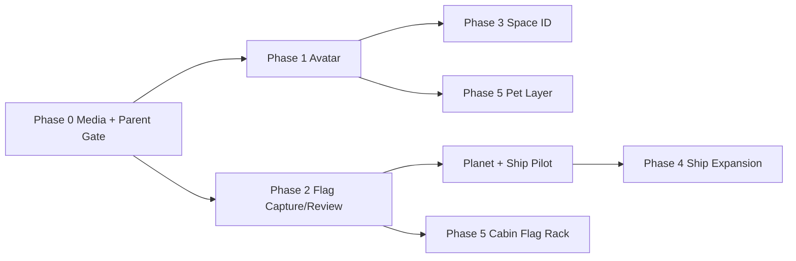

# IMPLEMENTATION PLAN — PHÂN HỆ CÁ NHÂN HÓA VŨ TRỤ

**Dự án**: NovaStars

**Mã tài liệu**: `IMP-MOD-PERSONALIZE-001`

**Phiên bản**: v1.0.0

**Trạng thái**: Ready for Engineering Breakdown

**Ngày**: 22/08/2026

**PRD nguồn**: `docs/PRD_PERSONALIZATION_SYSTEM.md` v1.1.0
**Phạm vi**: Offline-first, single-player, on-device media

---

## 1. MỤC TIÊU TRIỂN KHAI

Triển khai hệ thống cá nhân hóa theo thứ tự giảm rủi ro:

1. Xây nền tảng lưu media cục bộ và Parent Gate đúng trước.
2. Hoàn thiện avatar/wardrobe trên UI 2D.
3. Đưa cờ đã được phụ huynh duyệt vào một hành tinh và một tàu pilot.
4. Xây Space ID và export qua Parent Gate/share sheet.
5. Mở rộng VFX/ship cosmetics sau benchmark.
6. Làm pet và cabin riêng ở phase cuối.

Không có hạng mục backend upload, server moderation, admin moderation hoặc social system trong kế hoạch này.

---

## 2. GIẢ ĐỊNH LẬP KẾ HOẠCH

- Một squad gồm 1 product/designer, 2 frontend/game engineers và QA bán thời gian.
- App tiếp tục dùng React 18, TypeScript, Vite, Capacitor 6, Zustand, React Three Fiber và Three.js.
- Android/iOS là target production; web là môi trường development/E2E và fallback.
- Art production chạy song song với engineering nhưng phải tuân thủ asset contract trước khi tích hợp.
- `childId` hiện tại là một hồ sơ guest; data contract vẫn chuẩn bị sẵn cho nhiều hồ sơ trong tương lai nhưng không mở rộng Parent Zone multi-child trong scope này.
- Estimate là dev-day tương đối, chưa gồm thời gian duyệt App Store/Play Store và sản xuất toàn bộ art catalog.

---

## 3. BASELINE CODEBASE VÀ KHOẢNG TRỐNG

| Khu vực | Hiện trạng | Khoảng trống cần xử lý |
| :--- | :--- | :--- |
| App shell | `App.tsx` dùng local `activeTab` và `VercelHeader/VercelBottomNav` | `ParentDashboard` chưa được mount; legacy store cũng có `activeTab` riêng gây hai nguồn state |
| Profile | `ProfileView.tsx` cho chọn emoji avatar | Chưa có camera, crop, local file hoặc layer composer |
| Customization state | `CustomizationState` có ship, color, `hasVietnamFlag` và arrays unlocked | Chưa có media catalog, wardrobe slots, flag review state, card/pet/cabin state |
| Persistence | `useGameStore.ts` tự ghi JSON vào `localStorage` key `novastars_space_state_v2` | Không được lưu binary/Base64 lớn; chưa có schema migration và orphan cleanup |
| Parent Gate | PIN `1234` đang nằm plain text trong settings; có flow PIN cho daily quest | Chưa có PIN setup/hash, session timeout, lockout, review queue hoặc export gate |
| Parent Dashboard | Component báo cáo đã tồn tại | Chưa nối vào app shell; chưa có media review/control |
| Planet 3D | Có `PlanetMesh`, node lat/lon và `LessonCoordinatesMarker` | Chưa có flag marker, asset texture lifecycle hoặc inspect thành tích riêng |
| Ship 3D | Năm tàu core và các tàu mở rộng trong `SHIPS_DATA`; màu tàu/thrust đã hoạt động | Chưa có per-ship decal anchor/trail cosmetics; không được hard-code số lượng tàu |
| Native plugins | Có Capacitor core/app/preferences và các plugin nền | Chưa cài Camera, Filesystem, Share |
| Test | Playwright E2E tốt cho web/mobile viewport | Chưa có unit test cho state machine/file lifecycle và native smoke checklist |
| Backend | Hono chỉ có question/progress/content API | Không thay đổi; media personalization không đi qua backend |

### 3.1. Việc làm sạch kiến trúc bắt buộc

Trước khi thêm UI mới, cần thống nhất navigation source of truth:

- Trong scope này, giữ `activeTab` tại `App.tsx` và mở rộng `VercelTab` với `parent`.
- Mount `ParentDashboard` trong `App.tsx`.
- Không dùng `Header.tsx`/store `activeTab` cho tính năng mới.
- Sau khi E2E ổn định, tạo ticket riêng để xóa hoặc hợp nhất navigation legacy; không trộn refactor lớn vào media foundation nếu không cần.

---

## 4. QUYẾT ĐỊNH KIẾN TRÚC

### ADR-PER-001 — Binary media không nằm trong Zustand/localStorage

- Native persistent media: Capacitor Filesystem `Directory.Library`.
- Native export tạm: Capacitor Filesystem `Directory.Cache`.
- Web development/E2E: IndexedDB adapter cho Blob; in-memory adapter cho unit test.
- Zustand chỉ lưu `LocalMediaAsset` metadata với relative path/assetId.

**Lý do**: tránh phình state, quota localStorage, serializing Base64 và load app chậm.

### ADR-PER-002 — Xử lý ảnh hoàn toàn trên thiết bị

- Decode qua `createImageBitmap` khi hỗ trợ, fallback `HTMLImageElement`.
- Crop/resize bằng `OffscreenCanvas` hoặc `HTMLCanvasElement`.
- `canvas.toBlob()` tạo output mới và loại bỏ EXIF.
- Base64 chỉ tồn tại tạm trong service boundary nếu Filesystem native cần chuỗi Base64; không ghi vào store/log.

### ADR-PER-003 — Apply và Export là hai command khác nhau

- `approveFlagForLocalUse(assetId)` chỉ thay đổi state và render trong game.
- `requestCardExport()` luôn mở Parent Gate, dù cờ/avatar đã được apply.
- Không có boolean `published` hoặc `exportApproved` bền vững.

### ADR-PER-004 — Không có media backend

- Không thêm route upload vào `server/src/index.ts`.
- Không thêm bảng media/consent vào Neon.
- Không thêm bucket/key media vào R2.
- Network interceptor/test phải chứng minh capture/apply/export không phát request media.

### ADR-PER-005 — Decal dùng anchor mesh, không phụ thuộc UV của tàu

- Pilot decal là plane/mesh nhỏ đặt bằng per-ship anchor config.
- Không bake ảnh cờ vào texture atlas của tàu trong MVP.
- Mỗi ship khai báo position/rotation/scale cho decal trái/phải.

### ADR-PER-006 — Space ID render bằng Canvas 2D

- Không screenshot DOM và không thêm engine render nặng.
- Renderer whitelist field được phép xuất.
- QR marketing là PNG/SVG tĩnh build-time, không sinh từ `childId`.

### ADR-PER-007 — Parent credential thuộc Parent Zone

- Personalization chỉ phụ thuộc một `ParentGatePort` với các purpose `FLAG_APPROVAL`, `MEDIA_DELETE`, `CARD_EXPORT`.
- Không lưu PIN, PIN hash, OTP hoặc parent session trong personalization slice.
- Parent Zone là owner của enrollment, credential, lockout, recovery và session policy.
- Build offline cần một provider xác minh trên thiết bị đã enrollment; khi Parent Zone account/server được triển khai, thay provider mà không đổi personalization state machine.
- Độ dài PIN không được hard-code trong component cá nhân hóa.

---

## 5. DEPENDENCIES VÀ NATIVE CONFIG

### 5.1. Dependencies cần thêm

Chạy trong `client/` khi bắt đầu Phase 0:

```powershell
npm install @capacitor/camera@latest-6 @capacitor/filesystem@latest-6 @capacitor/share@latest-6
npx cap sync
```

Không chạy `@latest` không giới hạn major vì project đang ở Capacitor 6.

### 5.2. iOS

Thêm usage descriptions vào `Info.plist`:

- `NSCameraUsageDescription`
- `NSPhotoLibraryUsageDescription` nếu cho chọn ảnh thư viện
- `NSPhotoLibraryAddUsageDescription` nếu native flow cần thêm vào thư viện

Thêm `PrivacyInfo.xcprivacy` cho Filesystem theo yêu cầu plugin, gồm `NSPrivacyAccessedAPICategoryFileTimestamp` với approved reason phù hợp phiên bản Capacitor 6.

### 5.3. Android

- Camera plugin dùng system activity; không tự xin permission ngoài nhu cầu plugin.
- Lắng nghe `appRestoredResult` từ `@capacitor/app` để phục hồi kết quả khi camera activity làm app bị hệ điều hành kill.
- Share plugin mặc định chỉ chia sẻ file trong cache; giữ export trong cache để không phải mở rộng `file_paths.xml` ở MVP.
- Nếu bật chọn ảnh thư viện, kiểm tra Android Photo Picker/backport theo matrix thiết bị hỗ trợ.

### 5.4. Web fallback

- Capture: `<input type="file" accept="image/*" capture="user|environment">`.
- Persistent blob: IndexedDB.
- Export: `navigator.share({ files })` khi `canShare`; fallback tạo object URL và download link.
- Object URL phải `URL.revokeObjectURL()` khi component unmount/thay asset.

### 5.5. Tài liệu kỹ thuật chính thức

- [Capacitor Camera v6](https://capacitorjs.com/docs/v6/apis/camera)
- [Capacitor Filesystem v6](https://capacitorjs.com/docs/v6/apis/filesystem)
- [Capacitor Share v6](https://capacitorjs.com/docs/v6/apis/share)

---

## 6. CẤU TRÚC FILE DỰ KIẾN

```text
client/src/
  features/personalization/
    components/
      MediaCaptureSheet.tsx
      CameraGuideOverlay.tsx
      ImageCropEditor.tsx
      AvatarComposer.tsx
      WardrobePanel.tsx
      FlagReviewCard.tsx
      ParentMediaLibrary.tsx
      SpaceIdCardPreview.tsx
      SignaturePad.tsx
      ExportConfirmation.tsx
    data/
      cosmeticCatalog.ts
      avatarAssetManifest.ts
      shipDecalAnchors.ts
    services/
      mediaAssetService.ts
      imageProcessingService.ts
      cardRenderer.ts
      exportService.ts
      parentGateService.ts
      adapters/
        nativeMediaStorage.ts
        webMediaStorage.ts
        memoryMediaStorage.ts
    state/
      personalizationTypes.ts
      personalizationSlice.ts
      personalizationMigrations.ts
    utils/
      assetUri.ts
      imageValidation.ts
      mediaCleanup.ts
  components/3d/personalization/
    TerritoryFlag3D.tsx
    ShipFlagDecal.tsx
    ThrusterTrail.tsx
    CosmicPet3D.tsx
  components/views/
    PersonalizationView.tsx
    CaptainCabinView.tsx
  e2e/
    personalization-avatar.spec.ts
    personalization-flag.spec.ts
    personalization-export.spec.ts
```

Có thể điều chỉnh vị trí file để theo convention dự án, nhưng phải giữ ranh giới rõ giữa UI, state, image processing và native adapter.

---

## 7. DATA CONTRACT VÀ STORE ACTIONS

### 7.1. Types tối thiểu

```typescript
export type LocalMediaKind = 'AVATAR_PHOTO' | 'TERRITORY_FLAG' | 'SIGNATURE';

export type LocalMediaStatus =
  | 'DRAFT_LOCAL'
  | 'PENDING_PARENT_REVIEW'
  | 'APPROVED_FOR_LOCAL_USE'
  | 'REJECTED';

export interface LocalMediaAsset {
  id: string;
  childId: string;
  kind: LocalMediaKind;
  relativePath: string;
  mimeType: 'image/webp' | 'image/jpeg' | 'image/png';
  width: number;
  height: number;
  byteSize: number;
  status: LocalMediaStatus;
  createdAt: string;
  updatedAt: string;
  reviewedAt?: string;
  rejectReason?: 'BLURRY' | 'BAD_CROP' | 'NOT_APPROPRIATE' | 'OTHER';
  parentNote?: string;
}

export interface ParentGateSession {
  state: 'LOCKED' | 'UNLOCKED' | 'COOLDOWN'; // Type thuộc Parent Zone, chỉ minh họa integration
  unlockedUntil?: number;
}

export type ParentGatePurpose = 'FLAG_APPROVAL' | 'MEDIA_DELETE' | 'CARD_EXPORT';

export interface ParentGatePort {
  challenge(input: {
    purpose: ParentGatePurpose;
    requireExplicitConfirmation: boolean;
    allowOfflineTrustedDevice: boolean;
  }): Promise<{ verified: boolean; reason?: string }>;
  lock(): Promise<void>;
}
```

### 7.2. Store additions

```typescript
interface PersonalizationState {
  schemaVersion: 1;
  mediaAssets: Record<string, LocalMediaAsset>;
  profile: ChildPersonalizationProfile;
  allowPhotoLibraryImport: boolean;
}
```

Actions:

```typescript
addMediaAsset(asset: LocalMediaAsset): void;
replaceAvatarPhoto(assetId: string): Promise<void>;
submitFlagForParentReview(assetId: string): void;
approveFlagForLocalUse(assetId: string): void;
rejectFlag(assetId: string, reason: RejectReason, note?: string): void;
revokeFlag(assetId: string, deleteFile: boolean): Promise<void>;
deleteMediaAsset(assetId: string): Promise<void>;
equipWardrobeItem(slot: WardrobeSlot, itemId: string): void;
purchaseCosmetic(itemId: string): boolean;
resetPersonalization(): Promise<void>;
```

### 7.3. Parent Gate integration

- Credential implementation tuân thủ `docs/PRD_PARENT_ZONE.md` và `docs/PARENT_ZONE_IMPLEMENTATION_PLAN.md`.
- Personalization gọi `ParentGatePort.challenge()` và chỉ nhận kết quả verified/denied; không đọc PIN trực tiếp.
- Provider offline phải dùng credential đã enrollment trên thiết bị; personalization không biết hoặc persist verifier.
- App background gọi `ParentGatePort.lock()` qua owner Parent Zone.
- Development/E2E dùng fake provider deterministic; không nhúng default PIN vào production behavior.

### 7.4. State migration

Từ state v2 hiện tại:

1. Đọc user/avatar emoji → `profile.avatar.baseType = 'PRESET'`.
2. Đọc `hasVietnamFlag` → giữ accessory preset `flag_vn`.
3. Giữ ship/color/unlocked arrays hiện tại.
4. Khởi tạo `mediaAssets = {}` và profile personalization mặc định.
5. Ghi `STATE_SCHEMA_VERSION = 3` sau khi validate.
6. Nếu migration lỗi, backup JSON cũ trong memory cho log dev, fallback state an toàn; không reset tiến trình học không cần thiết.

---

## 8. PHASE 0 — OFFLINE MEDIA FOUNDATION & PARENT GATE

**Estimate**: 8–12 dev-days
**Mục tiêu**: chứng minh lifecycle capture → process → persist → resolve URI → delete hoàn toàn offline.

### 8.1. Backlog

| ID | Task | Deliverable | Phụ thuộc |
| :--- | :--- | :--- | :--- |
| PER-000 | Chốt ADR và asset path convention | ADR notes trong plan/code comments | Không |
| PER-001 | Cài Camera/Filesystem/Share major 6 | Package lock + native sync | PER-000 |
| PER-002 | Cấu hình iOS permissions/privacy manifest | Native config build được | PER-001 |
| PER-003 | Cấu hình Android camera restore/share cache | Native config + restore handler | PER-001 |
| PER-004 | Tạo `MediaStorageAdapter` | Native/web/memory adapters | PER-001 |
| PER-005 | Tạo image processing pipeline | Crop/resize/brightness/encode | PER-004 |
| PER-006 | Tạo asset catalog và URI resolver | `assetId -> renderable URI` | PER-004 |
| PER-007 | Bổ sung state schema + migration v2→v3 | Store load/save không mất progress | PER-006 |
| PER-008 | Xây cleanup/reset/orphan reconciliation | Không còn file mồ côi | PER-007 |
| PER-009 | Nối `ParentDashboard` vào app shell | Parent view truy cập được | Navigation cleanup |
| PER-010 | Định nghĩa/tích hợp `ParentGatePort` dùng chung | Purpose-based gate reusable | PER-009 + Parent Zone contract |
| PER-011 | Khóa parent session khi app background | Gọi owner Parent Zone, không lưu session trong personalization | PER-010 |
| PER-012 | Unit/E2E foundation tests | Test fixtures và plugin mocks | PER-004→011 |

### 8.2. Service contract

```typescript
interface MediaStorageAdapter {
  write(asset: ProcessedImage, target: MediaTarget): Promise<StoredMedia>;
  read(relativePath: string): Promise<Blob>;
  getRenderableUri(relativePath: string): Promise<string>;
  delete(relativePath: string): Promise<void>;
  list(childId: string): Promise<string[]>;
  clearChild(childId: string): Promise<void>;
  clearExpiredExports(now: number): Promise<void>;
}
```

Yêu cầu idempotency:

- `delete()` trả success nếu file đã không còn.
- `clearChild()` tiếp tục xóa các file khác khi một file lỗi và trả aggregate result.
- Store chỉ commit metadata sau khi file write + validation thành công.
- Replace asset: write mới → commit reference → xóa cũ; không xóa cũ trước.

### 8.3. Exit criteria

- Native Android/iOS: chụp ảnh và render lại sau restart ở airplane mode.
- Web: file input → IndexedDB → reload → render thành công.
- Kill/reopen trong camera flow không làm app crash hoặc commit asset rỗng.
- Reset xóa metadata + file; startup reconciliation xử lý file/reference lệch.
- Parent dashboard được mount; personalization không còn đọc/ghi PIN plain text hoặc sở hữu credential state.

---

## 9. PHASE 1 — AVATAR & WARDROBE MVP

**Estimate**: 12–16 dev-days engineering + art
**Mục tiêu**: selfie local hoặc preset có thể compose với bộ layer nhỏ và lưu bền vững.

### 9.1. Scope MVP

- 1 camera guide avatar `3:4`.
- 3 avatar preset giữ từ hệ thống hiện tại.
- 3 outfit, 3 headgear, 2 accessory, 2 frame, 2 background.
- Common/Rare bằng NovaCoins; chưa cần Epic/Legendary art đầy đủ.
- Post-capture brightness heuristic; không làm real-time face detection.

### 9.2. Backlog

| ID | Task | Deliverable | Phụ thuộc |
| :--- | :--- | :--- | :--- |
| PER-100 | Camera capture sheet + permission states | UI success/denied/cancel/retry | Phase 0 |
| PER-101 | Avatar guide overlay | Silhouette + instruction | PER-100 |
| PER-102 | Crop editor 3:4 | Pan/zoom/retake/confirm | PER-101 |
| PER-103 | Save/replace avatar asset | Local file + metadata | PER-102 |
| PER-104 | Define layer art contract | Canvas, anchor, manifest | Art + design |
| PER-105 | `AvatarComposer` | Preset/photo + 6 layer slots | PER-103/104 |
| PER-106 | Wardrobe panel and filters | Category/rarity/lock state | PER-104 |
| PER-107 | Preview state tách khỏi equipped | Thử không thay state bền vững | PER-106 |
| PER-108 | Atomic purchase/equip | Không double-charge | PER-106 |
| PER-109 | Integrate Profile/Header thumbnails | Avatar dùng nhất quán | PER-105 |
| PER-110 | Avatar delete/fallback | Xóa file và về preset | PER-103 |
| PER-111 | E2E + visual checks | Capture mock, crop, equip, restart | PER-100→110 |

### 9.3. Art contract

Mỗi item manifest:

```typescript
interface AvatarCosmeticItem {
  id: string;
  slot: 'OUTFIT' | 'HEADGEAR' | 'ACCESSORY' | 'PET' | 'FRAME' | 'BACKGROUND';
  rarity: 'COMMON' | 'RARE' | 'EPIC' | 'LEGENDARY';
  assetPath: string;
  canvasWidth: 768;
  canvasHeight: 1024;
  anchorX: number;
  anchorY: number;
  price: { currency: 'NOVA_COINS' | 'CHILD_DIAMONDS'; amount: number };
  unlockRequirement?: string;
}
```

PNG/WebP alpha, cùng canvas `768 × 1024`, không tự crop sát item nếu làm mất alignment.

### 9.4. Exit criteria

- Permission denied không chặn app; preset vẫn dùng được.
- Avatar photo không nằm trong serialized JSON.
- Replace avatar không để file cũ mồ côi.
- Preview không trừ tiền hoặc ghi equipped state.
- Double tap mua chỉ trừ tiền một lần.
- Header/Profile/Space ID preview dùng cùng composer output.

---

## 10. PHASE 2 — TERRITORY FLAG & 3D APPLICATION

**Estimate**: 12–18 dev-days
**Mục tiêu**: cờ local qua parent review rồi xuất hiện trên hành tinh và tàu pilot.

### 10.1. Backlog

| ID | Task | Deliverable | Phụ thuộc |
| :--- | :--- | :--- | :--- |
| PER-200 | Flag capture guide `3:2` | Grid + safe zone | Phase 0 |
| PER-201 | Crop/process/save flag | Draft local | PER-200 |
| PER-202 | Submit/review/reject state machine | Store actions + guards | PER-201 |
| PER-203 | Parent review queue UI | Approve/reject/note | PER-202 + Parent Gate |
| PER-204 | Revoke/delete flow | Unapply everywhere + cleanup | PER-202 |
| PER-205 | Flag texture loader/registry | Resolve, cache, dispose | PER-201 |
| PER-206 | `TerritoryFlag3D` pilot | Marker tại completed node | PER-205 |
| PER-207 | Own-achievement inspect popup | Không có public profile | PER-206 |
| PER-208 | `ShipFlagDecal` trên `explorer_v1` | Wing decal anchors | PER-205 |
| PER-209 | Performance baseline/benchmark | FPS/memory before-after | PER-206/208 |
| PER-210 | E2E + 3D regression tests | Draft hidden, approve/revoke | PER-202→209 |

### 10.2. 3D implementation notes

Planet flag position:

```typescript
const r = planetRadius + FLAG_OFFSET;
const position = new THREE.Vector3(
  r * Math.cos(node.lat) * Math.sin(node.lon),
  r * Math.sin(node.lat),
  r * Math.cos(node.lat) * Math.cos(node.lon),
);
```

- Orient pole theo surface normal.
- MVP flag plane có subtle sine animation bằng vertex displacement hoặc CPU rotation rất nhẹ.
- Nếu device quality thấp, tắt cloth animation nhưng giữ marker.
- Khi asset đổi, dispose texture cũ trước khi release reference.

Ship anchor config:

```typescript
interface ShipDecalAnchor {
  shipId: string;
  left: Transform3D;
  right: Transform3D;
  maxTextureSize: 512;
}
```

### 10.3. Exit criteria

- `DRAFT_LOCAL`, `PENDING_PARENT_REVIEW`, `REJECTED` không render trong 3D.
- Approve render mà không reload; revoke gỡ ngay.
- Tap flag mở thành tích của chính user đang active.
- Không có text/route/profile dành cho người chơi khác.
- Pilot không giảm FPS quá 10% và không tăng memory sau 10 vòng replace/revoke.

---

## 11. PHASE 3 — SPACE ID & CONTROLLED EXPORT

**Estimate**: 10–14 dev-days
**Mục tiêu**: tạo thẻ thành tích local và chỉ export sau xác nhận phụ huynh.

### 11.1. Backlog

| ID | Task | Deliverable | Phụ thuộc |
| :--- | :--- | :--- | :--- |
| PER-300 | Card theme/layout spec | Safe zones, fonts, whitelist field | Design |
| PER-301 | Canvas 2D renderer | Preview + 1080×1920 output | PER-300/Avatar |
| PER-302 | Load composed avatar/flag into canvas | Unified asset resolver | PER-301 |
| PER-303 | Optional signature pad | Flatten transparent PNG | Phase 0 |
| PER-304 | Decorative local pilot code | Không dùng childId trong export | PER-301 |
| PER-305 | Static generic QR asset | Landing URL chung | Marketing decision |
| PER-306 | Parent Gate per export | Challenge + confirmation | Parent Gate |
| PER-307 | Export preview | Final visual before share | PER-301/306 |
| PER-308 | Cache write + Share API | Native share sheet | PER-307 |
| PER-309 | Web share/download fallback | Browser support path | PER-307 |
| PER-310 | Cache cleanup | Post-share/startup/24h | PER-308 |
| PER-311 | Snapshot/security tests | Kích thước, fields, no childId | PER-301→310 |

### 11.2. Export whitelist

Được render:

- Display nickname do gia đình đặt.
- Level/rank/title.
- Tổng sao, bài học, tọa độ hoàn thành.
- Avatar composed, cờ approved, chữ ký trang trí.
- Logo/QR marketing chung.

Không được render:

- `childId`, database ID, local file path.
- Ngày sinh, trường/lớp cụ thể, email phụ huynh.
- Debug flags, God Mode state, internal timestamps không cần thiết.

### 11.3. Export lifecycle

```text
User taps Export
  -> Parent challenge
  -> Preview
  -> Render PNG in memory
  -> Write Cache/personalization-export/{uuid}.png
  -> Share.canShare
  -> Share.share({ files: [fileUri] })
  -> mark cache entry for cleanup
```

Nếu share bị cancel, file vẫn được dọn theo startup/24h job. MVP dùng share sheet để phụ huynh chọn “Save Image” hoặc ứng dụng nhận; direct gallery writer là backlog riêng.

### 11.4. Exit criteria

- Không thể đi thẳng từ child UI tới native share sheet.
- Mỗi lần export yêu cầu challenge/confirmation mới.
- Output đúng `1080 × 1920`, không vỡ font/ảnh.
- Automated test không tìm thấy `childId` hoặc path trong pixel metadata/filename.
- Export cache được dọn đúng lifecycle.

---

## 12. PHASE 4 — SHIP COSMETICS & CELEBRATION

**Estimate**: 15–22 dev-days + art/VFX
**Mục tiêu**: mở rộng ship decal có kiểm soát và thêm delight không ảnh hưởng luồng học.

### 12.1. Backlog

| ID | Task | Deliverable | Phụ thuộc |
| :--- | :--- | :--- | :--- |
| PER-400 | Anchor decal cho các tàu đăng ký hỗ trợ còn lại | Config + visual QA theo `SHIPS_DATA` | Pilot benchmark |
| PER-401 | Batch rollout decal | Feature flag per ship | PER-400 |
| PER-402 | Thruster trail config | 3 unlockable + default | Existing thrust |
| PER-403 | Device quality scaling | Particle budget low/high | PER-402 |
| PER-404 | Cockpit toy slot | 3 bobbleheads | Cockpit view |
| PER-405 | Victory banner state machine | Non-blocking overlay | Lesson completion |
| PER-406 | Fanfare catalog | 4 clips + selection | Audio service |
| PER-407 | Reduced motion/audio settings | Accessibility controls | PER-402/405/406 |
| PER-408 | E2E/performance soak | All ships, 10 transitions | PER-401→407 |

### 12.2. Integration constraints

- Lesson result được commit trước khi chạy celebration.
- Skip/close animation không rollback reward.
- SFX đi qua `soundService` và audio safety pipeline hiện tại.
- God Mode unlock-all cập nhật catalog mới nhưng không ghi đè equipped state thật khi tắt God Mode.

### 12.3. Exit criteria

- Mọi tàu production có `flagDecalSupported: true` render được decal mà không z-fighting rõ ràng.
- Low quality mode giảm particle và giữ interaction mượt.
- Fanfare tôn trọng SFX off.
- Celebration có skip, không chặn lưu kết quả.
- Không có texture/particle leak sau soak test.

---

## 13. PHASE 5 — PETS & PRIVATE CAPTAIN’S CABIN

**Estimate**: 15–20 dev-days + art
**Mục tiêu**: tạo không gian trưng bày riêng, tuyệt đối không mở social.

### 13.1. Backlog

| ID | Task | Deliverable | Phụ thuộc |
| :--- | :--- | :--- | :--- |
| PER-500 | Pet catalog/state | Equip pet/accessory | Wardrobe |
| PER-501 | Shoulder pet layer | Avatar integration | Avatar composer |
| PER-502 | Hangar pet behavior | Idle/emoji reactions | R3F scene |
| PER-503 | Cabin layout spike | Chọn 2.5D hoặc lightweight 3D | Performance budget |
| PER-504 | Trophy shelf | Derived from achievements | Progress state |
| PER-505 | Flag rack | Approved local flags only | Flag state |
| PER-506 | Planet table | Completed planets/nodes | Planet progress |
| PER-507 | Cabin persistence | Layout/equipped display | Store migration |
| PER-508 | Negative social assertions | Không route/friend/visit | QA |
| PER-509 | Memory/performance test | Scene enter/leave soak | PER-501→507 |

### 13.2. Cabin decision gate

Ưu tiên 2.5D nếu một trong các điều kiện sau xảy ra:

- 3D cabin làm memory peak vượt budget trên thiết bị thấp.
- Asset production cho 3D làm trễ roadmap quá một sprint.
- Cabin không tạo uplift usability/retention trong prototype test.

### 13.3. Exit criteria

- Cabin chỉ đọc dữ liệu của active profile trên thiết bị.
- Không có friend list, share code, visit button hoặc public URL.
- Xóa/thu hồi cờ cập nhật flag rack.
- Layout phục hồi sau restart và không crash khi asset thiếu.

---

## 14. TEST STRATEGY

### 14.1. Unit tests

Khuyến nghị thêm Vitest cho pure logic và adapters:

- Flag review state transitions hợp lệ/không hợp lệ.
- Purchase idempotency.
- v2→v3 migration.
- Asset replacement order và rollback khi write lỗi.
- Orphan reconciliation.
- Parent lockout/session timeout.
- Export whitelist và filename.
- Image validation: MIME, dimensions, max size, corrupt input.

### 14.2. Component tests

- Permission denied/cancel/retry UI.
- Crop editor pan/zoom bounds.
- Wardrobe preview vs equipped.
- Parent review approve/reject/revoke.
- Export confirmation không bị bypass.

### 14.3. Playwright E2E web

| Scenario | Assertion chính |
| :--- | :--- |
| Avatar preset fallback | Camera unavailable vẫn equip được preset |
| Avatar local persistence | Mock capture → reload → avatar còn |
| Flag draft | Không render marker/decal |
| Parent approve | PIN → approve → marker xuất hiện |
| Reject/retake | Asset cũ không apply |
| Revoke/delete | Marker/decal và blob biến mất |
| Export gate | Không có download/share trước PIN |
| Export whitelist | Không chứa internal ID/path |
| Reset | State + IndexedDB media được xóa |
| Migration | State v2 giữ progress/ship/color |

### 14.4. Native smoke matrix

Thiết bị tối thiểu:

- Android API 30 và một thiết bị mới hơn.
- Một Android cấu hình thấp/RAM thấp.
- iPhone/iPad trên phiên bản iOS target project.

Kiểm tra:

- Permission lần đầu, deny, deny vĩnh viễn, cấp lại từ Settings.
- Camera activity kill/restore.
- Rotate/background/foreground trong crop và Parent Zone.
- Share cancel/success; file cache cleanup.
- Uninstall/reinstall xóa media.
- Airplane mode toàn luồng.
- Bộ nhớ khi thay avatar/cờ 10 lần.

### 14.5. 3D performance

Đo trước/sau trên cùng scene:

- FPS median/P95 frame time.
- JS heap nếu browser hỗ trợ.
- GPU texture count qua dev diagnostics.
- Memory sau 10 lần replace/revoke.
- Scene enter/leave 20 lần.

Pass khi FPS regression ≤10%, không có xu hướng memory tăng liên tục và UI input không bị block rõ ràng.

---

## 15. FEATURE FLAGS VÀ ROLLOUT

Local build flags:

```typescript
interface PersonalizationFeatureFlags {
  localMediaFoundation: boolean;
  photoAvatar: boolean;
  territoryFlag: boolean;
  explorerFlagDecal: boolean;
  captainIdExport: boolean;
  shipVfx: boolean;
  pets: boolean;
  captainCabin: boolean;
}
```

Quy tắc:

- Flags đóng gói trong config local/build; không cần remote feature service.
- Phase mới mặc định off ở production cho tới khi phase exit criteria pass.
- Nếu flag off, state/asset đã có không bị xóa; UI fallback an toàn.
- Không dùng flag để đưa social/backend media vào app.

---

## 16. OBSERVABILITY CỤC BỘ

Event counter không chứa media:

```text
avatar_capture_started
avatar_capture_completed
avatar_equipped
wardrobe_item_previewed
wardrobe_item_purchased
flag_submitted_for_review
flag_approved_for_local_use
flag_rejected
flag_revoked
card_export_gate_opened
card_export_completed
personalization_reset_completed
```

- Production offline có thể chỉ lưu aggregate count cục bộ để Parent/QA xem.
- Không log nickname, image bytes, full file URI hoặc signature.
- Nếu tương lai thêm telemetry opt-in, chỉ gửi event name + coarse app version/device class; media vẫn không rời thiết bị.

---

## 17. RISK REGISTER

| ID | Rủi ro | Xác suất | Tác động | Owner | Giảm thiểu |
| :--- | :--- | :---: | :---: | :--- | :--- |
| R1 | Navigation có hai source of truth | Cao | Cao | FE lead | Chốt App local tab cho scope, ticket hợp nhất legacy |
| R2 | Hai hệ Parent Gate hoặc personalization hard-code PIN | Trung bình | Cao | FE lead/QA | Một `ParentGatePort`, credential do Parent Zone sở hữu, production assertion |
| R3 | Camera kill app activity | Trung bình | Cao | Mobile engineer | `appRestoredResult`, idempotent draft |
| R4 | Media Base64 lọt store | Trung bình | Cao | FE lead | Type/lint review, serialization test, adapter boundary |
| R5 | Orphan file sau replace/reset | Trung bình | Trung bình | FE | Two-phase replace + startup reconciliation |
| R6 | Procedural ship khó đặt decal | Cao | Trung bình | 3D engineer | Anchor plane pilot trên `explorer_v1` trước |
| R7 | Three texture leak | Trung bình | Cao | 3D engineer | Texture registry/dispose + soak test |
| R8 | Canvas export lỗi font/tainted image | Trung bình | Trung bình | FE | Local same-origin assets, await font/image decode, snapshot test |
| R9 | Art scope làm trễ engineering | Cao | Trung bình | Product/design | Asset manifest + catalog nhỏ mỗi phase |
| R10 | Cabin 3D quá nặng | Trung bình | Cao | Product/3D | Decision gate 2.5D |

---

## 18. ƯỚC LƯỢNG VÀ THỨ TỰ GIAO HÀNG

| Phase | Estimate engineering | Có thể phát hành độc lập |
| :--- | :---: | :---: |
| Phase 0 — Media Foundation & Parent Gate | 8–12 dev-days | Không, foundation |
| Phase 1 — Avatar & Wardrobe | 12–16 dev-days | Có |
| Phase 2 — Flag & 3D Pilot | 12–18 dev-days | Có |
| Phase 3 — Space ID & Export | 10–14 dev-days | Có |
| Phase 4 — Ship VFX & Celebration | 15–22 dev-days | Có theo batch |
| Phase 5 — Pets & Cabin | 15–20 dev-days | Có |

Tổng engineering tuần tự: **72–102 dev-days**. Với hai engineers làm song song hợp lý và art sẵn đúng hạn, lịch mục tiêu khoảng **10–14 tuần**, chưa tính store review. Không nên chạy Phase 2 trước khi Phase 0 pass data lifecycle; Phase 3 có thể phát triển renderer song song cuối Phase 2.

### Critical path



---

## 19. DEFINITION OF DONE

Một phase chỉ hoàn tất khi:

1. Code review pass và không làm thay đổi backend media boundary.
2. TypeScript build, audio safety check và E2E liên quan pass.
3. Unit tests cho pure logic/state machine pass.
4. Native smoke checklist của phase pass trên Android và iOS target.
5. Airplane mode flow pass.
6. Reset/delete không để orphan media.
7. Không log media/Base64/local path.
8. Accessibility checklist cơ bản pass.
9. Performance benchmark được ghi lại trước/sau cho thay đổi 3D.
10. PRD/Implementation Plan và code naming không dùng `publish`, `public profile`, `other player` hoặc social behavior.

---

## 20. VIỆC CẦN LÀM NGAY ĐỂ BẮT ĐẦU PHASE 0

Theo thứ tự:

1. Tạo branch `codex/personalization-phase-0` hoặc branch feature tương đương.
2. Chốt asset storage adapter và `Directory.Library`/`Directory.Cache` trong ADR code-level.
3. Cài ba plugin Capacitor major 6 và sync native projects.
4. Mount ParentDashboard qua app shell hiện hành.
5. Tích hợp `ParentGatePort` từ Parent Zone và xóa mọi dependency trực tiếp vào PIN khỏi personalization.
6. Thêm types + migration v2→v3 trước khi lưu media đầu tiên.
7. Implement memory/web adapter và unit tests.
8. Implement native adapter + camera restore.
9. Implement reset/orphan cleanup.
10. Chạy Phase 0 exit checklist rồi mới bắt đầu Avatar UI.

---

*Implementation Plan này là kế hoạch kỹ thuật canonical cho PRD v1.1.0. Thay đổi nào đưa media lên server, thêm multiplayer/social hoặc cho phép export không qua Parent Gate phải quay lại Product Review và cập nhật PRD trước khi triển khai.*
