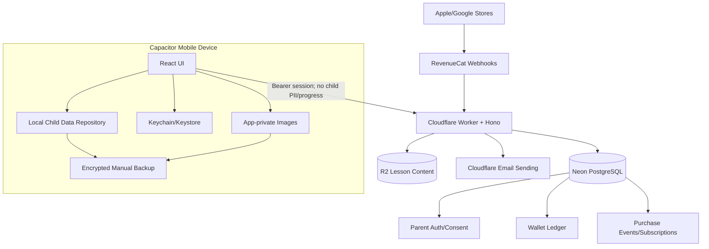

# KẾ HOẠCH TRIỂN KHAI CHI TIẾT — PARENT ZONE v1.2.0

**Dự án:** NovaStars
**Mã kế hoạch:** `IMP-MOD-PARENT-001`
**Phiên bản:** `v1.1.0`
**Ngày:** 22/08/2026
**PRD nguồn:** [`PRD_PARENT_ZONE.md`](./PRD_PARENT_ZONE.md)
**Trạng thái:** `MVP demo đã merge main — Sprint kế tiếp: Staging Readiness`

---

## 0. Trạng thái triển khai và kế hoạch thực thi (22/08/2026)

Phần mã nguồn MVP đã merge vào `main` qua PR #32, commit `9d1c8ab`: Parent Zone UI, tài khoản email/OTP/PIN 6 số, hồ sơ trẻ local, báo cáo local, nhiệm vụ từ bài học, giới hạn thời gian, cẩm nang, backup mã hóa, wallet/ledger server-authoritative, RevenueCat adapter/webhook và feature flags. Direct Neon và PIN mặc định đã được loại khỏi client; God Mode không render ở production.

Demo review hiện bật `VITE_PARENT_DEMO_ACCESS=true` và tạm chấp nhận mật khẩu `1234` hoặc `123456` trong bộ nhớ phiên theo quyết định của Product Owner. Cơ chế này chỉ dành cho review nội bộ, không phải authentication production. Các việc còn lại tập trung ở cấu hình backend thử nghiệm dùng chung, kiểm định native/store và release gates. Thực hiện vận hành theo [`PARENT_ZONE_RELEASE_RUNBOOK.md`](./PARENT_ZONE_RELEASE_RUNBOOK.md).

### 0.1. Bảng trạng thái tổng hợp

| Hạng mục | Trạng thái | Bằng chứng/việc còn lại |
| :--- | :---: | :--- |
| Parent Zone UI và demo gate | **Done** | Có trên `main`; demo tạm dùng `1234` hoặc `123456` |
| Hồ sơ trẻ local, tối đa 4 hồ sơ | **Done (web MVP)** | Khối lớp chỉ để hiển thị; cần kiểm định native lifecycle |
| Migration local v2 → v3 | **Done (web MVP)** | Write/read-back trước khi xóa v2; giữ hồ sơ/progress/Xu/customization; rollback đã loại PIN; Kim Cương chỉ giữ khi demo access bật |
| Báo cáo, nhiệm vụ, Xu và screen-time | **Done (web MVP)** | Clock chỉ tính foreground+engaged, tách 3 danh mục, rollover theo ngày local, tổng hợp 7 ngày; lesson/mini-game boundary E2E pass; còn UAT thiết bị thật |
| Cẩm nang/podcast không AI | **Done (draft)** | Nội dung mát-xa chờ hậu kiểm, production flag vẫn off |
| Backup mã hóa và xóa dữ liệu local | **Done (web MVP)** | Backup chủ động gồm cả ảnh local; đã test tệp lỗi, mật khẩu sai, account binding, preview, rollback, ảnh quá giới hạn, restore vào storage trống và xóa toàn bộ media; còn QA reinstall trên thiết bị thật |
| Xóa hồ sơ/tài khoản retry-safe | **Done (web/API MVP)** | Close request ổn định, hoàn số dư đúng một lần; local account data vẫn bị xóa khi phản hồi server bị mất; còn kiểm định DB thật |
| Auth/OTP/PIN Worker | **Đã deploy backend thử nghiệm; email đang tắt có chủ đích** | Register/OTP persistence live pass; email thật được hoãn, không chặn demo password |
| Wallet/ledger/reward server | **Đã kết nối Worker ↔ Hyperdrive ↔ Neon** | 10 migration, invariant, readiness, observability và registration transaction live pass; còn UAT/reconciliation vận hành |
| RevenueCat/IAP | **SDK/adapter có, feature off** | iOS/Android project đã sync RevenueCat SDK; còn product/store config, API keys và sandbox matrix |
| Native secure storage/biometric | **Android compile pass; device validation pending** | Capacitor 8 iOS/Android, privacy manifest, cross-platform SwiftPM paths, device-only Keychain namespace + legacy migration, lifecycle lock và OS backup exclusion đã có; Android Java 21/SDK 36 unit test + `assembleDebug` pass, iOS vẫn cần Mac/Xcode và cả hai platform cần thiết bị thật |
| Pilot/production | **Chưa bắt đầu** | Chỉ bắt đầu sau security/privacy/release gates |

### 0.2. Sprint kế tiếp — Shared Experimental Backend Readiness

**Mục tiêu:** Nhập schema Parent Zone vào Neon thử nghiệm hiện tại, kết nối Worker thử nghiệm và kiểm định wallet/backend; giữ demo auth `1234`/`123456`, chưa phụ thuộc email thật và giữ IAP tắt.

**Thời lượng tham chiếu:** 5–7 ngày làm việc với 1 backend/Cloudflare engineer, 1 frontend/mobile engineer và QA bán thời gian.

| ID | Công việc | Owner tham chiếu | Phụ thuộc | Acceptance criteria |
| :--- | :--- | :--- | :--- | :--- |
| `STG-01` | Chốt API origin thử nghiệm và privacy policy version | Product/Ops | Quyền quản trị domain/Worker | Giá trị được ghi trong env inventory; không dùng production secret |
| `STG-02` | Kết nối database ứng dụng trong Neon project/branch thử nghiệm hiện tại và chạy 10 migration theo thứ tự | Backend | Quyền Neon CLI | `npm run shared-demo:provision` chạy sạch; live schema verifier xác nhận bảng/column/index/trigger/checksum; log không chứa secret |
| `STG-03` | Gắn Worker thử nghiệm với database dùng chung qua Hyperdrive hoặc server-side secret | Backend/Ops | `STG-02` | Worker đọc DB qua binding/server secret; không có connection string trong client bundle |
| `STG-04` | Deploy Worker thử nghiệm với CORS allowlist và admin route được bảo vệ | Backend | `STG-03` | Health/API smoke pass; origin ngoài allowlist bị từ chối; admin route thiếu secret bị từ chối |
| `STG-05` | Email sender/OTP thật — hoãn, không chặn demo | Ops/Backend | Khi Product Owner yêu cầu bỏ demo password | SPF/DKIM/deliverability chỉ trở thành release gate trước pilot/production |
| `STG-06` | Cấu hình client review dùng API thử nghiệm ở các luồng backend đã bật; tiếp tục demo auth | Frontend | `STG-04` | Build review vẫn nhận `1234`/`123456`; không yêu cầu email để vào Parent Zone |
| `STG-07` | Kiểm thử child slot, wallet, reward idempotency và đóng hồ sơ trực tiếp ở backend thử nghiệm | Backend/QA | `STG-02`, `STG-04` | Không âm ví; reward trùng chỉ ghi một lần; đóng slot hoàn số dư về vault |
| `STG-08` | Privacy/network inspection | QA/Security | `STG-06` | Request/log không chứa nickname, grade, progress, đáp án, usage, nhiệm vụ hoặc ảnh trẻ |
| `STG-09` | Regression demo với Worker/database thử nghiệm | QA | `STG-07`, `STG-08` | Build review nhận cả `1234` và `123456`; luồng local-only không tải dữ liệu trẻ lên server |
| `STG-10` | Ghi evidence và quyết định go/no-go cho vòng kiểm thử native tiếp theo | Tech lead/Product | `STG-01`–`04`, `STG-06`–`09`; `STG-05` được hoãn | Checklist có người kiểm định, ngày, build/commit và kết quả rõ ràng |

#### Test matrix bắt buộc của sprint

- Auth: server unit/contract test tiếp tục bao phủ OTP/PIN/lockout/refresh; demo UI bắt buộc nhận `1234` và `123456`. Email deliverability không nằm trong sprint này.
- Session: refresh/revoke, app background, token không nằm trong persistent web storage ngoài phạm vi cho phép.
- Wallet: reward 0 và >0 Kim Cương, số dư không đủ, request trùng, hai debit đồng thời, đóng child slot.
- Local-only: tạo/sửa/xóa/chuyển hồ sơ; kiểm tra network không có dữ liệu trẻ.
- Backup: đúng/sai mật khẩu, tệp hỏng; import thất bại không ghi đè dữ liệu hiện tại.
- Build: client production build, server typecheck/tests và Wrangler staging dry-run.

#### Ngoài phạm vi sprint

- Không bật IAP hoặc giao dịch tiền thật.
- Không triển khai multi-device/cloud sync cho dữ liệu trẻ.
- Không dùng AI cho cẩm nang hoặc báo cáo.
- Không biến khối lớp thành logic học tập; trường này tiếp tục chỉ để hiển thị.
- Chưa bỏ demo password `1234`/`123456` cho tới khi Product Owner yêu cầu. Mẫu build `staging-auth` được giữ cho giai đoạn tương lai nhưng không chạy và không phải gate của sprint thử nghiệm này.

#### Tiến độ triển khai trong repo

- [x] `REPO-STG-01` Chuẩn hóa demo gate dùng chung cho đăng nhập, gia hạn và Parent Gate; tạm chấp nhận `1234`/`123456`.
- [x] `REPO-STG-02` Thêm `VITE_DEPLOYMENT_ENV`; build guard bắt buộc API HTTPS và giữ IAP off trên staging.
- [x] `REPO-STG-03` Thêm mẫu `.env.staging.example`, `.env.staging-auth.example` và `.env.production.example`; tách build review khỏi build kiểm định auth thật.
- [x] `REPO-STG-04` Thêm Worker `GET /ready` kiểm tra binding/secrets dưới dạng boolean, không trả giá trị bí mật.
- [x] `REPO-STG-05` Bắt buộc Hyperdrive trên staging/production; Neon URL chỉ còn fallback development.
- [x] `REPO-STG-06` Bổ sung unit/E2E cho hai demo password và giữ credential tại một policy dùng chung.
- [x] `REPO-STG-07` Loại God Mode/debug chunks khỏi staging-auth bundle và thêm automated production-safety scanner.
- [x] `REPO-STG-08` Thêm HTTP contract tests cho readiness, CORS allowlist và admin upload protection.
- [x] `REPO-STG-09` Thêm migration contract tests: thứ tự, additive-only, required constraints và không có child PII fields.
- [x] `REPO-STG-10` Gắn Hyperdrive `3ccaff54ff564d618c64daecde8ea358` và năm Worker secrets vào `novastars-api-staging`. Email binding được hoãn trong demo; staging dùng `EMAIL_DELIVERY_MODE=disabled` và readiness chỉ chấp nhận trạng thái này khi `DEMO_AUTH_ENABLED=true`.
- [x] `REPO-STG-11` `shared-demo:provision`, isolated integration và smoke live qua Worker đã pass: health, readiness, CORS allow/deny, admin guard, aggregate observability và đăng ký phụ huynh ghi đủ parent/OTP/2 consent/wallet.
- [ ] `REPO-STG-12` Network/privacy evidence và technical decision đã lưu tại [`PARENT_ZONE_NATIVE_TEST_GATE_2026-08-23.md`](./PARENT_ZONE_NATIVE_TEST_GATE_2026-08-23.md): GO cho vòng thử native nội bộ, NO-GO cho store/IAP/pilot/production. Chỉ đóng task sau khi Product Owner xem và ký; Codex không tự ký thay Product.
- [x] `REPO-STG-13` Migration local v2→v3 có verified write/read-back, sanitized rollback, profile adoption và E2E trên 5 viewport.
- [x] `REPO-STG-14` Siết idempotency wallet: replay phải trùng child/amount/SKU, phục hồi unique-key race và serialize giới hạn 4 child slot bằng parent-row lock.
- [x] `REPO-STG-15` Thêm migration 0005 và retry-safe child closure; account deletion orchestration ưu tiên xóa local ngay cả khi server response không chắc chắn.
- [x] `REPO-STG-16` Siết auth: OTP consume-once atomic, rate-limit email/IP không lưu PII thô, PIN lockout atomic và chặn session cũ ghi đè PIN ngoài luồng reset OTP.
- [x] `REPO-STG-17` Thêm access token 15 phút + refresh token rotation dùng một lần, trần phiên 30 ngày, single-flight client retry và xóa fresh-PIN claim sau rotation.
- [x] `REPO-STG-18` Siết RevenueCat ordering/dedup/reversal, thêm wallet-ledger reconciliation read-only và atomic guard cho thưởng nhiệm vụ demo.
- [x] `REPO-STG-19` Chuẩn hóa offline Parent Guide catalog/review metadata/search/templates và purchase pending-confirmation polling; giữ massage draft sau feature flag.
- [x] `REPO-STG-20` Hardening screen-time: pause/background/idle exclusion, midnight split, local timezone, clock rollback guard, radar confidence và lesson/mini-game activity-boundary E2E.
- [x] `REPO-STG-21` Thêm migration 0009 append-only ledger, versioned wallet read model, typed mission catalog/fixed reward và post-commit celebration event.
- [x] `REPO-STG-22` Khóa RevenueCat product theo store/environment, thêm migration 0010 dead-letter, safe replay admin endpoint và daily purchase reconciliation report.
- [x] `REPO-STG-23` Hoàn tất repository security review, incident runbook và App Store/Google Play review notes; ghi nhận rõ các giới hạn native/hạ tầng còn mở.
- [x] `REPO-STG-24` Thêm privacy network E2E cho profile/grade/progress/usage/mission local và accessibility E2E cho tab semantics, keyboard focus, accessible panel và touch target 44px trên 5 viewport.
- [x] `REPO-STG-25` Thêm admin observability summary chỉ đọc/tổng hợp cho auth error, PIN denial, rate limit, OTP lifecycle, purchase failed/stale và wallet-ledger mismatch; không trả identifier hoặc PII.
- [x] `REPO-STG-26` Nâng đồng bộ Capacitor 8, scaffold iOS/Android, sync 14 plugin, khóa cleartext/system backup, dùng Keychain device-only không iCloud sync, thêm automated native privacy verifier và Android `assembleDebug` CI gate; runtime dependency audit 0 vulnerability.
- [x] `REPO-STG-27` Thêm native encrypted-backup export: ghi tạm JSON mã hóa vào app cache, mở OS Share/Save sheet và luôn xóa file tạm kể cả khi hủy; web tiếp tục download bằng object URL.
- [x] `REPO-STG-28` Bổ sung unit test khóa Parent Gate khi app native vào background/document bị ẩn; thêm E2E cỡ chữ 200% và contrast WCAG AA trên 5 viewport, đồng thời sửa reflow hàng chọn biểu tượng hồ sơ ở màn hình điện thoại nhỏ.
- [x] `REPO-STG-29` Thêm live shared-database contract verifier sau migration: kiểm tra đủ bảng, critical columns, financial indexes, append-only trigger, validated constraints và checksum chính xác; lệnh `shared-demo:provision` không in connection string.
- [x] `REPO-STG-30` Hoàn tất external-link gate cho Cẩm nang: chỉ URL HTTPS chính xác trong allowlist biên tập, bắt buộc re-auth bằng demo password/PIN, không gắn dữ liệu trẻ vào URL và mở qua Capacitor Browser trên native; nguồn UNICEF đầu tiên đã được xác minh.
- [x] `REPO-STG-31` Thêm opt-in Neon integration harness dùng schema tạm `pz_it_<run-id>` ngay trong database thử nghiệm hiện tại: migration + live contract + negative-balance/unique-key/append-only invariants, cleanup `finally`, không fallback sang shared URL và từ chối mọi cleanup target ngoài schema do harness sở hữu. GitHub chạy tự động khi có secret `NEON_INTEGRATION_DATABASE_URL`.
- [x] `REPO-STG-32` Thay browser `prompt()` trong external-link re-auth bằng modal native-friendly: accessible dialog name/description, autofocus, focus trap, Escape/backdrop cancel, inline error và disabled submit; policy vẫn đi qua Parent Gate tập trung và giữ `1234`/`123456`.
- [x] `REPO-STG-33` Dùng chung modal Parent Gate cho external link, gia hạn/khôi phục đồng hồ screen-time, mua/restore IAP, bật sinh trắc học và xuất Space ID; browser prompt không còn dùng để tái xác thực thao tác nhạy cảm.
- [x] `REPO-STG-34` Git-ignore `server/.dev.vars`, giữ file mẫu không chứa secret và cho migration/live verifier tự đọc file local nếu có; process environment vẫn được ưu tiên, CI không cần file và connection string không xuất hiện trong command history.
- [x] `REPO-STG-35` Thay browser prompt của passphrase backup bằng dialog trong app: input được che, xác nhận hai lần khi tạo, tối thiểu 8 ký tự, autofocus/focus trap/Escape/backdrop cancel và inline validation; restore yêu cầu passphrase trước khi đọc/giải mã tệp.
- [x] `REPO-STG-36` Thay browser prompt của ghi chú từ chối cá nhân hóa bằng dialog trong app: autofocus/focus trap/Escape/backdrop cancel, giới hạn 160 ký tự, giữ trạng thái pending khi hủy và dùng lời nhắn mặc định an toàn khi gửi trống.
- [x] `REPO-STG-37` Loại toàn bộ browser `prompt()` còn lại khỏi Parent Zone: Quên PIN dùng form email → OTP → PIN mới trong app, chuẩn hóa email, numeric-only 6 số, nhập lại PIN và session rotation; runner auth thật tách biệt không thay đổi demo gate. GitHub Actions chạy cả demo regression và auth-reset regression trên Chromium/WebKit.
- [x] `REPO-STG-38` Lazy-load toàn bộ `ParentDashboard` khi mở tab, có accessible loading state và error boundary không làm thay đổi dữ liệu local. Production build tạo chunk riêng 79,58 kB (25,25 kB gzip), giảm entry bundle từ 1.589,20 xuống 1.511,53 kB (giảm 77,67 kB raw/23,48 kB gzip); E2E chứng minh module chưa tải trước khi mở tab trên 5 viewport. Production-safety gate bắt buộc đúng một chunk, marker Parent Zone không nằm trong entry và chunk không vượt 100 KiB raw.
- [x] `REPO-STG-39` Loại browser `confirm()`/`alert()` khỏi các thao tác nhạy cảm Parent Zone: dùng accessible alert dialog có safe-focus/focus trap/Escape/backdrop cancel cho xóa ảnh, xóa hồ sơ, thưởng từ 500 Kim Cương, restore backup và xóa tài khoản; cảnh báo xóa local một phần bắt buộc phụ huynh xác nhận đã hiểu. Gia hạn screen-time và clock reset dùng live status/alert trong app. E2E kiểm tra phần thưởng lớn, account deletion và screen-time notice trên 5 viewport.
- [x] `REPO-STG-40` Thêm pilot diagnostic export local có consent + fresh re-auth: JSON chỉ chứa aggregate profile count, screen-time/category/extension, activity type count, mission state và reward totals; không chứa name/profile ID/email/title/answer/score/media/raw event và không tự upload. Web tải file trực tiếp; native dùng cache + OS Share sheet và xóa file tạm trong `finally`. Unit dùng secret probes và E2E đọc file tải thật trên 5 viewport để chứng minh data minimization.
- [x] `REPO-STG-41` Thêm Parent Zone Observability vào Admin Center: gọi aggregate-only admin API theo cửa sổ 1/24/168/744 giờ, status healthy/warning/critical và metric auth/OTP/purchase/ledger. Admin secret chỉ nhập theo request, xóa ô ngay khi gửi, không persistence/URL/credentials/referrer/cache; API origin bắt buộc HTTPS trừ localhost. CSP + allowlist rendering + timeout/fail-closed; static production guard và 10/10 E2E trên 5 viewport chặn secret persistence, HTTP origin và field PII ngoài schema.
- [x] `REPO-STG-42` Dùng Neon CLI xác minh project `novastars-hcns`, giữ nguyên branch `development` và tạo database ứng dụng `novastars_app_demo` vì các database sẵn có là mặc định chưa provision hoặc thuộc HCNS. Isolated integration pass 10 migration/16 bảng/40 index/1 trigger cùng invariant số dư không âm, idempotent slot và append-only ledger; schema tạm được dọn sạch. `shared-demo:provision` sau đó pass trên schema `public`; không ghi hoặc in connection string vào repo/log.
- [x] `REPO-STG-43` Chuẩn bị Cloudflare staging demo không phụ thuộc email/R2: `DEMO_AUTH_ENABLED=true`, email delivery bị vô hiệu hóa, IAP off, content route fail-closed 503 khi R2 vắng mặt và production vẫn bắt buộc email binding/demo off. Thêm idempotent runtime-role provisioner kiểm tra quyền tối thiểu và smoke runner HTTPS cho health/readiness/CORS/admin guard/live Neon observability. Wrangler staging dry-run sạch; server 73/73 Vitest và 9/9 Node safety/contract tests pass. Tạo Hyperdrive/Worker thật còn chờ xác nhận cụ thể việc lưu credential runtime giới hạn trong Cloudflare.
- [x] `REPO-STG-44` Tạo role Neon `novastars_app_runtime` giới hạn DML, Hyperdrive riêng và Worker thử nghiệm thật; lưu credential/pepper chỉ trong Neon/Cloudflare. Khắc phục lỗi `Network connection lost` ở rate-limit bằng mốc reset ISO thay cho biểu thức interval có tham số lặp qua Hyperdrive, đồng thời dùng một Postgres.js client cho mỗi auth request và transaction-scoped native `begin`. Live registration HTTP 200, không lộ debug OTP, DB có đúng 1 parent + 1 OTP + 2 consent + 1 wallet; tài khoản smoke đã được xóa.
- [x] `REPO-STG-45` Làm registration nguyên tử bằng một data-modifying CTE cho parent + OTP + hai consent + vault, gửi email sau commit và xóa challenge không gửi được. Thêm repeatable `smoke:staging:auth` có database guard/cleanup; live pass register 200, retry 429 và invariant không phát sinh bản ghi phụ. Mở rộng runtime-role verifier lên ma trận 60 DML grant + writable-primary/schema visibility.
- [x] `REPO-STG-46` Khắc phục hai blocker iOS tĩnh: wrapper `cap:sync` chuẩn hóa 15 SwiftPM local path sang POSIX sau sync Windows; thêm target resource `PrivacyInfo.xcprivacy` với Filesystem `C617.1` và Preferences `CA92.1`. Session Keychain native chuyển sang key namespace `ThisDeviceOnly` mới và tự migrate/xóa legacy key có thể di chuyển; verifier khóa các invariant này.
- [x] `REPO-STG-47` Mở rộng isolated Neon integration từ ba constraint cơ bản thành ma trận reward/purchase/profile-close: insufficient vault không ghi, retry cùng key không debit lại, key xung đột giữ payload gốc, consumable purchase chỉ debit một lần, close slot hoàn đúng 25 Kim Cương đúng một lần và tạo đúng cặp ledger. Schema tạm 10 migration/16 bảng/40 index/1 trigger được dọn trong `finally`.
- [x] `REPO-STG-48` Đồng bộ bảng API và `AC-PIN-01` trong PRD với OpenAPI/code: public auth dùng `/api/v1/auth/*`, tài nguyên có auth dùng `/api/v1/parent/*`, email verification tạo session còn PIN verify chỉ tạo fresh re-auth window.
- [x] `REPO-STG-49` Giữ Parent Zone luôn truy cập được trong giờ giới nghiêm: FTUE của trẻ không render đè lên tab phụ huynh và E2E đi qua nút “Phụ huynh mở cài đặt” khi screen-time overlay đang bật. Privacy/accessibility 15/15 và real-auth reset 10/10 pass trên 5 viewport, gồm thời điểm sau 21:30; cả `1234` và `123456` vẫn giữ nguyên trong demo gate.
- [x] `REPO-STG-50` Dựng toolchain Android tạm độc lập repository và đóng compile gate trên Windows: Temurin Java 21.0.12.1, SDK/target 36, minSdk 24, Gradle 8.14.3 và AGP 8.13.0; `:app:testDebugUnitTest :app:assembleDebug` pass. Manifest đóng gói xác nhận `allowBackup=false`, backup/data-extraction rules và `usesCleartextTraffic=false`; verifier khóa explicit cleartext invariant. APK `com.novastars.app` version `1.0` mới nhất được tạo ngày 23/08/2026 (28.734.504 byte, SHA-256 `BAFFC0EA4D9C612315F69247B09A7EAA2D25274FB4C35A8F4BC98E0973454AB5`). Cảnh báo D8 của Amazon Appstore SDK transitively đi kèm RevenueCat không làm build fail; IAP vẫn off và store matrix chưa được coi là đạt.
- [x] `REPO-STG-51` Chạy Android `lintDebug` trên app và 15 plugin: 677 task lần đầu, 0 error/16 warning. Sửa ba warning thuộc app bằng cách đưa permission lên trước application và thêm monochrome adaptive icon cho launcher/round icon; rerun cùng unit/assemble pass 734 task với 0 error/13 warning còn lại (dependency version mới hơn và Capacitor scaffold resources). CI native chạy lint + unit + assemble và lưu APK, HTML/XML lint report, JUnit results 7 ngày.
- [x] `REPO-STG-52` Chứng minh Android release packaging không cần store credential: release lint gần nhất có 0 error/11 warning; `bundleRelease` mới nhất ngày 23/08/2026 tạo AAB 25.020.484 byte (SHA-256 `6D38E8AFE088F3F7B7A1CE80FB4F22491D465B5B10ED7CF7C5535071FDE2A925`). `jarsigner` xác nhận bundle chưa ký đúng như dự kiến; đây là compile/package evidence, không phải artifact được phép upload Play Store. CI tạo cả debug APK + unsigned release AAB và giữ hai bộ lint report/JUnit results 7 ngày.
- [x] `REPO-STG-53` Giải nén và audit cả APK/AAB staging-review bằng cùng một Node script cross-platform: không có Postgres/Neon URL, OTP pepper, admin token, RevenueCat webhook secret, private key hoặc source map; demo review markers được phép. Verifier đồng thời bắt buộc mọi web asset trong archive trùng byte với `dist`, chỉ cho phép hai Cordova shim sinh tự động. Regression fixture chứa asset thiếu/cũ/bất ngờ, Postgres URL và `.map` đều bị từ chối; CI audit cả APK lẫn AAB trước khi upload artifact.
- [x] `REPO-STG-54` Kiểm định thủ công trên trình duyệt hiển thị bằng build local sau giờ giới nghiêm: nút “Phụ huynh mở cài đặt” vào đúng demo gate; cả `1234` và `123456` đều mở được dashboard, `0000` bị từ chối bằng inline alert. Dashboard render đủ tám tab Báo cáo, Hồ sơ, Cá nhân hóa, Nhiệm vụ, Cẩm nang, Thời gian, Cửa hàng và Tài khoản; các panel đã kiểm tra chuyển đúng, `aria-controls`/`aria-labelledby` liên kết tab-panel hợp lệ. Resource timing không ghi nhận request `/api/v1/` hoặc Worker trong các thao tác demo local. Cẩm nang hiển thị nội dung offline/không AI; bản nháp mát-xa vẫn có trong catalog với `PENDING_HEALTH_REVIEW` và bị ẩn khi content flag mặc định off. Sau fresh re-auth bằng `1234`, thao tác mua trên web dừng an toàn với thông báo “Mua hàng đang tắt cho đến khi hoàn tất kiểm định cửa hàng.”, không tạo giao dịch thật.
- [x] `REPO-STG-55` Tái sinh `server/worker-configuration.d.ts` bằng Wrangler 4.125.0 để binding types khớp cấu hình hiện tại: Hyperdrive bắt buộc ở staging, email/R2 optional trong base env, staging dùng email disabled + demo auth bật và production dùng email binding + demo auth tắt. Chạy lại từ worktree hiện tại: client 85/85 unit + production build/safety pass; server 10 migration check + types/typecheck + 9/9 Node + 79/79 Vitest + staging dry-run pass.
- [x] `REPO-STG-56` Phát hiện Android assets chậm hơn build web 11 dialogue JSON bằng đối chiếu SHA-256 theo relative path; chạy lại Capacitor sync 15 plugin và xác nhận 72/72 file `dist` trùng byte-for-byte với Android public assets (ngoài hai Cordova shim được sinh). Build lại unit/debug APK/release AAB pass 1032 Gradle task; AAB mới có 1.127 entry/43.233.316 expanded bytes, không có secret/source map và vẫn chứa đúng hai demo password được phép.
- [x] `REPO-STG-57` Tự động hóa asset freshness gate: `cap:sync` nay fail nếu Android/iOS public assets thiếu, khác byte hoặc có file ngoài allowlist; archive auditor kiểm tra tiếp chính APK/AAB đã đóng gói. Thêm 6 positive/negative regression case, nâng client lên 28 files/91 tests. Gate đã từ chối APK cũ ngay sau một production build tạo chunk hash mới; sau rebuild 1032 task, APK/AAB mới pass 72/72 asset parity, secret/source-map scan và demo marker audit.

**Verification gần nhất (23/08/2026):** server migration/types/typecheck + 79/79 Vitest và 9/9 Node safety/contract tests pass; Wrangler staging dry-run pass; Worker version `84cf5aa5-5494-4115-9c55-e6be7409a7f7` pass live atomic registration + retry invariant. Client 91/91 unit tests, data-boundary/native privacy/production-safety verifier và build pass; demo passwords `1234`/`123456` vẫn bật. Android/iOS asset parity pass; APK/AAB archive parity và secret/source-map scan pass. Android debug lint gần nhất 0 error/13 warning, unit/APK assemble pass; release lint gần nhất 0 error/11 warning và unsigned AAB bundle pass bằng Java 21/SDK 36. iOS compile/privacy report/signed entitlements cần Mac/Xcode, còn biometric/backup/reinstall và lifecycle cần thiết bị thật. Store signing/RevenueCat sandbox và pilot vẫn chưa hoàn tất.

**Quyết định môi trường (22/08/2026):** sản phẩm chưa lên production, nên giữ nguyên Neon project `novastars-hcns` (`flat-wave-92357555`) và branch `development` (`br-raspy-voice-az1na2ea`), không tạo project hoặc branch staging. Database ứng dụng `novastars_app_demo` (ID `427726`) nằm trong branch này và nhận đủ schema Parent Zone. Worker thử nghiệm `novastars-api-staging` dùng Hyperdrive riêng `novastars-parent-zone-development`; “staging” chỉ là nhãn cấu hình/build/Worker, không phải database/project mới. Connection string chỉ được CLI nạp tạm vào process, không lưu trong repo/client. Hạ tầng database và Worker không còn là blocker; `REPO-STG-12` chỉ còn chờ Product Owner xem và ký technical decision đã lập, còn native/store/pilot tiếp tục là các release gate độc lập.

### 0.3. Các milestone sau Staging Readiness

1. **Native Readiness:** iOS/Android project, secure storage, biometric fallback và automatic-backup exclusion đã có; Android compile pass, còn iOS compile và kiểm thử lifecycle/reinstall trên thiết bị thật.
2. **Store Readiness:** cấu hình App Store/Google Play/RevenueCat, product mapping, webhook sandbox, refund/revoke/restore và reconciliation; IAP vẫn off đến khi toàn bộ matrix đạt.
3. **Security & Privacy Gate:** IDOR, replay, CORS, bundle audit, network inspection, xóa/backup/reinstall và accessibility.
4. **Pilot:** 20–30 gia đình, rollout bằng feature flag, thu phản hồi có consent; không bật IAP nếu store gate chưa đạt.
5. **Production Rollout:** 5% → 25% → 100%, có dashboard cảnh báo và runbook rollback.

### 0.4. Quy ước trạng thái cho backlog bên dưới

Các task Phase 0–8 là **traceability backlog gốc**. Checkbox trong phần này không còn được dùng làm nguồn trạng thái thực thi; nguồn trạng thái chính là bảng 0.1 và sprint/milestone ở 0.2–0.3. Khi một milestone được kiểm định, cập nhật acceptance evidence trong release runbook thay vì chỉ đánh dấu theo sự tồn tại của code.

---

## 1. Mục tiêu kế hoạch

Kế hoạch này chuyển PRD Parent Zone v1.2.0 thành thứ tự triển khai có dependency rõ ràng cho frontend, backend, mobile native, QA, content và vận hành.

Mục tiêu cuối:

1. Có Parent Zone an toàn bằng tài khoản phụ huynh, PIN 6 số và OTP.
2. Giữ toàn bộ hồ sơ/tiến độ trẻ trên thiết bị.
3. Có screen-time, báo cáo local, xóa và backup mã hóa.
4. Có nhiệm vụ từ bài học và chuyển thưởng Kim Cương on-the-fly.
5. Có ledger server-authoritative, RevenueCat và VIP subscription.
6. Đủ release gates để pilot trước, bật IAP production sau.

### 1.1. Giả định nguồn lực tham chiếu

- 1 frontend/mobile engineer.
- 1 backend/Cloudflare engineer.
- 1 QA engineer bán thời gian từ Sprint 1, toàn thời gian từ Sprint 6.
- 1 product/content owner.
- Security/privacy reviewer theo milestone.

Với sprint 2 tuần, lịch tham chiếu là 9 sprint cho pilot không IAP và 10–11 sprint cho IAP production. Đây là thứ tự dependency, không phải cam kết ngày nếu nguồn lực khác.

---

## 2. Baseline trước PR #32 và khoảng cách kiến trúc

### 2.1. Baseline lịch sử trước khi triển khai MVP

> Phần này được giữ để giải thích lý do của các quyết định kiến trúc. Đây không phải trạng thái repo hiện tại; xem mục 0.1 để biết trạng thái mới nhất.

- Client: React 18, Vite, Zustand, Capacitor 6.
- Parent tab và dashboard đã tồn tại nhưng chỉ là UI báo cáo đơn giản.
- PIN hiện là chuỗi `1234` trong Zustand và persisted local storage.
- Hồ sơ hiện chỉ có một `UserProfile`; chưa có family/multi-profile model.
- Kim Cương/Xu đang được cộng trừ trực tiếp trong client.
- Client có thể kết nối Neon trực tiếp qua `VITE_NEON_DATABASE_URL`.
- Server là Hono trên Cloudflare Workers, kết nối Neon và R2.
- Server chưa có authentication/authorization, wallet ledger hoặc RevenueCat webhook.
- CORS hiện cho phép `origin: *`.
- Schema hiện có `users`, content và `student_mastery_logs`, chưa có Parent Zone entities.
- Chưa có server unit/integration test runner.

### 2.2. Các thay đổi nền tảng bắt buộc

| Khoảng cách | Hành động bắt buộc |
| :--- | :--- |
| PIN local/default | Xóa khỏi persisted state; thiết lập/xác minh server-side |
| Direct Neon từ client | Loại `@neondatabase/serverless` khỏi client và bỏ `VITE_NEON_DATABASE_URL` production |
| Cloud progress | Vô hiệu hóa `POST /api/v1/progress` và `student_mastery_logs` khỏi production flow của app trẻ |
| Một profile | Thêm local family repository và tối đa 4 hồ sơ |
| Diamond local | Tách thành server wallet; client chỉ cache read-only có version |
| Không có ledger | Thêm immutable double-entry-style ledger và idempotency |
| CORS mở | Allowlist theo environment, mobile origin và API auth |
| Upload content không auth | Bảo vệ/di chuyển admin upload khỏi public API trước production |
| God mode | Loại khỏi production bundle |

---

## 3. Kiến trúc mục tiêu



### 3.1. Trust boundaries

- Client được tin cho UX, progress, Xu Nova và dữ liệu học local; không được tin cho PIN, Kim Cương, subscription hoặc product mapping.
- Worker xác thực mọi request, kiểm tra quyền sở hữu `childSlotId` và chịu trách nhiệm transaction/idempotency.
- RevenueCat client callback chỉ cập nhật trạng thái pending; webhook/server quyết định credit.
- Neon không được truy cập từ mobile client.
- R2 chỉ cung cấp lesson package đã đóng băng; upload content phải là admin-only.

### 3.2. Privacy-safe measurement

- Không gửi mission completion, usage, mastery hoặc profile analytics lên production server.
- KPI mission/screen-time được đo bằng automated QA và local diagnostic export có consent trong pilot.
- KPI payer/subscription dùng purchase events server vì đây là dữ liệu giao dịch của người lớn.
- Logs server không được chứa PIN, OTP, email đầy đủ, child nickname hoặc mission title.

---

## 4. Cấu trúc code mục tiêu

Tên file có thể điều chỉnh theo convention khi triển khai, nhưng trách nhiệm phải được tách tương đương.

### 4.1. Client

```text
client/src/
  features/parent-zone/
    components/
      ParentGate.tsx
      ParentShell.tsx
      ChildProfileManager.tsx
      ScreenTimePanel.tsx
      ProgressReport.tsx
      MissionApprovalCard.tsx
      ParentStore.tsx
      DataPrivacyPanel.tsx
    stores/
      useParentSessionStore.ts      # memory-only/session UI
      useFamilyLocalStore.ts        # projection over local repository
      useWalletCacheStore.ts        # server cache, not authoritative
    services/
      parentApi.ts
      localDataRepository.ts
      secureSessionStorage.ts
      biometricGate.ts
      screenTimeTracker.ts
      backupService.ts
      imageVault.ts
      revenueCatClient.ts
    domain/
      parentTypes.ts
      screenTimePolicy.ts
      missionPolicy.ts
      masteryPolicy.ts
  migrations/
    localStateV2ToV3.ts
```

### 4.2. Server

```text
server/src/
  index.ts
  app.ts
  config.ts
  middleware/
    auth.ts
    cors.ts
    requestId.ts
    rateLimit.ts
    errorHandler.ts
  routes/
    parentAuth.ts
    childSlots.ts
    wallets.ts
    rewards.ts
    itemPurchases.ts
    subscriptions.ts
    revenueCatWebhook.ts
  services/
    emailService.ts
    otpService.ts
    pinService.ts
    sessionService.ts
    ledgerService.ts
    purchaseService.ts
    reconciliationService.ts
  repositories/
    parentRepository.ts
    walletRepository.ts
    purchaseRepository.ts
  validation/
    parentSchemas.ts
    walletSchemas.ts
    webhookSchemas.ts
  security/
    redaction.ts
    audit.ts
server/migrations/
  0001_parent_auth.sql
  0002_wallet_ledger.sql
  0003_purchase_subscriptions.sql
  0004_audit_and_consent.sql
  0005_child_slot_close_idempotency.sql
  0006_auth_rate_limits.sql
  0007_refresh_sessions.sql
  0008_purchase_event_ordering.sql
  0009_wallet_ledger_append_only.sql
  0010_purchase_dead_letter.sql
```

---

## 5. Database plan

### 5.1. Nguyên tắc

- Dùng migration tăng dần; không chỉ sửa trực tiếp `scripts/db/schema.sql`.
- Mọi bảng có `created_at`, `updated_at` khi phù hợp và UTC timestamps.
- Tiền tệ ảo lưu bằng integer/bigint; không dùng floating point.
- Ledger append-only; sửa sai bằng compensating entry, không update/delete bút toán.
- Unique constraints là lớp bảo vệ idempotency cuối cùng.
- Transaction tài chính phải khóa/kiểm tra số dư phù hợp để không âm.

### 5.2. Schema logical

#### `parent_accounts`

- `id UUID PK`
- `email_normalized VARCHAR UNIQUE`
- `email_verified_at TIMESTAMPTZ NULL`
- `status active|deleting|closed`
- timestamps

#### `parent_auth_credentials`

- `parent_id PK/FK`
- `pin_verifier`, `pin_salt`, `verifier_version`
- `failed_attempts`, `lock_level`, `locked_until`
- `pin_changed_at`

PIN sử dụng KDF có salt riêng và server pepper từ secret; tham số được security review, không hard-code trong PRD.

#### `email_otp_challenges`

- `id UUID PK`, `parent_id/email_hash`
- `purpose verify_email|reset_pin|login`
- `otp_hash`, `expires_at`, `attempts`, `resend_after`, `consumed_at`
- Không lưu OTP thô.

#### `parent_sessions`

- `id UUID PK`, `parent_id FK`
- `refresh_token_hash`, `device_id_hash`
- `expires_at`, `revoked_at`, `last_reauthenticated_at`

Access token giữ trong memory; refresh token lưu bằng secure device storage.

#### `child_wallet_slots`

- `id UUID PK`, `parent_id FK`
- `status active|closed`, `closed_at`
- Không có nickname, grade, avatar hoặc learning fields.

#### `wallet_accounts`

- `id UUID PK`, `parent_id FK`
- `child_slot_id NULL` cho parent vault; NOT NULL cho child wallet
- `wallet_type parent_vault|child_diamonds`
- `balance BIGINT CHECK balance >= 0`
- `version BIGINT` cho optimistic/client cache refresh
- Unique parent vault và unique child wallet/slot.

#### `wallet_ledger`

- `id UUID PK`, `transaction_group_id UUID`
- `wallet_id FK`, `direction credit|debit`, `amount BIGINT CHECK amount > 0`
- `reason purchase_credit|mission_transfer|item_purchase|profile_closure_return|refund_adjustment|manual_reconciliation`
- `external_reference`, `metadata JSONB` đã allowlist/redact
- timestamps

Mỗi transfer có debit và credit cùng `transaction_group_id`; tổng net trong group phải bằng 0 trừ external purchase/refund boundary đã định nghĩa.

#### `reward_transfers`

- `reward_request_id VARCHAR UNIQUE`
- `parent_id`, `child_slot_id`, `diamond_amount`
- `ledger_transaction_group_id UNIQUE`
- Không lưu mission title/content/lesson result.

#### `purchase_events`

- `revenuecat_event_id VARCHAR UNIQUE`
- `store_transaction_id`, `app_user_id`, `product_id`, `event_type`
- `normalized_payload JSONB` chỉ gồm fields cần đối soát
- `processing_status`, `processed_at`, `error_code`

#### `subscriptions`

- `parent_id`, `product_id`, `entitlement_id`
- `status`, `period_start`, `period_end`, `will_renew`
- `last_store_transaction_id`

#### `item_entitlements`

- `child_slot_id`, `sku`, `source_transaction_group_id`
- Unique active entitlement theo slot/SKU.

#### `consent_receipts` và `security_audit_log`

- Consent: `parent_id`, `policy_version`, `scope`, `accepted_at`.
- Audit: actor, action, result, request ID, timestamp; không log secret/child PII.

### 5.3. Transaction bắt buộc

- Approve reward có Kim Cương.
- Mua item bằng Kim Cương.
- Đóng child slot và hoàn số dư.
- Credit purchase/renewal từ webhook.
- Refund/reconciliation adjustment.

---

## 6. API và security contract

### 6.1. Authentication lifecycle

1. `register` nhận email normalized, tạo challenge và gửi verification OTP.
2. `verify-email` tiêu thụ OTP, tạo account hoặc xác minh account pending.
3. `pin/setup` nhận PIN 6 số qua TLS, tạo verifier server-side.
4. Client nhận access token ngắn hạn và refresh token; refresh token vào Keychain/Keystore.
5. `pin/verify` tạo parent-unlocked claim/re-auth timestamp ngắn hạn.
6. Hành động nhạy cảm kiểm tra re-auth freshness phía server.

### 6.2. Endpoint requirements

| Endpoint | Validation/Authorization | Idempotency |
| :--- | :--- | :--- |
| Parent register/OTP | Email normalization, generic response, IP/email rate limit | Challenge reuse window |
| PIN verify/reset | 6 digits, account lockout, audit | OTP consume-once |
| Create child slot | Auth + max 4 active slots | `Idempotency-Key` |
| Delete child slot | Auth + fresh re-auth + ownership | Delete request key |
| Wallet GET | Auth; only own vault/slots | N/A |
| Reward approve | Auth + fresh gate + slot ownership + positive integer | Unique `rewardRequestId` |
| Item purchase | Auth + slot ownership + allowed SKU | Unique purchase request ID |
| RevenueCat webhook | Authorization secret + schema validation + mapped product | Unique RevenueCat event ID/store transaction ID |
| Account delete | Auth + fresh re-auth + typed confirmation | Delete request key |

### 6.3. CORS và headers

- Thay `origin: *` bằng allowlist theo `ENVIRONMENT`.
- Chỉ cho methods/headers thực sự dùng.
- Thêm request ID và security headers.
- Không trả stack trace/error nội bộ ở production.
- Admin content upload tách auth role hoặc tắt khỏi public production Worker.

### 6.4. Email OTP

- Dùng Cloudflare Email Sending binding trong Worker, không dùng API key trong source.
- Preflight bắt buộc: onboard sending domain, SPF/DKIM, cấu hình `send_email` binding và generate Worker types.
- Sender bị giới hạn, ví dụ `security@<domain>`; luôn có HTML và text body.
- Chỉ gửi transactional email; không dùng luồng OTP cho marketing.
- Retry lỗi tạm thời có exponential backoff; validation/sender errors không retry mù.
- Logs chỉ giữ provider result/request ID, không log OTP.

---

## 7. Local storage và migration plan

### 7.1. Repository abstraction

Tạo `LocalDataRepository` để UI không phụ thuộc trực tiếp `localStorage`:

```typescript
interface LocalDataRepository {
  getFamily(): Promise<LocalFamilyData>;
  saveFamily(data: LocalFamilyData): Promise<void>;
  transact<T>(fn: (draft: LocalFamilyData) => T): Promise<T>;
  exportEncrypted(passphrase: string): Promise<Blob>;
  importEncrypted(file: Blob, passphrase: string): Promise<ImportPreview>;
  deleteChild(localId: string): Promise<void>;
  deleteAll(): Promise<void>;
}
```

- Mobile production: SQLite-compatible native local database và app-private filesystem.
- Web/dev fallback: IndexedDB.
- `Capacitor Preferences` chỉ dùng cho flags nhỏ, không dùng cho profile/progress/ảnh.
- Persisted schema có `schemaVersion` và migration tests.

### 7.2. Migration v2 → v3

1. Đọc `novastars_space_state_v2` một lần và ghi schema mới vào `novastars_space_state_v3`.
2. Tạo một `LocalChildProfile` từ user hiện tại.
3. Giữ nickname/name, avatar, XP, stars, Xu, progress và customization.
4. Grade chuyển thành `gradeCosmetic`.
5. Không migrate `parentPin: '1234'`; bắt thiết lập account/PIN mới.
6. Không coi local `diamonds/gems` cũ là tiền đã mua. Với bản prototype hiện tại, production wallet bắt đầu từ 0; dev fixture giữ riêng sau dev flag.
7. Sau khi server tạo `childSlotId`, ghi mapping local.
8. Chỉ xóa key v2 sau khi write/read-back v3 thành công; giữ backup migration cục bộ đã loại PIN cho rollback một phiên bản.

Nếu đã có người dùng thật có Kim Cương trả tiền trước v1.2, dừng migration mặc định và chạy reconciliation riêng.

### 7.3. Direct database removal

- Xóa `@neondatabase/serverless` khỏi client dependencies.
- Xóa `VITE_NEON_DATABASE_URL` khỏi build/runtime secrets phía client.
- `fetchQuestionsFromNeon` thay bằng content API/R2 package fetch qua Worker.
- `syncProgressToNeon` bị loại; progress ghi local repository.
- Server endpoint `/api/v1/progress` tắt/deprecate và schema progress cũ không được dùng cho Parent Zone.

### 7.4. Backup encryption

- File backup có magic header, schema version, salt, nonce, ciphertext và integrity tag.
- Dùng Web Crypto chuẩn, authenticated encryption và KDF từ passphrase; tham số security-reviewed.
- Import parse vào vùng tạm, kiểm tra integrity/schema/account binding, hiển thị preview rồi mới commit.
- Import thất bại không được sửa dữ liệu hiện tại.
- Ảnh nằm app-private và bị đánh dấu loại khỏi automatic OS cloud backup; chỉ vào export khi phụ huynh chủ động.

---

## 8. Kế hoạch triển khai theo phase

## Phase 0 — Architecture, privacy và test foundation

**Mục tiêu:** Khóa boundary trước khi tạo UI mới.
**Phụ thuộc:** PRD v1.2.0.
**Exit gate:** ADR/API/schema được review.
**Trạng thái hiện tại:** **Repo foundation và live Neon schema complete** — ADR, threat model, data inventory, OpenAPI contract, migrations, validation, test harness, flags và bảo vệ upload đã có. Harness đã tạo/xóa an toàn schema tạm trên `novastars_app_demo`; 10 migration và live contract cũng đã được provision/verify trên `public`.

### Tasks

- [x] `PZ-0001` ADR accepted: local-only child data, server-authoritative finance và dùng chung Neon thử nghiệm hiện tại.
- [x] `PZ-0002` Threat model: child bypass, local tampering, brute force PIN, webhook replay, duplicate reward, backup theft.
- [x] `PZ-0003` Data inventory/data-flow diagram, network inspection checklist và log-redaction policy.
- [x] `PZ-0004` OpenAPI 3.1 + validation contract cho auth, child slots, wallets, rewards, subscription, delete; automated route-drift test.
- [x] `PZ-0005` Thiết lập server unit/integration harness với schema tạm cô lập, ownership guard và cleanup; live run được theo dõi ở `REPO-STG-11`.
- [x] `PZ-0006` Thiết lập checksum migration runner và CI migration/build/test check.
- [x] `PZ-0007` Feature flags client/Worker cho Parent Zone, real-life rewards và parent IAP; IAP mặc định off.
- [x] `PZ-0008` Tách content upload sang protected `/api/v1/admin/*`; public content route chỉ còn read-only.

### Deliverables

- ADR, threat model, OpenAPI draft, migration skeleton, CI test command.

## Phase 1 — Backend auth, consent và email OTP

**Mục tiêu:** Có tài khoản phụ huynh và parental gate server-side.
**Phụ thuộc:** Phase 0.
**Exit gate:** PIN/OTP/rate-limit tests pass; không còn PIN persisted.
**Trạng thái hiện tại:** **Code implemented, operations pending** — ưu tiên thực thi qua `STG-01` đến `STG-06`.

### Backend

- [x] `PZ-0101` Migration `parent_accounts`, credentials, OTP, sessions, consent, audit và rate-limit.
- [x] `PZ-0102` Email normalization và generic register/reset response chống account enumeration.
- [x] `PZ-0103` PIN KDF service với versioned parameters/salt/server pepper.
- [x] `PZ-0104` Lockout state machine atomic 5m → 15m → 1h.
- [x] `PZ-0105` OTP create/hash/expire/attempt/resend/consume-once atomic; rate-limit email/IP dùng khóa băm.
- [x] `PZ-0106` Cloudflare Email Sending adapter và test double.
- [x] `PZ-0107` Access token 15 phút, refresh rotation dùng một lần với trần 30 ngày và fresh re-auth claim bị xóa khi rotation.
- [x] `PZ-0108` Auth middleware, request ID, redacted audit log, restricted CORS.

### Cloudflare/email operations

- [ ] `PZ-0110` Onboard sender domain; xác minh SPF/DKIM.
- [ ] `PZ-0111` Thêm `send_email` binding theo staging/production và generate Worker types.
- [ ] `PZ-0112` Test deliverability bằng địa chỉ thật do đội sở hữu; không dùng fake recipients.

### Client

- [x] `PZ-0120` Tạo account/email verification/setup PIN screens; session hết hạn quay lại luồng email.
- [x] `PZ-0121` Input PIN numeric 6 số và states loading/error/attempts-remaining/locked-until countdown.
- [x] `PZ-0122` Parent session cache memory-only; web dùng `sessionStorage`, native dùng Secure Storage; concurrent 401 dùng single-flight refresh.
- [x] `PZ-0123` Auto-lock app background và idle 3 phút (demo review giữ cửa sổ 30 phút có chủ đích).
- [x] `PZ-0124` Biometric opt-in sau PIN và fallback an toàn.
- [x] `PZ-0125` Xóa PIN mặc định khỏi `GameSettings` và migration không mang PIN cũ; mật khẩu `1234`/`123456` chỉ còn trong demo gate theo quyết định Product Owner.

## Phase 2 — Local family repository, profiles, delete và backup

**Mục tiêu:** Multi-profile local-only có lifecycle đầy đủ.
**Phụ thuộc:** Phase 1 cho account/child slot.
**Exit gate:** Migration/delete/backup tests pass; network capture không có child profile.
**Trạng thái hiện tại:** **Web/native code implemented, physical-device validation pending** — export/import gồm binary media khi phụ huynh chủ động sao lưu; import giải mã/validate/account-bind, hiển thị preview trước commit và rollback cả localStorage lẫn media nếu ghi lỗi; account deletion xóa cả media local kể cả orphan đã mất metadata. iOS/Android app container đã bị loại khỏi automatic backup/transfer bằng cấu hình OS.

### Tasks

- [x] `PZ-0201` Local repository schema v3 + verified writes + transaction lease/journal, rollback và crash recovery.
- [x] `PZ-0202` Migration v2 → v3, giữ progress/Xu/customization; giữ Kim Cương khi demo access bật và reset legacy diamonds khi tắt demo; rollback không chứa PIN.
- [x] `PZ-0203` Create child slot API idempotent và local mapping `localId ↔ childSlotId`; tự provision khi đăng nhập thật.
- [x] `PZ-0204` UI tạo/sửa/chuyển tối đa 4 hồ sơ; grade cosmetic; chuyển profile hydrate state cô lập không reload Parent Gate.
- [x] `PZ-0205` Profile switch chỉ được expose trong phiên Parent Zone đã mở khóa; child-facing UI chỉ đọc active profile.
- [x] `PZ-0206` Image vault app-private và exclude automatic backup: Capacitor Library + Android legacy/Android 12+ cloud/device-transfer rules + iOS excluded-from-backup resource flag; device restore QA nằm ở `PZ-0804`.
- [x] `PZ-0207` AES-GCM encrypted export/import, account binding, preview và rollback localStorage/media khi ghi lỗi.
- [x] `PZ-0208` Delete child orchestration: server return balance đúng một lần → local delete; retry dùng request ID ổn định.
- [x] `PZ-0209` Delete account flow và warning hệ quả; local deletion vẫn hoàn tất khi trạng thái server chưa chắc chắn.
- [x] `PZ-0210` Privacy/data-boundary copy; service consent bắt buộc và marketing opt-in tách biệt.

## Phase 3 — Screen time và báo cáo local

**Mục tiêu:** Enforcement đúng định nghĩa, không upload usage.
**Phụ thuộc:** Phase 2 profile repository.
**Exit gate:** Clock/background/curfew/activity-boundary E2E pass.
**Trạng thái hiện tại:** **MVP implemented, device QA pending** — không yêu cầu activity phải kết thúc trong 15 phút; luôn cho hoàn thành địa điểm/lượt chơi hiện tại.

### Tasks

- [x] `PZ-0301` Usage event model theo child và category (lesson/mini-game/exploration).
- [x] `PZ-0302` Foreground/interaction tracker; exclude Parent Zone/background/idle/audio-only.
- [x] `PZ-0303` Daily rollover, midnight split và weekly aggregation theo timezone device.
- [x] `PZ-0304` Limit presets/custom và warnings 5/1 phút.
- [x] `PZ-0305` Activity boundary contract cho lesson coordinate và mini-game turn.
- [x] `PZ-0306` Chặn start mới khi limit/curfew đã chạm; hoàn thành activity hiện tại rồi khóa.
- [x] `PZ-0307` Extension +15 phút, tối đa 2 lần/ngày, yêu cầu demo password/PIN gate.
- [x] `PZ-0308` Curfew 21:30–06:00; clock rollback guard khóa activity mới đến khi phụ huynh xác nhận lại.
- [x] `PZ-0309` Eye-break 20 giây sau 20 phút liên tục; massage draft giữ sau feature/content flag pending review.
- [x] `PZ-0310` First-attempt quiz events de-duplicate theo stable question ID; mastery minimum 5 mẫu và ngưỡng 80%.
- [x] `PZ-0311` Weekly/lifetime reports, accessible 5-domain radar confidence state và non-diagnostic disclaimer.

## Phase 4 — Parent guidance và content integration

**Mục tiêu:** Cẩm nang/podcast/trò chuyện curated hoạt động offline/local.
**Phụ thuộc:** Lesson IDs ổn định và Parent Shell.
**Exit gate:** Content review metadata và link gate pass.
**Trạng thái hiện tại:** **Draft implemented** — không dùng AI; nội dung mát-xa tiếp tục ở bản nháp và production flag phải off đến khi hậu kiểm.

### Tasks

- [x] `PZ-0401` Typed/validated content schema cho guide, device-read podcast transcript và conversation template.
- [x] `PZ-0402` Ánh xạ stable lesson/content ID → approved conversation template và gợi ý theo hoạt động gần nhất.
- [x] `PZ-0403` Parent library UI, search/filter cơ bản, catalog đóng gói offline.
- [x] `PZ-0404` Bản đọc bằng speech engine thiết bị chỉ trong Parent Zone; cancel khi rời component.
- [x] `PZ-0405` External links qua re-auth/parent context: exact HTTPS allowlist, không query/hash hoặc child data, mở bằng Capacitor Browser; demo nhận `1234`/`123456`.
- [x] `PZ-0406` Review metadata: author/reviewer/version/date/status; massage giữ `PENDING_HEALTH_REVIEW` theo quyết định Product Owner.
- [x] `PZ-0407` Production build từ chối content `PENDING_HEALTH_REVIEW` nếu flag bật; đồng thời từ chối demo access.

## Phase 5 — Wallet ledger và child slots

**Mục tiêu:** Nền tài chính an toàn trước missions/IAP.
**Phụ thuộc:** Phase 0 schema; Phase 1 auth.
**Exit gate:** Concurrent debit/transfer/idempotency/property tests pass.
**Trạng thái hiện tại:** **Code implemented, Neon DB validation pass** — ưu tiên `STG-03`, Worker smoke của `STG-07` và reconciliation evidence.

### Tasks

- [x] `PZ-0501` Migrations child slots, wallets, ledger, reward transfers, entitlements và append-only trigger.
- [x] `PZ-0502` Ledger service với transaction group; PostgreSQL trigger chặn `UPDATE`/`DELETE` ledger.
- [x] `PZ-0503` Parent vault/child wallet GET scoped theo parent, chỉ trả active child slots và balance version.
- [x] `PZ-0504` Reward transfer atomic/idempotent, row locks và constraints chống số dư âm.
- [x] `PZ-0505` Item purchase debit/idempotency/entitlement atomic theo server catalog.
- [x] `PZ-0506` Child slot closure retry-safe và `profile_closure_return` trả balance đúng một lần.
- [x] `PZ-0507` Wallet cache/read UI refresh sau mutation; strict bundle scanner chặn setter/debug path production.
- [x] `PZ-0508` Reconciliation query/API read-only: ledger sum vs wallet balance.
- [x] `PZ-0509` Admin-only manual reconciliation runbook, không làm UI người dùng và không tự sửa balance.

### Required tests

- 50 requests cùng reward ID → một transfer.
- Hai reward khác nhau cạnh tranh số dư → không âm, tối đa số hợp lệ commit.
- Client gửi amount âm/decimal/overflow/slot người khác → 4xx, không ledger.
- Delete slot đồng thời với reward/item purchase → một thứ tự hợp lệ, không mất tiền.

## Phase 6 — Mission bridge MVP

**Mục tiêu:** Nhiệm vụ lesson-defined và thưởng on-the-fly.
**Phụ thuộc:** Phase 2 local data, Phase 5 wallets.
**Exit gate:** End-to-end child complete → parent approve → child balance/item purchase pass.
**Trạng thái hiện tại:** **Demo implemented, authoritative staging E2E pending** — nhiệm vụ chỉ từ bài học, không có UI tạo nhiệm vụ và MVP không hoàn tác.

### Tasks

- [x] `PZ-0601` Typed/runtime-validated `realLifeTask` có unique stable `contentMissionId`, difficulty và fixed Xu 50/100/150/200.
- [x] `PZ-0602` Khi trẻ hoàn thành nội dung có `realLifeTask`, tạo local mission idempotent chờ phụ huynh.
- [x] `PZ-0603` Parent approval queue/card; không có create/edit mission UI.
- [x] `PZ-0604` Nhập Kim Cương on-the-fly theo quyết định Product Owner; safe integer validation và double confirm >=500.
- [x] `PZ-0605` 0 diamonds: local approve không gọi transfer API.
- [x] `PZ-0606` >0 diamonds: API transaction rồi mới atomic commit local verified state; demo commit local trước khi cộng Kim Cương.
- [x] `PZ-0607` Retry/recovery bằng stable local mission ID và server idempotency khi response bị mất trước local commit.
- [x] `PZ-0608` Xu cap 200/ngày, 1.000/tuần, partial award display và local atomic guard chống double-click.
- [x] `PZ-0609` Typed celebration event/UI chỉ phát sau server success + local commit (hoặc demo local commit).
- [x] `PZ-0610` Không có undo/reserve/create/repeat paths trong production UI/API.

## Phase 7 — RevenueCat, consumables và VIP

**Mục tiêu:** Purchase/subscription server-authoritative.
**Phụ thuộc:** Phase 5 ledger; store products/RevenueCat project.
**Exit gate:** Sandbox matrix và reconciliation pass.
**Trạng thái hiện tại:** **Native SDK/adapter/backend implemented, feature off** — RevenueCat SDK đã sync vào iOS/Android; chưa có store product/API key/sandbox configuration.

### Backend

- [x] `PZ-0701` Migration purchase events/subscriptions, unique event/store constraints và event ordering fields.
- [x] `PZ-0702` Server product catalog mapping bắt buộc `APP_STORE`/`PLAY_STORE` và `SANDBOX`/`PRODUCTION` khớp Worker environment.
- [x] `PZ-0703` Webhook authorization, bounded body schema/timestamps và event normalization.
- [x] `PZ-0704` Purchase/renewal credit idempotent; reversal đến trước chặn late credit.
- [x] `PZ-0705` Subscription entitlement state machine có event ordering chống state cũ ghi đè.
- [x] `PZ-0706` Cancel, billing retry, grace, expire, refund, revoke handlers.
- [x] `PZ-0707` Indexed dead-letter/error state, retry counter, normalized-payload safe replay admin endpoint và runbook.
- [x] `PZ-0708` Read-only purchase reconciliation report: failed/stale events, credit thiếu ledger, VIP thiếu subscription; chạy theo cửa sổ ngày.

### Client/store configuration

- [ ] `PZ-0720` RevenueCat native SDK đã cài/sync iOS/Android; còn gắn App Store/Play products, public SDK keys theo build environment và chạy sandbox matrix.
- [x] `PZ-0721` Parent Store lấy products/localized price; không hard-code giá hiển thị.
- [x] `PZ-0722` Re-auth trước purchase; khóa mua lặp và bounded polling giữ pending đến khi server refresh thấy credit.
- [x] `PZ-0723` VIP entitlement chỉ mở Parent Zone benefits; không energy/skin/Xu direct.
- [x] `PZ-0724` Restore UI không hứa cấp lại consumables.
- [ ] `PZ-0725` Transaction confirmation email gọi là xác nhận nội bộ, không phải hóa đơn store.

### Sandbox matrix

- New purchase từng consumable.
- VIP month/annual initial purchase và renewal.
- Duplicate webhook/reordered webhook/delayed webhook.
- Cancel, billing retry, grace, expire.
- Refund/revoke khi parent/child còn đủ hoặc đã tiêu Kim Cương.
- Restore sau reinstall.
- Network mất giữa store success và server credit.
- Product ID không map/sai environment.

## Phase 8 — Hardening, pilot và release

**Mục tiêu:** Pilot an toàn, rollout có thể dừng.
**Phụ thuộc:** Các phase theo scope pilot/IAP.
**Exit gate:** Release checklist ký duyệt.
**Trạng thái hiện tại:** **Repository hardening complete; native, infrastructure và pilot gates pending** — các kiểm định có thể tự động trong repo đã hoàn tất; chưa thay thế kiểm thử thiết bị thật hoặc rollout người dùng.

### Tasks

- [ ] `PZ-0801` E2E full regression mobile viewport và native lifecycle. Mobile viewport pass; native background/document-hidden lock có unit coverage; Android Java 21/SDK 36 debug/release lint 0 error, unit/APK/unsigned AAB pass local, workflow CI vẫn chờ commit/run đầu tiên; iOS compile và lifecycle trên thiết bị thật còn mở.
- [x] `PZ-0802` Security review: auth, lockout, token storage, IDOR, webhook replay, CORS. Xem `docs/security/PARENT_ZONE_SECURITY_REVIEW.md`; native token storage và kiểm định hạ tầng thật vẫn là gate riêng.
- [x] `PZ-0803` Privacy network inspection trong web demo: profile/grade/progress/usage/mission không xuất hiện trong request và thao tác local không gọi `/api/v1/`; lặp lại capture trên staging-auth/native là release gate hạ tầng.
- [ ] `PZ-0804` Backup corrupt/wrong password/large image/reinstall tests. Unit tests cho tệp JSON lỗi, ciphertext bị sửa, mật khẩu sai, account mismatch, ảnh quá lớn, restore vào storage trống và rollback đều pass; còn reinstall trên thiết bị native.
- [ ] `PZ-0805` Accessibility: tab semantics, accessible names/panel, keyboard focus, touch target 44px, contrast WCAG AA, reflow ở cỡ chữ 200% và modal Parent Gate dùng chung có autofocus/focus trap/Escape cancel/inline alert đã có automated E2E trên 5 viewport; còn screen reader và xác nhận dynamic text scaling trên thiết bị thật.
- [x] `PZ-0806` Production build audit: God mode, default PIN, DB URL, debug wallet setters absent.
- [ ] `PZ-0807` Aggregate API và Admin Center dashboard cho auth errors, OTP lifecycle, webhook failures/stale và ledger mismatch đã xong với secret non-persistence/CSP/E2E/static guard; còn deploy Worker, chạy dashboard với Neon thật và kết nối alert/notification vận hành.
- [ ] `PZ-0808` Pilot 20–30 gia đình: consented local aggregate diagnostic export đã triển khai/kiểm định; còn tuyển gia đình, quy trình nhận tệp chủ động và interview thực tế.
- [ ] `PZ-0809` Feature-flag rollout 5% → 25% → 100% Parent Zone.
- [x] `PZ-0810` IAP flag giữ off cho đến khi store/policy/privacy gates pass.
- [x] `PZ-0811` Incident runbooks: compromised account, stuck purchase, duplicate event, ledger mismatch, email outage. Xem `docs/PARENT_ZONE_INCIDENT_RUNBOOK.md`.
- [x] `PZ-0812` App Review/Play Console notes mô tả parental gate và IAP access. Xem `docs/PARENT_ZONE_STORE_REVIEW_NOTES.md`.

---

## 9. Test strategy

### 9.1. Unit tests

- PIN lockout state machine.
- OTP expiry/attempt/resend/consume-once.
- Screen-time category/rollover/curfew/clock rollback.
- Mastery minimum sample và first-attempt accuracy.
- Xu daily/weekly cap và partial award.
- Mission local state transitions.
- Backup serialize/encrypt/integrity/migration.
- Product mapping và webhook normalization.

### 9.2. Integration tests

- Auth + session + fresh re-auth.
- Ledger atomicity và unique constraints trên test Postgres.
- Reward/item purchase ownership/IDOR.
- Child slot closure concurrent với debit.
- RevenueCat event replay/reordering.
- Email adapter success/transient/permanent error bằng test double; staging gửi thật có kiểm soát.

### 9.3. E2E tests

- First-run parent onboarding → PIN → child profile.
- Auto-lock sau idle/background.
- Trẻ không thể truy cập Parent Store hoặc switch profile.
- Screen time warnings → finish current activity → lock → parent extension.
- Mission 0 diamonds và mission có diamonds.
- Insufficient vault và double confirmation >=500.
- Delete child return balance và local purge.
- Backup/export → clear → import.
- Purchase pending → webhook credit → wallet refresh.

### 9.4. Native/manual tests

- Face ID/Touch ID/BiometricPrompt fallback.
- Keychain/Keystore persistence qua app restart.
- App background/foreground/OS kill.
- OS automatic backup exclusion cho ảnh/database.
- Store sandbox trên thiết bị iOS và Android thật.
- Timezone và đổi đồng hồ thiết bị.

### 9.5. Privacy assertions trong CI/release

- Static scan chặn `VITE_NEON_DATABASE_URL` trong client bundle.
- Static scan chặn `parentPin` persisted và PIN/OTP logging; mật khẩu review chỉ được phép trong demo gate được gắn nhãn rõ ràng.
- Production bundle không chứa God mode entrypoints/test fixtures.
- Contract tests xác nhận API child slot không có nickname/grade/progress fields.

---

## 10. Observability và vận hành

### 10.1. Được phép ghi server metrics

- Request count/status/latency theo route, không có child identifiers trong label.
- Auth success/failure aggregate, lockout count.
- OTP delivery result aggregate.
- Webhook received/processed/duplicate/failed.
- Ledger transaction success/failure và reconciliation mismatch.
- Subscription status counts và payer conversion từ dữ liệu người lớn.

### 10.2. Không được log/gửi

- PIN, OTP, access/refresh token.
- Email đầy đủ; chỉ hash hoặc redacted form khi thật sự cần.
- Nickname, avatar, grade, answers, mission title, usage, ảnh.
- Raw RevenueCat payload nếu chứa fields ngoài allowlist cần thiết.

### 10.3. Alerts tối thiểu

- Webhook failure rate tăng hoặc backlog chưa xử lý.
- Ledger mismatch khác 0.
- OTP sending outage/rate-limit spike.
- Auth brute-force spike.
- Purchase credited nhưng wallet refresh liên tục thất bại.

---

## 11. Rollout và rollback

### 11.1. Feature flags

| Flag | Default production | Điều kiện bật |
| :--- | :--- | :--- |
| `parent_zone_v2` | Off | Phase 1–4 + privacy gate pass |
| `real_life_rewards` | Off | Phase 5–6 + ledger tests pass |
| `parent_iap` | Off | Phase 7 + store/policy/privacy gates pass |
| `eye_massage_content` | Off | Hậu kiểm chuyên môn pass |

### 11.2. Rollback

- UI feature flag rollback không được xóa/mutate ledger.
- Database migrations ưu tiên additive; destructive cleanup ở release sau.
- Webhook endpoint vẫn nhận/ghi event khi IAP UI flag off nếu đã có subscription active.
- Khi wallet API gặp sự cố: chuyển UI sang read-only, không cho client fallback cộng local.
- Khi email outage: giữ challenge hợp lệ, hiển thị retry sau; không bỏ qua xác minh.

---

## 12. Rủi ro và biện pháp

| Rủi ro | Mức | Biện pháp |
| :--- | :---: | :--- |
| Local data mất khi gỡ app/mất máy | Cao | Warning rõ, encrypted manual backup, test restore |
| Trẻ sửa local Xu/progress | Trung bình | Chấp nhận trong economy offline; Kim Cương vẫn server-authoritative |
| Webhook retry cộng tiền hai lần | Cao | Unique event/transaction IDs + transaction + replay tests |
| Parent reward và item purchase đồng thời làm âm ví | Cao | Row/transaction locking + balance check + concurrency tests |
| Client crash sau server transfer | Cao | Idempotent reward ID và recovery/reconcile local state |
| Subscription cấp Kim Cương lặp | Cao | Một credit/store transaction; renewal matrix |
| PIN brute force/account enumeration | Cao | Generic response, server lockout, IP/email rate limit, audit |
| Child PII bị log vô tình | Cao | Contract allowlist, redaction, static/network tests |
| Eye massage chưa review | Trung bình | Feature/content flag off production đến khi duyệt |
| Activity kéo dài sau hạn mức | Chấp nhận MVP | Không cho start mới; theo dõi qua pilot local diagnostic |
| Single-device không đáp ứng một số gia đình | Chấp nhận MVP | Ghi rõ limitation; backup thủ công; multi-device backlog |

---

## 13. Dependency/decision checklist trước khi code từng phần

### Có thể bắt đầu ngay

- ADR/data boundary.
- Local repository spike và migration design.
- Server test/migration foundation.
- UI Parent Shell và design system states.

### Cần thông tin vận hành trước Phase 1 hoàn tất

- Domain email sẽ dùng cho OTP.
- Privacy policy URL và policy version đầu tiên.
- Staging/production origins cho CORS.
- Quy trình giữ/xóa ledger theo tư vấn pháp lý.

### Cần cấu hình thương mại trước Phase 7

- Apple/Google bundle IDs và store product IDs.
- RevenueCat project, entitlements, offerings và webhook secret.
- Localized store metadata.
- Danh sách Parent Zone benefits của VIP và content availability.

---

## 14. Definition of Done

Một task chỉ Done khi:

- Code review hoàn tất và không đưa child data vượt boundary.
- Unit/integration test tương ứng pass.
- Error/loading/offline/retry state đã xử lý.
- Accessibility labels và localization tiếng Việt có đủ.
- Không log secret/PII.
- Acceptance criteria liên quan được map vào test ID.
- Tài liệu/API/schema/migration được cập nhật.

### 14.1. Demo MVP Done

Demo MVP được coi là Done khi:

- Luồng Parent Zone chính chạy được trong build review bằng demo gate `1234` hoặc `123456`.
- Dữ liệu hồ sơ, tiến độ, nhiệm vụ, thời lượng và ảnh trẻ chỉ lưu local.
- IAP mặc định off; giao dịch demo không được coi là giao dịch tài chính thật.
- Build, server typecheck/test/dry-run và E2E review chính pass trên commit bàn giao.
- Build hiển thị nhãn DEMO và không thể bị nhầm với staging/production auth.

Trạng thái hiện tại: **Đạt**, qua PR #32/commit `9d1c8ab`; vẫn phải regression khi các phần khác của ứng dụng thay đổi.

### 14.2. Pilot/Production Ready

Parent Zone chỉ được coi là Pilot/Production Ready khi:

- Tất cả release gates trong PRD đạt.
- Không còn PIN mặc định/direct Neon client/cloud progress production.
- Trước khi phát hành thật, Product Owner ra quyết định bỏ demo gate; khi đó `VITE_PARENT_DEMO_ACCESS=false` và mật khẩu `1234`/`123456` không còn mở được Parent Zone.
- Email OTP/PIN/session thật đã được kiểm định trên staging.
- Wallet ledger/idempotency/concurrency pass.
- Delete và backup được thử trên thiết bị thật.
- Feature flags và rollback runbook đã diễn tập.
- IAP vẫn off nếu bất kỳ policy/privacy/store gate nào chưa đạt.

---

## 15. Thứ tự pull request khuyến nghị

1. `PR-01`: ADR + test runner + migration framework + CORS/config foundation.
2. `PR-02`: Parent auth schema/services/routes + email test adapter.
3. `PR-03`: Client parent onboarding/PIN/session + remove default PIN.
4. `PR-04`: Local repository v3 + migration + remove direct Neon/progress sync.
5. `PR-05`: Multi-profile + privacy/delete + child slot API.
6. `PR-06`: Backup/image vault.
7. `PR-07`: Screen-time/curfew/activity boundary.
8. `PR-08`: Reports/mastery/guidance content.
9. `PR-09`: Wallet/ledger/reconciliation backend.
10. `PR-10`: Mission bridge + Xu caps + wallet cache.
11. `PR-11`: Item purchase by child diamonds.
12. `PR-12`: RevenueCat webhook/product catalog/subscriptions.
13. `PR-13`: Parent Store/VIP UI + sandbox E2E.
14. `PR-14`: Hardening, production bundle audit, pilot flags/runbooks.

Mỗi PR nên độc lập, có migration/rollback note và không bật production feature mặc định.

---

*Kế hoạch này là companion document của PRD v1.2.0. Thay đổi hành vi sản phẩm phải cập nhật PRD/decision log trước; thay đổi thứ tự kỹ thuật có thể cập nhật trực tiếp kế hoạch nếu vẫn giữ nguyên acceptance criteria.*
