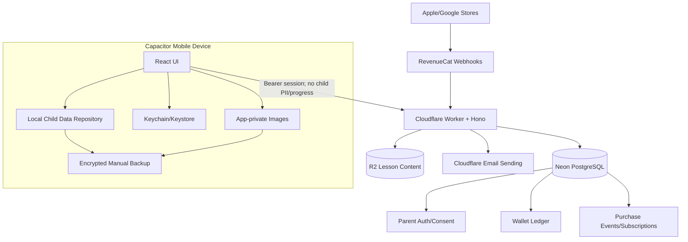

# KẾ HOẠCH TRIỂN KHAI CHI TIẾT — PARENT ZONE v1.2.0

**Dự án:** NovaStars
**Mã kế hoạch:** `IMP-MOD-PARENT-001`
**Phiên bản:** `v1.0.0`
**Ngày:** 22/08/2026
**PRD nguồn:** [`PRD_PARENT_ZONE.md`](./PRD_PARENT_ZONE.md)
**Trạng thái:** `MVP implemented — chờ cấu hình hạ tầng và kiểm định store/native`

---

## 0. Trạng thái triển khai (22/08/2026)

Phần mã nguồn MVP đã hoàn tất: Parent Zone UI, tài khoản email/OTP/PIN 6 số, hồ sơ trẻ local, báo cáo local, nhiệm vụ từ bài học, giới hạn thời gian, cẩm nang, backup mã hóa, wallet/ledger server-authoritative, RevenueCat adapter/webhook và feature flags. Direct Neon và PIN mặc định đã được loại khỏi client; God Mode không render ở production.

Các việc còn lại là release gates phụ thuộc môi trường bên ngoài, không phải chức năng còn thiếu trong repo: chạy migration trên Neon, cấp secrets/Hyperdrive và domain gửi email, tạo sản phẩm App Store/Google Play/RevenueCat, thêm project native iOS/Android, khai báo quyền sinh trắc học, kiểm thử sandbox/refund và hậu kiểm nội dung sức khỏe. Thực hiện theo [`PARENT_ZONE_RELEASE_RUNBOOK.md`](./PARENT_ZONE_RELEASE_RUNBOOK.md).

---

## 1. Mục tiêu kế hoạch

Kế hoạch này chuyển PRD Parent Zone v1.2.0 thành thứ tự triển khai có dependency rõ ràng cho frontend, backend, mobile native, QA, content và vận hành.

Mục tiêu cuối:

1. Có Parent Zone an toàn bằng tài khoản phụ huynh, PIN 6 số và OTP.
2. Giữ toàn bộ hồ sơ/tiến độ trẻ trên thiết bị.
3. Có screen-time, báo cáo local, xóa và backup mã hóa.
4. Có nhiệm vụ từ bài học và chuyển thưởng Kim Cương on-the-fly.
5. Có ledger server-authoritative, RevenueCat và VIP subscription.
6. Đủ release gates để pilot trước, bật IAP production sau.

### 1.1. Giả định nguồn lực tham chiếu

- 1 frontend/mobile engineer.
- 1 backend/Cloudflare engineer.
- 1 QA engineer bán thời gian từ Sprint 1, toàn thời gian từ Sprint 6.
- 1 product/content owner.
- Security/privacy reviewer theo milestone.

Với sprint 2 tuần, lịch tham chiếu là 9 sprint cho pilot không IAP và 10–11 sprint cho IAP production. Đây là thứ tự dependency, không phải cam kết ngày nếu nguồn lực khác.

---

## 2. Hiện trạng repo và khoảng cách cần xử lý

### 2.1. Hiện trạng

- Client: React 18, Vite, Zustand, Capacitor 6.
- Parent tab và dashboard đã tồn tại nhưng chỉ là UI báo cáo đơn giản.
- PIN hiện là chuỗi `1234` trong Zustand và persisted local storage.
- Hồ sơ hiện chỉ có một `UserProfile`; chưa có family/multi-profile model.
- Kim Cương/Xu đang được cộng trừ trực tiếp trong client.
- Client có thể kết nối Neon trực tiếp qua `VITE_NEON_DATABASE_URL`.
- Server là Hono trên Cloudflare Workers, kết nối Neon và R2.
- Server chưa có authentication/authorization, wallet ledger hoặc RevenueCat webhook.
- CORS hiện cho phép `origin: *`.
- Schema hiện có `users`, content và `student_mastery_logs`, chưa có Parent Zone entities.
- Chưa có server unit/integration test runner.

### 2.2. Các thay đổi nền tảng bắt buộc

| Khoảng cách | Hành động bắt buộc |
| :--- | :--- |
| PIN local/default | Xóa khỏi persisted state; thiết lập/xác minh server-side |
| Direct Neon từ client | Loại `@neondatabase/serverless` khỏi client và bỏ `VITE_NEON_DATABASE_URL` production |
| Cloud progress | Vô hiệu hóa `POST /api/v1/progress` và `student_mastery_logs` khỏi production flow của app trẻ |
| Một profile | Thêm local family repository và tối đa 4 hồ sơ |
| Diamond local | Tách thành server wallet; client chỉ cache read-only có version |
| Không có ledger | Thêm immutable double-entry-style ledger và idempotency |
| CORS mở | Allowlist theo environment, mobile origin và API auth |
| Upload content không auth | Bảo vệ/di chuyển admin upload khỏi public API trước production |
| God mode | Loại khỏi production bundle |

---

## 3. Kiến trúc mục tiêu



### 3.1. Trust boundaries

- Client được tin cho UX, progress, Xu Nova và dữ liệu học local; không được tin cho PIN, Kim Cương, subscription hoặc product mapping.
- Worker xác thực mọi request, kiểm tra quyền sở hữu `childSlotId` và chịu trách nhiệm transaction/idempotency.
- RevenueCat client callback chỉ cập nhật trạng thái pending; webhook/server quyết định credit.
- Neon không được truy cập từ mobile client.
- R2 chỉ cung cấp lesson package đã đóng băng; upload content phải là admin-only.

### 3.2. Privacy-safe measurement

- Không gửi mission completion, usage, mastery hoặc profile analytics lên production server.
- KPI mission/screen-time được đo bằng automated QA và local diagnostic export có consent trong pilot.
- KPI payer/subscription dùng purchase events server vì đây là dữ liệu giao dịch của người lớn.
- Logs server không được chứa PIN, OTP, email đầy đủ, child nickname hoặc mission title.

---

## 4. Cấu trúc code mục tiêu

Tên file có thể điều chỉnh theo convention khi triển khai, nhưng trách nhiệm phải được tách tương đương.

### 4.1. Client

```text
client/src/
  features/parent-zone/
    components/
      ParentGate.tsx
      ParentShell.tsx
      ChildProfileManager.tsx
      ScreenTimePanel.tsx
      ProgressReport.tsx
      MissionApprovalCard.tsx
      ParentStore.tsx
      DataPrivacyPanel.tsx
    stores/
      useParentSessionStore.ts      # memory-only/session UI
      useFamilyLocalStore.ts        # projection over local repository
      useWalletCacheStore.ts        # server cache, not authoritative
    services/
      parentApi.ts
      localDataRepository.ts
      secureSessionStorage.ts
      biometricGate.ts
      screenTimeTracker.ts
      backupService.ts
      imageVault.ts
      revenueCatClient.ts
    domain/
      parentTypes.ts
      screenTimePolicy.ts
      missionPolicy.ts
      masteryPolicy.ts
  migrations/
    localStateV2ToV3.ts
```

### 4.2. Server

```text
server/src/
  index.ts
  app.ts
  config.ts
  middleware/
    auth.ts
    cors.ts
    requestId.ts
    rateLimit.ts
    errorHandler.ts
  routes/
    parentAuth.ts
    childSlots.ts
    wallets.ts
    rewards.ts
    itemPurchases.ts
    subscriptions.ts
    revenueCatWebhook.ts
  services/
    emailService.ts
    otpService.ts
    pinService.ts
    sessionService.ts
    ledgerService.ts
    purchaseService.ts
    reconciliationService.ts
  repositories/
    parentRepository.ts
    walletRepository.ts
    purchaseRepository.ts
  validation/
    parentSchemas.ts
    walletSchemas.ts
    webhookSchemas.ts
  security/
    redaction.ts
    audit.ts
server/migrations/
  0001_parent_auth.sql
  0002_wallet_ledger.sql
  0003_purchase_subscriptions.sql
  0004_audit_and_consent.sql
```

---

## 5. Database plan

### 5.1. Nguyên tắc

- Dùng migration tăng dần; không chỉ sửa trực tiếp `scripts/db/schema.sql`.
- Mọi bảng có `created_at`, `updated_at` khi phù hợp và UTC timestamps.
- Tiền tệ ảo lưu bằng integer/bigint; không dùng floating point.
- Ledger append-only; sửa sai bằng compensating entry, không update/delete bút toán.
- Unique constraints là lớp bảo vệ idempotency cuối cùng.
- Transaction tài chính phải khóa/kiểm tra số dư phù hợp để không âm.

### 5.2. Schema logical

#### `parent_accounts`

- `id UUID PK`
- `email_normalized VARCHAR UNIQUE`
- `email_verified_at TIMESTAMPTZ NULL`
- `status active|deleting|closed`
- timestamps

#### `parent_auth_credentials`

- `parent_id PK/FK`
- `pin_verifier`, `pin_salt`, `verifier_version`
- `failed_attempts`, `lock_level`, `locked_until`
- `pin_changed_at`

PIN sử dụng KDF có salt riêng và server pepper từ secret; tham số được security review, không hard-code trong PRD.

#### `email_otp_challenges`

- `id UUID PK`, `parent_id/email_hash`
- `purpose verify_email|reset_pin|login`
- `otp_hash`, `expires_at`, `attempts`, `resend_after`, `consumed_at`
- Không lưu OTP thô.

#### `parent_sessions`

- `id UUID PK`, `parent_id FK`
- `refresh_token_hash`, `device_id_hash`
- `expires_at`, `revoked_at`, `last_reauthenticated_at`

Access token giữ trong memory; refresh token lưu bằng secure device storage.

#### `child_wallet_slots`

- `id UUID PK`, `parent_id FK`
- `status active|closed`, `closed_at`
- Không có nickname, grade, avatar hoặc learning fields.

#### `wallet_accounts`

- `id UUID PK`, `parent_id FK`
- `child_slot_id NULL` cho parent vault; NOT NULL cho child wallet
- `wallet_type parent_vault|child_diamonds`
- `balance BIGINT CHECK balance >= 0`
- `version BIGINT` cho optimistic/client cache refresh
- Unique parent vault và unique child wallet/slot.

#### `wallet_ledger`

- `id UUID PK`, `transaction_group_id UUID`
- `wallet_id FK`, `direction credit|debit`, `amount BIGINT CHECK amount > 0`
- `reason purchase_credit|mission_transfer|item_purchase|profile_closure_return|refund_adjustment|manual_reconciliation`
- `external_reference`, `metadata JSONB` đã allowlist/redact
- timestamps

Mỗi transfer có debit và credit cùng `transaction_group_id`; tổng net trong group phải bằng 0 trừ external purchase/refund boundary đã định nghĩa.

#### `reward_transfers`

- `reward_request_id VARCHAR UNIQUE`
- `parent_id`, `child_slot_id`, `diamond_amount`
- `ledger_transaction_group_id UNIQUE`
- Không lưu mission title/content/lesson result.

#### `purchase_events`

- `revenuecat_event_id VARCHAR UNIQUE`
- `store_transaction_id`, `app_user_id`, `product_id`, `event_type`
- `normalized_payload JSONB` chỉ gồm fields cần đối soát
- `processing_status`, `processed_at`, `error_code`

#### `subscriptions`

- `parent_id`, `product_id`, `entitlement_id`
- `status`, `period_start`, `period_end`, `will_renew`
- `last_store_transaction_id`

#### `item_entitlements`

- `child_slot_id`, `sku`, `source_transaction_group_id`
- Unique active entitlement theo slot/SKU.

#### `consent_receipts` và `security_audit_log`

- Consent: `parent_id`, `policy_version`, `scope`, `accepted_at`.
- Audit: actor, action, result, request ID, timestamp; không log secret/child PII.

### 5.3. Transaction bắt buộc

- Approve reward có Kim Cương.
- Mua item bằng Kim Cương.
- Đóng child slot và hoàn số dư.
- Credit purchase/renewal từ webhook.
- Refund/reconciliation adjustment.

---

## 6. API và security contract

### 6.1. Authentication lifecycle

1. `register` nhận email normalized, tạo challenge và gửi verification OTP.
2. `verify-email` tiêu thụ OTP, tạo account hoặc xác minh account pending.
3. `pin/setup` nhận PIN 6 số qua TLS, tạo verifier server-side.
4. Client nhận access token ngắn hạn và refresh token; refresh token vào Keychain/Keystore.
5. `pin/verify` tạo parent-unlocked claim/re-auth timestamp ngắn hạn.
6. Hành động nhạy cảm kiểm tra re-auth freshness phía server.

### 6.2. Endpoint requirements

| Endpoint | Validation/Authorization | Idempotency |
| :--- | :--- | :--- |
| Parent register/OTP | Email normalization, generic response, IP/email rate limit | Challenge reuse window |
| PIN verify/reset | 6 digits, account lockout, audit | OTP consume-once |
| Create child slot | Auth + max 4 active slots | `Idempotency-Key` |
| Delete child slot | Auth + fresh re-auth + ownership | Delete request key |
| Wallet GET | Auth; only own vault/slots | N/A |
| Reward approve | Auth + fresh gate + slot ownership + positive integer | Unique `rewardRequestId` |
| Item purchase | Auth + slot ownership + allowed SKU | Unique purchase request ID |
| RevenueCat webhook | Authorization secret + schema validation + mapped product | Unique RevenueCat event ID/store transaction ID |
| Account delete | Auth + fresh re-auth + typed confirmation | Delete request key |

### 6.3. CORS và headers

- Thay `origin: *` bằng allowlist theo `ENVIRONMENT`.
- Chỉ cho methods/headers thực sự dùng.
- Thêm request ID và security headers.
- Không trả stack trace/error nội bộ ở production.
- Admin content upload tách auth role hoặc tắt khỏi public production Worker.

### 6.4. Email OTP

- Dùng Cloudflare Email Sending binding trong Worker, không dùng API key trong source.
- Preflight bắt buộc: onboard sending domain, SPF/DKIM, cấu hình `send_email` binding và generate Worker types.
- Sender bị giới hạn, ví dụ `security@<domain>`; luôn có HTML và text body.
- Chỉ gửi transactional email; không dùng luồng OTP cho marketing.
- Retry lỗi tạm thời có exponential backoff; validation/sender errors không retry mù.
- Logs chỉ giữ provider result/request ID, không log OTP.

---

## 7. Local storage và migration plan

### 7.1. Repository abstraction

Tạo `LocalDataRepository` để UI không phụ thuộc trực tiếp `localStorage`:

```typescript
interface LocalDataRepository {
  getFamily(): Promise<LocalFamilyData>;
  saveFamily(data: LocalFamilyData): Promise<void>;
  transact<T>(fn: (draft: LocalFamilyData) => T): Promise<T>;
  exportEncrypted(passphrase: string): Promise<Blob>;
  importEncrypted(file: Blob, passphrase: string): Promise<ImportPreview>;
  deleteChild(localId: string): Promise<void>;
  deleteAll(): Promise<void>;
}
```

- Mobile production: SQLite-compatible native local database và app-private filesystem.
- Web/dev fallback: IndexedDB.
- `Capacitor Preferences` chỉ dùng cho flags nhỏ, không dùng cho profile/progress/ảnh.
- Persisted schema có `schemaVersion` và migration tests.

### 7.2. Migration v2 → v3

1. Đọc `novastars_space_state_v2` một lần.
2. Tạo một `LocalChildProfile` từ user hiện tại.
3. Giữ nickname/name, avatar, XP, stars, Xu, progress và customization.
4. Grade chuyển thành `gradeCosmetic`.
5. Không migrate `parentPin: '1234'`; bắt thiết lập account/PIN mới.
6. Không coi local `diamonds/gems` cũ là tiền đã mua. Với bản prototype hiện tại, production wallet bắt đầu từ 0; dev fixture giữ riêng sau dev flag.
7. Sau khi server tạo `childSlotId`, ghi mapping local.
8. Chỉ xóa key v2 sau khi write/read-back v3 thành công; giữ backup migration cục bộ cho rollback một phiên bản.

Nếu đã có người dùng thật có Kim Cương trả tiền trước v1.2, dừng migration mặc định và chạy reconciliation riêng.

### 7.3. Direct database removal

- Xóa `@neondatabase/serverless` khỏi client dependencies.
- Xóa `VITE_NEON_DATABASE_URL` khỏi build/runtime secrets phía client.
- `fetchQuestionsFromNeon` thay bằng content API/R2 package fetch qua Worker.
- `syncProgressToNeon` bị loại; progress ghi local repository.
- Server endpoint `/api/v1/progress` tắt/deprecate và schema progress cũ không được dùng cho Parent Zone.

### 7.4. Backup encryption

- File backup có magic header, schema version, salt, nonce, ciphertext và integrity tag.
- Dùng Web Crypto chuẩn, authenticated encryption và KDF từ passphrase; tham số security-reviewed.
- Import parse vào vùng tạm, kiểm tra integrity/schema/account binding, hiển thị preview rồi mới commit.
- Import thất bại không được sửa dữ liệu hiện tại.
- Ảnh nằm app-private và bị đánh dấu loại khỏi automatic OS cloud backup; chỉ vào export khi phụ huynh chủ động.

---

## 8. Kế hoạch triển khai theo phase

## Phase 0 — Architecture, privacy và test foundation

**Mục tiêu:** Khóa boundary trước khi tạo UI mới.
**Phụ thuộc:** PRD v1.2.0.
**Exit gate:** ADR/API/schema được review.

### Tasks

- [ ] `PZ-0001` Viết ADR: local-only child data và server-authoritative finance.
- [ ] `PZ-0002` Viết threat model: child bypass, local tampering, brute force PIN, webhook replay, duplicate reward, backup theft.
- [ ] `PZ-0003` Viết data inventory/data-flow diagram và log-redaction policy.
- [ ] `PZ-0004` Chốt OpenAPI/validation schema cho auth, child slots, wallets, rewards, subscription, delete.
- [ ] `PZ-0005` Thiết lập server Vitest/integration harness với test database schema cô lập.
- [ ] `PZ-0006` Thiết lập migration runner và CI migration check.
- [ ] `PZ-0007` Định nghĩa feature flags: `parent_zone_v2`, `real_life_rewards`, `parent_iap`.
- [ ] `PZ-0008` Đóng/tách admin content upload khỏi public route.

### Deliverables

- ADR, threat model, OpenAPI draft, migration skeleton, CI test command.

## Phase 1 — Backend auth, consent và email OTP

**Mục tiêu:** Có tài khoản phụ huynh và parental gate server-side.
**Phụ thuộc:** Phase 0.
**Exit gate:** PIN/OTP/rate-limit tests pass; không còn PIN persisted.

### Backend

- [ ] `PZ-0101` Migration `parent_accounts`, credentials, OTP, sessions, consent, audit.
- [ ] `PZ-0102` Email normalization và generic register response chống account enumeration.
- [ ] `PZ-0103` PIN KDF service với versioned parameters/salt/server pepper.
- [ ] `PZ-0104` Lockout state machine 5m → 15m → 1h.
- [ ] `PZ-0105` OTP create/hash/expire/attempt/resend/consume-once.
- [ ] `PZ-0106` Cloudflare Email Sending adapter và test double.
- [ ] `PZ-0107` Access/refresh session và fresh re-auth claim.
- [ ] `PZ-0108` Auth middleware, request ID, redacted audit log, restricted CORS.

### Cloudflare/email operations

- [ ] `PZ-0110` Onboard sender domain; xác minh SPF/DKIM.
- [ ] `PZ-0111` Thêm `send_email` binding theo staging/production và generate Worker types.
- [ ] `PZ-0112` Test deliverability bằng địa chỉ thật do đội sở hữu; không dùng fake recipients.

### Client

- [ ] `PZ-0120` Tạo account/email verification/setup PIN screens.
- [ ] `PZ-0121` Tạo keypad PIN 6 số và states loading/error/locked-until.
- [ ] `PZ-0122` Parent session store memory-only; refresh token qua secure storage.
- [ ] `PZ-0123` Auto-lock app background và idle 3 phút.
- [ ] `PZ-0124` Biometric opt-in sau PIN và fallback an toàn.
- [ ] `PZ-0125` Xóa PIN mặc định khỏi `GameSettings` và migration không mang PIN cũ.

## Phase 2 — Local family repository, profiles, delete và backup

**Mục tiêu:** Multi-profile local-only có lifecycle đầy đủ.
**Phụ thuộc:** Phase 1 cho account/child slot.
**Exit gate:** Migration/delete/backup tests pass; network capture không có child profile.

### Tasks

- [ ] `PZ-0201` Implement local repository + schema versioning + transaction lock.
- [ ] `PZ-0202` Migration v2 → v3, giữ progress/Xu/customization, reset legacy diamonds production.
- [ ] `PZ-0203` Create child slot API và local mapping `localId ↔ childSlotId`.
- [ ] `PZ-0204` UI tạo/sửa/chuyển tối đa 4 hồ sơ; grade cosmetic.
- [ ] `PZ-0205` Ngăn trẻ tự switch profile ngoài Parent Zone.
- [ ] `PZ-0206` Image vault app-private và exclude automatic backup.
- [ ] `PZ-0207` Encrypted export/import, preview và rollback-on-failure.
- [ ] `PZ-0208` Delete child orchestration: server return balance → local delete.
- [ ] `PZ-0209` Delete account flow và warning số dư/hệ quả.
- [ ] `PZ-0210` Privacy/consent screens và marketing opt-in tách biệt.

## Phase 3 — Screen time và báo cáo local

**Mục tiêu:** Enforcement đúng định nghĩa, không upload usage.
**Phụ thuộc:** Phase 2 profile repository.
**Exit gate:** Clock/background/curfew/activity-boundary E2E pass.

### Tasks

- [ ] `PZ-0301` Usage event model theo child và category.
- [ ] `PZ-0302` Foreground/interaction tracker; exclude Parent Zone/background/audio.
- [ ] `PZ-0303` Daily rollover và weekly aggregation theo timezone device.
- [ ] `PZ-0304` Limit presets/custom và warnings 5/1 phút.
- [ ] `PZ-0305` Activity boundary contract cho lesson coordinate và mini-game turn.
- [ ] `PZ-0306` Chặn start mới khi limit/curfew đã chạm; hoàn thành activity hiện tại rồi khóa.
- [ ] `PZ-0307` Extension +15 phút, tối đa 2 lần/ngày, yêu cầu gate.
- [ ] `PZ-0308` Curfew 21:30–06:00 và clock rollback guard.
- [ ] `PZ-0309` Eye-break component; massage content giữ feature/content flag pending review.
- [ ] `PZ-0310` First-attempt answer events và mastery policy minimum 5/80%.
- [ ] `PZ-0311` Weekly/lifetime reports, radar confidence state và disclaimer.

## Phase 4 — Parent guidance và content integration

**Mục tiêu:** Cẩm nang/podcast/trò chuyện curated hoạt động offline/local.
**Phụ thuộc:** Lesson IDs ổn định và Parent Shell.
**Exit gate:** Content review metadata và link gate pass.

### Tasks

- [ ] `PZ-0401` Content schema cho guide, podcast và conversation template.
- [ ] `PZ-0402` Ánh xạ lesson/content ID → conversation template.
- [ ] `PZ-0403` Parent library UI, search/filter cơ bản, offline package.
- [ ] `PZ-0404` Podcast player chỉ trong Parent Zone.
- [ ] `PZ-0405` External links qua re-auth/parent context.
- [ ] `PZ-0406` Review metadata: author/reviewer/version/date/status.
- [ ] `PZ-0407` Production build từ chối content `PENDING_HEALTH_REVIEW` nếu flag bật.

## Phase 5 — Wallet ledger và child slots

**Mục tiêu:** Nền tài chính an toàn trước missions/IAP.
**Phụ thuộc:** Phase 0 schema; Phase 1 auth.
**Exit gate:** Concurrent debit/transfer/idempotency/property tests pass.

### Tasks

- [ ] `PZ-0501` Migration child slots, wallets, ledger, reward transfers, entitlements.
- [ ] `PZ-0502` Ledger service với transaction group và append-only invariants.
- [ ] `PZ-0503` Parent vault/child wallet GET với ownership filtering/version.
- [ ] `PZ-0504` Reward transfer atomic/idempotent, chống số dư âm.
- [ ] `PZ-0505` Item purchase debit/idempotency/entitlement.
- [ ] `PZ-0506` Child slot closure và `CHILD_PROFILE_CLOSURE_RETURN`.
- [ ] `PZ-0507` Wallet cache UI; không có setter/debug path production.
- [ ] `PZ-0508` Reconciliation query: ledger sum vs wallet balance.
- [ ] `PZ-0509` Admin-only manual reconciliation runbook, không làm UI người dùng.

### Required tests

- 50 requests cùng reward ID → một transfer.
- Hai reward khác nhau cạnh tranh số dư → không âm, tối đa số hợp lệ commit.
- Client gửi amount âm/decimal/overflow/slot người khác → 4xx, không ledger.
- Delete slot đồng thời với reward/item purchase → một thứ tự hợp lệ, không mất tiền.

## Phase 6 — Mission bridge MVP

**Mục tiêu:** Nhiệm vụ lesson-defined và thưởng on-the-fly.
**Phụ thuộc:** Phase 2 local data, Phase 5 wallets.
**Exit gate:** End-to-end child complete → parent approve → child balance/item purchase pass.

### Tasks

- [ ] `PZ-0601` Chuẩn hóa `realLifeTask` trong lesson package có stable `contentMissionId`/difficulty.
- [ ] `PZ-0602` Khi trẻ hoàn thành, tạo local mission idempotent `pending_parent_approval`.
- [ ] `PZ-0603` Parent approval queue/card; không có create/edit mission UI.
- [ ] `PZ-0604` Selector 0/5/10/20/custom; integer validation; double confirm >=500.
- [ ] `PZ-0605` 0 diamonds: local approve không gọi transfer API.
- [ ] `PZ-0606` >0 diamonds: API transaction rồi mới commit local verified state.
- [ ] `PZ-0607` Retry/recovery khi server success nhưng client crash trước local commit.
- [ ] `PZ-0608` Xu cap 200/ngày, 1.000/tuần và partial award display.
- [ ] `PZ-0609` Celebration event sau authoritative success.
- [ ] `PZ-0610` Không có undo/reserve/create/repeat paths trong production UI/API.

## Phase 7 — RevenueCat, consumables và VIP

**Mục tiêu:** Purchase/subscription server-authoritative.
**Phụ thuộc:** Phase 5 ledger; store products/RevenueCat project.
**Exit gate:** Sandbox matrix và reconciliation pass.

### Backend

- [ ] `PZ-0701` Migration purchase events/subscriptions và unique constraints.
- [ ] `PZ-0702` Server product catalog mapping per platform/environment.
- [ ] `PZ-0703` Webhook authorization, body schema validation và event normalization.
- [ ] `PZ-0704` Purchase/renewal credit transaction idempotent.
- [ ] `PZ-0705` Subscription entitlement state machine.
- [ ] `PZ-0706` Cancel, billing retry, grace, expire, refund, revoke handlers.
- [ ] `PZ-0707` Dead-letter/error state và safe replay command/runbook.
- [ ] `PZ-0708` Daily reconciliation report purchase events ↔ ledger ↔ subscription.

### Client/store configuration

- [ ] `PZ-0720` Thêm RevenueCat native SDK/config theo iOS/Android.
- [ ] `PZ-0721` Parent Store lấy offerings/localized price; không hard-code giá hiển thị.
- [ ] `PZ-0722` Re-auth trước purchase; pending state đến khi server refresh thấy credit.
- [ ] `PZ-0723` VIP entitlement chỉ mở Parent Zone benefits; không energy/skin/Xu direct.
- [ ] `PZ-0724` Restore UI không hứa cấp lại consumables.
- [ ] `PZ-0725` Transaction confirmation email gọi là xác nhận nội bộ, không phải hóa đơn store.

### Sandbox matrix

- New purchase từng consumable.
- VIP month/annual initial purchase và renewal.
- Duplicate webhook/reordered webhook/delayed webhook.
- Cancel, billing retry, grace, expire.
- Refund/revoke khi parent/child còn đủ hoặc đã tiêu Kim Cương.
- Restore sau reinstall.
- Network mất giữa store success và server credit.
- Product ID không map/sai environment.

## Phase 8 — Hardening, pilot và release

**Mục tiêu:** Pilot an toàn, rollout có thể dừng.
**Phụ thuộc:** Các phase theo scope pilot/IAP.
**Exit gate:** Release checklist ký duyệt.

### Tasks

- [ ] `PZ-0801` E2E full regression mobile viewport và native lifecycle.
- [ ] `PZ-0802` Security review: auth, lockout, token storage, IDOR, webhook replay, CORS.
- [ ] `PZ-0803` Privacy network inspection: không child profile/progress/usage/photo.
- [ ] `PZ-0804` Backup corrupt/wrong password/large image/reinstall tests.
- [ ] `PZ-0805` Accessibility: screen reader labels, contrast, focus, large text, touch targets.
- [ ] `PZ-0806` Production build audit: God mode, default PIN, DB URL, debug wallet setters absent.
- [ ] `PZ-0807` Observability dashboard cho auth errors, OTP delivery, webhook failures, ledger mismatch.
- [ ] `PZ-0808` Pilot 20–30 gia đình với consented local diagnostic export/interview.
- [ ] `PZ-0809` Feature-flag rollout 5% → 25% → 100% Parent Zone.
- [ ] `PZ-0810` IAP flag giữ off cho đến khi store/policy/privacy gates pass.
- [ ] `PZ-0811` Incident runbooks: compromised account, stuck purchase, duplicate event, ledger mismatch, email outage.
- [ ] `PZ-0812` App Review/Play Console notes mô tả parental gate và IAP access.

---

## 9. Test strategy

### 9.1. Unit tests

- PIN lockout state machine.
- OTP expiry/attempt/resend/consume-once.
- Screen-time category/rollover/curfew/clock rollback.
- Mastery minimum sample và first-attempt accuracy.
- Xu daily/weekly cap và partial award.
- Mission local state transitions.
- Backup serialize/encrypt/integrity/migration.
- Product mapping và webhook normalization.

### 9.2. Integration tests

- Auth + session + fresh re-auth.
- Ledger atomicity và unique constraints trên test Postgres.
- Reward/item purchase ownership/IDOR.
- Child slot closure concurrent với debit.
- RevenueCat event replay/reordering.
- Email adapter success/transient/permanent error bằng test double; staging gửi thật có kiểm soát.

### 9.3. E2E tests

- First-run parent onboarding → PIN → child profile.
- Auto-lock sau idle/background.
- Trẻ không thể truy cập Parent Store hoặc switch profile.
- Screen time warnings → finish current activity → lock → parent extension.
- Mission 0 diamonds và mission có diamonds.
- Insufficient vault và double confirmation >=500.
- Delete child return balance và local purge.
- Backup/export → clear → import.
- Purchase pending → webhook credit → wallet refresh.

### 9.4. Native/manual tests

- Face ID/Touch ID/BiometricPrompt fallback.
- Keychain/Keystore persistence qua app restart.
- App background/foreground/OS kill.
- OS automatic backup exclusion cho ảnh/database.
- Store sandbox trên thiết bị iOS và Android thật.
- Timezone và đổi đồng hồ thiết bị.

### 9.5. Privacy assertions trong CI/release

- Static scan chặn `VITE_NEON_DATABASE_URL` trong client bundle.
- Static scan chặn `parentPin`, default `1234`, PIN/OTP logging.
- Production bundle không chứa God mode entrypoints/test fixtures.
- Contract tests xác nhận API child slot không có nickname/grade/progress fields.

---

## 10. Observability và vận hành

### 10.1. Được phép ghi server metrics

- Request count/status/latency theo route, không có child identifiers trong label.
- Auth success/failure aggregate, lockout count.
- OTP delivery result aggregate.
- Webhook received/processed/duplicate/failed.
- Ledger transaction success/failure và reconciliation mismatch.
- Subscription status counts và payer conversion từ dữ liệu người lớn.

### 10.2. Không được log/gửi

- PIN, OTP, access/refresh token.
- Email đầy đủ; chỉ hash hoặc redacted form khi thật sự cần.
- Nickname, avatar, grade, answers, mission title, usage, ảnh.
- Raw RevenueCat payload nếu chứa fields ngoài allowlist cần thiết.

### 10.3. Alerts tối thiểu

- Webhook failure rate tăng hoặc backlog chưa xử lý.
- Ledger mismatch khác 0.
- OTP sending outage/rate-limit spike.
- Auth brute-force spike.
- Purchase credited nhưng wallet refresh liên tục thất bại.

---

## 11. Rollout và rollback

### 11.1. Feature flags

| Flag | Default production | Điều kiện bật |
| :--- | :--- | :--- |
| `parent_zone_v2` | Off | Phase 1–4 + privacy gate pass |
| `real_life_rewards` | Off | Phase 5–6 + ledger tests pass |
| `parent_iap` | Off | Phase 7 + store/policy/privacy gates pass |
| `eye_massage_content` | Off | Hậu kiểm chuyên môn pass |

### 11.2. Rollback

- UI feature flag rollback không được xóa/mutate ledger.
- Database migrations ưu tiên additive; destructive cleanup ở release sau.
- Webhook endpoint vẫn nhận/ghi event khi IAP UI flag off nếu đã có subscription active.
- Khi wallet API gặp sự cố: chuyển UI sang read-only, không cho client fallback cộng local.
- Khi email outage: giữ challenge hợp lệ, hiển thị retry sau; không bỏ qua xác minh.

---

## 12. Rủi ro và biện pháp

| Rủi ro | Mức | Biện pháp |
| :--- | :---: | :--- |
| Local data mất khi gỡ app/mất máy | Cao | Warning rõ, encrypted manual backup, test restore |
| Trẻ sửa local Xu/progress | Trung bình | Chấp nhận trong economy offline; Kim Cương vẫn server-authoritative |
| Webhook retry cộng tiền hai lần | Cao | Unique event/transaction IDs + transaction + replay tests |
| Parent reward và item purchase đồng thời làm âm ví | Cao | Row/transaction locking + balance check + concurrency tests |
| Client crash sau server transfer | Cao | Idempotent reward ID và recovery/reconcile local state |
| Subscription cấp Kim Cương lặp | Cao | Một credit/store transaction; renewal matrix |
| PIN brute force/account enumeration | Cao | Generic response, server lockout, IP/email rate limit, audit |
| Child PII bị log vô tình | Cao | Contract allowlist, redaction, static/network tests |
| Eye massage chưa review | Trung bình | Feature/content flag off production đến khi duyệt |
| Activity kéo dài sau hạn mức | Chấp nhận MVP | Không cho start mới; theo dõi qua pilot local diagnostic |
| Single-device không đáp ứng một số gia đình | Chấp nhận MVP | Ghi rõ limitation; backup thủ công; multi-device backlog |

---

## 13. Dependency/decision checklist trước khi code từng phần

### Có thể bắt đầu ngay

- ADR/data boundary.
- Local repository spike và migration design.
- Server test/migration foundation.
- UI Parent Shell và design system states.

### Cần thông tin vận hành trước Phase 1 hoàn tất

- Domain email sẽ dùng cho OTP.
- Privacy policy URL và policy version đầu tiên.
- Staging/production origins cho CORS.
- Quy trình giữ/xóa ledger theo tư vấn pháp lý.

### Cần cấu hình thương mại trước Phase 7

- Apple/Google bundle IDs và store product IDs.
- RevenueCat project, entitlements, offerings và webhook secret.
- Localized store metadata.
- Danh sách Parent Zone benefits của VIP và content availability.

---

## 14. Definition of Done

Một task chỉ Done khi:

- Code review hoàn tất và không đưa child data vượt boundary.
- Unit/integration test tương ứng pass.
- Error/loading/offline/retry state đã xử lý.
- Accessibility labels và localization tiếng Việt có đủ.
- Không log secret/PII.
- Acceptance criteria liên quan được map vào test ID.
- Tài liệu/API/schema/migration được cập nhật.

Parent Zone MVP chỉ Done khi:

- Tất cả release gates trong PRD đạt.
- Không còn PIN mặc định/direct Neon client/cloud progress production.
- Wallet ledger/idempotency/concurrency pass.
- Delete và backup được thử trên thiết bị thật.
- Feature flags và rollback runbook đã diễn tập.
- IAP vẫn off nếu bất kỳ policy/privacy/store gate nào chưa đạt.

---

## 15. Thứ tự pull request khuyến nghị

1. `PR-01`: ADR + test runner + migration framework + CORS/config foundation.
2. `PR-02`: Parent auth schema/services/routes + email test adapter.
3. `PR-03`: Client parent onboarding/PIN/session + remove default PIN.
4. `PR-04`: Local repository v3 + migration + remove direct Neon/progress sync.
5. `PR-05`: Multi-profile + privacy/delete + child slot API.
6. `PR-06`: Backup/image vault.
7. `PR-07`: Screen-time/curfew/activity boundary.
8. `PR-08`: Reports/mastery/guidance content.
9. `PR-09`: Wallet/ledger/reconciliation backend.
10. `PR-10`: Mission bridge + Xu caps + wallet cache.
11. `PR-11`: Item purchase by child diamonds.
12. `PR-12`: RevenueCat webhook/product catalog/subscriptions.
13. `PR-13`: Parent Store/VIP UI + sandbox E2E.
14. `PR-14`: Hardening, production bundle audit, pilot flags/runbooks.

Mỗi PR nên độc lập, có migration/rollback note và không bật production feature mặc định.

---

*Kế hoạch này là companion document của PRD v1.2.0. Thay đổi hành vi sản phẩm phải cập nhật PRD/decision log trước; thay đổi thứ tự kỹ thuật có thể cập nhật trực tiếp kế hoạch nếu vẫn giữ nguyên acceptance criteria.*
