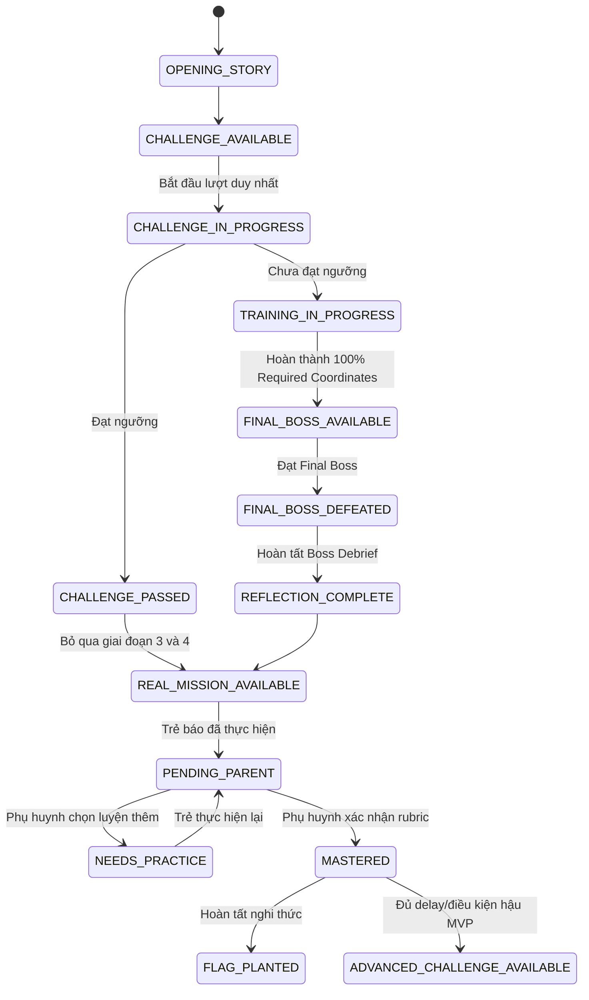

# PRD — HỆ THỐNG GALAXY, PLANET & MASTERY JOURNEY

> **Mã tài liệu**: `NS-PRD-GPM-01`  
> **Phiên bản**: `v0.10.0 — Proposed Canonical`  
> **Ngày**: 22/08/2026  
> **Phạm vi**: Bản đồ học tập, Planet Journey, branching dialogue, Challenge Test, learning progression, Final Boss, nhiệm vụ đời thực, xác nhận phụ huynh và nghi thức cắm cờ  
> **Đối tượng**: Product, Curriculum, Game Design, UX/UI, Engineering, Data, QA  
> **Tài liệu liên quan**: PRD V2, NLAS 10-stage, Parent Zone, Personalization System, curriculum workbook và question bank hiện có

---

## 1. Tóm tắt quyết định sản phẩm

NovaStars tổ chức hành trình học theo mô hình:

```text
Vũ trụ NovaStars
└── Galaxy — một nhóm năng lực lớn
    └── Planet — một kỹ năng sống ổn định qua nhiều độ tuổi
        ├── Planet Track — tuyến nội dung phù hợp learning band
        │   ├── Opening Story — graphic-novel dialogue có thể phân nhánh
        │   ├── Challenge Test — một lượt chứng minh năng lực để bỏ qua tuyến học
        │   ├── 3–5 Training Coordinates — minigame tăng dần theo Bloom
        │   └── Final Boss & Reflection — đánh giá tổng hợp và cam kết hành động
        └── Bonus Coordinate — nhiệm vụ ngoài đời, mở sau khi thắng Boss
            └── Parent Verification — phụ huynh quan sát và xác nhận
                └── Mastery Ritual — cắm cờ, nhận huy hiệu và phần thưởng
```

Các quyết định canonical đề xuất:

1. Dùng **6 Galaxy** để khớp trực tiếp với 6 ngân hàng câu hỏi theo nhóm hiện có.
2. Không lấy nguyên 36 nhãn macro trong curriculum làm 36 Planet. Chúng là **skill family/cluster**; một kỹ năng đủ độc lập để có Final Boss và nhiệm vụ đời thực riêng sẽ là một Planet. Vì vậy “thoát hiểm hỏa hoạn”, “xử lý khi đi lạc”, “an toàn điện” và “phòng tránh đuối nước” là các Planet riêng.
3. Bộ 34 kỹ năng legacy là danh mục Planet ứng viên có sẵn assessment, nhưng chưa phải catalog đầy đủ vì còn thiếu nhiều kỹ năng tài chính, số, cảm xúc và tự quản trong curriculum mở rộng.
4. Con số **125** trong PRD V2 được hiểu chủ yếu là các **grade-specific learning units/coordinate routes**. Một unit chỉ được nâng thành Planet khi vượt qua tiêu chí granularity tại Mục 5.1.
5. Một Planet tồn tại xuyên suốt nhiều độ tuổi. Nội dung thay đổi theo `learningBand`, nhưng danh tính và lịch sử khám phá của Planet được giữ ổn định.
6. Một Coordinate chỉ được tính hoàn thành khi có **tương tác quan sát được**; xem video, nghe podcast hoặc đọc nội dung đơn thuần chưa đủ.
7. Mỗi PlanetTrack mở đầu bằng graphic-novel dialogue, sau đó cho trẻ đúng **một lượt Challenge Test**. Nếu đạt ngưỡng, trẻ được bỏ qua Training Coordinates và Final Boss để đi thẳng tới nhiệm vụ đời thực.
8. Challenge Test và Final Boss dùng chung ngân hàng đề/blueprint đã duyệt. Challenge engine chịu trách nhiệm random thứ tự câu hỏi và thứ tự đáp án trong từng run.
9. Challenge Test hiển thị điểm số rõ ràng, ví dụ `10/20`, kèm phân loại tổng quát; không tiết lộ đúng/sai hoặc feedback ở cấp câu hỏi.
10. Training route gồm 3–5 minigame tăng dần theo Bloom. `Remember` và `Understand` là bắt buộc; mức cao nhất từ `Apply` đến `Create` được cấu hình theo bản chất của từng kỹ năng.
11. Final Boss là bài đánh giá trí tuệ/tình huống, không phải chiến đấu bạo lực. Đồng hồ hoặc AI Rival tạo kịch tính nhưng **không được biến tốc độ thành điều kiện đạt năng lực**.
12. Thắng Challenge Test hoặc Final Boss chỉ chứng minh năng lực trong app. Planet chỉ đạt `MASTERED` sau nhiệm vụ đời thực được phụ huynh xác nhận.
13. Branching dialogue dùng **Ink + inkjs** làm narrative runtime; NovaStars tự xây React renderer cho giao diện graphic novel, âm thanh, animation, accessibility và analytics.
14. Nghi thức cắm cờ chỉ diễn ra sau `MASTERED`. Cờ ảnh cá nhân phải được phụ huynh duyệt; luôn có cờ preset an toàn để thay thế.
15. Xu/Huy hiệu là phần thưởng học tập đảm bảo. Kim Cương là phần thưởng phụ huynh tùy chọn từ Parent Vault; app không hứa trước số Kim Cương.
16. Dữ liệu học tập, nhiệm vụ, dialogue state và media của trẻ tiếp tục local-first; server chỉ xử lý nội dung phát hành và ledger Kim Cương bằng `childSlotId` ẩn danh.

---

## 2. Bối cảnh và vấn đề cần giải quyết

### 2.1. Trải nghiệm hiện tại

NovaStars đã có các mảnh ghép quan trọng: bản đồ thế giới, hành tinh 3D, marker tọa độ, lesson runner, ngân hàng câu hỏi, Parent Zone, cờ cá nhân, phần thưởng và nhiệm vụ đời thực. Tuy nhiên, kiến trúc nội dung hiện có đang coi một bài học 10 giai đoạn như một đơn vị gần như hoàn chỉnh, trong khi concept mới cần nhiều hoạt động học cùng đóng góp vào một kỹ năng trước khi trẻ gặp Final Boss.

### 2.2. Ba taxonomy đang không đồng nhất

| Nguồn | Cấu trúc hiện có | Vấn đề |
| :--- | :--- | :--- |
| Curriculum mở rộng `Hệ thống kiến thức kỹ năng tiểu học.xlsx` | 36 nhãn skill family/macro-skill, nội dung theo Lớp 1–5 | Granularity không đều; “Kỹ năng an toàn” chứa nhiều kỹ năng đủ lớn để trở thành Planet riêng. Cột nhóm bị merge/để trống nên không thể forward-fill thành nhóm chuẩn một cách máy móc |
| Danh sách `danhsachkinang.xlsx` + `questions_data.js` | 34 kỹ năng, 20 câu/kỹ năng, 5 tier LSCAF | Nhiều nhãn là micro-skill; nhóm cũ chỉ phục vụ biên dịch và không còn hợp lý làm world map |
| PRD V2/wiki/client mock | 5 domain và tuyên bố 125 skills | Trộn khái niệm domain, skill, grade-specific lesson và UI seed data |
| Sáu file `question_bank/group*.md` | 6 nhóm, 390 câu theo 30 chủ đề | Phù hợp làm Galaxy nhưng chưa có stable ID, grade, tier hoặc Planet mapping |

PRD này thiết lập một lớp mapping canonical thay vì xóa hoặc đổi trực tiếp dữ liệu gốc.

### 2.3. Cơ hội sản phẩm

- Trẻ nhìn thấy một mục tiêu năng lực dài hạn, thay vì các bài rời rạc.
- Phụ huynh hiểu rõ khoảng cách giữa “đã học trong app” và “đã làm được ngoài đời”.
- Content team có thể thêm media/game mới vào Planet mà không phá vỡ cấu trúc tiến bộ.
- Question bank được tái sử dụng có chiến lược theo độ khó và mục tiêu đánh giá.
- Cờ cá nhân trở thành dấu mốc mastery có ý nghĩa, không chỉ là vật trang trí.

---

## 3. Mục tiêu, non-goals và nguyên tắc

### 3.1. Mục tiêu

1. Tạo một mô hình thế giới dễ hiểu cho trẻ 6–11 tuổi và có thể mở rộng nội dung trong nhiều năm.
2. Đo được tiến bộ từ nhận biết → luyện tập → vận dụng mô phỏng → thực hành đời thực.
3. Tạo cảm giác chinh phục Boss mà không dùng bạo lực, trừng phạt hoặc cạnh tranh gây áp lực.
4. Đưa phụ huynh vào đúng thời điểm có giá trị nhất: quan sát hành vi đời thực và phản hồi tích cực.
5. Chuẩn hóa dữ liệu để product, curriculum, client, backend và analytics dùng chung một ngôn ngữ.

### 3.2. Non-goals

- Không xây thế giới multiplayer, bảng xếp hạng công khai, PvP hoặc chat.
- Không cho AI tự quyết định trẻ đã thành thạo một kỹ năng đời thực.
- Không yêu cầu ảnh/video làm điều kiện bắt buộc để được công nhận.
- Không mô phỏng trực tiếp hành vi nguy hiểm như lửa thật, điện thật, nước sâu, vật sắc nhọn hoặc tiếp xúc người lạ.
- Không dùng timer để kết luận trẻ không có năng lực.
- Không thiết kế gacha, loot box, pay-to-win hoặc dùng Kim Cương để bỏ qua nội dung học.

### 3.3. Nguyên tắc thiết kế

- **Học để làm được**: in-app mastery là cần nhưng chưa đủ; năng lực hoàn tất bằng hành vi được quan sát.
- **Sai để học**: trẻ không mất HP, tiền, streak hoặc quyền học khi trả lời sai.
- **Một hành tinh, một lời hứa kỹ năng**: tên Planet phải mô tả điều trẻ có thể làm được.
- **Mỗi media phải dẫn tới hành động**: đọc/xem/nghe luôn kết thúc bằng ít nhất một tương tác có phản hồi.
- **Căng thẳng tích cực, không áp lực**: kịch tính đến từ câu chuyện, giới hạn lượt, nhiệm vụ và phản hồi; không đến từ làm nhục hay đe dọa.
- **Parent as coach, not grader**: phụ huynh dùng rubric quan sát ngắn, có lựa chọn “Cần luyện thêm”, không có nút “Con thất bại”.
- **Private by architecture**: bằng chứng media ở trên thiết bị; cờ không công khai; export luôn qua Parent Gate.

---

## 4. Từ điển sản phẩm canonical

| Thuật ngữ | Định nghĩa | Không được dùng để chỉ |
| :--- | :--- | :--- |
| `Galaxy` | Nhóm năng lực lớn, là tầng điều hướng cao nhất của curriculum | Một lớp học hoặc một mùa sự kiện |
| `Planet` | Một kỹ năng sống có identity ổn định | Một video, một bài trắc nghiệm hoặc một lớp học |
| `PlanetTrack` | Tuyến mục tiêu và nội dung của Planet cho một `learningBand` | Hồ sơ lớp mang tính cosmetic |
| `Coordinate` | Một hoạt động học/mini-game hoàn chỉnh, có interaction và feedback | Một trang nội dung chỉ cần mở để pass |
| `RequiredCoordinate` | Tọa độ bắt buộc trước khi mở Boss | Mọi nội dung phụ |
| `OptionalCoordinate` | Tọa độ luyện thêm, ôn tập hoặc enrichment | Điều kiện mastery |
| `FinalBoss` | Đánh giá tổng hợp ở cấp Planet | Boss của từng media nhỏ |
| `BonusCoordinate` | Nhiệm vụ thực hành ngoài đời, chỉ mở sau Boss | Quà ngẫu nhiên |
| `ParentVerification` | Xác nhận dựa trên quan sát/rubric | Chẩn đoán tâm lý hoặc chấm điểm chuyên môn |
| `MasteryRitual` | Celebration sau khi Parent Verification thành công | Phần thưởng mua bằng tiền |
| `LearningBand` | Mức nội dung gợi ý, thường tương ứng Lớp 1–5 nhưng có thể điều chỉnh | Tuổi/ngày sinh bắt buộc hoặc grade cosmetic |

`learningBand` là cấu hình học local do phụ huynh chọn hoặc điều chỉnh; tách khỏi `gradeCosmetic` đang dùng trong Parent Zone. Đổi band không xóa mastery cũ. Một Planet có thể có nhiều mastery record theo band.

---

## 5. Canonical mapping: 6 Galaxy, skill family và Planet

### 5.1. Quy tắc mapping

- Mỗi Planet có đúng một `primaryGalaxyId` để world map không trùng lặp.
- Có thể gắn `secondaryTags` để tìm kiếm, báo cáo và tạo tuyến liên môn.
- Nhãn kỹ năng cũ được giữ trong `legacyAliases` để nối question bank và migration.
- Tên Planet dùng tiếng Việt rõ nghĩa; tên fantasy chỉ là subtitle/art direction.
- Một Planet phải trả lời được cả ba câu: **Trẻ làm được điều gì ngoài đời? Boss tổng hợp kiểm tra điều gì? Phụ huynh quan sát hành vi nào?**
- Nếu một skill family có nhiều câu trả lời độc lập cho ba câu trên, phải tách thành nhiều Planet. Đây là lý do `Kĩ năng an toàn` được tách thành các Planet đi lạc, giao thông, bỏng, hỏa hoạn, điện, đuối nước…
- Những nội dung nhỏ như “phân loại” hoặc “so sánh” có thể là micro-skill/coordinate nếu chỉ là thao tác nhận thức dùng trong nhiều kỹ năng; có thể là Planet nếu curriculum owner chứng minh được mastery promise độc lập.
- Catalog Planet là **versioned taxonomy**. Không khóa số lượng Planet bằng 34, 36 hoặc 125 trước khi hoàn tất normalization.

### 5.2. Mapping 36 skill family của curriculum mở rộng

| Galaxy | Skill family nguồn | Planet canonical/ứng viên được tách ra |
| :--- | :--- | :--- |
| **G1 — An toàn & Tự chăm sóc** `GAL-SAF` | Chăm sóc sức khỏe cá nhân | Dinh dưỡng lành mạnh; Uống nước đúng cách; Bảo vệ mắt; Giấc ngủ khỏe mạnh; Phát triển thể chất |
|  | Tự lập | Chuẩn bị dã ngoại/du lịch; Sắp xếp đồ dùng; Chuẩn bị theo thời tiết |
|  | Tuổi dậy thì | Chăm sóc cơ thể tuổi dậy thì; Hiểu thay đổi tinh thần; Tôn trọng và công bằng giới |
|  | Kỹ năng an toàn | Xử lý khi đi lạc; An toàn giao thông/phương tiện công cộng; An toàn dưới nắng; Phòng tránh vật sắc; Phòng tránh bỏng; Thoát hiểm hỏa hoạn; An toàn điện; Phòng tránh đuối nước; An toàn thang máy/thang cuốn; An toàn xe đạp |
|  | Phòng tránh xâm hại | Bảo vệ vùng riêng tư; Nhận diện động chạm an toàn/không an toàn; Tìm kiếm người lớn hỗ trợ |
|  | Sơ cấp cứu cơ bản | Xử lý chảy máu cam; Ứng phó khi sốt; Ứng phó khi động vật cắn; Gọi trợ giúp đúng cách |
| **G2 — Bản lĩnh & Tự quản** `GAL-SELF` | Đặt mục tiêu | Mục tiêu cá nhân; Mục tiêu học tập; Mục tiêu hiệu quả |
|  | Lập kế hoạch | Xác định ưu tiên; Thời gian biểu; Kế hoạch nhiều bước |
|  | Quản lý thời gian | Cân bằng học/chơi; MIT; Pomodoro; Eisenhower |
|  | Tự nhận thức | Nét riêng; Điểm mạnh/điểm cần cải thiện; Lòng tự trọng |
|  | Tự động viên | Ghi nhận bản thân; Tạo động lực khi khó khăn |
|  | Cảm xúc | Nhận diện cảm xúc bản thân; Nhận diện cảm xúc người khác |
|  | Quản lý cảm xúc | Bình tĩnh; Điều hòa cơn giận; Ứng phó lo lắng/thất vọng |
|  | Quản lý căng thẳng | Nhận diện stress; Chiến lược vượt qua stress |
|  | Đối mặt thất bại | Chấp nhận kết quả; Học từ thất bại; Growth mindset |
| **G3 — Tư duy & Học tập** `GAL-LEARN` | Kỹ năng học tập | Nội quy và tự giác; Tổ chức góc học tập; Tập trung; Ôn tập; Nhờ trợ giúp |
|  | Đọc sách | Xây thói quen đọc; Chọn sách; Đọc lấy thông tin; Ghi chú; Tóm tắt |
|  | Tìm kiếm và xử lý thông tin | Đọc biển báo/bản đồ; Tìm bằng từ khóa; Đánh giá nguồn và thông tin |
|  | Tư duy logic | Quan sát; Sắp xếp; So sánh; Phân loại; Quy trình logic |
|  | Tư duy phản biện và sáng tạo | Đặt câu hỏi; Công não; Đánh giá ưu/nhược; Tranh biện; Tạo giải pháp |
|  | Tư duy máy tính | Tách nhỏ; Nhận diện quy luật; Khái quát hóa; Thiết kế chuỗi bước |
|  | Giải quyết vấn đề | Mô tả vấn đề; Tạo phương án; Dự đoán nếu-thì; Chọn và thử giải pháp |
| **G4 — Giao tiếp & Hợp tác** `GAL-COM` | Giao tiếp | Chào hỏi; Cảm ơn/xin lỗi; Giao tiếp lịch sự theo bối cảnh; Ứng xử văn minh online |
|  | Lắng nghe | Lắng nghe và hồi đáp; Tiếp nhận phản hồi tích cực |
|  | Xây dựng mối quan hệ | Làm quen/kết bạn; Duy trì tình bạn; Tôn trọng và góp ý; Tham gia nhóm |
|  | Làm việc nhóm | Vai trò; Phân công; Chia sẻ ý tưởng; Khuyến khích và phối hợp |
|  | Thuyết trình | Giới thiệu bản thân/sở thích; Bài nói 3 phần; Ngôn ngữ cơ thể; Thuyết trình theo chủ đề |
|  | Thuyết phục | Chuẩn bị lý lẽ; Chọn thời điểm/thái độ; Thuyết phục tôn trọng |
|  | Giải quyết xung đột | Xích mích bạn bè; Thỏa thuận gia đình; Hòa giải trong nhóm |
|  | Đồng cảm | Hiểu góc nhìn; Cổ vũ/động viên; Hành động quan tâm |
|  | Mạnh dạn/quyết đoán | Nói nhu cầu; Nhờ giúp đỡ; Nêu và bảo vệ quan điểm tôn trọng |
| **G5 — Trách nhiệm & Chính trực** `GAL-RESP` | Trách nhiệm | Trách nhiệm cá nhân; Trách nhiệm gia đình; Trách nhiệm học đường; Trách nhiệm xã hội |
|  | Chịu trách nhiệm | Bảo quản đồ dùng; Nhận lỗi-xin lỗi-sửa lỗi; Chịu trách nhiệm trong/cho nhóm |
|  | Phòng tránh bắt nạt | Nhận diện bắt nạt; Ứng phó khi bị/chứng kiến; Phòng tránh bắt nạt trực tuyến |
| **G6 — Tài chính & Công dân số** `GAL-FINDIG` | Quản lý tài chính | Cần và muốn; Lập kế hoạch chi tiêu; Mua sắm thông minh; Hiểu quảng cáo; Tiết kiệm; Sổ chi tiêu |
|  | Sử dụng công nghệ an toàn | Bảo vệ thông tin cá nhân; Mật khẩu; Nội dung không an toàn; Tin giả; Lừa đảo; Dấu chân/ứng xử số |

Bảng trên là **atomization map**, chưa phải quyết định rằng mọi cụm sau dấu chấm phẩy đều bắt buộc là Planet. Phase 0 chạy tiêu chí Mục 5.1, dedupe alias và phát hành `planet_catalog_v1`. Điểm đã khóa là các kỹ năng an toàn độc lập như hỏa hoạn/đi lạc/điện/đuối nước không được gộp vào một Planet chung.

### 5.3. Mapping 34 kỹ năng của ngân hàng LSCAF cũ

| Nhóm legacy | Cách đưa vào concept mới |
| :--- | :--- |
| 8 kỹ năng an toàn: đi lạc, giao thông công cộng, nắng, vật sắc, bỏng, hỏa hoạn, điện, đuối nước | **8 Planet trực tiếp** trong `GAL-SAF`; mỗi Planet đã có 20 câu LSCAF làm assessment seed |
| Quan sát, sắp xếp, so sánh, phân loại | Planet ứng viên hoặc micro-skill trong `GAL-LEARN`; quyết định bằng rubric granularity, không gộp mặc định |
| Sáng tạo | Planet ứng viên trong `GAL-LEARN`, đồng thời là secondary tag của nhiều route |
| Chào hỏi, cảm ơn, chúc Tết, ứng xử khi đến chơi nhà, tôn trọng/yêu thương thầy cô | Planet/route ứng viên trong `GAL-COM`; có thể gom theo mastery promise “giao tiếp lịch sự theo bối cảnh” nếu Boss và mission chung |
| Giới thiệu sở thích, thuyết trình | Planet thuyết trình hoặc hai Planet theo band trong `GAL-COM` |
| Làm việc nhóm, chia sẻ ý tưởng | Planet làm việc nhóm trong `GAL-COM` |
| Cảm xúc bản thân/người khác | Một hoặc hai Planet nhận diện cảm xúc trong `GAL-SELF` |
| Cổ vũ, động viên | Planet/route đồng cảm trong `GAL-COM` |
| Lắng nghe | Planet lắng nghe trong `GAL-COM` |
| Trách nhiệm cá nhân/gia đình/xã hội | Ba Planet trực tiếp hoặc ba track dưới một skill family trong `GAL-RESP`; Phase 0 kiểm tra Boss/mission overlap |
| Mục tiêu | Planet đặt mục tiêu trong `GAL-SELF` |
| Nội quy lớp học, tự giác học tập | Planet/route kỹ năng học tập trong `GAL-LEARN` |
| Bảo vệ sức khỏe bản thân | Skill family cần tách dinh dưỡng, nước, mắt, ngủ và phát triển thể chất trong `GAL-SAF` |

---

## 6. Cấu trúc một Planet

### 6.1. Planet identity

Mỗi Planet cần có:

- Một lời hứa năng lực: “Sau hành trình này, em có thể…”
- 3–7 learning objectives cho mỗi `learningBand`.
- Một Opening Story và một Challenge Test chỉ được nộp đúng một lần cho mỗi PlanetTrack/content version.
- 3–5 Required Training Coordinates; tối đa 2 Optional Coordinates trong MVP.
- Một Final Boss đánh giá toàn bộ objective bắt buộc.
- Một Bonus Coordinate đời thực và rubric phụ huynh.
- Một huy hiệu riêng, màu/nền hành tinh và bộ sưu tập cosmetic liên quan.

### 6.2. PlanetTrack và learning band

| Band | Định hướng | Thiết kế ưu tiên |
| :---: | :--- | :--- |
| 1 | 6–7 tuổi / nội dung tương đương Lớp 1 | Audio-first, hình ảnh, 2–3 lựa chọn, thao tác một bước |
| 2 | 7–8 tuổi | Chuỗi 2–3 bước, bối cảnh gia đình/trường học |
| 3 | 8–9 tuổi | Tình huống nhánh, giải thích nguyên nhân-hậu quả |
| 4 | 9–10 tuổi | Nhiều ràng buộc, so sánh phương án, phản biện |
| 5 | 10–11 tuổi | Chuyển giao bối cảnh, lập kế hoạch, tự phản tư có cấu trúc |

Band chỉ là tuyến gợi ý. Phụ huynh có thể đổi band; app không suy luận tuổi từ ngày sinh. Nếu trẻ đã `MASTERED` một band, thành tích vẫn được giữ và band mới tạo một route nâng cao.

### 6.3. Loại Coordinate

| Loại | Nội dung chính | Tương tác bắt buộc ở cuối |
| :--- | :--- | :--- |
| `THEORY_INTERACTIVE` | Thẻ lý thuyết ngắn, infographic | Chọn điểm đúng, sắp xếp, giải thích bằng lựa chọn |
| `VIDEO_INTERACTIVE` | Video ngắn có chapter | Hotspot, dự đoán bước tiếp theo, 2–3 câu kiểm tra |
| `AUDIO_INTERACTIVE` | Podcast/audio story | Chọn tín hiệu nghe được, dựng trình tự, phản hồi giọng nói tùy chọn |
| `COMIC_INTERACTIVE` | Truyện tranh phân cảnh | Chọn lời thoại/hành động, tìm chi tiết, nhánh kết thúc |
| `QUIZ_GAME` | Trắc nghiệm tình huống | Phản hồi giải thích ngay; không chỉ báo đúng/sai |
| `SORT_MATCH_DRAG` | Kéo thả, ghép, phân loại | Feedback theo từng vật phẩm |
| `SEQUENCE_SIM` | Sắp xếp quy trình/mô phỏng | Chạy lại kết quả của chuỗi đã chọn |
| `INTERACTIVE_STORY` | Câu chuyện nhiều lựa chọn | Hệ quả an toàn, cho phép quay lại và thử cách khác |
| `PURE_LEARNING_GAME` | Game mà cơ chế chính là kỹ năng | Có debrief gọi tên kiến thức/hành vi vừa học |
| `REFLECTION` | Phản tư ngắn | Chọn/nói/ghi lại một liên hệ cá nhân, có quyền bỏ qua ghi âm |
| `DIALOGUE_SCENE` | Graphic-novel dialogue trước/sau game | Lựa chọn lời nói/hành động, thay đổi biến Ink và đi tiếp tới node hợp lệ |

### 6.4. Definition of Done cho Coordinate

Coordinate được tính `COMPLETED` khi:

1. Trẻ đã tiếp cận đủ phần nội dung tối thiểu hoặc hoàn tất loop game.
2. Hoàn thành interaction cuối; không được auto-complete chỉ vì thời gian đã trôi.
3. Hệ thống đã đưa feedback cho mọi lựa chọn quan trọng.
4. Objective coverage và kết quả lần đầu được ghi local.
5. Nếu chưa đạt ngưỡng, trẻ nhận một remediation ngắn và thử lại; không mất reward đã có.

Ngưỡng gợi ý: `>= 70%` cho coordinate luyện tập. Coordinate có thể hoàn thành sau remediation; accuracy lần đầu vẫn được giữ riêng cho analytics.

---

## 7. Planet Journey V1 — 6 giai đoạn

### 7.1. Journey tổng thể



| Giai đoạn | Thành phần | Kết quả chuyển tiếp |
| :---: | :--- | :--- |
| 1 | Opening Story | Thiết lập xung đột và động lực; mở Challenge Test |
| 2 | Challenge Test | `PASS` đi thẳng tới Real-world Mission; `NOT_PASS` vào Training Coordinates |
| 3 | 3–5 Training Coordinates | Hoàn thành learning progression và mở Final Boss |
| 4 | Final Boss & Reflection | Chứng minh năng lực trong app, rút bài học và tạo cam kết hành động |
| 5 | Real-world Mission | Phụ huynh xác nhận; Planet đạt `MASTERED` và mở Flag Ritual |
| 6 | Advanced Challenge — hậu MVP | Đo retention/transfer sau trải nghiệm thực tế; không thu hồi mastery |

### 7.2. Giai đoạn 1 — Opening Story và Branching Dialogue

- Trình bày như graphic novel game: mỗi thời điểm hiển thị một lượt thoại, portrait/sprite nhân vật, tên người nói, background và biểu cảm.
- Dialogue có thể xuất hiện ở đầu Planet, trước/sau minigame, sau Final Boss và lúc chuyển sang nhiệm vụ đời thực.
- Một lựa chọn có thể tạo nhánh ngắn, thay đổi biến câu chuyện hoặc phản hồi của nhân vật; nhánh phải có điểm hội tụ rõ để không nhân bội khối lượng content ngoài kiểm soát.
- Lựa chọn trong narrative không mặc định là đúng/sai. Chỉ gắn correctness khi node đó thực sự là scored interaction.
- Mỗi lượt thoại ưu tiên không quá 25 từ; 2–3 lựa chọn trên mobile; hỗ trợ auto-advance có kiểm soát, tap-to-continue, caption và reduced motion.

**Quyết định kỹ thuật:** dùng Ink để author branching narrative và `inkjs` làm runtime JavaScript/TypeScript. File `.ink` được compile ở build/content-pipeline thành JSON; client không compile hoặc sinh nhánh trong runtime. NovaStars xây `DialoguePlayer` React riêng để render UI graphic novel.

`DialoguePlayer` tối thiểu phải hỗ trợ:

- choice, conditional, variable, divert và nhánh hội tụ;
- save/resume đúng node và khôi phục toàn bộ story state;
- allowlist command như `OPEN_COORDINATE`, `PLAY_SFX`, `SET_BACKGROUND`, `SET_EMOTION`, `START_CHALLENGE`;
- analytics node đã xem, lựa chọn đã chọn và thời gian phiên bằng ID ổn định, không gửi raw child dialogue/voice;
- kiểm tra build cho dead end, divert lỗi, node không thể tới và command ngoài allowlist;
- không cho nội dung Ink thực thi JavaScript tùy ý.

### 7.3. Giai đoạn 2 — Challenge Test

Challenge Test là một challenge exam cho phép trẻ chứng minh mình đã có năng lực trước khi đi qua tuyến học.

1. Mỗi PlanetTrack/content version chỉ có một **submitted attempt**. Mở test hoặc mất kết nối không tiêu lượt; trẻ được resume attempt chưa nộp.
2. Khi nộp, hệ thống hiển thị điểm số thô, ví dụ `10/20`, tỷ lệ phần trăm và một phân loại tổng quát.
3. Trong và sau test, trẻ không được biết câu nào đúng/sai, không thấy đáp án và không nhận feedback cấp câu hỏi.
4. Nếu đạt ngưỡng cấu hình, mặc định gợi ý `>= 80%`, trạng thái chuyển `CHALLENGE_PASSED`; trẻ bỏ qua toàn bộ giai đoạn 3 và 4 để mở Real-world Mission.
5. Nếu chưa đạt, trạng thái chuyển `TRAINING_IN_PROGRESS`; trẻ đi lần lượt qua 3–5 Required Coordinates rồi làm Final Boss.
6. Kết quả chi tiết theo objective/tier chỉ dùng nội bộ để chọn variant, difficulty và analytics; UI không gắn nhãn trẻ “kém” hoặc “thất bại”.
7. Challenge Test và Final Boss dùng chung approved question pool/Boss blueprint. Challenge engine random thứ tự câu hỏi và thứ tự đáp án trong mỗi run, đồng thời ghi `questionId`, `optionId`, seed/assembly version và raw response để chấm ổn định.

**Ranh giới phạm vi:** challenge game engine được tái sử dụng từ dự án khác và không thuộc phạm vi thiết kế/triển khai của PRD này. NovaStars chỉ định nghĩa contract đầu vào, kết quả, attempt policy và progress transition cần tích hợp.

### 7.4. Giai đoạn 3 — Training Coordinates và Bloom progression

Mỗi PlanetTrack có 3–5 Required Coordinates. Learning progression đi từ nhận thức nền tới mức tư duy cao nhất phù hợp với bản chất kỹ năng:

| Bloom level | Yêu cầu | Vai trò trong Planet |
| :--- | :---: | :--- |
| `REMEMBER` — Nhớ | Bắt buộc | Nhận diện thuật ngữ, tín hiệu, quy tắc hoặc bước cơ bản |
| `UNDERSTAND` — Hiểu | Bắt buộc | Giải thích nguyên nhân-hậu quả, phân loại và diễn giải quy tắc |
| `APPLY` — Vận dụng | Theo skill | Chọn hoặc thực hiện quy trình trong tình huống quen thuộc |
| `ANALYZE` — Phân tích | Theo skill | Tách yếu tố, so sánh phương án, phát hiện lỗi hoặc rủi ro |
| `EVALUATE` — Đánh giá | Theo skill | Bảo vệ lựa chọn, đánh giá hành vi hoặc cân nhắc nhiều ràng buộc |
| `CREATE` — Sáng tạo | Theo skill | Lập kế hoạch, tạo sản phẩm/giải pháp hoặc thiết kế cách ứng phó mới |

Quy tắc authoring:

- Mỗi PlanetTrack khai báo `targetBloomLevel`; không ép mọi kỹ năng phải đạt `CREATE`.
- Hai mức `REMEMBER` và `UNDERSTAND` luôn phải có objective coverage và scored interaction.
- Các Coordinate đi theo thứ tự không giảm về độ sâu nhận thức; một Coordinate có thể bao phủ nhiều Bloom level liền kề.
- Độ khó tăng bằng độ phức tạp của tư duy, số ràng buộc và mức chuyển giao bối cảnh; không chỉ tăng timer, tốc độ hoặc số câu.
- Minigame luyện tập có feedback tức thời, giải thích hệ quả và remediation. Quy tắc không feedback cấp câu chỉ áp dụng cho Challenge Test và scored Final Boss run.
- Dialogue đầu/cuối Coordinate phải phục vụ bối cảnh, hệ quả, manh mối Boss hoặc debrief; không dùng để kéo dài thời lượng thụ động.

### 7.5. Giai đoạn 4 — Final Boss & Reflection

Final Boss mở khi 100% Required Coordinates đã `COMPLETED`, mọi objective bắt buộc có scored evidence và không có nội dung safety bắt buộc ở `PENDING_EXPERT_REVIEW`.

Sau khi đạt Final Boss, một đoạn branching dialogue ngắn thực hiện Reflection:

- gọi tên điều trẻ vừa học và chiến thuật đã giúp trẻ thành công;
- giúp trẻ nhận ra sai lầm hoặc quan niệm đã thay đổi;
- yêu cầu trẻ chọn/nói một cam kết hành động cụ thể;
- dùng cam kết đó làm cầu nối sang Real-world Mission;
- không bắt buộc microphone và không để AI tự sinh hướng dẫn safety trong runtime.

Optional Coordinates không chặn Final Boss. Nếu chưa đạt, hệ thống mở remediation đúng objective yếu và cho phép retry mà không mất tài sản/năng lượng.

### 7.6. Giai đoạn 5 — Real-world Mission

Giai đoạn này gồm chuỗi `nhận nhiệm vụ → thực hiện ngoài đời → trẻ báo hoàn thành → phụ huynh đánh giá rubric → MASTERED → Flag Ritual`. Dù thắng Challenge Test và bỏ qua tuyến học, trẻ vẫn bắt buộc hoàn thành nhiệm vụ đời thực để Planet đạt `MASTERED`.

### 7.7. Giai đoạn 6 — Advanced Challenge, hậu MVP

Advanced Challenge thay cho khái niệm Posttest cũ và chưa triển khai trong MVP đầu tiên.

- Chỉ mở sau khi Planet đã `MASTERED` và đủ delay/điều kiện trải nghiệm thực tế được cấu hình, ví dụ 7–30 ngày.
- Dùng tình huống mới, nhiều ràng buộc hơn và tập trung `APPLY`–`CREATE` theo `targetBloomLevel` của kỹ năng.
- Đo retention và transfer; không thu hồi trạng thái `MASTERED` nếu trẻ chưa đạt.
- Trao reward nâng cao riêng như Mastery Star, cosmetic hoặc danh hiệu; không lặp phần thưởng cắm cờ.
- Có blueprint/version riêng dù có thể tái sử dụng approved question pool.

---

## 8. Final Boss

### 8.1. Mục đích

Final Boss là lần đánh giá tổng hợp sau tuyến luyện tập. Nó phải kiểm tra khả năng **chọn, giải thích, sắp xếp và chuyển giao hành vi** trong nhiều tình huống; không chỉ kiểm tra nhớ đáp án. Challenge Test và Final Boss cùng đánh giá một mastery blueprint để hai con đường có giá trị tương đương.

### 8.2. Cấu trúc chuẩn

Một Boss run dùng chung approved question pool/Boss blueprint với Challenge Test. Challenge engine chịu trách nhiệm lắp đề, random thứ tự câu hỏi, random thứ tự đáp án và chấm điểm. Một run gợi ý dài 3–6 phút, gồm 4–7 encounter:

1. `WARM_UP`: một câu nhận diện để trẻ vào nhịp.
2. `SCENARIO`: 2–3 tình huống lựa chọn hành vi.
3. `SEQUENCE_OR_BUILD`: sắp xếp quy trình hoặc dựng kế hoạch.
4. `JUDGMENT`: phát hiện/sửa lỗi của Boss hoặc NPC.
5. `TRANSFER`: áp dụng vào bối cảnh mới.
6. `RESULT`: tổng điểm và phân loại; không tiết lộ đáp án trong scored run.

Challenge Test và Final Boss có thể khác số lượng encounter hoặc presentation skin, nhưng phải dùng cùng objective coverage, scoring contract và pass threshold nếu cùng tuyên bố mức năng lực. Nội dung Reflection diễn ra sau kết quả Boss bằng dialogue riêng, không nằm trong challenge engine.

### 8.3. Cơ chế “đánh Boss” không bạo lực

- Boss đại diện cho hiểu lầm, sự bối rối, thói quen xấu, tin giả hoặc bài toán khó.
- Câu trả lời đúng làm sáng lá chắn kiến thức, sửa bản đồ, giải cứu NPC hoặc giảm “Thanh Hiểu Lầm”.
- Trẻ không có HP bị trừ. Trả lời sai kích hoạt scaffold, ví dụ minh họa và cơ hội thử lại.
- Không dùng ngôn ngữ “thua cuộc”, “bị hạ gục”, “kém”. Dùng “Boss vẫn còn một bí ẩn”, “Cùng đổi chiến thuật”.

### 8.4. Timer và AI Rival

| Cơ chế | Cho phép | Guardrail |
| :--- | :--- | :--- |
| Soft timer | Tăng kịch tính, trao sao bonus | Hết giờ không làm mất mastery; có pause; có chế độ tắt |
| Turn budget | Giới hạn số gợi ý để tăng chiến thuật | Hết lượt mở remediation, không khóa nội dung |
| AI Rival | NPC chọn phương án và giải thích; độ khó thích nghi | Không chấm mastery đời thực; không giả làm người chơi thật |
| Ghost score cá nhân | So với kết quả tốt nhất của chính trẻ | Không leaderboard công khai, không so sánh bạn bè |

Với kỹ năng an toàn, sức khỏe, xâm hại và sơ cấp cứu, **độ chính xác luôn quan trọng hơn tốc độ**. Timer chỉ dùng cho bonus/cosmetic hoặc bị tắt hoàn toàn theo review chuyên môn.

### 8.5. Tiêu chí thắng Boss

- Hiển thị điểm thô `correctCount/totalCount` và tỷ lệ phần trăm.
- `overallAccuracy >= passThreshold`, mặc định gợi ý `80%`.
- Mỗi objective trọng yếu có ít nhất một câu đạt.
- Hoàn thành encounter `TRANSFER`.
- Không dùng quá số gợi ý cấu hình nếu Planet yêu cầu mức `Competent`; việc dùng nhiều gợi ý không chặn học tiếp, chỉ kích hoạt remediation trước lần retry.

Trong scored run, hệ thống không báo đúng/sai tức thời và không hiện đáp án. Sau lần chưa đạt, UI chỉ hiển thị tổng điểm, phân loại và nhóm objective cần luyện; hệ thống tạo `REMEDIATION_ROUTE` gồm 1–2 hoạt động ngắn đúng objective yếu. Trẻ có thể thử lại Final Boss không mất phí/năng lượng. Chính sách một-attempt chỉ áp dụng cho Challenge Test đầu Planet.

### 8.6. Contract tích hợp Challenge Engine

PRD này không thiết kế lại challenge game engine. Adapter NovaStars tối thiểu phải trao đổi:

```typescript
interface ChallengeRunRequest {
  runId: string;
  childLocalId: string;
  planetTrackId: string;
  mode: 'challenge_test' | 'final_boss' | 'advanced_challenge';
  blueprintId: string;
  questionPoolVersion: string;
  contentVersion: string;
  locale: string;
  passThreshold: number;
  attemptPolicy: 'single_submitted_attempt' | 'retryable';
}

interface ChallengeRunResult {
  runId: string;
  submittedAt: string;
  correctCount: number;
  totalCount: number;
  scorePercent: number;
  classification: string;
  passed: boolean;
  objectiveScores: Record<string, number>;
  assemblyVersion: string;
}
```

Engine phải trả kết quả idempotent theo `runId`; thứ tự đáp án hiển thị không được làm thay đổi `optionId` canonical dùng để chấm. NovaStars progress service chịu trách nhiệm khóa submitted Challenge Test và chuyển trạng thái PlanetTrack.

---

## 9. Bonus Coordinate và xác nhận phụ huynh

### 9.1. Nguyên tắc nhiệm vụ đời thực

- Chỉ mở sau `CHALLENGE_PASSED` hoặc `FINAL_BOSS_DEFEATED` + `REFLECTION_COMPLETE`.
- Có một hành vi quan sát được, thời lượng gợi ý 3–15 phút.
- Nêu rõ vật dụng, địa điểm, mức giám sát và điều kiện dừng.
- Nội dung an toàn/health/body protection phải qua reviewer chuyên môn.
- Không yêu cầu trẻ tự thử nguy hiểm để chứng minh kỹ năng.
- Bằng chứng ảnh/video/audio là tùy chọn, local-only và không ảnh hưởng quyền đạt mastery.

### 9.2. Mẫu nhiệm vụ

```text
Tên: Lập bản đồ thoát hiểm an toàn cùng gia đình
Mục tiêu: Trẻ chỉ ra lối ra, điểm tập kết và người lớn cần báo khi có sự cố.
Giám sát: Bắt buộc có phụ huynh.
Không thực hiện: Không tạo khói/lửa, không khóa cửa, không chạy ra đường.
Rubric:
□ Con chỉ được ít nhất hai hướng rời khu vực nếu có thể.
□ Con chọn được điểm gặp nhau an toàn do gia đình thống nhất.
□ Con biết ưu tiên báo người lớn và làm theo hướng dẫn khẩn cấp đã được duyệt.
```

Ví dụ chỉ minh họa cấu trúc; mọi hướng dẫn an toàn cụ thể phải qua safety SME và nguồn chính thức trước khi phát hành.

### 9.3. Luồng phụ huynh

1. Trẻ bấm “Con đã thực hành xong”.
2. App tạo đúng một mission instance `PENDING_PARENT`.
3. Phụ huynh vượt Parent Gate.
4. Phụ huynh xem mục tiêu, điều kiện an toàn và rubric 2–4 tiêu chí.
5. Phụ huynh chọn:
   - `Xác nhận con đã thực hiện`;
   - `Cần luyện thêm` kèm một lời nhắn preset/voice local;
   - `Để sau`.
6. Khi xác nhận, Planet chuyển `MASTERED`; app ghi thời gian và rubric local.
7. Phụ huynh có thể chọn Kim Cương 0/5/10/20 hoặc số phù hợp từ Parent Vault theo contract hiện hành.

`dismissed` không được hiểu là trẻ thất bại. Trạng thái canonical nên đổi thành `DEFERRED` hoặc `NEEDS_PRACTICE` để phản ánh đúng sư phạm.

---

## 10. Mastery Ritual: cắm cờ và phần thưởng

### 10.1. Chuỗi trải nghiệm

1. Tín hiệu từ phụ huynh truyền về Planet.
2. Planet chuyển từ “đã ổn định” sang “đã khám phá trọn vẹn”.
3. Tàu đáp tại vị trí cắm cờ; avatar và Pet xuất hiện.
4. Trẻ chọn cờ đã được `APPROVED_FOR_LOCAL_USE` hoặc cờ preset.
5. Trẻ thực hiện thao tác kéo/giữ để cắm cờ; hỗ trợ reduced motion và one-tap.
6. Pop-up thành tích hiển thị kỹ năng, band, ngày hoàn tất, badge và lời khen cụ thể.
7. Trao phần thưởng đúng một lần bằng idempotency key.

### 10.2. Phần thưởng

| Loại | Bắt buộc | Quy tắc |
| :--- | :---: | :--- |
| Planet Badge | Có | Gắn với kỹ năng, không mua được |
| Nova Coins | Có | Theo độ khó mission; tuân cap Parent Zone |
| Mastery XP/Stars | Có | Không phụ thuộc số Kim Cương |
| Cosmetic thematic | Tùy Planet | Chỉ cosmetic, không tăng khả năng làm bài |
| Kim Cương | Không | Do phụ huynh chọn, server-authoritative, không hứa trước |
| Territory Flag marker | Có | Chỉ sau `MASTERED`; asset ảnh cần duyệt phụ huynh |

Không cho mua/cắm cờ mastery khi chưa hoàn tất mission. Nếu reward API lỗi, mastery vẫn được lưu local và nghi thức có thể resume; Kim Cương ở trạng thái `REWARD_PENDING` cho đến khi ledger commit.

---

## 11. Mapping ngân hàng câu hỏi vào journey mới

### 11.1. Tài sản hiện có

| Nguồn | Quy mô đã kiểm kê | Vai trò đề xuất |
| :--- | ---: | :--- |
| `question_bank/questions_data.js` | 680 câu; 34 kỹ năng; 20 câu/kỹ năng | Pool LSCAF chính sau khi retag và QA |
| LSCAF tier trong `questions_data.js` | 136 câu/tier A, B, C, D, E | Phân bổ theo phase học và Boss |
| 6 file `question_bank/group*.md` | 390 câu; 30 chủ đề | Pool bổ sung theo Galaxy, dùng sau dedupe/retag/age review |
| `client/src/data/mockQuestions.ts` | Dữ liệu seed demo theo 5 domain | Chỉ dùng demo; không phải nguồn curriculum canonical |

### 11.2. Quy tắc dùng tier

| Tier | Dùng chính ở đâu | Tỷ trọng Boss gợi ý |
| :--- | :--- | :---: |
| A — Biết | Challenge Test, Coordinate `REMEMBER` | 0–10% |
| B — Hiểu | Coordinate luyện hiểu, match/classify | 10–20% |
| C — Lựa chọn trong tình huống | Scenario coordinate, Boss | 25–35% |
| D — Đánh giá hành vi | Boss judgment | 30–40% |
| E — Vận dụng & phản tư | Boss transfer, Reflection, Advanced Challenge | 20–30% |

Challenge Test và Final Boss cùng lấy từ approved question pool nhưng không random thuần túy. Blueprint phải đảm bảo coverage theo objective, tier, Bloom level, bối cảnh và dạng interaction; engine chỉ random trong các ràng buộc này.

### 11.3. Metadata bắt buộc sau migration

```typescript
interface CanonicalQuestion {
  id: string;
  version: number;
  source: 'lscaf_680' | 'thematic_390' | 'new_authored';
  galaxyId: string;
  planetId: string;
  microSkillId: string;
  objectiveIds: string[];
  learningBands: Array<1 | 2 | 3 | 4 | 5>;
  lscafTier: 'A' | 'B' | 'C' | 'D' | 'E';
  bloomLevel: 'remember' | 'understand' | 'apply' | 'analyze' | 'evaluate' | 'create';
  difficulty: 'easy' | 'medium' | 'hard';
  interactionType: 'single_choice' | 'multi_select' | 'sort' | 'match' | 'branch';
  prompt: string;
  options: Array<{ id: string; text: string; isCorrect: boolean; feedback: string }>;
  safetyReviewStatus: 'not_required' | 'pending' | 'approved' | 'rejected';
  status: 'draft' | 'qa_passed' | 'human_approved' | 'frozen' | 'retired';
}
```

### 11.4. Khoảng trống cần xử lý trước khi dùng production

- Bộ 680 câu chưa có `grade/learningBand`, stable Planet ID hoặc content version.
- Sáu bank Markdown chưa có LSCAF tier và stable skill mapping.
- Các nguồn chủ yếu có 4 lựa chọn, trong khi PRD V2 quy định tối đa 3. Quyết định mới: Band 1–2 tối đa 3 lựa chọn; Band 3–5 tối đa 4 nếu UX test đạt.
- Cần dedupe nội dung giữa bộ 680 và bộ 390.
- Một số câu có thể là template sinh tự động hoặc diễn đạt lặp; bắt buộc human content QA, không coi số lượng hiện có là số lượng production-ready.
- Dữ liệu DB hiện thiếu `planet_id`, `objective_ids`, `tier`, `version`, `review_status` và feedback cấp option.
- API hiện chỉ lọc `domainId` và `grade`; cần endpoint/selector theo Boss blueprint thay vì `LIMIT 50` chung.

---

## 12. Ví dụ đầy đủ: Planet “Thoát hiểm khi có hỏa hoạn”

> Đây là ví dụ product/content structure, không phải hướng dẫn an toàn đã được duyệt.

| Node | Tên trải nghiệm | Format | Learning evidence |
| :--- | :--- | :--- | :--- |
| Opening Story | Tín hiệu từ Trạm Khói Mù | Ink branching dialogue | Bối cảnh, lựa chọn narrative, mở Challenge Test |
| Challenge Test | Thử thách trực tiếp Mê Cung Khói Mù | Challenge engine; một submitted attempt | Điểm `x/20`; pass thì đi thẳng tới Mission, chưa đạt thì mở training route |
| C1 — Remember | Thám tử tìm dấu hiệu nguy hiểm | Comic + hotspot | Nhận diện dấu hiệu/cảnh báo |
| C2 — Understand | Vì sao lối này nguy hiểm? | Video chapter + classify | Giải thích nguyên nhân-hậu quả |
| C3 — Apply | Xếp đúng quy trình | Sequence simulation | Vận dụng chuỗi hành động trong tình huống quen thuộc |
| C4 — Analyze/Evaluate | Hai ngã rẽ | Interactive story + dialogue | So sánh phương án trong bối cảnh mới |
| Final Boss | Mê Cung Khói Mù | Cùng question pool/blueprint; random câu và đáp án | Điểm tổng, objective coverage, transfer |
| Reflection | Lời hứa của Người Giữ An Toàn | Ink branching dialogue | Bài học rút ra và cam kết hành động |
| Bonus | Bản đồ an toàn của gia đình | Real-world mission có phụ huynh | Rubric quan sát 3 tiêu chí |
| Ritual | Cắm cờ Người Giữ An Toàn | 3D celebration | `MASTERED`, badge, reward ledger |

Boss có thể dùng AI Rival “Ngài Bối Rối” đưa ra phương án sai để trẻ sửa. Rival chỉ phát nội dung đã được duyệt hoặc chọn từ blueprint; không tự sinh hướng dẫn an toàn trong runtime.

---

## 13. UX và navigation

### 13.1. Galaxy map

- Hiển thị cả 6 Galaxy ngay từ đầu để trẻ hiểu quy mô vũ trụ.
- Mỗi Galaxy có màu, biểu tượng, motif và lời hứa năng lực; không mã hóa “mạnh/yếu” bằng màu đỏ-xanh.
- Galaxy progress = số Planet `MASTERED` / số Planet được phát hành cho band, không tính Planet chưa có content.

### 13.2. Planet map

- Planet card hiển thị: tên kỹ năng, lời hứa “Em sẽ…”, band route, trạng thái Challenge Test, số Required Coordinates, trạng thái Final Boss và trạng thái nhiệm vụ đời thực.
- Planet surface phân biệt rõ:
  - coordinate chưa mở;
  - sẵn sàng;
  - đã hoàn thành;
  - Challenge Test available/passed/not passed;
  - Boss available;
  - Boss defeated nhưng chưa mastered;
  - mastered/có cờ.
- Sau Boss, Bonus Coordinate phải nổi bật nhưng không gây cảm giác Planet đã hoàn tất.

### 13.3. Session length

- Một Coordinate: 3–8 phút.
- Opening Story: 1–3 phút; có thể skip phần đã xem khi replay nhưng không skip lựa chọn chưa thực hiện.
- Challenge Test: theo blueprint của skill và challenge engine; phải cho pause/resume an toàn.
- Một Boss run: 3–6 phút.
- Mission đời thực: 3–15 phút, ngoài screen-time trẻ.
- App cho phép rời/resume giữa các coordinate; không chia nhỏ giữa một interaction có tính trình tự trừ khi có checkpoint.

### 13.4. Accessibility

- Touch target tối thiểu 48×48 dp trong child zone.
- Có narration, caption, điều chỉnh tốc độ audio và giảm chuyển động.
- Timer có thể tắt; không dùng màu đơn độc để báo đúng/sai/trạng thái.
- Không bắt buộc microphone/camera.
- Phản hồi sai phải cụ thể, ngắn, tích cực và cho phép thử lại.

---

## 14. Functional requirements

### 14.1. World & content

- `FR-WORLD-01`: Hệ thống hỗ trợ tối thiểu 6 Galaxy, mỗi Galaxy nhiều Planet.
- `FR-WORLD-02`: Một Planet hỗ trợ nhiều PlanetTrack theo learning band.
- `FR-WORLD-03`: Content release có thể thêm/retire coordinate mà không xóa progress đã đạt.
- `FR-WORLD-04`: Mỗi Required Coordinate khai báo objective coverage và completion rule.
- `FR-WORLD-05`: Optional Coordinate không chặn Boss.

### 14.2. Dialogue

- `FR-DLG-01`: Opening Story và các scene chuyển tiếp chạy bằng Ink JSON đã compile, không compile `.ink` trên client.
- `FR-DLG-02`: Dialogue hỗ trợ choice, variable, conditional, divert, branch convergence và save/resume.
- `FR-DLG-03`: Command từ Ink phải đi qua allowlist; script không được thực thi JavaScript tùy ý.
- `FR-DLG-04`: Mỗi node/choice có stable ID để QA, localization và analytics.
- `FR-DLG-05`: DialoguePlayer hỗ trợ caption, narration tùy chọn, reduced motion và touch target tối thiểu 48×48 dp.

### 14.3. Challenge Test & Boss

- `FR-CHL-01`: Mỗi PlanetTrack/content version chỉ chấp nhận một submitted Challenge Test attempt; attempt chưa nộp có thể resume.
- `FR-CHL-02`: Challenge Test hiển thị `correctCount/totalCount`, phần trăm và classification; không hiển thị correctness/feedback cấp câu.
- `FR-CHL-03`: Challenge Test đạt ngưỡng mở Real-world Mission mà không yêu cầu Training Coordinates hoặc Final Boss.
- `FR-CHL-04`: Challenge Test chưa đạt mở Training Coordinates theo thứ tự và không cho nộp lại test cùng content version.
- `FR-CHL-05`: Challenge Test và Final Boss dùng chung approved question pool/Boss blueprint; engine random câu hỏi và đáp án nhưng giữ stable ID để chấm.

- `FR-BOSS-01`: Boss chỉ mở sau khi thỏa required coverage.
- `FR-BOSS-02`: Boss blueprint cố định coverage; câu hỏi được chọn không lặp trong cùng run và dùng chung pool với Challenge Test.
- `FR-BOSS-03`: Hết soft timer không tự động fail mastery.
- `FR-BOSS-04`: Sai không trừ tài sản/HP; scored run không lộ đáp án và kết quả mở remediation theo objective.
- `FR-BOSS-05`: Kết quả ghi first-attempt và best-attempt riêng.

### 14.4. Learning progression

- `FR-LRN-01`: Mỗi PlanetTrack khai báo `targetBloomLevel` và coverage từ `REMEMBER` đến mức đích.
- `FR-LRN-02`: `REMEMBER` và `UNDERSTAND` là bắt buộc cho mọi PlanetTrack.
- `FR-LRN-03`: Training route có 3–5 Required Coordinates theo thứ tự Bloom không giảm.
- `FR-LRN-04`: Completion rule của Coordinate phải ghi objective IDs, Bloom levels và scored interaction.

### 14.5. Mission & parent

- `FR-MSN-01`: Challenge Test passed hoặc Final Boss defeated tạo đúng một Bonus Coordinate instance cho PlanetTrack.
- `FR-MSN-02`: Một thao tác “Con đã xong” tạo đúng một pending request idempotent.
- `FR-MSN-03`: Parent Gate bắt buộc trước review.
- `FR-MSN-04`: Parent có thể verify, needs-practice hoặc defer.
- `FR-MSN-05`: Media evidence tùy chọn và local-only.
- `FR-MSN-06`: Mastery không phụ thuộc việc phụ huynh cấp Kim Cương.

### 14.6. Ritual & reward

- `FR-RIT-01`: Ritual chỉ mở ở trạng thái `MASTERED`.
- `FR-RIT-02`: Cờ ảnh chưa duyệt không được render; cờ preset luôn khả dụng.
- `FR-RIT-03`: Flag planting, badge, XP/coin và reward transfer đều idempotent/resumable.
- `FR-RIT-04`: Reward API lỗi không rollback mastery.
- `FR-RIT-05`: Inspect cờ chỉ hiển thị thành tích của hồ sơ local đang active.

---

## 15. Data model đề xuất

```typescript
interface GalaxyDefinition {
  id: string;
  slug: string;
  nameVi: string;
  description: string;
  artTheme: string;
  planetIds: string[];
  status: 'draft' | 'published' | 'retired';
  version: number;
}

interface PlanetDefinition {
  id: string;
  primaryGalaxyId: string;
  legacyAliases: string[];
  secondaryTags: string[];
  nameVi: string;
  masteryPromise: string;
  trackIds: string[];
  badgeId: string;
  status: 'draft' | 'published' | 'retired';
  version: number;
}

interface PlanetTrackDefinition {
  id: string;
  planetId: string;
  learningBand: 1 | 2 | 3 | 4 | 5;
  objectiveIds: string[];
  targetBloomLevel: 'remember' | 'understand' | 'apply' | 'analyze' | 'evaluate' | 'create';
  openingStoryRef: string;
  challengeBlueprintId: string;
  requiredCoordinateIds: string[];
  optionalCoordinateIds: string[];
  bossBlueprintId: string;
  reflectionStoryRef: string;
  realMissionId: string;
  advancedChallengeBlueprintId?: string;
  contentVersion: string;
}

interface CoordinateDefinition {
  id: string;
  planetTrackId: string;
  type: string;
  objectiveIds: string[];
  bloomLevels: Array<'remember' | 'understand' | 'apply' | 'analyze' | 'evaluate' | 'create'>;
  estimatedMinutes: number;
  completionRule: { interactionRequired: true; minimumAccuracy?: number };
  packageRef: string;
  required: boolean;
}

interface LocalPlanetProgress {
  childLocalId: string;
  planetTrackId: string;
  state:
    | 'discoverable'
    | 'opening_story'
    | 'challenge_available'
    | 'challenge_in_progress'
    | 'training_in_progress'
    | 'final_boss_available'
    | 'final_boss_defeated'
    | 'reflection_complete'
    | 'real_mission_available'
    | 'pending_parent'
    | 'needs_practice'
    | 'mastered'
    | 'flag_planted';
  dialogueState: Record<string, { storyVersion: string; stateJson: string; completed: boolean }>;
  challengeAttempt?: {
    runId: string;
    status: 'in_progress' | 'submitted';
    correctCount?: number;
    totalCount?: number;
    scorePercent?: number;
    classification?: string;
    passed?: boolean;
    submittedAt?: string;
  };
  coordinateProgress: Record<string, LocalCoordinateProgress>;
  bossAttempts: BossAttemptSummary[];
  missionInstanceId?: string;
  masteredAt?: string;
  flagAssetId?: string;
  rewardState?: 'not_ready' | 'pending' | 'committed';
  contentVersion: string;
}
```

### 15.1. Data boundary

| Dữ liệu | Nguồn sự thật | Ghi chú |
| :--- | :--- | :--- |
| Galaxy/Planet/Track/Coordinate definitions | Versioned content package/CDN-R2 | Không chứa PII |
| Child progress, dialogue state, challenge runs, answers, mission rubric, flag media | Local device | Backup mã hóa theo Parent Zone |
| Parent account, consent, wallet/ledger | Server | Dùng opaque `childSlotId` |
| Aggregate telemetry | Chỉ khi có consent và privacy design riêng | Không gửi raw answer/media/nickname theo PRD Parent Zone hiện tại |

---

## 16. Analytics và KPI

### 16.1. North Star

Giữ `PVCMR` nhưng làm rõ đơn vị:

```text
PVCMR = số PlanetTrack được phụ huynh xác nhận MASTERED trong tháng / Child MAU
```

### 16.2. Funnel chính

```text
planet_started
→ opening_story_completed
→ challenge_test_submitted
   ├─ pass → competency_validated
   └─ not_pass → training_started
                → required_coordinates_completed
                → final_boss_started
                → final_boss_defeated
                → reflection_completed
                → competency_validated
→ real_mission_started
→ parent_verified
→ mastery_ritual_completed
```

### 16.3. Chỉ số theo dõi

- Opening Story completion, choice distribution, dead-end/error rate và dialogue resume rate.
- Challenge Test start → submit; pass/skip rate; score distribution; attempt resume/abandon rate.
- Coordinate completion rate và median completion time theo format/Bloom level.
- Tỷ lệ Final Boss mở → bắt đầu, first-attempt pass, eventual pass, remediation success.
- Objective miss rate để phát hiện nội dung dạy chưa đủ.
- Boss defeated → mission started → parent verified trong 1/3/7 ngày.
- Tỷ lệ chọn `needs_practice` và lần thử đến khi verify.
- Tỷ lệ ritual completion và cắm cờ preset/custom.
- Learning guardrail: thêm game/ritual không làm giảm completion quá 2 điểm phần trăm.
- Safety guardrail: số issue nội dung nghiêm trọng phát hành production phải bằng 0.

Target kinh doanh chính thức được đặt sau pilot. Tránh tối ưu first-attempt pass quá cao vì có thể làm Boss mất giá trị đánh giá; ưu tiên eventual mastery và hành vi đời thực.

---

## 17. Content operations và governance

### 17.1. Pipeline phát hành

```text
Curriculum mapping
→ PlanetTrack objectives
→ Bloom progression + Challenge/Boss blueprint
→ Ink dialogue authoring và compile
→ Coordinate blueprint
→ Authoring media/game/question
→ Automated schema/readability/dedupe QA
→ Pedagogy review
→ Safety/health/body-protection SME review nếu cần
→ Playtest theo band
→ HUMAN_APPROVED
→ FROZEN version
→ Publish
```

### 17.2. Review gates

- Nội dung phổ thông: curriculum reviewer + copy QA.
- Safety/first aid/health/puberty/body protection: chuyên gia phù hợp + ngày review + nguồn tham khảo.
- AI runtime: chỉ được lựa chọn/biến đổi trong giới hạn asset đã duyệt; không tự phát minh chỉ dẫn nguy hiểm.
- Mọi thay đổi đáp án đúng hoặc rubric phải tăng version và có migration/retake policy.

### 17.3. Content quality rules

- Một câu thoại tối đa 25 từ; instruction có thể dài hơn nhưng phải chia bước.
- Mọi Ink story phải qua kiểm tra dead end, unreachable node, divert lỗi, command allowlist và branch convergence trước khi publish.
- Distractor phản ánh sai lầm thường gặp, không ngớ ngẩn hoặc gây cười vào trẻ.
- Feedback giải thích “vì sao” và “làm gì tiếp”.
- Challenge Test và scored Final Boss run không hiển thị feedback/đáp án cấp câu; feedback trên chỉ áp dụng cho hoạt động học và remediation.
- Không dùng một câu hỏi giống hệt cho học và Boss trong cùng route.
- Không dùng ảnh/video cá nhân của trẻ làm dữ liệu prompt cho AI.

---

## 18. Phạm vi MVP đề xuất

### 18.1. Vertical slice

Phát hành ba Planet mẫu thuộc **ba Galaxy/nhóm kỹ năng khác nhau** để kiểm chứng khả năng tái sử dụng journey trên các dạng năng lực khác nhau. Danh sách skill cụ thể được chốt trong content workshop tiếp theo theo tiêu chí: có question pool đủ dùng, có nhiệm vụ đời thực an toàn, khác nhau về `targetBloomLevel` và đại diện cho ít nhất ba loại minigame.

Mỗi route gồm 1 Opening Story, 1 Challenge Test, 3–5 Required Coordinates, 0–1 Optional Coordinate, 1 Final Boss + Reflection, 1 Bonus Coordinate, Parent Verification và Flag Ritual.

### 18.2. Trong MVP

- Galaxy/Planet/Coordinate navigation và progress state machine.
- InkJS runtime + DialoguePlayer React cho branching dialogue, save/resume và command allowlist.
- Challenge engine adapter cho Challenge Test/Final Boss; không xây lại challenge game engine trong dự án này.
- Coordinate formats: comic/story, quiz, drag/classify, sequence.
- Challenge/Boss blueprint dùng chung question pool, random câu/đáp án và score contract.
- Bloom progression từ `REMEMBER`/`UNDERSTAND` bắt buộc tới `targetBloomLevel` phù hợp từng skill.
- Final Boss với soft timer tùy chọn và scripted AI Rival.
- Nhiệm vụ đời thực + rubric + Parent Gate.
- Cờ preset và cờ custom đã duyệt; cắm cờ trên Planet.
- Badge, XP, Nova Coins; Kim Cương tùy chọn theo Parent Zone.
- Migration tối thiểu cho question bank của 3 Planet.

### 18.3. Ngoài MVP

- Runtime generative AI Boss cho nội dung safety.
- Multiplayer/PvP/leaderboard.
- Toàn bộ Planet trong `planet_catalog_v1` có content hoàn chỉnh.
- Nhiệm vụ do phụ huynh tự tạo.
- Cloud sync raw child progress/media.
- Procedural generation không qua content review.
- Advanced Challenge/Posttest đo retention sau khi đã có trải nghiệm thực tế.

---

## 19. Roadmap

| Phase | Kết quả | Exit criteria |
| :--- | :--- | :--- |
| 0 — Canonical data | Chốt 6 Galaxy, granularity, `planet_catalog_v1`, IDs, aliases và question migration spec | Không còn skill/group mồ côi; mỗi Planet có mastery promise; schema validation pass |
| 1 — Three-Galaxy vertical slice | 3 Planet thuộc 3 nhóm kỹ năng chạy end-to-end | Story → Challenge Test → Training/Boss → Mission → Parent → Flag chạy offline-first |
| 2 — Content scale | Mở đủ 6 Galaxy với 1–2 Planet đại diện/Galaxy | Mỗi Planet có human-approved track và Boss |
| 3 — Adaptive routes | Remediation theo objective, band switching | Không mất progress; content selection có test |
| 4 — Full curriculum | Mở rộng dần toàn bộ `planet_catalog_v1` và các track | Coverage dashboard, version governance và review SLA hoạt động |

---

## 20. Acceptance criteria cấp hệ thống

| ID | Given / When / Then |
| :--- | :--- |
| `AC-GPM-01` | Given Opening Story có hai lựa chọn, when trẻ chọn một nhánh và đóng app, then mở lại đúng node, biến và lựa chọn đã lưu. |
| `AC-GPM-02` | Given Ink story chứa command ngoài allowlist hoặc dead end không hợp lệ, when content build chạy, then release gate thất bại. |
| `AC-GPM-03` | Given trẻ mở Challenge Test rồi mất kết nối trước khi nộp, when mở lại, then run được resume và chưa tiêu submitted attempt. |
| `AC-GPM-04` | Given Challenge Test đã submitted, when trẻ mở lại cùng PlanetTrack/content version, then không thể tạo attempt thứ hai. |
| `AC-GPM-05` | Given Challenge Test đạt 16/20 với threshold 80%, when kết quả commit, then UI hiện `16/20`, classification và mở Real-world Mission mà không yêu cầu Training/Final Boss. |
| `AC-GPM-06` | Given Challenge Test đạt 10/20, when hiện kết quả, then UI hiện `10/20` và classification nhưng không tiết lộ câu đúng/sai, đáp án hoặc feedback cấp câu. |
| `AC-GPM-07` | Given Challenge Test chưa đạt, when kết quả commit, then Training Coordinate đầu tiên mở và Final Boss vẫn khóa. |
| `AC-GPM-08` | Given Challenge Test và Final Boss dùng cùng blueprint, when engine lắp hai run, then question/option order có thể khác nhưng stable IDs và scoring không đổi. |
| `AC-GPM-09` | Given một PlanetTrack có 4 Required Coordinates, when trẻ mới hoàn thành 3, then Final Boss vẫn khóa và chỉ rõ tọa độ còn thiếu. |
| `AC-GPM-10` | Given mọi required objective đã có evidence, when Coordinate cuối hoàn thành, then Final Boss mở đúng một lần và progress resume sau restart. |
| `AC-GPM-11` | Given Boss dùng soft timer, when thời gian hết nhưng trẻ hoàn tất chính xác, then kết quả dựa trên accuracy/coverage, không tự fail vì thời gian. |
| `AC-GPM-12` | Given Final Boss chưa đạt, when kết quả hiện, then không giảm HP/tài sản/streak, không lộ đáp án và có remediation phù hợp. |
| `AC-GPM-13` | Given Final Boss đạt và Reflection hoàn tất, when trở lại map, then Bonus Coordinate mở nhưng Planet chưa hiển thị mastered/có cờ. |
| `AC-GPM-14` | Given mission pending, when phụ huynh chọn needs-practice, then Planet không mastered và trẻ có thể nộp lại mà không mất kết quả đánh giá trong app. |
| `AC-GPM-15` | Given phụ huynh verify với 0 Kim Cương, when commit local, then Planet vẫn mastered và nhận đầy đủ badge/XP/coin. |
| `AC-GPM-16` | Given phụ huynh chọn Kim Cương, when cùng rewardRequestId retry, then ledger chỉ transfer một lần. |
| `AC-GPM-17` | Given custom flag chưa duyệt, when ritual bắt đầu, then chỉ flag preset/approved xuất hiện. |
| `AC-GPM-18` | Given app đóng giữa ritual, when mở lại, then ritual resume hoặc hoàn tất idempotent, không trao reward lần hai. |
| `AC-GPM-19` | Given content version mới retire một Coordinate, when migrate, then completed progress không bị mất và eligibility được tính lại bằng mapping versioned. |
| `AC-GPM-20` | Given nội dung safety hoặc Ink story liên quan chưa `approved`, when build production, then release gate thất bại. |

---

## 21. Tác động đến hệ thống hiện có

### 21.1. Có thể tái sử dụng

- `WorldMap`, `Planet3DView`, `LessonCoordinatesMarker`, `CoordinatePreviewModal` cho navigation.
- `InteractiveQuizPlayer`, `CanvasMiniGame`, `TenStageLessonRunner` như renderer/interaction library.
- Challenge game engine từ dự án khác thông qua adapter contract; không đưa phần lõi engine vào phạm vi MVP NovaStars.
- Parent Zone mission approval, Parent Gate và wallet idempotency.
- Territory flag state machine, `TerritoryFlag3D` và flag decal.
- Content pipeline status `DRAFT → QA_PASSED → HUMAN_APPROVED → FROZEN`.

### 21.2. Cần thay đổi

- Tách lesson package monolithic 10 stages thành coordinate package + Planet-level boss/mission.
- Thêm InkJS, content compile `.ink` → JSON và `DialoguePlayer` thay cho mảng dialogue tuyến tính hiện tại.
- Thêm one-attempt Challenge Test, nhánh skip Training/Final Boss và kết quả điểm `x/y` không feedback cấp câu.
- Bổ sung Bloom progression và `targetBloomLevel` cho PlanetTrack/Coordinate.
- Thêm canonical Galaxy/Planet/Track IDs và alias migration.
- Bổ sung progress state machine cấp PlanetTrack.
- Mở rộng question schema/API theo `planetId`, `objectiveId`, `tier`, `learningBand`, `version`, `reviewStatus`.
- Đổi Parent mission state từ `dismissed` sang semantic không trừng phạt.
- Tách `learningBand` khỏi `gradeCosmetic`.
- Làm rõ trong PRD V2 rằng 125 hiện là inventory grade-specific chưa chuẩn hóa; mỗi item được map thành Coordinate/Track hoặc chỉ được nâng thành Planet nếu đạt tiêu chí granularity.

---

## 22. Rủi ro và biện pháp

| Rủi ro | Tác động | Giảm thiểu |
| :--- | :--- | :--- |
| Planet quá rộng, quá nhiều tọa độ | Trẻ không thấy tiến bộ | Track ngắn 3–5 required nodes; chia route/micro-skill; milestone trung gian |
| Challenge Test một lượt bị tiêu do lỗi kỹ thuật | Trẻ mất quyền thử đường tắt | Chỉ khóa khi submit thành công; run idempotent; checkpoint/resume; recovery log |
| Dùng chung question pool làm trẻ nhớ câu | Giảm giá trị đánh giá | Pool đủ lớn, constrained randomization, random option order, version/retire và theo dõi item exposure |
| Branching dialogue phình to hoặc có nhánh cụt | Tăng chi phí content, kẹt tiến trình | Nhánh ngắn có hội tụ; Ink static analysis; node/command allowlist; playtest mọi path |
| Bloom target đặt quá cao hoặc quá thấp | Lộ trình không phù hợp bản chất skill | Curriculum owner phê duyệt `targetBloomLevel`; objective evidence map; pilot ba nhóm skill khác nhau |
| Boss chỉ là quiz bọc skin | Giảm hứng thú, không đo transfer | Bắt buộc có sequence/build, judgment và transfer encounter |
| Timer gây lo lắng | Học vội, sai kỹ năng an toàn | Soft timer, toggle, accessibility, không dùng làm mastery gate |
| Parent verification thấp | Planet dừng ở boss defeated | Reminder nhẹ, rubric dưới 1 phút, defer, mission ngắn và rõ |
| Phụ huynh thưởng không nhất quán | Trẻ gắn học với tiền | Badge/XP/coin luôn đảm bảo; Kim Cương optional và không quảng bá trước |
| Question bank nhiều nhưng chất lượng không đều | Đánh giá sai | Human QA, dedupe, playtest, version/retire, objective coverage |
| Taxonomy thay đổi | Mất progress hoặc trùng kỹ năng | Stable IDs, aliases, mapping version, migration tests |
| Nội dung an toàn sai | Rủi ro thực tế nghiêm trọng | SME gate, nguồn chính thức, không runtime-generate hướng dẫn |

---

## 23. Quyết định cần phê duyệt trước Phase 0

1. Phê duyệt **6 Galaxy** và rubric granularity “mastery promise + Boss riêng + real-world mission riêng” làm taxonomy game canonical.
2. Phê duyệt việc đưa inventory “125 skills” qua normalization để phân loại thành Planet, PlanetTrack objective hoặc Coordinate; không dùng con số 125 làm world-map count.
3. Phê duyệt `learningBand` là trường local riêng, không dùng `gradeCosmetic` để chọn curriculum.
4. Phê duyệt Planet Journey V1 gồm 6 giai đoạn và chính sách một submitted attempt cho Challenge Test.
5. Phê duyệt Challenge Test/Final Boss dùng chung approved question pool/Boss blueprint, do challenge engine random câu hỏi và đáp án.
6. Phê duyệt Bloom progression: `REMEMBER`/`UNDERSTAND` bắt buộc và `targetBloomLevel` theo từng skill.
7. Phê duyệt Ink + inkjs làm branching narrative runtime và NovaStars tự xây React DialoguePlayer.
8. Phê duyệt Kim Cương là phần thưởng phụ huynh tùy chọn; badge/XP/Xu mới là reward mastery đảm bảo.
9. Chọn owner cho content taxonomy và owner cho safety/health/body-protection review.

---

## 24. Definition of Ready cho implementation

Implementation chỉ bắt đầu khi:

- `planet_catalog_v1` có stable ID, primary Galaxy và legacy aliases được curriculum owner duyệt.
- Ba Planet/route MVP thuộc ba Galaxy khác nhau có objective map, Bloom progression, Ink story, Challenge/Boss blueprint và mission rubric.
- Question subset MVP đã được retag, dedupe và human-approved.
- Challenge engine adapter contract và fixture run đã pass randomization/scoring/idempotency tests.
- DialoguePlayer spike đã chạy được branch, convergence, command, save/resume trên web và ít nhất một native target.
- Data migration từ progress/lesson cũ có test cases.
- Parent Zone/Personalization decision log đã cập nhật các điểm learning band, mission state và mastery ritual.
- Safety review gate có owner, checklist và trạng thái máy đọc được.
- UX prototype đã test với ít nhất hai nhóm band: 1–2 và 4–5.

---

## Phụ lục A — Bảng mapping nhanh 6 question bank

| Question bank | Galaxy đích | Số câu hiện có | Ghi chú migration |
| :--- | :--- | ---: | :--- |
| Group 1 — Tự chăm sóc & An toàn cá nhân | `GAL-SAF` | 80 | Tách theo 6 Planet; safety/health review bắt buộc |
| Group 2 — Nhận thức & Quản lý bản thân | `GAL-SELF` | 100 | Tách theo 9 Planet; đánh dấu emotion/stress sensitivity |
| Group 3 — Tư duy & Học tập thế kỷ 21 | `GAL-LEARN` | 60 | Tách theo 7 Planet; bổ sung interaction ngoài single-choice |
| Group 4 — Giao tiếp & Hợp tác xã hội | `GAL-COM` | 50 | Tách theo 9 Planet; nhiều kỹ năng cần branch/role-play |
| Group 5 — Trách nhiệm & Sự chính trực | `GAL-RESP` | 50 | Tách theo 3 Planet; bullying cần safeguarding review |
| Group 6 — Quản lý tài chính & An toàn số | `GAL-FINDIG` | 50 | Tách Finance/Digital; cập nhật tình huống số theo version |

Tổng: **390 câu thematic**. Bộ **680 câu LSCAF** được nối bằng `legacyAliases`, không cộng thẳng thành 1.070 câu production trước khi dedupe và QA.

## Phụ lục B — Traceability nguồn

- Curriculum mở rộng: `data/raw/Hệ thống kiến thức kỹ năng tiểu học.xlsx` và `data/processed/extracted_skills.json`.
- Danh sách 34 kỹ năng legacy: `data/raw/danhsachkinang.xlsx`.
- LSCAF bank: `question_bank/questions_data.js` và pipeline biên dịch liên quan.
- Thematic banks: `question_bank/group1_self_care_safety.md` đến `group6_financial_digital.md`.
- Pedagogy/game loop hiện tại: `docs/PRD_V2/02_PEDAGOGY_AND_GAME_DESIGN.md`, `wiki/00_CORE/nlas_10_stages.md`.
- Mastery model cũ: `docs/PRD_V1/02_V1_UNIVERSAL_COMPETENCY_FRAMEWORK_AND_SCHEMA.md`.
- Parent mission/economy/privacy: `docs/PRD_PARENT_ZONE.md`.
- Flag/privacy/ritual dependencies: `docs/PRD_PERSONALIZATION_SYSTEM.md`.
- Branching narrative: Ink/Inky official documentation `https://www.inklestudios.com/ink/` và inkjs runtime `https://github.com/y-lohse/inkjs`.

---

*Tài liệu này là đề xuất canonical cho phần Galaxy → Planet → Opening Story → Challenge Test → Training Coordinates → Final Boss & Reflection → Real-world Mission → Parent Verification → Flag Ritual, cùng Advanced Challenge hậu MVP. Sau khi các quyết định tại Mục 23 được duyệt, cần cập nhật PRD V2, schema và decision log liên quan để tránh hai nguồn sự thật song song.*
