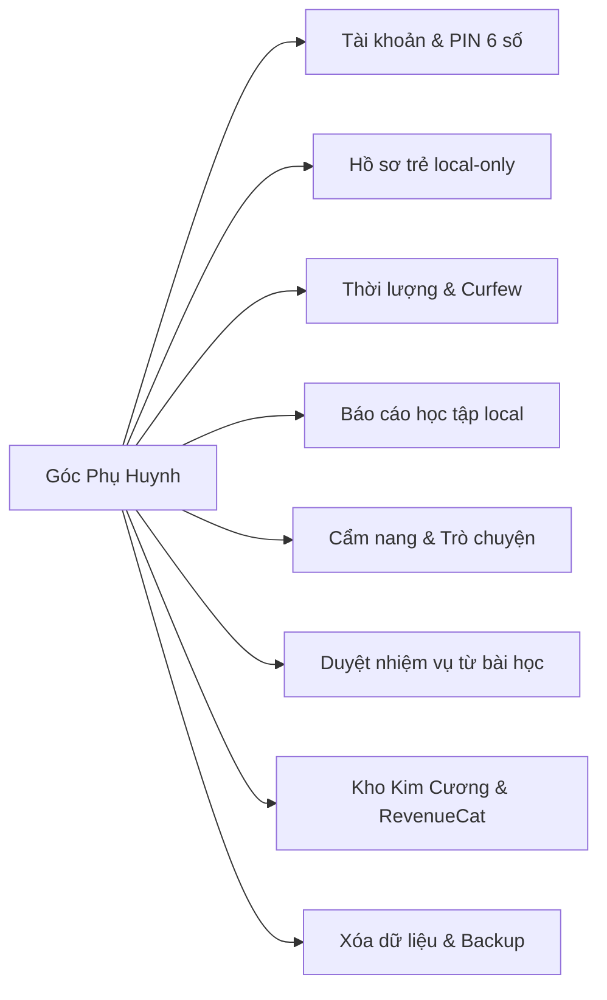
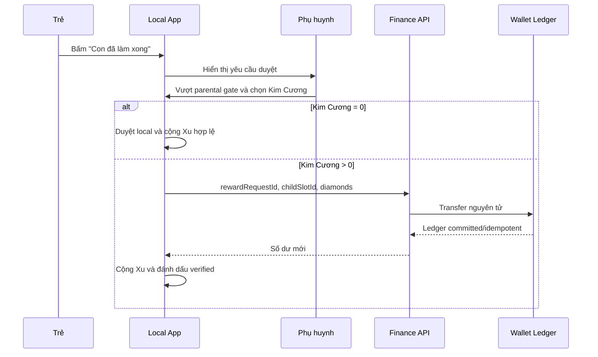

# TÀI LIỆU YÊU CẦU SẢN PHẨM (PRD) — GÓC PHỤ HUYNH (PARENT ZONE)

**Dự án:** Nền tảng phiêu lưu học kỹ năng sống tiểu học NovaStars
**Mã tài liệu:** `PRD-MOD-PARENT-001`
**Phiên bản:** `v1.2.0`
**Trạng thái:** `Approved for MVP Implementation`
**Phạm vi phát hành:** iOS và Android qua Capacitor; Việt Nam; tiếng Việt; trẻ 6–11 tuổi
**Cập nhật lần cuối:** 22/08/2026
**Kế hoạch triển khai:** [`PARENT_ZONE_IMPLEMENTATION_PLAN.md`](./PARENT_ZONE_IMPLEMENTATION_PLAN.md)

> Trạng thái trên cho phép bắt đầu triển khai MVP. IAP/subscription chỉ được bật production sau khi hoàn tất policy review, privacy review, kiểm thử store sandbox và đối soát giao dịch.

---

## 1. Tóm tắt sản phẩm

### 1.1. Bối cảnh và sứ mệnh

NovaStars là ứng dụng giáo dục kỹ năng sống dành cho trẻ tiểu học, kết hợp bài học tương tác và gamification vũ trụ. Góc Phụ Huynh là khu vực dành riêng cho người lớn để:

- Theo dõi tiến độ học tập được lưu trên thiết bị.
- Quản lý thời lượng sử dụng.
- Xác nhận nhiệm vụ đời thực phát sinh từ bài học.
- Chuyển Kim Cương từ kho phụ huynh sang ví của trẻ.
- Truy cập cẩm nang và gợi ý trò chuyện đã được biên soạn.
- Quản lý subscription và mua Kim Cương qua RevenueCat.

> **Sứ mệnh:** Biến thời gian sử dụng màn hình của trẻ thành những cuộc trò chuyện gia đình có ý nghĩa và thúc đẩy hành động tích cực ngoài đời thực.

### 1.2. Định vị phạm vi

Đây là bản mở rộng đầy đủ của Parent Zone hiện có, không chỉ là một tab giao diện. Phạm vi gồm client mobile, lưu trữ local, xác thực phụ huynh, backend tài chính, email OTP, RevenueCat, quyền riêng tư và vận hành.

### 1.3. Người dùng

| Người dùng | Nhu cầu chính | Quyền |
| :--- | :--- | :--- |
| **Phụ huynh/chủ tài khoản** | Theo dõi, kiểm soát thời lượng, xác nhận nhiệm vụ, quản lý ví và subscription | Truy cập Parent Zone sau parental gate |
| **Trẻ em 6–11 tuổi** | Học, thực hiện nhiệm vụ, nhận thưởng và tự chọn vật phẩm | Không thấy kho phụ huynh, không truy cập IAP/cài đặt nhạy cảm |

MVP chỉ hỗ trợ một chủ tài khoản phụ huynh và tối đa bốn hồ sơ trẻ. Nhiều người giám hộ và đồng bộ nhiều thiết bị nằm ngoài MVP.

### 1.4. Mục tiêu và KPI

| Mục tiêu | KPI | Target/Quy tắc |
| :--- | :--- | :--- |
| Parental gate | Sự cố truy cập trái phép đã xác nhận | `0` sự cố; không tuyên bố bảo mật tuyệt đối |
| Enforcement thời lượng | Tỷ lệ phiên áp dụng hạn mức đúng đặc tả | `>= 99,9%` trong telemetry kỹ thuật không chứa dữ liệu trẻ |
| Cầu nối đời thực | Tỷ lệ nhiệm vụ từ bài học được phụ huynh xác nhận trong 7 ngày | Đo baseline trong pilot, chưa đặt target |
| Doanh thu | D30 payer conversion | Giả thuyết `8–12%`, đánh giá sau khi đủ cohort |
| Quyền tự chủ của trẻ | Tỷ lệ trẻ dùng Kim Cương đã nhận để tự chọn vật phẩm | `>= 70%` khi Showroom đủ catalog |
| Quyền riêng tư | Hồ sơ, tiến độ, câu trả lời, ảnh và usage của trẻ gửi lên backend | `0` bản ghi; xác minh bằng network inspection |

---

## 2. Nguyên tắc bắt buộc

1. **Local-first cho dữ liệu trẻ:** Hồ sơ, tiến độ, câu trả lời, thời lượng, nhiệm vụ, lời khen và ảnh chỉ lưu trên thiết bị.
2. **Server-authoritative cho tiền thật:** Subscription, giao dịch RevenueCat, kho phụ huynh, ví Kim Cương và ledger do server kiểm soát.
3. **Ẩn danh hóa ví trẻ:** Backend chỉ biết `childSlotId`; không biết tên, tuổi, khối lớp, ảnh hoặc lịch sử học.
4. **Không có IAP trong khu vực trẻ:** Mọi cơ hội mua hàng, giá và liên kết thương mại nằm sau parental gate.
5. **Không mua vật phẩm thay trẻ:** Kim Cương mua bằng tiền thật chỉ vào kho phụ huynh; trẻ chỉ tiêu số đã nhận qua nhiệm vụ được duyệt.
6. **Không thưởng trực tiếp từ IAP:** Không tặng Xu, skin, Boss Pass, năng lượng vô tận hoặc mở khóa Showroom cho trẻ.
7. **Không dùng AI trong MVP:** Câu hỏi trò chuyện và cẩm nang dùng template đã biên soạn.
8. **Khối lớp chỉ là cosmetic:** Không đổi nội dung, mastery hoặc unlock.
9. **Không tạo nhiệm vụ tự do:** Nhiệm vụ chỉ phát sinh từ bài học được biên soạn.
10. **Mọi thay đổi Kim Cương có ledger:** Client không tự cộng/trừ số dư.

---

## 3. Phạm vi MVP

### 3.1. Trong phạm vi

- Tài khoản phụ huynh bằng email đã xác minh.
- PIN 6 số, OTP khôi phục, tự khóa và sinh trắc học tùy chọn.
- Tối đa bốn hồ sơ trẻ local-only.
- Xóa hồ sơ, xóa dữ liệu local và backup mã hóa thủ công.
- Báo cáo tuần, lifetime và 5 miền năng lực từ dữ liệu local.
- Hạn mức ngày, curfew, cảnh báo sắp hết giờ và nhắc nghỉ mắt.
- Nhiệm vụ đời thực từ bài học và duyệt thưởng on-the-fly.
- Kho Kim Cương phụ huynh và ví Kim Cương ẩn danh từng trẻ.
- Gói Kim Cương một lần, VIP tháng và VIP năm.
- Cẩm nang, podcast và câu hỏi trò chuyện được biên soạn.
- Feature flags riêng cho Parent Zone, missions và IAP.

### 3.2. Ngoài phạm vi MVP

- Phụ huynh tự tạo/sửa/lặp/lên lịch nhiệm vụ.
- Hứa thưởng hoặc reserve Kim Cương trước khi trẻ hoàn thành.
- Hoàn tác phần thưởng đã trao.
- Nhiều guardian hoặc phân quyền gia đình.
- Đồng bộ tiến độ giữa nhiều thiết bị và automatic cloud backup.
- Upload ảnh/video minh chứng.
- AI tạo nội dung hoặc cá nhân hóa.
- Thưởng cột mốc ngoài nhiệm vụ bài học.
- Hạn mức chi tiêu tháng do NovaStars áp đặt.
- Cá nhân hóa nội dung theo khối lớp.

---

## 4. Ranh giới dữ liệu và quyền riêng tư

### 4.1. Phân loại dữ liệu

| Dữ liệu | Nơi lưu | Ghi chú |
| :--- | :--- | :--- |
| Email/trạng thái xác minh phụ huynh | Server | Dữ liệu người lớn |
| PIN verifier, OTP challenge, session | Server + secure device storage | Không lưu PIN/verifier trong Zustand/localStorage |
| Consent receipt | Server | Version, thời điểm, parent account; không có hồ sơ trẻ |
| Biệt danh, avatar, khối lớp cosmetic | Local | Không gửi server |
| Tiến độ, câu trả lời, mastery, streak | Local | Không dùng cloud progress endpoint |
| Usage, screen-time settings, curfew | Local | Không gửi server |
| Nội dung/trạng thái nhiệm vụ, lời khen | Local | Server chỉ nhận idempotency key nếu chuyển Kim Cương |
| Ảnh minh chứng | App-private local storage | Không automatic cloud backup, không upload |
| `childSlotId` | Local + server | ID ngẫu nhiên, không chứa PII |
| Parent vault, child diamond balances, ledger | Server | Nguồn sự thật tài chính |
| RevenueCat events/subscription | Server | Đối soát và nghĩa vụ pháp lý |
| Vật phẩm mua bằng Kim Cương | Server ledger + local projection | Server chỉ lưu SKU/entitlement |
| Xu Nova/vật phẩm mua bằng Xu | Local | Không quy đổi thành tiền |

### 4.2. Consent

- Phụ huynh phải đồng ý privacy notice trước khi tạo hồ sơ trẻ hoặc kích hoạt tính năng tài chính.
- Consent cung cấp dịch vụ và marketing tách riêng; marketing mặc định tắt.
- Notice nêu rõ dữ liệu local/server và rủi ro mất dữ liệu khi mất/gỡ thiết bị.
- Thay đổi notice trọng yếu yêu cầu consent receipt phiên bản mới.

### 4.3. Xóa dữ liệu

**Xóa một hồ sơ trẻ:**

1. Yêu cầu parental gate và xác nhận cuối.
2. Server chuyển Kim Cương chưa tiêu về `parentVault` bằng ledger `CHILD_PROFILE_CLOSURE_RETURN`.
3. Vật phẩm đã mua của hồ sơ bị xóa và không hoàn Kim Cương.
4. Client xóa hồ sơ, tiến độ, usage, nhiệm vụ, lời khen, ảnh và khóa backup liên quan.
5. Slot bị đóng, không khôi phục.

**Xóa tài khoản phụ huynh:**

- Xóa dữ liệu local ngay sau xác nhận.
- Xóa dữ liệu server không bắt buộc giữ.
- Ledger chỉ giữ trong thời hạn cần cho kế toán, chống gian lận và pháp lý.
- UI thông báo số dư và hệ quả mất quyền truy cập trước khi xóa.

### 4.4. Backup local

- Parent Zone hỗ trợ export/import backup mã hóa thủ công.
- Backup gồm hồ sơ, tiến độ, cài đặt, nhiệm vụ, vật phẩm và ảnh local.
- Phụ huynh đặt mật khẩu backup; mật khẩu/khóa không upload lên NovaStars.
- Import yêu cầu parental gate, đúng tài khoản và mật khẩu backup.
- Không có cloud sync tự động; app cảnh báo nguy cơ mất dữ liệu nếu không backup.

---

## 5. Bản đồ tính năng



---

## 6. Đặc tả chức năng

### Module 1 — Tài khoản và parental gate

- Phụ huynh đăng ký/đăng nhập bằng email đã xác minh; trẻ không có tài khoản riêng.
- PIN bắt buộc đúng 6 chữ số và được xác minh phía server.
- Sau 5 lần sai: khóa 5 phút; tái phạm tiếp theo 15 phút; tiếp theo 1 giờ.
- Phản hồi lỗi không tiết lộ email/PIN có tồn tại.
- Session tự khóa sau 3 phút không tương tác, app background, logout hoặc account switch.
- Đổi email, thay PIN, xóa hồ sơ/tài khoản và mua hàng yêu cầu xác thực lại.
- OTP reset gồm 6 số, hết hạn 10 phút, tối đa 5 lần nhập; resend sau 60 giây và có server rate limit.
- OTP được gửi bằng transactional email từ Cloudflare Worker; sender domain phải onboard và binding giới hạn sender.
- Sinh trắc học là tùy chọn, chỉ bật sau PIN; token lưu trong Keychain/Keystore.

### Module 2 — Hồ sơ trẻ local-only

- Tối đa bốn hồ sơ; bắt buộc biệt danh và avatar.
- Khối lớp 1–5 là tùy chọn và chỉ cosmetic; không thu thập giới tính hoặc ngày/năm sinh.
- Chỉ phụ huynh đổi active profile trong Parent Zone; trẻ không tự chuyển hồ sơ.
- Mỗi hồ sơ ánh xạ với một `childSlotId` ẩn danh để quản lý ví Kim Cương.
- Đổi khối lớp không ảnh hưởng nội dung, mastery hoặc unlock.

### Module 3 — Screen time và curfew

#### 6.3.1. Định nghĩa

Chỉ tính khi khu vực trẻ ở foreground và có tương tác. Không tính Parent Zone, background, màn hình khóa, audio nền hoặc màn hình bị chặn. Phân loại tối thiểu: `lesson`, `mini_game`, `showroom`.

#### 6.3.2. Hạn mức

- Preset 15/30/45/60 phút; custom 10–120; mặc định 30 phút/ngày.
- Cảnh báo khi còn 5 phút và 1 phút.
- Khi chạm hạn mức giữa hoạt động, trẻ được hoàn thành tọa độ/bài học nhỏ hoặc lượt chơi hiện tại; MVP không có grace-period cứng.
- Không được bắt đầu hoạt động mới sau khi đã chạm hạn mức.
- Kết thúc hoạt động hiện tại thì lưu tiến độ và khóa khu vực trẻ.
- Phụ huynh gia hạn 15 phút/lần, tối đa hai lần/ngày, sau parental gate.

#### 6.3.3. Curfew và clock

- Mặc định `21:30–06:00` theo timezone thiết bị; cảnh báo trước 5 phút.
- Nếu curfew bắt đầu giữa hoạt động, cho hoàn thành hoạt động hiện tại rồi khóa.
- Dùng server time khi online; nếu phát hiện clock rollback khi offline, áp dụng trạng thái bảo thủ đến khi xác minh lại.
- MVP chỉ hỗ trợ một thiết bị, không tổng hợp usage đa thiết bị.

#### 6.3.4. Nhắc nghỉ mắt

- Sau mỗi 20 phút liên tục, dừng 20 giây và hướng dẫn nhìn ra xa, thư giãn/mát-xa mắt.
- Nội dung mát-xa gắn `PENDING_HEALTH_REVIEW` và không bật production trước hậu kiểm chuyên môn.

### Module 4 — Báo cáo tiến độ local

- Tuần tính từ thứ Hai đến Chủ Nhật theo timezone thiết bị.
- Báo cáo số bài/tọa độ, accuracy lần đầu, streak và usage theo loại.
- Một kỹ năng cần tối thiểu 5 tương tác có điểm; `Mastered` khi accuracy tập gần nhất `>=80%`.
- Thiếu 5 tương tác: hiển thị `Chưa đủ dữ liệu`.
- Radar 5 miền phải ghi đây là tiến độ trong app, không phải đánh giá tâm lý/chẩn đoán.
- Accuracy lưu theo event lần đầu, không ghi đè bởi lần làm lại.

### Module 5 — Cẩm nang và gợi ý trò chuyện

- Nội dung biên soạn sẵn, không dùng AI.
- Cẩm nang gồm bảo vệ bản thân, tài chính gia đình, an toàn số và đồng hành cảm xúc.
- Bài đọc dạng checklist khoảng 2 phút; podcast khoảng 3 phút.
- Câu hỏi trò chuyện ánh xạ từ lesson/content ID sang template curated.
- Nội dung sức khỏe, an toàn, vùng riêng tư và tâm lý có reviewer, version và ngày cập nhật.
- Podcast và liên kết ngoài chỉ xuất hiện trong Parent Zone.

### Module 6 — Nhiệm vụ đời thực từ bài học

#### 6.6.1. Nguồn nhiệm vụ

- Nhiệm vụ được lập trình trong lesson package.
- Phụ huynh không tạo, sửa, lặp hoặc lên lịch.
- Nội dung, category, difficulty và Xu cố định không sửa được trong Parent Zone.

#### 6.6.2. Luồng duyệt



- Kim Cương không bắt buộc; không có lời hứa thưởng hoặc reserve trước.
- Tại lúc duyệt, chọn preset 0/5/10/20 hoặc số nguyên tùy ý.
- Không có business cap nhưng không được vượt số dư; từ 500 trở lên xác nhận lần hai.
- `rewardRequestId` idempotent; retry không thưởng hai lần.
- Thiếu số dư: giảm số thưởng hoặc duyệt với 0.
- Không hoàn tác sau khi ledger commit trong MVP.
- Trạng thái local: `pending_parent_approval`, `verified`, `dismissed`.

#### 6.6.3. Xu Nova

| Độ khó | Xu cố định |
| :--- | ---: |
| Easy | 50 |
| Medium | 100 |
| Hard | 150 |
| Challenge | 200 |

- Tổng Xu nhiệm vụ bị giới hạn `200/ngày/trẻ` và `1.000/tuần/trẻ`.
- Nếu vượt phần còn lại, chỉ cộng phần hợp lệ và hiển thị số thực nhận.
- Xu và giao dịch bằng Xu là local-only, không quy đổi thành tiền.

### Module 7 — Kho Kim Cương và quyền tự chủ

- `parentVaultDiamonds` là kho chung của gia đình; mỗi `childSlotId` có ví riêng.
- Trẻ không thấy/tiêu parent vault; phụ huynh không mua vật phẩm thay trẻ.
- Trẻ tự mua vật phẩm phù hợp lứa tuổi bằng Kim Cương đã nhận mà không cần duyệt từng món.
- Mua bằng Kim Cương gọi server debit idempotent trước khi unlock local; mua bằng Xu xử lý local.
- Không cho số dư âm hoặc client tự đặt số dư.

### Module 8 — RevenueCat IAP và VIP

Giá sau chỉ là tham chiếu kinh doanh; UI phải hiển thị localized price của store.

| Gói | Loại | Kim Cương vào parent vault | Giá tham chiếu | Quyền lợi khác |
| :--- | :--- | ---: | ---: | :--- |
| Starter | Consumable | 100 | 29.000đ | Không |
| Explorer | Consumable | 350 | 79.000đ | Không |
| Galaxy | Consumable | 1.000 | 199.000đ | Không |
| Master | Consumable | 2.500 | 499.000đ | Không |
| VIP Month | Subscription chính | 150/kỳ gia hạn thành công | 99.000đ/tháng | Báo cáo chuyên sâu, toàn bộ cẩm nang/podcast, lịch sử dài hơn |
| VIP Annual | Subscription phụ | 2.000/kỳ gia hạn thành công | 799.000đ/năm | Quyền lợi Parent Zone tương đương và ebook curated |

Product ID tách theo Apple/Google và sandbox/production. Mapping product → Kim Cương cấu hình server; không tin giá trị client.

#### 6.8.1. Luồng giao dịch

1. Re-auth trước purchase flow.
2. Client lấy offering/localized price từ RevenueCat/store.
3. Client bắt đầu purchase nhưng không tự cộng Kim Cương.
4. RevenueCat webhook gọi Cloudflare Worker qua endpoint có authorization secret.
5. Server kiểm tra event ID, app user ID, product mapping và event type.
6. Server ghi purchase event, ledger và số dư trong một transaction.
7. Event trùng trả thành công idempotent, không cộng lại.
8. Client refresh wallet/subscription từ server.

#### 6.8.2. Subscription và đối soát

- Cấp Kim Cương đúng một lần khi initial purchase/renewal hợp lệ.
- Billing retry/grace giữ entitlement theo trạng thái store nhưng không cấp thêm nếu chưa có renewal hợp lệ.
- Cancellation không thu hồi quyền lợi của kỳ đã thanh toán trước ngày hết hạn.
- Refund/revoke ghi ledger và vào reconciliation; không tự làm ví trẻ âm.
- Restore không được xem là purchase mới để cộng lại consumable/renewal.
- Không có hạn mức chi tiêu do NovaStars áp đặt.
- Biên lai chính thức do Apple/Google; email NovaStars chỉ là xác nhận nội bộ.

---

## 7. Kiến trúc dữ liệu và API

### 7.1. Local contract

```typescript
export type ChildSlotId = string;

export interface LocalChildProfile {
  localId: string;
  childSlotId: ChildSlotId;
  nickname: string;
  avatar: string;
  gradeCosmetic?: 1 | 2 | 3 | 4 | 5;
  isActive: boolean;
  learning: {
    level: number;
    xp: number;
    stars: number;
    novaCoins: number;
    answers: LocalAnswerEvent[];
    domainProgress: Record<string, LocalDomainProgress>;
  };
  customization: LocalCustomizationState;
}

export interface LocalMissionInstance {
  localMissionId: string;
  rewardRequestId: string;
  childSlotId: ChildSlotId;
  lessonId: string;
  contentMissionId: string;
  title: string;
  difficulty: 'easy' | 'medium' | 'hard' | 'challenge';
  fixedCoinReward: 50 | 100 | 150 | 200;
  status: 'pending_parent_approval' | 'verified' | 'dismissed';
  completedByChildAt: string;
  verifiedAt?: string;
  awardedCoins?: number;
  awardedDiamonds?: number;
}
```

Persisted state không chứa `parentPin`, `parentPinHash`, OTP hoặc RevenueCat entitlement giả. Wallet balance chỉ là cache có version và phải refresh sau giao dịch.

### 7.2. Server entities

| Entity | Mục đích |
| :--- | :--- |
| `parent_accounts` | Email, xác minh, account status |
| `parent_auth_credentials` | PIN verifier, lockout counters |
| `email_otp_challenges` | OTP hash, expiry, attempt/resend counters |
| `parent_sessions` | Session/re-auth lifecycle |
| `consent_receipts` | Policy version và thời điểm đồng ý |
| `child_wallet_slots` | Opaque slot, không PII |
| `wallet_accounts` | Parent vault và child wallets |
| `wallet_ledger` | Immutable credit/debit/transfer |
| `reward_transfers` | Idempotency cho nhiệm vụ có Kim Cương |
| `purchase_events` | RevenueCat event đã chuẩn hóa |
| `subscriptions` | Entitlement và expiry |
| `item_entitlements` | SKU mua bằng Kim Cương theo slot |
| `security_audit_log` | Auth, PIN, delete, purchase và wallet actions |

### 7.3. API tối thiểu

| Method | Endpoint | Chức năng |
| :--- | :--- | :--- |
| `POST` | `/api/v1/auth/register` | Tạo tài khoản, gửi email verify |
| `POST` | `/api/v1/auth/verify-email` | Xác minh email và tạo session |
| `POST` | `/api/v1/auth/pin-reset/request` | Tạo OTP reset |
| `POST` | `/api/v1/auth/pin-reset/confirm` | Xác minh OTP, đổi PIN và xoay session |
| `POST` | `/api/v1/auth/session/refresh` | Xoay access/refresh token |
| `POST` | `/api/v1/parent/pin/setup` | Thiết lập PIN 6 số |
| `POST` | `/api/v1/parent/pin/verify` | Mở Parent Zone/re-auth |
| `POST` | `/api/v1/parent/logout` | Thu hồi session hiện tại |
| `POST` | `/api/v1/parent/child-slots` | Tạo opaque wallet slot |
| `DELETE` | `/api/v1/parent/child-slots/:childSlotId` | Đóng slot, hoàn số dư về vault |
| `GET` | `/api/v1/parent/wallets` | Lấy vault và child balances |
| `POST` | `/api/v1/parent/rewards/approve` | Chuyển Kim Cương idempotent |
| `POST` | `/api/v1/parent/items/purchase` | Debit child diamonds, cấp entitlement |
| `GET` | `/api/v1/parent/subscriptions` | Lấy entitlement hiện tại |
| `POST` | `/api/v1/webhooks/revenuecat` | Nhận RevenueCat event có xác thực |
| `DELETE` | `/api/v1/parent/account` | Bắt đầu xóa tài khoản |

`POST /api/v1/progress` và truy cập Neon trực tiếp từ client không thuộc kiến trúc này và phải bị vô hiệu hóa khỏi production flow.

---

## 8. Wireframe chức năng

```text
+----------------------------------------------------------------------------+
| [< Trở lại khu trẻ]      GÓC ĐỒNG HÀNH PHỤ HUYNH        [Khóa ngay]         |
+----------------------------------------------------------------------------+
| [Bé Su · Lớp 3 ▼]                         Kho phụ huynh: 450 Kim Cương [Nạp] |
+----------------------------------------------------------------------------+
| [Tiến độ] [Thời lượng] [Chờ duyệt] [Cẩm nang] [Cửa hàng] [Dữ liệu & Backup]|
+----------------------------------------------------------------------------+
| YÊU CẦU CHỜ DUYỆT                                                        (1)|
| Bé đã báo hoàn thành: "Tự dọn góc học tập sau khi làm bài"                |
| Xu cố định: +100                                                           |
| Thưởng thêm từ kho: [0] [5] [10] [20] [Nhập số]                           |
| Số dư kho: 450                                                             |
| [Bỏ qua]                               [Xác nhận & trao thưởng]             |
+----------------------------------------------------------------------------+
```

Màn hình trẻ không hiển thị parent vault, giá tiền thật, offering hoặc liên kết store.

---

## 9. Acceptance criteria

### 9.1. Security và privacy

| Mã | Given/When/Then |
| :--- | :--- |
| `AC-PIN-01` | Given đã có parent session hợp lệ và Parent Zone đang khóa, when nhập đúng PIN 6 số, then server ghi fresh re-auth window và mở zone; session gốc được tạo khi xác minh email hoặc xoay qua refresh/reset. |
| `AC-PIN-02` | Given nhập sai 5 lần, when thử tiếp, then server từ chối theo lockout trên mọi client. |
| `AC-PIN-03` | Given zone đang mở, when app background hoặc idle 3 phút, then session khóa. |
| `AC-PIN-04` | Given persisted local state, when kiểm tra storage, then không có PIN, verifier hoặc OTP. |
| `AC-OTP-01` | Given OTP hợp lệ, when xác nhận, then đặt PIN mới và vô hiệu hóa OTP. |
| `AC-PRIV-01` | Given trẻ học, when kiểm tra network/server DB, then không có nickname, grade, answer, progress, usage, mission content hoặc ảnh được gửi lên. |
| `AC-PROFILE-01` | Given có bốn hồ sơ, when thêm hồ sơ thứ năm, then từ chối. |
| `AC-PROFILE-02` | Given đổi grade cosmetic, when lưu, then nội dung/mastery/unlock không đổi. |
| `AC-DELETE-01` | Given hồ sơ còn Kim Cương, when xóa, then hoàn số dư về vault trước khi xóa local. |
| `AC-DELETE-02` | Given hồ sơ đã xóa, when kiểm tra local files, then không còn dữ liệu/ảnh liên quan. |
| `AC-BACKUP-01` | Given backup đúng tài khoản/mật khẩu, when import, then khôi phục nhất quán. |
| `AC-BACKUP-02` | Given sai mật khẩu/file bị sửa, when import, then thất bại an toàn và không ghi đè dữ liệu. |

### 9.2. Screen time

| Mã | Given/When/Then |
| :--- | :--- |
| `AC-TIME-01` | Given app background/Parent Zone, when thời gian trôi, then không cộng child screen time. |
| `AC-TIME-02` | Given còn 5/1 phút, when đạt ngưỡng, then cảnh báo đúng một lần mỗi phiên. |
| `AC-TIME-03` | Given chạm hạn mức giữa hoạt động, when hoạt động kết thúc, then lưu và khóa trước hoạt động mới. |
| `AC-TIME-04` | Given đã chạm hạn mức, when phụ huynh gia hạn, then cộng 15 phút; lần thứ ba trong ngày bị từ chối. |
| `AC-CURFEW-01` | Given trong 21:30–06:00 và không có hoạt động chạy, when bắt đầu hoạt động, then bị chặn. |

### 9.3. Mission và economy

| Mã | Given/When/Then |
| :--- | :--- |
| `AC-MSN-01` | Given nhiệm vụ từ lesson, when trẻ báo hoàn thành, then tạo đúng một yêu cầu pending. |
| `AC-MSN-02` | Given duyệt với 0 Kim Cương, when xác nhận, then không gọi wallet transfer và vẫn cộng Xu hợp lệ. |
| `AC-MSN-03` | Given duyệt với X Kim Cương, when server commit, then vault giảm X và child wallet tăng X nguyên tử. |
| `AC-MSN-04` | Given cùng rewardRequestId gửi lại/đồng thời, when xử lý, then chỉ một transfer ledger. |
| `AC-MSN-05` | Given thưởng >=500, when xác nhận lần đầu, then yêu cầu xác nhận lần hai. |
| `AC-MSN-06` | Given không đủ số dư, when duyệt, then không số dư nào đổi và có thể giảm về 0. |
| `AC-COIN-01` | Given đã đạt 200 Xu/ngày hoặc 1.000/tuần, when duyệt thêm, then không vượt cap. |
| `AC-UNDO-01` | Given reward đã commit, when tìm hoàn tác, then không có chức năng trong MVP. |

### 9.4. IAP và subscription

| Mã | Given/When/Then |
| :--- | :--- |
| `AC-IAP-01` | Given store trả localized price, when hiển thị, then dùng đúng chuỗi của store. |
| `AC-IAP-02` | Given client báo success nhưng webhook chưa commit, when xem kho, then pending và chưa cộng. |
| `AC-IAP-03` | Given webhook mới hợp lệ, when xử lý, then purchase event và ledger commit nguyên tử. |
| `AC-IAP-04` | Given webhook trùng event ID, when nhận lại, then không cộng lần hai. |
| `AC-IAP-05` | Given VIP renewal hợp lệ, when commit, then cộng đúng Kim Cương của kỳ vào vault. |
| `AC-IAP-06` | Given restore/reinstall, when sync, then không cấp lại consumable/renewal cũ. |
| `AC-IAP-07` | Given refund/revoke, when reconciliation, then ghi audit và không tự làm ví trẻ âm. |
| `AC-STORE-01` | Given ở khu trẻ, when điều hướng app, then không thấy giá/purchase opportunity/commerce link. |

---

## 10. Release gates

### Bắt đầu implementation

- PRD và data boundary được phê duyệt, đưa vào ADR.
- Database migration/API contract được review.
- Feature flags được định nghĩa.

### Cho phép pilot

- Parental gate, delete, backup và screen-time E2E pass.
- Network capture không có child PII/progress.
- Wallet concurrency/idempotency tests pass.
- Dev/God mode không có trong production build.
- Nội dung nhạy cảm có trạng thái review rõ.

### Bật IAP production

- Apple/Google policy review và privacy review hoàn tất.
- RevenueCat sandbox purchase/renewal/cancel/refund/restore pass.
- Webhook authorization, idempotency và reconciliation runbook pass.
- Cloudflare Email Sending domain/binding và OTP deliverability test pass.
- Có cảnh báo cho purchase event lỗi và ledger mismatch.

---

## 11. Decision log v1.2.0

| Quyết định | Kết quả |
| :--- | :--- |
| PIN | 6 số, xác minh server, lockout tăng dần |
| Child data | Local-only; server chỉ có opaque wallet slot |
| Grade | Cosmetic local-only |
| AI | Không dùng |
| Mission authoring | Không; chỉ nhiệm vụ từ bài học |
| Diamond reward | Tùy chọn on-the-fly; không business cap |
| Reserve/undo | Không reserve; không undo trong MVP |
| Nova Coin cap | 200/ngày, 1.000/tuần/trẻ |
| VIP | Tháng là gói chính, năm là gói phụ; không energy vô tận |
| Spending limit | Không có giới hạn do NovaStars áp đặt |
| Hết screen time | Cho hoàn thành hoạt động hiện tại, không grace-period cứng |
| Curfew | 21:30–06:00 |
| Multi-device | Ngoài MVP |
| Backup | Export/import mã hóa thủ công |
| Eye massage | Draft được phép; production chờ hậu kiểm |

---

*PRD v1.2.0 là nguồn yêu cầu canonical cho Parent Zone MVP. Nếu implementation plan hoặc code mâu thuẫn với tài liệu này, PRD phải được cập nhật qua decision log trước khi đổi hành vi sản phẩm.*
