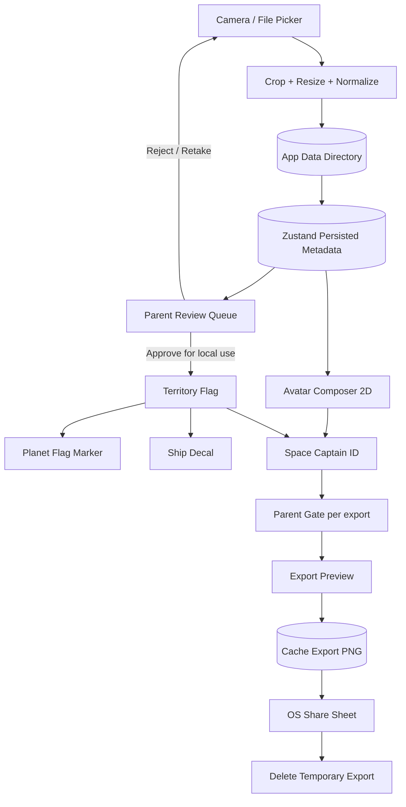
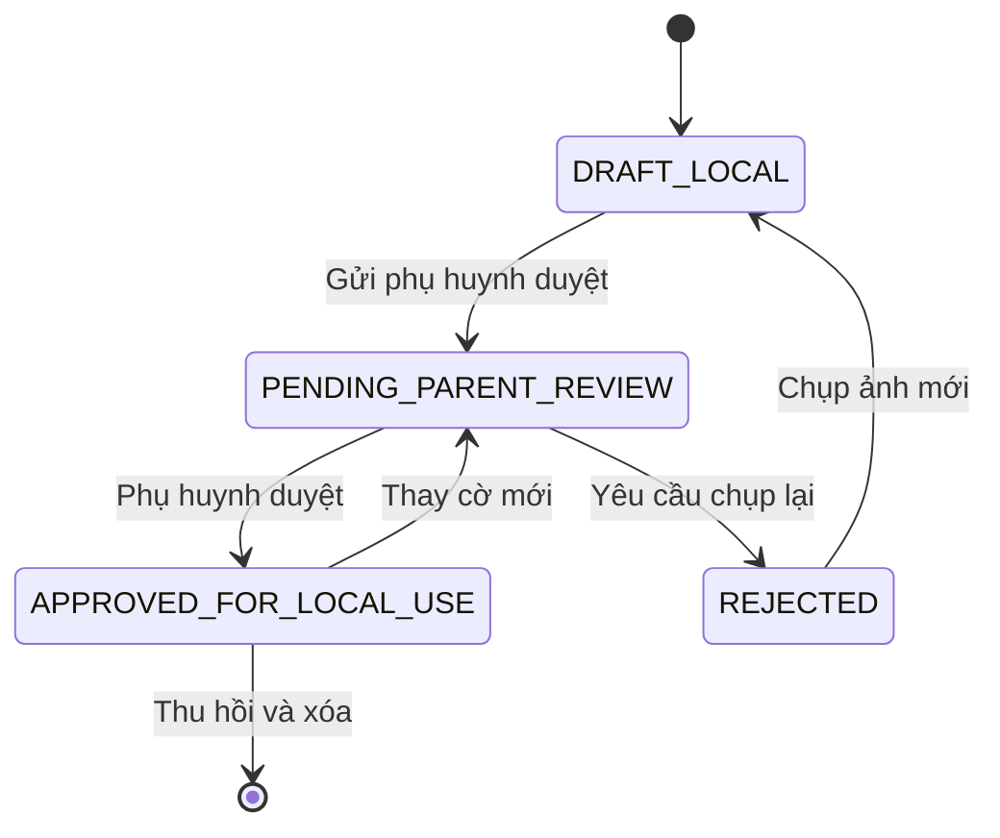
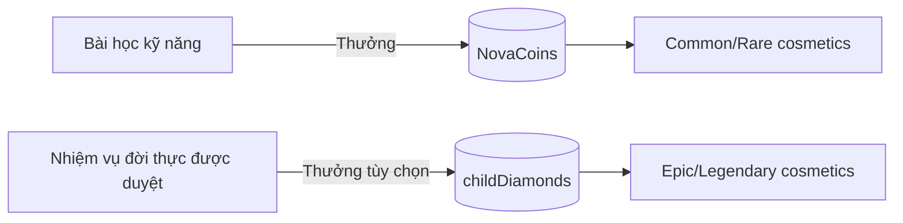

# TÀI LIỆU YÊU CẦU SẢN PHẨM (PRD) — PHÂN HỆ CÁ NHÂN HÓA VŨ TRỤ

**Dự án**: Nền Tảng Phiêu Lưu Học Kỹ Năng Sống Tiểu Học NovaStars

**Mã tài liệu**: `PRD-MOD-PERSONALIZE-001`

**Phiên bản**: v1.1.0 (Canonical Specification)

**Trạng thái**: Approved for Implementation — Offline Single-Player Scope

**Cập nhật lần cuối**: 22/08/2026
**Tài liệu triển khai**: `docs/IMPLEMENTATION_PLAN_PERSONALIZATION_SYSTEM.md`

---

## 0. LỊCH SỬ THAY ĐỔI

| Phiên bản | Ngày | Thay đổi chính |
| :--- | :--- | :--- |
| v1.0.0 | 21/08/2026 | Đặc tả ban đầu cho avatar, cờ, Space ID, tàu, pet và cabin. |
| v1.1.0 | 22/08/2026 | Chốt phạm vi offline/single-player; loại bỏ public/social; tách Apply và Export; chuyển media sang lưu file cục bộ; bỏ KPI tiêu 65% số dư; bổ sung acceptance criteria và roadmap 6 phase. |

---

## 1. TỔNG QUAN SẢN PHẨM

### 1.1. Bối cảnh và mục tiêu

NovaStars là ứng dụng giáo dục kỹ năng sống tiểu học dành cho trẻ 6–11 tuổi, kết hợp bài học với trải nghiệm phiêu lưu vũ trụ 3D. Phân hệ Cá Nhân Hóa giúp trẻ thể hiện bản sắc và nhìn thấy thành tựu học tập của mình thông qua avatar, lá cờ, phi thuyền, thẻ thành tích và căn cứ riêng.

> **Tuyên ngôn sản phẩm**:
> *“Mỗi học sinh là một Vị Chỉ Huy Vũ Trụ độc nhất — mang bản sắc và thành tựu học tập của chính mình lên từng tọa độ hành tinh và chiến hạm.”*

### 1.2. Phạm vi sản phẩm đã chốt

Phân hệ tuân thủ các ràng buộc sau:

1. **Offline-first**: toàn bộ thao tác chụp, crop, lưu, duyệt và áp dụng ảnh cá nhân hóa hoạt động khi thiết bị không có mạng.
2. **Single-player**: chỉ trẻ và phụ huynh sử dụng trên cùng thiết bị; không có multiplayer, friend list, chat, feed, lớp học chung hoặc tham quan căn cứ người khác.
3. **On-device media**: selfie, ảnh cờ và chữ ký trang trí không được tải lên server và không được đồng bộ vào Neon/R2.
4. **Không có nội dung công khai**: không tồn tại profile công khai, cờ công khai hoặc thao tác `PUBLISH`.
5. **Apply khác Export**:
   - `APPLY`: dùng asset bên trong game trên thiết bị.
   - `EXPORT`: tạo file ảnh tạm và mở share sheet để phụ huynh chủ động lưu hoặc gửi ra ngoài ứng dụng.
6. **Parent Gate cho thao tác nhạy cảm**: phụ huynh duyệt cờ trước khi apply và phải xác nhận lại mỗi lần export.

### 1.3. Ngoài phạm vi (Non-goals)

- Không có server moderation hoặc admin moderation.
- Không upload selfie, cờ, chữ ký hoặc Space ID lên backend.
- Không có social graph, nội dung do người dùng khác tạo hoặc bản đồ hành tinh dùng chung.
- Không có liên kết profile theo `childId` và không nhúng mã định danh trẻ vào QR.
- Không triển khai direct-to-gallery native riêng trong MVP; share sheet hệ điều hành là đường xuất chuẩn.
- Không dùng nhận diện khuôn mặt hoặc sinh trắc học.

### 1.4. Mục tiêu và KPI

| Mục tiêu | KPI | Target ban đầu |
| :--- | :--- | :--- |
| **Kích hoạt cá nhân hóa** | Tỷ lệ trẻ hoàn tất ít nhất một thao tác đổi avatar/trang bị trong 7 ngày đầu | ≥ 70% người dùng hoạt động |
| **Mức độ sử dụng** | Tỷ lệ trẻ quay lại Phòng Thử Đồ ít nhất một lần trong 30 ngày | ≥ 40% người đã cá nhân hóa |
| **Giá trị vật phẩm** | Tỷ lệ vật phẩm đã mua/mở khóa được equip ít nhất một lần | ≥ 80% |
| **An toàn export** | Tỷ lệ lần export bắt đầu sau khi Parent Gate xác nhận | 100% |
| **Tính toàn vẹn dữ liệu** | Tỷ lệ reset/xóa hồ sơ không còn file media mồ côi do phân hệ tạo ra | 100% trong test suite |
| **Learning guardrail** | Chênh lệch tỷ lệ hoàn thành bài học sau khi thêm personalization | Không giảm quá 2 điểm phần trăm |
| **Hiệu năng 3D** | Mức giảm FPS do decal/cờ trên thiết bị mục tiêu | Không quá 10% so với baseline |

KPI chỉ đo hành vi sử dụng; **không đặt mục tiêu ép trẻ tiêu một tỷ lệ cố định trong ví**. Nếu ứng dụng chưa có telemetry online, KPI được đánh giá qua QA, usability test và counter cục bộ không chứa media.

---

## 2. NGUYÊN TẮC THIẾT KẾ

### 2.1. Private by architecture

- Binary media nằm trong vùng dữ liệu ứng dụng trên thiết bị.
- State chỉ lưu `assetId`/đường dẫn tương đối và metadata cần thiết; không lưu Base64 lớn trong Zustand/localStorage.
- File nguồn tạm được xóa sau khi tạo ảnh đã crop/chuẩn hóa.
- Khi gỡ ứng dụng, dữ liệu media phải được hệ điều hành xóa cùng vùng dữ liệu app.

### 2.2. Apply và Export là hai quyền độc lập

| Hành động | Ai thực hiện | Parent Gate | Kết quả |
| :--- | :--- | :---: | :--- |
| Chụp selfie | Trẻ với hướng dẫn trong app | Không bắt buộc mỗi lần | Tạo avatar draft cục bộ |
| Chụp cờ | Trẻ | Không bắt buộc khi chụp | Tạo cờ draft, chưa được apply |
| Duyệt cờ để apply | Phụ huynh | Bắt buộc | Cờ được dùng trên hành tinh/tàu |
| Đổi trang phục/màu | Trẻ | Không | Chỉ đổi hiển thị trong game |
| Export Space ID | Phụ huynh | Bắt buộc mỗi lần | Tạo file tạm và mở share sheet |
| Thu hồi/xóa ảnh | Phụ huynh | Bắt buộc | Gỡ asset khỏi mọi nơi và xóa file |

### 2.3. Trải nghiệm tích cực, không gây áp lực mua sắm

- Trẻ được thử đồ trước khi mua.
- Hiển thị rõ giá bằng Xu Nova hoặc Kim Cương Bé.
- Không loot box, không flash sale đếm ngược, không thông báo gây sợ bỏ lỡ.
- Mọi màn hình cửa hàng phải có đường thoát rõ và không cản luồng học.

### 2.4. Progressive enhancement

- Web/PWA dùng file input và Web Share khi được hỗ trợ.
- iOS/Android dùng Capacitor Camera, Filesystem và Share.
- Nếu camera hoặc share không khả dụng, app vẫn chạy bằng avatar preset và nút tải file web.

---

## 3. KIẾN TRÚC CHỨC NĂNG



### 3.1. Ranh giới dữ liệu

- `Neon`, `Cloudflare Workers` và `R2` không tham gia vào luồng media cá nhân hóa.
- Backend vẫn có thể phục vụ câu hỏi/bài học như kiến trúc hiện tại, nhưng không nhận asset hoặc metadata cá nhân hóa chứa ảnh.
- Các counter sản phẩm nếu có chỉ được phép chứa event kỹ thuật như `avatar_equipped` hoặc `card_export_started`; không chứa ảnh, chữ ký, tên file hoặc đường dẫn local.

---

## 4. ĐẶC TẢ TÍNH NĂNG

### 4.1. Nền tảng media cục bộ

#### Capture

- Yêu cầu camera permission tại đúng thời điểm trẻ chọn chụp, không hỏi ngay khi mở app.
- Hỗ trợ chụp mới; chọn ảnh từ thư viện là tùy chọn do phụ huynh bật trong Parent Zone.
- Nếu hệ điều hành đóng app khi camera đang mở, app phải khôi phục được kết quả hoặc trở về trạng thái an toàn không mất dữ liệu đã lưu.

#### Processing

- Avatar: crop tỷ lệ `3:4`, cạnh dài tối đa 1024 px.
- Cờ: crop tỷ lệ `3:2`, cạnh dài tối đa 1024 px, safe zone 10%.
- Chuẩn hóa hướng ảnh trước khi render.
- Ảnh dùng trong game ưu tiên WebP/JPEG; asset cần alpha như chữ ký dùng PNG.
- Không giữ EXIF trong file đã xử lý/export.
- MVP dùng guide trực quan và kiểm tra độ sáng sau chụp; nhận diện vị trí khuôn mặt thời gian thực không bắt buộc.

#### Storage lifecycle

- Media bền vững lưu trong app data directory.
- File export tạm lưu trong cache và phải được dọn sau share, khi app khởi động lại hoặc khi quá hạn 24 giờ.
- Xóa hồ sơ/reset game phải xóa metadata và toàn bộ media thuộc `childId`.

### 4.2. Avatar bán thân và Phòng Thử Đồ

#### Camera guide

- Overlay nét đứt cho đỉnh đầu, cằm, cổ và hai vai.
- Hướng dẫn bằng câu ngắn: “Đưa mặt vào giữa khung”, “Bật thêm đèn”, “Giữ máy thẳng”.
- Cho phép chụp lại trước khi lưu.
- Nếu không cấp camera permission, trẻ dùng avatar preset hiện có.

#### Layering engine

Render từ dưới lên:

| Layer | Thành phần | Ghi chú |
| :---: | :--- | :--- |
| 0 | Background | Tinh vân, buồng lái, trạm quỹ đạo |
| 1 | Body base | Selfie đã crop hoặc avatar preset |
| 2 | Outfit | Trang phục/giáp ngực |
| 3 | Neckwear | Huy hiệu, khăn, huy chương |
| 4 | Headgear | Mũ, kính, scouter |
| 5 | Shoulder pet | Pet mini nếu đã mở khóa |
| 6 | Frame | Khung và hiệu ứng viền |

Mỗi asset art phải khai báo kích thước canvas chuẩn, anchor và vùng che để không lệch trên nhiều tỷ lệ màn hình.

#### Wardrobe

- Danh mục: Outfit, Headgear, Accessory, Pet, Frame, Background.
- Hỗ trợ trạng thái `locked`, `unlocked`, `previewing`, `equipped`.
- Preview không trừ tiền.
- Mua thành công phải equip được ngay hoặc giữ lựa chọn cũ theo quyết định của trẻ.

### 4.3. Cờ lãnh thổ và duyệt cục bộ của phụ huynh

#### Capture guide

- Khung `3:2`, lưới 3×3 và safe zone 10%.
- Nội dung gợi ý: cờ giấy, hình vẽ, biểu tượng gia đình hoặc đội do trẻ tự tạo.
- Sau chụp, asset chuyển sang `PENDING_PARENT_REVIEW` và chưa xuất hiện trên hành tinh/tàu.

#### State machine



#### Parent review

- Parent Zone hiển thị thumbnail, thời gian tạo và hai hành động: `Duyệt để dùng trong game`, `Yêu cầu chụp lại`.
- Reject reason gồm: mờ, lệch khung, chưa phù hợp, lý do khác.
- Phụ huynh có thể thu hồi cờ; khi thu hồi, app gỡ texture khỏi hành tinh và tàu rồi xóa file nếu phụ huynh chọn xóa.
- Đây là duyệt nội bộ gia đình, không phải server moderation.

#### Planet display và inspect

- Cờ chỉ xuất hiện tại tọa độ bài học đã hoàn thành của chính trẻ.
- MVP dùng plane/flag marker đơn giản; cloth vertex shader là enhancement sau khi đạt performance budget.
- Khi **trẻ hoặc phụ huynh** chạm cờ, pop-up thành tích hiển thị avatar, danh hiệu, số sao và thời điểm hoàn thành tọa độ.
- Không có “người chơi khác” hoặc profile công khai.

### 4.4. Space Captain ID

Thẻ gồm:

1. Logo NovaStars và mã phi hành gia mang tính trang trí, sinh cục bộ.
2. Avatar đã compose.
3. Cờ đã được `APPROVED_FOR_LOCAL_USE` nếu có.
4. Biệt danh, cấp bậc, số bài học, số tọa độ và tổng sao.
5. Chữ ký/vẽ tay tùy chọn, lưu dưới dạng PNG nền trong suốt cục bộ; không lưu nét vector thô.
6. Hologram là hiệu ứng CSS/canvas; gyroscope không thuộc MVP.

#### Export

- Nút `Xuất thẻ thành tích` mở Parent Gate.
- Sau khi xác thực, phụ huynh xem preview và bấm `Mở tùy chọn lưu/chia sẻ`.
- Render PNG `1080 × 1920` vào cache rồi mở share sheet hệ điều hành.
- QR nếu có chỉ là asset tĩnh dẫn tới trang tải NovaStars chung; không chứa `childId`, biệt danh hoặc profile URL.
- Không lưu cờ `exportApproved`; mỗi lần export đều yêu cầu xác nhận mới.

### 4.5. Ngoại trang phi thuyền

#### Ship decal

- Pilot trên `explorer_v1` trước, sau đó mở rộng sang các tàu core `falcon_apex`, `solar_phoenix`, `starlight_runner`, `astral_shuttle` và các tàu mở rộng đã đăng ký trong `SHIPS_DATA`.
- Decal A: hai bên cánh hoặc thân tàu tùy mesh.
- Decal B: mũi tàu dùng huy hiệu rank hoặc logo NovaStars.
- Chỉ dùng cờ có trạng thái `APPROVED_FOR_LOCAL_USE`.
- Thay/xóa cờ phải cập nhật texture mà không cần reload app.

#### Thruster trail

- Mặc định: ion xanh/cam.
- Unlockable: Rainbow Warp, Starlight Gold, Dark Matter Plasma.
- Có cấu hình giảm số particle trên thiết bị yếu.

#### Cockpit toy

- Mỗi tàu equip tối đa một bobblehead.
- MVP: Laika, xương rồng Sao Hỏa, quả cầu tuyết thiên hà.

### 4.6. Pet và Captain’s Cabin riêng

#### Cosmic Pets

- Pet bay cạnh tàu trong Hangar và xuất hiện tại layer vai của avatar.
- Pet phản ứng bằng emoji khi trẻ có chuỗi trả lời đúng.
- Phụ kiện pet là cosmetic, không tăng điểm hoặc làm sai lệch kết quả học.

#### Captain’s Cabin

- Không gian riêng offline, isometric 2.5D hoặc 3D nhẹ.
- Trưng bày cúp, cờ lưu niệm, tàu đang equip và mô hình hành tinh đã hoàn thành.
- Không có tính năng tham quan căn cứ của bạn bè hoặc chia sẻ cabin trực tiếp.

### 4.7. Hiệu ứng khải hoàn

- Kích hoạt khi hoàn thành tọa độ khó, boss hoặc hành tinh mới.
- Banner hiển thị avatar, cờ và tên tọa độ của chính trẻ.
- Fanfare 3 giây: Oai hùng, Vui nhộn, Công nghệ tương lai, Rock sôi động.
- Tuân thủ cài đặt SFX/BGM và audio safety hiện có.
- Hoạt cảnh phải có nút bỏ qua và không chặn việc lưu kết quả bài học.

---

## 5. GÓC PHỤ HUYNH VÀ PARENT GATE

### 5.1. Chức năng bắt buộc

- Xem hàng đợi cờ chờ duyệt.
- Duyệt để dùng cục bộ hoặc yêu cầu chụp lại.
- Xem các media đang lưu của hồ sơ trẻ.
- Thu hồi/xóa selfie, cờ hoặc chữ ký.
- Xác nhận từng lần export Space ID.
- Bật/tắt quyền chọn ảnh từ thư viện.

### 5.2. Yêu cầu Parent Gate

- Phân hệ Cá Nhân Hóa **không sở hữu hoặc tự triển khai một hệ PIN riêng**; mọi challenge đi qua contract Parent Gate canonical của `PRD_PARENT_ZONE.md`.
- Độ dài PIN, setup, recovery, lockout, session và biometric do Parent Zone quyết định; không hard-code lại trong personalization UI/state.
- Bản build offline phải có phương thức xác minh trên thiết bị đã được phụ huynh thiết lập trước; initial enrollment/recovery có thể tuân theo luồng riêng của Parent Zone.
- Không ghi PIN/credential dạng plain text trong state, log hoặc analytics.
- Parent session có timeout; export vẫn yêu cầu confirmation screen ngay cả khi session đang mở.

---

## 6. KINH TẾ VẬT PHẨM



Quy tắc:

1. Common/Rare ưu tiên mở bằng NovaCoins hoặc thành tích học.
2. Epic/Legendary có thể dùng `childDiamonds` theo quy tắc hai tầng ví của Parent Zone.
3. Không đặt KPI phần trăm số dư phải tiêu.
4. Không tăng sức mạnh học tập bằng cosmetic trả phí.
5. Giao dịch phải idempotent trong state cục bộ: không trừ tiền hai lần nếu UI double tap hoặc app bị background.

---

## 7. MÔ HÌNH DỮ LIỆU

```typescript
type LocalMediaKind = 'AVATAR_PHOTO' | 'TERRITORY_FLAG' | 'SIGNATURE';

type LocalMediaStatus =
  | 'DRAFT_LOCAL'
  | 'PENDING_PARENT_REVIEW'
  | 'APPROVED_FOR_LOCAL_USE'
  | 'REJECTED';

interface LocalMediaAsset {
  id: string;
  childId: string;
  kind: LocalMediaKind;
  relativePath: string;       // Path trong app data directory, không phải public URL
  mimeType: 'image/webp' | 'image/jpeg' | 'image/png';
  width: number;
  height: number;
  byteSize: number;
  status: LocalMediaStatus;
  createdAt: string;
  updatedAt: string;
  reviewedAt?: string;
  rejectReason?: 'BLURRY' | 'BAD_CROP' | 'NOT_APPROPRIATE' | 'OTHER';
  parentNote?: string;
}

interface ChildPersonalizationProfile {
  schemaVersion: 1;
  childId: string;
  avatar: {
    baseType: 'PRESET' | 'LOCAL_PHOTO';
    presetId?: string;
    photoAssetId?: string;
    equippedCostumeId?: string;
    equippedHeadgearId?: string;
    equippedAccessoryId?: string;
    equippedFrameId?: string;
    equippedPetId?: string;
    backgroundId?: string;
    titleTag: string;
  };
  territoryFlag: {
    activeAssetId?: string;
  };
  spaceCaptainIdCard: {
    signatureAssetId?: string;
    cardThemeId: string;
  };
  shipCustomization: {
    equippedDecalFlag: boolean;
    equippedTrailVfxId: string;
    equippedDashboardToyId?: string;
  };
  conquestFanfare: {
    soundJingleId: string;
    bannerVfxId: string;
  };
  cabin: {
    layoutId: string;
    displayedTrophyIds: string[];
  };
}
```

### 7.1. Quy ước đường dẫn file

```text
novastars/personalization/{childId}/
  avatar/{assetId}.webp
  flags/{assetId}.webp
  signatures/{assetId}.png

cache/personalization-export/
  {exportId}.png
```

### 7.2. Migration

- Giữ avatar emoji hiện tại như `PRESET` mặc định.
- Chuyển `hasVietnamFlag: true` thành accessory preset `flag_vn`, không biến thành media asset.
- Nếu assetId tham chiếu file không tồn tại, app fallback về preset và tự dọn metadata hỏng.
- Reset progress phải gọi media cleanup trước khi xóa state.

---

## 8. YÊU CẦU PHI CHỨC NĂNG

### 8.1. Offline và độ bền dữ liệu

- Toàn bộ capture → review → apply → render hoạt động ở airplane mode.
- Không có request mạng mang theo media hoặc local path.
- Ghi file theo quy trình temp → validate → rename để hạn chế file hỏng khi app bị đóng.

### 8.2. Hiệu năng

- Asset texture trong game không vượt 1024 px cạnh dài.
- Ảnh phải được lazy load và giải phóng texture Three.js khi thay asset/unmount.
- Mỗi phase 3D phải benchmark trên thiết bị mục tiêu trước khi mở rộng từ một tàu sang năm tàu.
- Export chạy ngoài animation loop 3D và hiển thị progress để tránh cảm giác treo app.

### 8.3. Khả dụng và accessibility

- Touch target tối thiểu 44×44 px.
- Mọi màu rarity có nhãn chữ, không dựa vào màu duy nhất.
- Camera guide có hướng dẫn văn bản và âm thanh tùy chọn.
- Các thao tác xóa/thu hồi cần confirmation rõ ràng.

### 8.4. An toàn dữ liệu cục bộ

- Không log Base64, file path đầy đủ, ảnh hoặc chữ ký.
- Xóa export cache quá hạn khi khởi động.
- Khi app vào background trong lúc Parent Zone mở, session phải khóa lại.
- Privacy notice giải thích ngắn gọn rằng ảnh được lưu trên thiết bị và chỉ rời app khi phụ huynh chủ động export.

---

## 9. ROADMAP

### Phase 0 — Offline Media Foundation & Parent Gate

- Tích hợp Camera, Filesystem và Share cho Capacitor; web fallback.
- Xây `LocalMediaAssetService`, thư mục lưu trữ, cleanup và migration.
- Nối ParentDashboard vào app shell và tích hợp `ParentGatePort` dùng chung với Parent Zone; không tạo credential store riêng trong personalization.
- Bổ sung reset/xóa media và recovery khi camera activity bị hệ điều hành đóng.

**Exit criteria**: chụp, lưu, đọc và xóa một ảnh test hoàn toàn offline; không còn file sau reset; Parent Gate hoạt động trên web test và native smoke test.

### Phase 1 — Avatar & Wardrobe MVP

- Camera guide, crop `3:4`, avatar preset fallback.
- Avatar composer và asset contract cho layer.
- Wardrobe preview/equip, Common/Rare bằng NovaCoins.

**Exit criteria**: avatar được khôi phục sau restart; không lưu Base64 lớn trong state; preview không trừ tiền; mua/equip không double-charge.

### Phase 2 — Territory Flag & Planet Application

- Capture/crop cờ `3:2`.
- Parent review state machine.
- Flag marker trên một hành tinh và inspect thành tích của chính trẻ.
- Pilot decal trên `explorer_v1`.

**Exit criteria**: cờ draft không xuất hiện trong 3D; approve cập nhật texture; revoke gỡ khỏi planet/tàu; FPS regression trong budget.

### Phase 3 — Space ID & Controlled Export

- Canvas renderer cho Space ID.
- Chữ ký trang trí cục bộ tùy chọn.
- Parent Gate per export, preview, cache PNG và OS share sheet.
- QR tĩnh tới landing page chung nếu được duyệt marketing.

**Exit criteria**: không export nếu chưa xác nhận; file `1080 × 1920`; export không chứa `childId`; cache được dọn đúng lifecycle.

### Phase 4 — Ship Cosmetics & Celebration

- Mở decal ra các tàu đã đăng ký hỗ trợ theo từng batch sau benchmark; không hard-code số lượng tàu trong feature logic.
- Thruster trail, cockpit toy, banner và fanfare.
- Tích hợp audio safety và chế độ giảm hiệu ứng.

**Exit criteria**: toàn bộ tàu production khai báo `flagDecalSupported` render an toàn; không rò texture; fanfare không chặn lưu kết quả bài học.

### Phase 5 — Pets & Private Captain’s Cabin

- Pet companion và phụ kiện pet.
- Cabin riêng offline, trophy shelf, flag rack và planet table.
- Không có social visit.

**Exit criteria**: cabin khôi phục layout sau restart; chỉ hiển thị thành tựu của chính hồ sơ đang active; đạt memory/performance budget.

---

## 10. ACCEPTANCE CRITERIA TOÀN PHÂN HỆ

1. Chế độ máy bay không làm hỏng capture, review, apply hoặc render asset đã lưu.
2. Không có endpoint backend nhận selfie, cờ, chữ ký hoặc Space ID.
3. Không có chuỗi “người chơi khác”, “public profile”, “publish” hoặc “tham quan bạn bè” trong UI production.
4. Cờ chưa được phụ huynh duyệt không thể xuất hiện trên hành tinh hoặc tàu.
5. Apply không tự cấp quyền export; mỗi lần export đều qua Parent Gate và preview.
6. Reset/xóa hồ sơ xóa mọi file do phân hệ tạo ra và fallback UI an toàn.
7. Ảnh hỏng hoặc file thất lạc không làm crash app.
8. Mọi texture động được dispose khi thay/xóa/unmount.
9. Cosmetic purchase không double-charge và không ảnh hưởng điểm số học tập.
10. Cabin và bản đồ chỉ chứa dữ liệu của hồ sơ active trên thiết bị.

---

## 11. RỦI RO VÀ GIẢM THIỂU

| Rủi ro | Tác động | Giảm thiểu |
| :--- | :--- | :--- |
| Ảnh lớn gây đầy bộ nhớ | Crash/lag trên máy yếu | Resize trước khi lưu, giới hạn 1024 px, lazy decode |
| LocalStorage phình lớn | Mất state hoặc load chậm | Binary ở Filesystem; state chỉ lưu metadata |
| App bị kill khi camera mở | Mất kết quả hoặc state dở dang | Lắng nghe restored result, state machine idempotent |
| Texture không dispose | Memory leak ở 3D | Texture registry và cleanup khi replace/unmount |
| PIN development lọt production | Parent Gate không có ý nghĩa | Bắt thiết lập PIN, chặn default PIN trong production build |
| Export vô tình chứa ID nội bộ | Lộ định danh kỹ thuật | Canvas export whitelist field, test snapshot và không render `childId` |
| Phạm vi art quá lớn | Trễ tiến độ | Chuẩn hóa asset contract, pilot ít item và một tàu trước |

---

*PRD v1.1.0 là nguồn yêu cầu canonical cho phạm vi cá nhân hóa offline, single-player. Implementation Plan phải tuân thủ các ranh giới dữ liệu và non-goals trong tài liệu này.*
