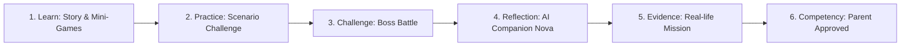
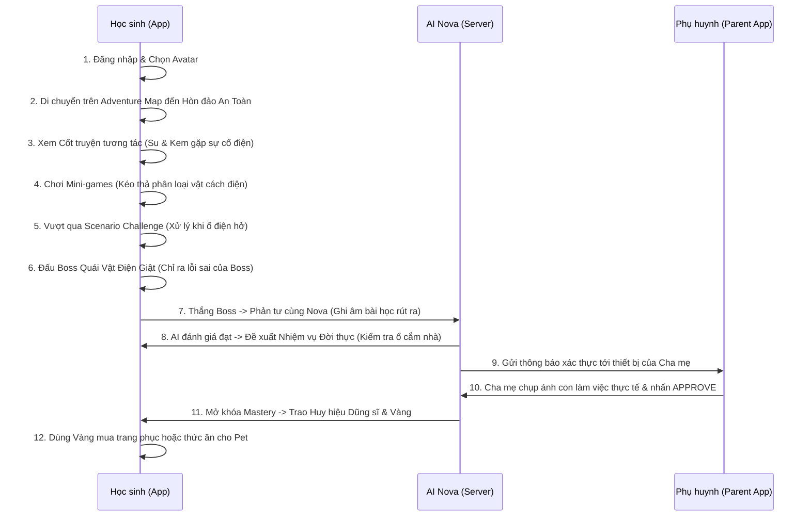

# 01. HIẾN CHƯƠNG DỰ ÁN & NỀN TẢNG SẢN PHẨM V1 (V1 Project Charter & Product Foundation)

> **Mã Tài Liệu Hợp Nhất**: `NS-V1-PRD-01`  
> **Nguồn Hợp Nhất Từ V1**: `00_Project Charter/README.md`, `01_Product Foundation/README.md`, `PRODUCT_FOUNDATION.md`, `PRODUCT_BLUEPRINT.md`.  
> **Trạng Thái**: ARCHIVED CANONICAL V1 (Bản Giai Đoạn 1)

---

## 1. HIẾN CHƯƠNG DỰ ÁN (Project Charter)

### 1.1. Danh Tính Đội Ngũ (Team Identity)
- **Chief Product Officer (CPO)**: Chiến lược sản phẩm và mô hình kinh doanh.
- **Chief Learning Officer (CLO)**: Bảo trợ phương pháp sư phạm và chất lượng giáo dục.
- **Game Director**: Thiết kế thế giới trò chơi, cơ chế tương tác và trải nghiệm UX tổng thể.
- **AI Architect**: Thiết kế kiến trúc AI đồng hành, prompt standards và các tính năng generative.
- **UX Director**: Giám sát trải nghiệm người dùng, đảm bảo giao diện thân thiện với trẻ em.
- **Technical Architect**: Thiết kế cấu trúc hệ thống, cơ sở dữ liệu và khả năng mở rộng.
- **Curriculum Expert**: Đảm bảo nội dung bám sát khung chương trình kỹ năng tiểu học.
- **Child Psychologist**: Tư vấn tâm lý lứa tuổi học sinh tiểu học (6 - 11 tuổi).
- **Gamified Designer**: Chịu trách nhiệm về hệ thống phần thưởng (Octalysis) và gameplay loop.

### 1.2. Tầm Nhìn Sản Phẩm Cốt Lõi (Core Product Vision)
NovaStars được định vị là một **Competency Adventure Platform (Nền tảng Phiêu lưu Năng lực)** dành cho học sinh tiểu học:
- **ĐÂY KHÔNG PHẢI LÀ**: Một LMS truyền thống, một app trắc nghiệm (Quiz App), hay một game giải trí đơn thuần.
- **ĐÂY LÀ**: Thế giới phiêu lưu nơi học sinh hình thành năng lực thực tế ngoài đời theo công thức:
  $$\text{Competency} = \text{Story} + \text{Game} + \text{AI} + \text{Reflection} + \text{Practice} + \text{Real-life Mission} + \text{Evidence}$$

### 1.3. Nguyên Tắc Làm Việc Cốt Lõi (Working Principles)
1. **Không quyết định dựa trên phỏng đoán**: Bắt buộc hỏi rõ chuyên gia/người dùng khi thiếu dữ liệu.
2. **Bắt buộc phải có Rationale**: Mọi giải pháp phải phân tích rõ Trade-offs, Ưu/Nhược điểm và Scalability.
3. **Ưu tiên cao nhất**: Giá trị năng lực thực chất (Competency-Based), Trải nghiệm an toàn của trẻ và Khả năng quốc tế hóa (i18n).
4. **Phương pháp vận hành**: Cuốn chiếu theo chu trình **Review $\rightarrow$ Approve $\rightarrow$ Freeze**.

---

## 2. ĐỊNH VỊ SẢN PHẨM & BẢN ĐỒ CẠNH TRANH (Product Positioning)

- **Target Persona**: Học sinh tiểu học (6–11 tuổi) là người trải nghiệm chính; Phụ huynh là người đồng hành và xác thực.
- **Vấn đề giải quyết**: Trẻ thiếu hụt kỹ năng an toàn và quản lý cảm xúc; phụ huynh bận rộn; thị trường tràn ngập quiz khô khan hoặc game gây nghiện.
- **Giá trị cốt lõi**: Chuyển hóa thời gian onscreen thành hành động thực tế ngoài đời, gắn kết gia đình không áp lực điểm số.
- **3 Điểm Khác Biệt Độc Bản (USP)**:
  1. Khung đánh giá năng lực đa tầng LSCAF (Tiers A-E).
  2. Vòng lặp Real-life Mission buộc trẻ phải hành động ngoài màn hình.
  3. AI Companion cá nhân hóa, thấu cảm, đóng vai trò bạn thân.

### Bảng So Sánh Vị Thế Cạnh Tranh
| Tiêu chí | LMS & Quiz App Truyền thống | Game Giải trí Thuần túy | NovaStars |
| :--- | :--- | :--- | :--- |
| **Bản chất** | Kiểm tra kiến thức lý thuyết | Giải trí, giữ chân kiếm tiền | **Hình thành năng lực thực tế** |
| **Động lực** | Điểm số, bảng xếp hạng thi đua | Vật phẩm ảo, cày cuốc | **Cốt truyện, AI Companion, Nhiệm vụ thực** |
| **Đầu ra** | Ghi nhớ ngắn hạn | Phản xạ tay mắt | **Hành vi thực tế & Portfolio năng lực** |

---

## 3. TRIẾT LÝ SẢN PHẨM & DNA ĐỘC QUYỀN (Product DNA: A-S-C-R-A)

5 Trụ cột Bản sắc của NovaStars:
1. **Adventure (Phiêu lưu)**: Khám phá thế giới mở gồm 6 hòn đảo năng lực.
2. **Story (Cốt truyện tương tác)**: Nhập vai qua truyện tranh hoạt họa cùng Su, Kem và Nova.
3. **Competency (Năng lực thực tế)**: Không dùng điểm số học thuật; đo lường bằng Portfolio năng lực.
4. **Real Life (Đời sống thực)**: Màn chơi bắt buộc dẫn đến hành động vật lý ngoài đời.
5. **AI (Trí tuệ nhân tạo)**: AI Companion Nova tương tác và phản hồi theo thời gian thực.

### 5 Nguyên Tắc Thiết Kế Sư Phạm Cốt Lõi (Core Principles)
- **No Lectures**: Không video bài giảng dài dòng, không tài liệu đọc lý thuyết khô khan.
- **No Rote Learning**: Không kiểm tra học thuộc lòng; 100% câu hỏi là mô phỏng tình huống thực tế.
- **No Pure Quizzes**: Thay thế trắc nghiệm chữ bằng mini-games tương tác vật lý.
- **Positive Reinforcement**: Không trừ điểm, không phạt khi sai; Nova che chắn và hướng dẫn thử lại.
- **Safety-First**: Nhiệm vụ đời thực kiểm duyệt y khoa/sư phạm, AI có guardrails bảo vệ, bảo mật ảnh của trẻ.

---

## 4. CHU TRÌNH HỌC TẬP 6 BƯỚC (6-Step Learning Progression)

$$\text{Learn} \rightarrow \text{Practice} \rightarrow \text{Challenge} \rightarrow \text{Reflection} \rightarrow \text{Evidence} \rightarrow \text{Competency}$$

---

## 5. HỒ SƠ NGƯỜI DÙNG & HÀNH TRÌNH (User Personas & Journey)

### 4 Nhóm Người Dùng Chính:
1. **Học sinh nhỏ tuổi (6–8 tuổi - Lớp 1, 2)**: Thích nuôi Pet, nút bấm to, dùng ghi âm giọng nói thay gõ phím.
2. **Học sinh lớn tuổi (9–11 tuổi - Lớp 3, 4, 5)**: Thích tùy biến Skin, Boss Battle kịch tính 5 HP, cốt truyện chiều sâu.
3. **Phụ huynh học sinh (The Busy Guide)**: Cần xác thực One-Click nhanh chóng, nhận báo cáo Radar năng lực cuối tuần.
4. **Content Team & Admin**: Cần SOP chuẩn, script kiểm tra tự động và hệ thống an toàn dữ liệu.

### Sơ Đồ Hành Trình Học Sinh & Phụ Huynh (Sequence Journey)

---

## 6. HỆ THỐNG CHỈ SỐ THÀNH CÔNG & CHỈ SỐ SAO BẮC ĐẨU (North Star Metric)

### Chỉ Số Sao Bắc Đẩu: $\text{PVCMR}$ (Parent-Verified Competency Mastery Rate)
$$\text{PVCMR} = \frac{\text{Tổng số nhiệm vụ đời thực được cha mẹ phê duyệt thành công trong tháng}}{\text{Số lượng tài khoản học sinh hoạt động hàng tháng (MAU)}} \ge 1.5$$

### 6 Nhóm Chỉ Số Sức Khỏe Sản Phẩm
1. **Learning**: Tiến tầng trong 7 ngày, độ chính xác lần đầu $>70\%$.
2. **Engagement**: $\text{DAU/MAU} > 30\%$, phiên học lý tưởng $15 - 20\text{ phút/ngày}$, Streak 7 ngày $>25\%$.
3. **Retention**: $\text{D7} > 50\%$, $\text{D30} > 40\%$.
4. **Competency**: Hoàn thành nhiệm vụ đời thực $>70\%$ số trẻ thắng Boss.
5. **Parent**: Tỷ lệ duyệt $\text{PVR} > 80\%$, $\text{Parent NPS} > 50$, phản hồi $< 12\text{ giờ}$.
6. **AI**: Độ chính xác phản tư $>90\%$, độ trễ $< 2.0\text{s}$, chi phí $<\$0.10/\text{User/tháng}$.

---

## 7. PHẠM VI SẢN PHẨM & QUẢN TRỊ RỦI RO (Scope & Risks)

- **In Scope**: Khóa ngân hàng 34 kỹ năng (680 câu hỏi JS qua CDN), App đa nền tảng (Flutter), AI Companion & Assessor (Gemini 1.5 Flash), Adventure Map 2D isometric, Firebase Serverless.
- **Out of Scope**: Không 3D phức tạp, không Multiplayer PvP thời gian thực, không quảng cáo/IAP hướng tới trẻ em.

### 4 Rủi Ro Trọng Yếu & Phương Án Giảm Thiểu
1. **AI Jailbreak / Lời khuyên mất an toàn**: System Instructions cứng + Safety Filter Agent + 100% nhiệm vụ đời thực lấy từ thư viện đã duyệt y khoa/sư phạm.
2. **Nghẽn do Phụ huynh không duyệt bài**: Nhắc nhở thông minh qua SMS/Zalo ZNS + Chế độ "Tạm duyệt bởi AI" sau 24h để không chặn đường chơi của trẻ.
3. **Lạm phát chi phí đám mây**: Phân phối câu hỏi tĩnh qua CDN (`questions_data.js`), dùng Gemini 1.5 Flash cho hội thoại thông thường.
4. **Rò rỉ hình ảnh trẻ em**: Mã hóa tệp tin, phân quyền Firebase Security Rules nghiêm ngặt và tự động xóa ảnh sau 30 ngày.
