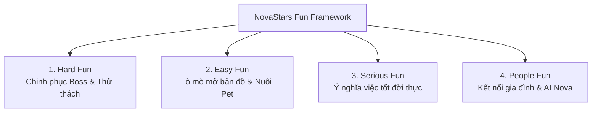
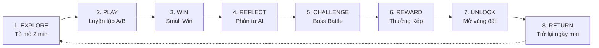
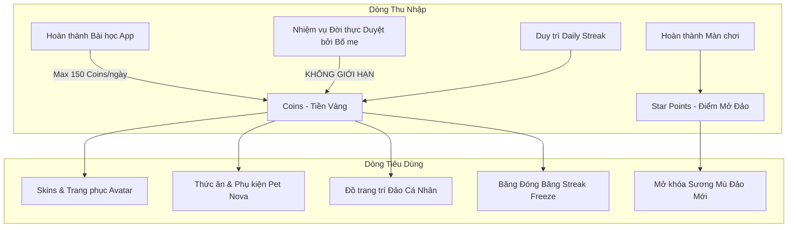

# 03. KINH THÁNH THIẾT KẾ GAME & HỆ THỐNG THIẾT KẾ V1 (V1 Game Design Bible & Design System)

> **Mã Tài Liệu Hợp Nhất**: `NS-V1-PRD-03`  
> **Nguồn Hợp Nhất Từ V1**: `03_Game Design Bible/` (`GAME_DESIGN_BIBLE.md`, `README.md`), `05_Design System/` (`README.md`).  
> **Trạng Thái**: ARCHIVED CANONICAL V1 (Bản Giai Đoạn 1)

---

## 1. KHUNG KHÁI NIỆM "FUN" TRONG GIÁO DỤC (Fun Framework)

### Các Loại "Fun" Cấm Đoán (Unethical Funs to Avoid)
- ❌ Không Gambling / Gacha / Hộp quà may rủi.
- ❌ Không Toxic Competitive PvP đè bẹp bạn bè.
- ❌ Không Clicker Grinding bấm vô nghĩa.
- ❌ Không Panic FOMO đe dọa mất đồ.

---

## 2. 12 NGUYÊN TẮC THIẾT KẾ GAME CỦA HỘI ĐỒNG (12 Council Principles)

1. **Adventure-First, Study-Second**: Học tập là phương tiện để chiến thắng cuộc phiêu lưu.
2. **Competency Over Content**: Hoàn thành khi chứng minh được năng lực thực tế.
3. **Fail-Safe Environment**: Thất bại là thông tin phản hồi; không bao giờ trừ điểm, không phạt chờ.
4. **Scaffolding Mastery**: Độ khó thích ứng theo vùng phát triển gần nhất (ZPD).
5. **Intrinsic Motivation Priority**: Ngoại lực (Coins/Badges) chỉ là giàn giáo ban đầu.
6. **Real-World Bridge**: Mọi thành tựu trong game phải có dây nối với đời thực.
7. **Empathetic Companion**: AI Nova thấu cảm, không phán xét, luôn khích lệ.
8. **Self-Paced Autonomy**: Trẻ tự chủ lựa chọn nhân vật, Pet và cách giải quyết.
9. **Visual & Emotional Clarity**: UI/UX rực rỡ, bo tròn, tối thiểu 48x48dp.
10. **Parent as Co-Hero**: Cha mẹ là đồng minh xác thực thành tích ngoài đời.
11. **Ethical Safeguards**: Giới hạn thời gian chơi tối đa 20-30 phút/ngày.
12. **Long-Term Behavior Change**: Đo lường thành công bằng sự thay đổi hành vi sau 30-90 ngày.

---

## 3. VÒNG LẶP GAMEPLAY CỐT LÕI (8-Step Core Game Loop)

---

## 4. HỆ THỐNG KINH TẾ TIỀN TỆ KÉP (Dual-Currency Economy Balance)

### Bảng Cân Bằng Giá Cả & Bài Học Tiết Kiệm Cho Trẻ
| Vật Phẩm | Độ Hiếm | Giá (Coins) | Thời Gian Tích Lũy | Bài Học Tài Chính |
| :--- | :---: | :---: | :---: | :--- |
| **Thức ăn Pet Cơ bản** | Common | 30 | 1 ngày học in-app | Tiêu dùng thiết yếu |
| **Mũ Thám Hiểm** | Common | 200 | 2 ngày học + 1 Nhiệm vụ | Tiết kiệm ngắn hạn |
| **Áo Choàng Dũng Sĩ** | Rare | 600 | 4-5 ngày học & thực hành | Lập kế hoạch tiết kiệm |
| **Lâu Đài Đa Sắc Đảo** | Legendary | 2,000 | 2-3 tuần kiên trì | Hoãn sự sung sướng (Delayed Gratification) |
| **Băng Đóng Băng Streak** | Consumable | 300 | 2 ngày học | Quản lý rủi ro & Bảo hiểm |

---

## 5. THIẾT KẾ THẤT BẠI AN TOÀN & ĐẤU BOSS (Failure Design & Boss Battle)

### Nguyên Tắc Phản Hồi Giàn Giáo Khi Trả Lời Sai
- **Lần sai 1**: Nova gợi ý nhẹ bằng hình ảnh hoặc loại 1 phương án sai nhất.
- **Lần sai 2**: Nova giải thích nguyên lý ngắn gọn bằng hoạt hình minh họa.
- **Lần sai 3**: Nova cùng trẻ phân tích và dẫn dắt đến đáp án đúng. Chọn lại đúng vẫn nhận trọn vẹn điểm thưởng.

### Cơ Chế Đấu Boss Turn-Based
- Boss đại diện cho **"Thói quen xấu / Nguy cơ mất an toàn / Sự bốc đồng"** (Quái Vật Lười Biếng, Quái Vật Nổi Giận...).
- Học sinh tấn công Boss bằng cách **chỉ ra hành vi sai của Boss và chọn cách khắc phục đúng**.
- Thắng Boss $\rightarrow$ Boss hóa giải thành Tinh linh bạn tốt và trao Star Points.

---

## 6. HỆ THỐNG THIẾT KẾ TRỰC QUAN (V1 Design System)

### 6.1. Bảng Màu Chuẩn (Color Palette)
- **Primary Green (Duolingo-like)**: `#58CC02` - Nút hành động chính, hoàn thành thử thách.
- **Adventure Yellow**: `#FFC800` - Sao vàng, mở khóa đảo, phần thưởng.
- **Ocean Blue**: `#1899D6` - Bản đồ nước, thông tin hướng dẫn của AI Nova.
- **Energy Orange**: `#FF9600` - Boss Battle, cảnh báo nhẹ nhàng.
- **Text & Background**: Chữ `#3C3C3C` (Xám đậm) hoặc `#FFFFFF`, nền tối/glassmorphism bo góc $12\text{px}-20\text{px}$.

### 6.2. Phông Chữ & Typography
- **Tiêu đề**: **Outfit** hoặc **Fredoka One** (Bo góc mềm mại).
- **Nội dung**: **Inter** hoặc **Nunito** (Cỡ chữ tối thiểu $16\text{px}$ trên mobile).

### 6.3. Linh Vật & Nhân Vật
- **Sao Nova (AI Companion)**: Chú sao nhỏ có cánh, lấp lánh, thay đổi biểu cảm linh hoạt (vui mừng, suy nghĩ, cổ vũ).
- **Boss**: Hoạt họa ngộ nghĩnh, nghịch ngợm, không gây ác mộng cho trẻ nhỏ.
