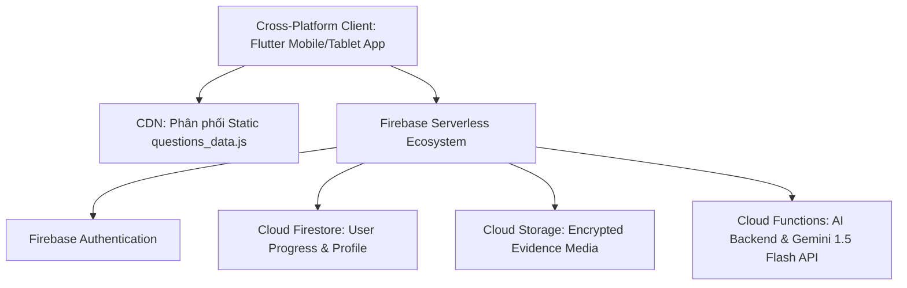
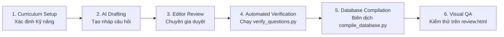
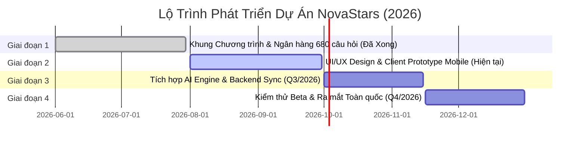

# 04. AI BIBLE, KIẾN TRÚC KỸ THUẬT & LỘ TRÌNH V1 (V1 AI Bible, Tech Architecture, SOP & Roadmap)

> **Mã Tài Liệu Hợp Nhất**: `NS-V1-PRD-04`  
> **Nguồn Hợp Nhất Từ V1**: `04_AI Bible/`, `06_Technical Architecture/`, `07_Content Production SOP/`, `08_Decision Log/`, `09_Roadmap/`.  
> **Trạng Thái**: ARCHIVED CANONICAL V1 (Bản Giai Đoạn 1)

---

## 1. AI BIBLE: BẢN THIẾT KẾ TRỢ LÝ ĐỒNG HÀNH & HỆ THỐNG AGENT (AI Architecture)

### 1.1. Nhân Vật AI Companion Nova
- **Vai trò**: Người bạn đồng hành thấu cảm, khích lệ và cùng học với trẻ (không phải thầy giáo khó tính hay người chấm điểm phán xét).
- **Thuật toán IRIS (Interactive Real-time Instructional Scaffolding)**:
  - Phân tích tốc độ phản hồi và lịch sử trả lời để tự động điều chỉnh độ khó bài học.
  - Phân tích câu trả lời phản tư tự do (Tier E) bằng mô hình xử lý ngôn ngữ tự nhiên tiếng Việt.
- **Hàng rào bảo vệ Zero-Toxic Guardrails**:
  - Chặn hoàn toàn các chủ đề bạo lực, tình dục, chính trị, tôn giáo hoặc thông tin nhạy cảm.
  - Mọi nhiệm vụ vật lý ngoài đời thực bắt buộc phải thuộc danh mục an toàn đã được Hội đồng Y khoa & Sư phạm phê duyệt.

### 1.2. Chuẩn Hợp Đồng Tác Nhân (AI Agent Contract Standard - ACS)
- Quy định rõ ràng `agent_id`, `role`, `input_schema`, `output_schema`, và `quality_rubric` cho từng tác nhân trong hệ thống.
- **Story Agent**: Tạo cốt truyện và hội thoại nhân vật.
- **Boss Agent**: Thiết kế cơ chế trận đấu và câu hỏi sửa sai cho Boss.
- **Assessment Agent**: Thiết kế câu hỏi tình huống LSCAF và phân tích phản tư.

---

## 2. KIẾN TRÚC KỸ THUẬT V1 BAN ĐẦU (Legacy Tech Architecture)

### Các Thành Phần Hạ Tầng V1
1. **Frontend App**: Flutter đa nền tảng tối ưu cho Tablet/iPad và Smartphone.
2. **Ngân Hàng Câu Hỏi Tĩnh**: 680 câu hỏi tĩnh biên dịch thành file JavaScript `questions_data.js` phân phối qua CDN để tiết kiệm $90\%$ chi phí Firestore Reads (DEC-2026-003).
3. **Cơ Sở Dữ Liệu Động**: Cloud Firestore lưu trữ tiến trình năng lực cá nhân, điểm Coins, Star Points và trạng thái Streak.
4. **Backend Xử Lý AI**: Google Cloud Functions gọi mô hình **Gemini 1.5 Flash** cho các tác vụ hội thoại và chấm điểm phản tư.

---

## 3. QUY TRÌNH BIÊN SOẠN NỘI DUNG 6 BƯỚC (Content Production SOP)

1. **Curriculum Setup**: Xác định mục tiêu kỹ năng theo khung LSCAF.
2. **AI Drafting**: Trợ lý AI tạo bản nháp 20 câu hỏi tình huống theo 5 tầng nhận thức.
3. **Editor Review**: Chuyên gia giáo dục chỉnh sửa ngôn từ phù hợp lứa tuổi 6-11.
4. **Automated Verification**: Chạy script `verify_questions.py` kiểm tra cấu trúc cú pháp JSON/JS.
5. **Database Compilation**: Chạy script `compile_database.py` để xuất bản file `questions_data.js`.
6. **Visual QA**: Kiểm tra hiển thị trực quan trên ứng dụng web `review.html`.

---

## 4. NHẬT KÝ QUYẾT ĐỊNH ĐÃ ĐÓNG BĂNG V1 (Frozen Decision Log)

- **📌 DEC-2026-001 [Pedagogy]**: Khóa Khung Chương trình 34 Kỹ năng Cốt lõi cho Tiểu học chia làm 6 nhóm năng lực.
- **📌 DEC-2026-002 [Pedagogy]**: Áp dụng Hệ thống Đánh giá 5 Tầng LSCAF (Tier A $\rightarrow$ Tier E, 20 câu hỏi/kỹ năng, tổng cộng 680 câu hỏi).
- **📌 DEC-2026-003 [Tech Architecture]**: Phân phối Ngân hàng Câu hỏi Tĩnh qua CDN dưới dạng file JavaScript (`questions_data.js`) để tối ưu tốc độ và giảm chi phí Firestore.
- **📌 DEC-2026-004 [UX Design]**: Thiết kế Turn-Based Boss Battle cho đánh giá năng lực Tier D.

---

## 5. LỘ TRÌNH PHÁT TRIỂN 4 GIAI ĐOẠN (Development Roadmap)

- **Giai đoạn 1 (Đã hoàn thành)**: Thiết lập Khung Chương trình, Blueprint & Ngân hàng 680 Câu hỏi tĩnh.
- **Giai đoạn 2 (Tiếp theo)**: Xây dựng UI/UX Design & Game Client Prototype (React/Capacitor).
- **Giai đoạn 3 (Q3/2026)**: Tích hợp AI Companion Engine (Nova) & Đồng bộ Backend.
- **Giai đoạn 4 (Q4/2026)**: Kiểm thử Beta diện rộng & Chính thức phát hành.
