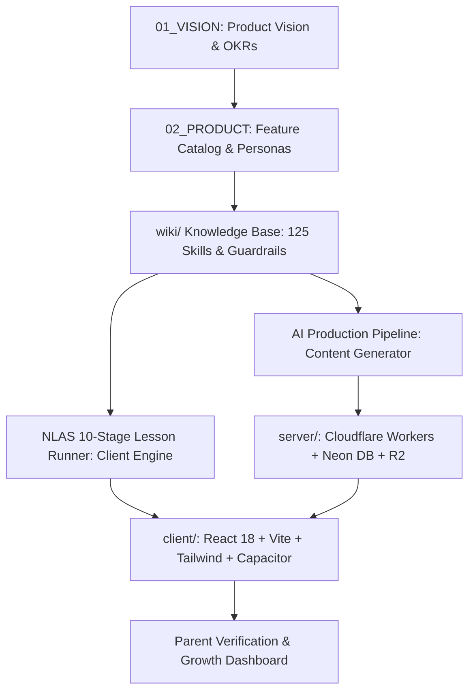
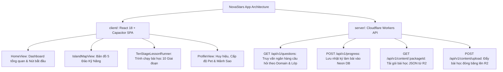

# 01. TẦM NHÌN SẢN PHẨM & CHÂN DUNG NGƯỜI DÙNG (Product Vision, Strategy & Personas)

> **Mã Tài Liệu Hợp Nhất**: `NS-CANONICAL-PRD-01`  
> **Phiên Bản**: `v2.1.0` (Cập nhật đồng bộ thực tế hệ thống 10 Giai đoạn & 125 Kỹ năng)  
> **Nguồn Tri Thức**: `docs/PRD_V2/`, `wiki/00_CORE/`, `wiki/01_DOMAINS/`, `client/`, `server/`.  
> **Trạng Thái**: CANONICAL LIVING SPECIFICATION

---

## 1. TỔNG QUAN HỆ THỐNG & BẢN ĐỒ KIẾN TRÚC TOÀN CỤC (System Overview & Architecture Map)

NovaStars là **Nền tảng Phiêu lưu Năng lực (Competency Adventure Platform)** dành cho học sinh tiểu học (6–11 tuổi / Lớp 1 đến Lớp 5), kết hợp giữa giáo dục kỹ năng sống, trò chơi nhập vai tương tác và trợ lý AI đồng hành.

```
       [ HỌC SINH TIỂU HỌC (Lớp 1 - 5) ] ◄── Trải nghiệm nhập vai 10 Giai đoạn ──► [ AI COMPANION NOVA ]
                         │                                                                   ▲
                         ▼                                                                   │
              [ BẢN ĐỒ 5 ĐẢO NĂNG LỰC ] (125 Kỹ năng thực tế)                               │
                         │                                                                   │
                         ▼                                                                   │
            [ THỰC HÀNH & PHẢN TƯ SÂU ] ──► [ NHIỆM VỤ ĐỜI THỰC ] ──► [ PHỤ HUYNH XÁC THỰC ]
```

### Sơ Đồ Tô-Pô Dòng Chảy Tri Thức Hiện Tại (Topology Dependency Flow)


---

## 2. TRIẾT LÝ SẢN PHẨM & 5 NGUYÊN TẮC CỐT LÕI (Canonical Principles)

1. **Năng Lực Thực Tế Thay Vì Học Vẹt (Life Skills Over Rote Memorization)**: Xây dựng năng lực phản xạ và hành vi ngoài đời (tài chính, an toàn, cảm xúc SEL, tự chăm sóc, kỹ năng số) thay vì học thuộc định nghĩa.
2. **Học Tập Vui Vẻ & Làm Chủ Tự Thân (Joyful Mastery)**: Động lực nội tại thông qua chinh phục Boss, nuôi Pet Nova và mở khóa Đảo phiêu lưu; không áp lực thi cử hay xếp hạng đè bẹp.
3. **Cá Nhân Hóa Bằng AI (AI Companion & Scaffolding)**: Trợ lý AI Nova thấu cảm, hỗ trợ giàn giáo (scaffolding) phân tầng khi trẻ gặp khó khăn và chấm điểm phản tư định tính.
4. **Môi Trường An Toàn Để Thử Sai (Fail-Safe Environment)**: Sai sót là bước đệm học tập; tuyệt đối không trừ điểm, không trừ mạng (No HP penalty) và không trừng phạt.
5. **Cầu Nối Gia Đình (Parent-Child Bridge)**: Mọi bài học đều dẫn đến nhiệm vụ đời thực (Real-life Mission) để trẻ thực hành cùng cha mẹ và được cha mẹ xác nhận đạt chuẩn.

$$\text{Tầm Nhìn 2026–2030: Trở thành Hệ điều hành rèn luyện kỹ năng sống hàng đầu cho 10 triệu học sinh tiểu học.}$$

---

## 3. CÁC GIẢ ĐỊNH & CHỈ SỐ SAO BẮC ĐẨU (North Star Metric & OKRs)

### Chỉ Số Sao Bắc Đẩu: $\text{PVCMR}$ (Parent-Verified Competency Mastery Rate)
$$\text{PVCMR} = \frac{\text{Tổng số nhiệm vụ đời thực được phụ huynh phê duyệt trong tháng}}{\text{Số lượng học sinh hoạt động hàng tháng (MAU)}} \ge 1.5$$

### Mục Tiêu Chiến Lược & OKRs (2026–2027)
- **Objective 1: Hoàn Thiện Khung 125 Kỹ Năng Chuẩn Hóa**:
  - *KR 1.1:* Đóng gói 125 gói bài học mẫu (Lesson Packages) chuẩn 10 giai đoạn cho 5 khối lớp.
  - *KR 1.2:* Tỷ lệ phụ huynh xác nhận nhiệm vụ thực tế đạt $>85\%$.
- **Objective 2: Vận Hành Hệ Thống Production Đồng Bộ**:
  - *KR 2.1:* Client React 18 + Capacitor đạt 60 FPS, kích thước cài đặt $<15\text{MB}$.
  - *KR 2.2:* Serverless API Cloudflare Workers + Neon DB phản hồi $<100\text{ms}$.
- **Objective 3: Tối Đa Hóa Độ Gắn Kết Của Trẻ**:
  - *KR 3.1:* Tỷ lệ hoàn thành trọn vẹn 10 giai đoạn bài học ($6 - 10\text{ phút}$) đạt $>90\%$.
  - *KR 3.2:* D30 Retention đạt $>45\%$.

---

## 4. CHÂN DUNG NGƯỜI DÙNG (User Personas)

### 👦 1. Primary Learner: Bé Leo (8 Tuổi - Học sinh Lớp 3)
- **Hành vi**: Dùng màn hình cảm ứng thành thạo, khả năng tập trung 5–8 phút/phiên, thích hình ảnh trực quan, hiệu ứng pháo hoa, giọng nói ấm áp.
- **Nhu cầu**: Muốn được phiêu lưu, thu thập Mảnh Sao (Star Shards), nuôi Pet Nova, đánh bại Boss và khoe việc tốt với ba mẹ.
- **Quy chuẩn UX cho Leo**:
  - Nút bấm tối thiểu **$48\times 48\text{ dp}$** dạng 3D bouncy.
  - Mỗi câu thoại $\le 25$ từ, font chữ Fredoka/Outfit bo tròn mềm mại.
  - Hỗ trợ ghi âm giọng nói khi trả lời phản tư cùng Nova.

### 👨‍💼 2. Parent Persona: Bố Minh (35 Tuổi - Phụ huynh hiện đại)
- **Hành vi**: Bận rộn, lo lắng con xem video vô bổ hoặc chơi game bạo lực, muốn con biết tự lập, an toàn và biết quản lý cảm xúc.
- **Nhu cầu**:
  - Nhận thông báo xác thực nhiệm vụ thực tế của con với 1 chạm (One-Click Approval).
  - Báo cáo trực quan theo biểu đồ Radar 5 Miền năng lực.
  - Chủ đề gợi ý trò chuyện ngắn 1 phút tại bàn ăn gia đình.
  - Bảo mật tuyệt đối dữ liệu và hình ảnh trẻ em (chuẩn COPPA/GDPR Kids).

---

## 5. DANH MỤC TÍNH NĂNG ĐANG TRIỂN KHAI TRÊN CODEBASE (Feature Catalog)


