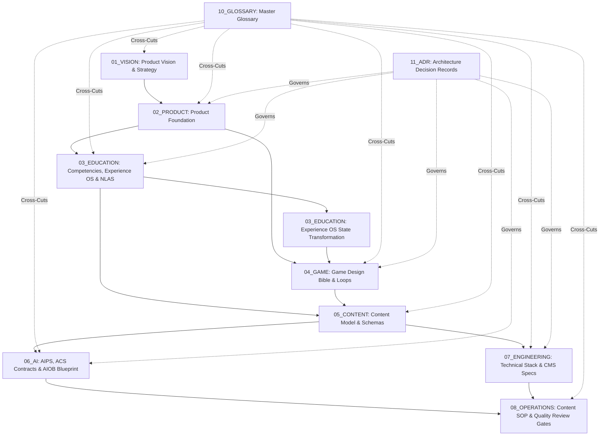
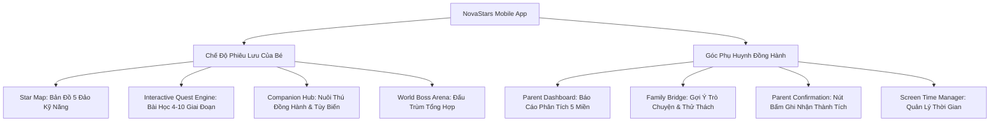

# 01. TẦM NHÌN SẢN PHẨM & CHÂN DUNG NGƯỜI DÙNG (Product Vision, Strategy & Personas)

> **Mã Tài Liệu Hợp Nhất**: `NS-CANONICAL-PRD-01`  
> **Nguồn Hợp Nhất Từ V2**: `00_HOME/` (`index.md`, `architecture_map.md`, `system_status.md`), `01_VISION/` (`product_philosophy.md`, `core_assumptions.md`, `strategic_objectives.md`), `02_PRODUCT/` (`product_foundation.md`, `feature_catalog/companion_system.md`, `feature_catalog/quest_system.md`, `user_personas/learner_persona.md`, `user_personas/parent_persona.md`).  
> **Trạng Thái**: CANONICAL FROZEN (Bản Chuẩn Hóa V2.0.0)

---

## 1. TỔNG QUAN HỆ THỐNG & BẢN ĐỒ KIẾN TRÚC TOÀN CỤC (System Overview & Architecture Map)

NovaStars là **Nền tảng Phiêu lưu Năng lực (Competency Adventure Platform)** dành cho học sinh tiểu học (6–12 tuổi), kết hợp giữa giáo dục kỹ năng sống, trò chơi nhập vai tương tác và trợ lý AI đồng hành.

### Sơ Đồ Tô-Pô Dòng Chảy Tri Thức (Topology Dependency Flow)

### Trạng Thái Đóng Băng Các Miền Tri Thức (Domain Health & Status Matrix)
- Toàn bộ 12 Miền tri thức ban đầu (`00_HOME` đến `11_ADR`) đã đạt chuẩn **100% FROZEN (Canonical)** với cấp độ ưu tiên `CRITICAL` và chu kỳ rà soát `QUARTERLY` / `ANNUAL`.

---

## 2. TRIẾT LÝ SẢN PHẨM & KIM CHỈ NAM (Product Philosophy & North Star)

### 5 Nguyên Tắc Cốt Lõi (Canonical Principles)
1. **Năng Lực Thực Tế Thay Vì Học Vẹt (Life Skills Over Rote Memorization)**: Xây dựng năng lực xử lý tình huống thực tế (tài chính, cảm xúc, an toàn, kỹ năng số) thay vì chỉ nhớ định nghĩa lý thuyết.
2. **Học Tập Vui Vẻ & Làm Chủ Tự Thân (Joyful Mastery)**: Gamification không phải là điểm thưởng giả tạo bên ngoài, mà là động lực nội tại gắn liền với sự tò mò và trải nghiệm chinh phục thử thách.
3. **Cá Nhân Hóa Bằng AI (AI-Powered Personalization & Scale)**: Trợ lý AI đồng hành thích ứng với tốc độ và tâm lý riêng của từng em, sản xuất hàng ngàn bài học chất lượng cao.
4. **Môi Trường An Toàn Để Thử Sai (Safe Failure & Growth Mindset)**: Sai sót là cơ hội học hỏi; tuyệt đối không phạt nặng hay chê bai trẻ.
5. **Cầu Nối Gia Đình (Parent-Child Bridge)**: Chuyển hóa bài học từ màn hình di động thành thói quen tốt ngoài đời thực dưới sự khích lệ của cha mẹ.

$$\text{Tầm Nhìn 2026–2030: Phụng sự 10 triệu trẻ em toàn cầu với các kỹ năng sống cốt lõi.}$$

---

## 3. CÁC GIẢ ĐỊNH & GIẢ THUYẾT CHIẾN LƯỢC (Foundational Hypotheses)

1. **Giả thuyết 1: Gamification Nội Tại Thúc Đẩy Học Bền Vững**:
   - *Giả định:* Trẻ 6–12 tuổi sẽ dành thời gian gấp $3\times$ để rèn luyện kỹ năng nếu được đặt trong vòng lặp game phiêu lưu thay vì trắc nghiệm truyền thống.
   - *Chỉ số xác minh:* Tỷ lệ giữ chân D30 $>45\%$, hoàn thành trung bình $\ge 2$ quest nodes/ngày.
2. **Giả thuyết 2: Sự Đồng Hành Của Phụ Huynh Tăng Giá Trị Vòng Đời (LTV)**:
   - *Giả định:* Phụ huynh sẵn sàng đăng ký trả phí nếu được cung cấp báo cáo năng lực trực quan và chủ đề trò chuyện thực tế hàng ngày mà không gây phiền toái.
   - *Chỉ số xác minh:* Tỷ lệ kích hoạt Parent Portal $>70\%$, tỷ lệ hoàn thành hoạt động ngoại tuyến $>40\%$.
3. **Giả thuyết 3: Tự Động Hóa AI Giảm 90% Chi Phí Sản Xuất Nội Dung**:
   - *Giả định:* Pipeline AI Multi-Agent tuân thủ JSON Schemas và 5 Review Gates có thể sản xuất $10,000+$ bài học với chi phí $<\$0.50$/bài.
   - *Chỉ số xác minh:* $>95\%$ pass rate ở Gates 1-4, tốc độ kiểm duyệt của con người đạt $>20$ bài/giờ tại Gate 5.

---

## 4. MỤC TIÊU CHIẾN LƯỢC & OKRs (Target OKRs 2026–2027)

- **Objective 1: Xây Dựng Khung Chương Trình Chuẩn Quốc Tế**:
  - *KR 1.1:* Hoàn thành và đóng băng 125 kỹ năng qua 5 khối lớp (Lớp 1 - 5).
  - *KR 1.2:* Tỷ lệ phụ huynh xác nhận kỹ năng thực tế của con đạt $>85\%$.
- **Objective 2: Tự Động Hóa Sản Xuất Bằng AI Factory (AIPS)**:
  - *KR 2.1:* Tự động hóa sinh 1,000 bài học đầu tiên đạt $100\%$ schema validation.
  - *KR 2.2:* Chi phí sản xuất trung bình $<\$0.50$/bài học.
- **Objective 3: Tối Đa Hóa Độ Gắn Kết Của Người Học**:
  - *KR 3.1:* Tỷ lệ hoàn thành mỗi phiên học 6-10 phút đạt $>90\%$.
  - *KR 3.2:* D30 retention đạt $>45\%$.

---

## 5. CHÂN DUNG NGƯỜI DÙNG (User Personas)

### 👦 1. Primary Learner Persona: "Leo" (8 Tuổi, Học Sinh Lớp 3)
- **Hồ sơ**: Thành thạo màn hình cảm ứng (chơi game di động, xem YouTube Kids), khả năng chú ý 5–8 phút/phiên, đọc được câu ngắn (15–20 từ), thích hình ảnh và giọng đọc (voiceover).
- **Mục tiêu & Động lực**:
  - Thu thập thú đồng hành NovaStar và mở khóa trang phục bắt mắt.
  - Vượt qua cốt truyện kịch tính và đánh bại trùm quái vật (Boss).
  - Cảm thấy tự hào khi khoe thành tích với ba mẹ.
- **Quy tắc thiết kế UX cho Leo**:
  - Kích thước nút chạm tối thiểu: **$48\times 48\text{ dp}$**.
  - Luôn có nút phát giọng đọc âm thanh cho mọi câu thoại đối thoại.
  - Không phạt điểm khi chọn sai; phản hồi hỗ trợ tức thì với thái độ khích lệ.

### 👨‍💼 2. Parent Persona: "Minh" (35 Tuổi, Nhân Viên Văn Phòng)
- **Hồ sơ**: Bố của trẻ 8 tuổi, muốn con học kỹ năng thực tế (quản lý tiền bạc, làm chủ cảm xúc) mà không bị nghiện màn hình hoặc xem video thụ động.
- **Tính năng yêu cầu**:
  - Báo cáo tuần (Weekly Mastery Digest) qua push notification bằng ngôn ngữ đời thường (e.g. *"Tuần này Leo đã thành thạo kỹ năng tiết kiệm tiền!"*).
  - Chủ đề gợi ý trò chuyện 1 phút tại bàn ăn gia đình (Offline Conversation Starters).
  - Giới hạn thời gian màn hình (Screen Time Guardrails: tối đa 20 phút/ngày).
  - Bảo mật tuyệt đối thông tin riêng tư của trẻ (tuân thủ COPPA & GDPR Kids).

---

## 6. DANH MỤC TÍNH NĂNG CỐT LÕI (Feature Catalog)

### Đặc Tả 1: Hệ Thống Quest & Star Map (`NS-PRD-FET-001`)
- **Star Map Interface**: Giao diện chính theo chiến dịch thế giới (Echo Forest, Crystal Canyon...).
- **3 Loại Quest Nodes**:
  1. *Story Quest Node (Chuẩn)*: Chạy bài học sư phạm (Hook $\rightarrow$ Exploration $\rightarrow$ Boss $\rightarrow$ Reflection).
  2. *Challenge Quest Node*: Câu đố thử thách độc lập kiểm tra kỹ năng.
  3. *World Boss Node*: Trận đấu trùm tổng hợp sau mỗi cụm 5 quest nodes.

### Đặc Tả 2: Hệ Thống Thú Đồng Hành NovaStar (`NS-PRD-FET-002`)
- **Companion Hub**: Nhận nuôi linh vật (Cáo Orion, Thỏ Astra).
- **Tính năng**:
  1. Chăm sóc, cho ăn, trang điểm phụ kiện bằng Star Shards (Mảnh Sao).
  2. Bạn đồng hành gợi ý (Scaffolding Partner) khi bé gặp câu hỏi khó.
  3. Tiến hóa cấp độ (Level 5 & Level 10) mở khóa hiệu ứng hào quang (Star Aura) và vương miện.
