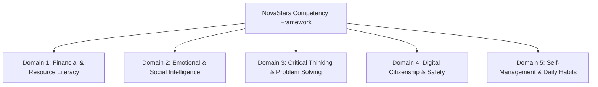
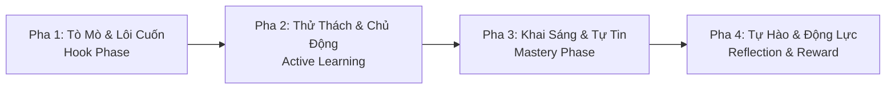
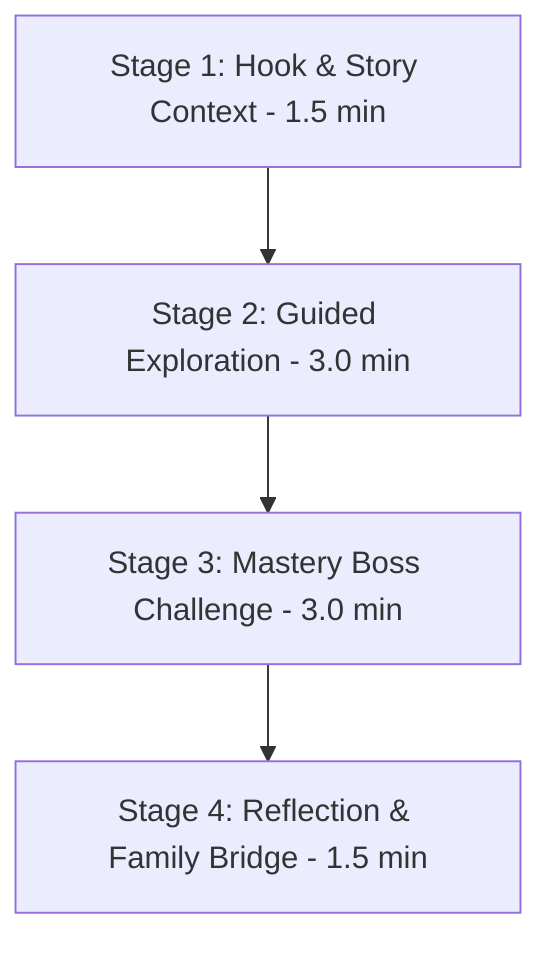
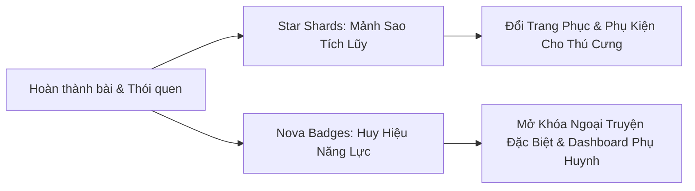
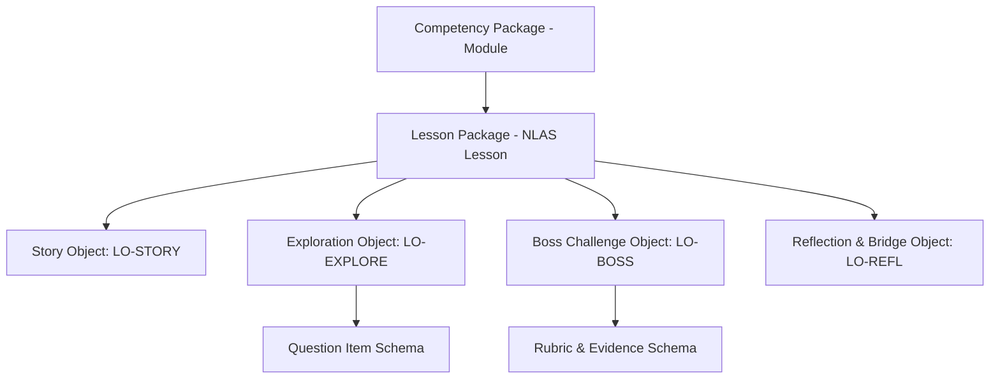

# 02. SƯ PHẠM, THIẾT KẾ GAME & MÔ HÌNH NỘI DUNG (Pedagogy, Game Design & Content Model)

> **Mã Tài Liệu Hợp Nhất**: `NS-CANONICAL-PRD-02`  
> **Nguồn Hợp Nhất Từ V2**: `03_EDUCATION/` (`competency_framework.md`, `experience_os.md`, `learning_framework.md`, `nlas_framework.md`), `04_GAME/` (`game_design_bible.md`, `game_economy.md`, `gameplay_loops.md`, `mechanics_catalog/mini_game_patterns.md`), `05_CONTENT/` (`content_model.md`).  
> **Trạng Thái**: CANONICAL FROZEN (Bản Chuẩn Hóa V2.0.0)

---

## 1. KHUNG NĂNG LỰC CỐT LÕI (Competency Framework: 5 Domains, 25 Subdomains)

Toàn bộ chương trình giáo dục kỹ năng sống NovaStars được xây dựng trên **5 Miền Năng Lực Lớn** và **25 Phân Miền**:



### 1.1. Miền 1: Giáo Dục Tài Chính & Quản Lý Nguồn Lực (`DOM-FIN`)
- `SUB-FIN-EARN`: Hiểu giá trị lao động & cách tạo ra tiền
- `SUB-FIN-SAVE`: Tiết kiệm & Trì hoãn sự thỏa mãn tức thì (Delayed Gratification)
- `SUB-FIN-BUDG`: Lập ngân sách & Chi tiêu thông minh
- `SUB-FIN-NEED`: Phân biệt Cần (Need) vs. Muốn (Want)
- `SUB-FIN-ETHC`: Quản lý tài nguyên & Đạo đức sử dụng tiền

### 1.2. Miền 2: Trí Tuệ Cảm Xúc & Kỹ Năng Xã Hội SEL (`DOM-SEL`)
- `SUB-SEL-RECG`: Nhận diện & Gọi tên cảm xúc
- `SUB-SEL-REGU`: Tự điều chỉnh cảm xúc & Chiến lược ứng phó (Hạ hỏa cơn giận)
- `SUB-SEL-EMPA`: Thấu cảm & Đặt mình vào vị trí người khác
- `SUB-SEL-COMM`: Giao tiếp lành mạnh, lễ phép & Lắng nghe tích cực
- `SUB-SEL-CONF`: Giải quyết xung đột ôn hòa & Hợp tác đội nhóm

### 1.3. Miền 3: Tư Duy Phản Biện & Giải Quyết Vấn Đề (`DOM-CRT`)
- `SUB-CRT-LOGIC`: Tư duy logic & Suy luận diễn dịch
- `SUB-CRT-INFO`: Đánh giá thông tin & Phân biệt Sự thật vs. Ý kiến
- `SUB-CRT-CREA`: Tư duy sáng tạo & Đổi mới cách làm
- `SUB-CRT-CAUSE`: Phân tích nguyên nhân & Hệ quả hành vi
- `SUB-CRT-RISK`: Ra quyết định & Đánh giá rủi ro

### 1.4. Miền 4: Công Dân Số & An Toàn Bản Thân (`DOM-DIG`)
- `SUB-DIG-PRIV`: Bảo vệ quyền riêng tư & Dữ liệu cá nhân (Safe Touch, Mật khẩu)
- `SUB-DIG-BULLY`: Nhận diện bắt nạt mạng & Lên tiếng bảo vệ bạn
- `SUB-DIG-TIME`: Quản lý thời gian màn hình cân bằng (Screen Time)
- `SUB-DIG-EVAL`: Đánh giá độ tin cậy của thông tin trên Internet
- `SUB-DIG-RESP`: Ứng xử văn minh, lịch thiệp trên không gian số

### 1.5. Miền 5: Tự Quản Bản Thân & Thói Quen Hàng Ngày (`DOM-HAB`)
- `SUB-HAB-GOAL`: Thiết lập mục tiêu & Lập kế hoạch hành động
- `SUB-HAB-TIME`: Quản lý thời gian & Ưu tiên công việc học tập
- `SUB-HAB-WELL`: Vệ sinh cá nhân & Chăm sóc sức khỏe (Dinh dưỡng, mắt, giấc ngủ)
- `SUB-HAB-PERST`: Tư duy phát triển & Kiên trì vượt khó (Growth Mindset)
- `SUB-HAB-INDY`: Trách nhiệm việc nhà & Tính tự lập cá nhân

---

## 2. TÂM LÝ HỌC GIÁO DỤC & EXPERIENCE OS (Emotion Engine)

Mỗi trải nghiệm học tập của bé được điều hướng qua **Chu Trình 4 Pha Chuyển Đổi Tâm Lý**:



### Thang Đo Nhận Thức Bloom Cho Kỹ Năng Tiểu Học
1. **Level 1 (Remember):** Nhận diện khái niệm cơ bản (ví dụ: nhãn cảm xúc, vùng riêng tư).
2. **Level 2 (Understand):** Giải thích tại sao một hành vi dẫn đến hậu quả cụ thể.
3. **Level 3 (Apply):** Vận dụng giải quyết tình huống mô phỏng hoặc phân bổ ngân sách.
4. **Level 4 (Analyze):** Đánh giá sự đánh đổi giữa lợi ích tức thời và lâu dài.
5. **Level 5 (Synthesize):** Tổng hợp kỹ năng để chiến thắng Boss trận cuối.

### Tiêu Chuẩn Thành Thạo (Mastery Benchmark $\ge 80\%$)
- Bé đạt chuẩn thành thạo một năng lực khi đạt $\ge 80\%$ độ chính xác qua 3 thử thách độc lập mà không cần dùng trợ giúp cấp 3.

---

## 3. QUY CHUẨN BÀI HỌC NLAS (Lesson Architecture System)

Mỗi bài học chuẩn kéo dài **6 – 10 phút**, tuân thủ 4 giai đoạn sư phạm cốt lõi:



1. **Stage 1: Hook & Story Context (1.5 phút)**: Giới thiệu tình huống, nhân vật, dilemna đạo đức/hành vi (`LO-STORY`).
2. **Stage 2: Guided Exploration (3.0 phút)**: 2-3 mini-game tương tác tìm tòi khái niệm có giàn giáo hỗ trợ (`LO-EXPLORE`).
3. **Stage 3: Mastery Boss Challenge (3.0 phút)**: Trận đấu Boss tổng hợp kiến thức (`LO-BOSS`).
4. **Stage 4: Reflection & Family Bridge (1.5 phút)**: Tự chiêm nghiệm, huy hiệu và thử thách ngoài đời thực (`LO-REFL`).

### Giới Hạn Nhận Thức Bắt Buộc
- Độ dài tối đa mỗi câu thoại đối thoại: **$\le 25$ từ**.
- Số lượng lựa chọn tại mỗi ngã rẽ: **tối đa 3 lựa chọn**.
- Mọi lựa chọn chưa đúng PHẢI có phản hồi sư phạm giải thích lý do mang tính xây dựng.

---

## 4. KINH THÁNH THIẾT KẾ GAME (Game Design Bible & Economy)

### 4 Trụ Cột Niềm Vui (The Fun Framework)
1. **Narrative Wonder (Kỳ Quan Cốt Truyện)**: Cốt truyện phiêu lưu 5 Đảo vũ trụ lôi cuốn.
2. **Mastery & Agency (Làm Chủ & Quyền Lựa Chọn)**: Mở khóa bằng năng lực thực chất, không pay-to-win.
3. **Companion Connection (Gắn Kết Linh Vật)**: Sao Nova đồng hành, khích lệ và cùng bé trưởng thành.
4. **Meaningful Collection (Bộ Sưu Tập Ý Nghĩa)**: Tích lũy Mảnh Sao (Star Shards) và Huy Hiệu Nova (Badges).

### Thiết Kế Thử Sai An Toàn (Safe Failure)
- Sai lầm chỉ kích hoạt hiệu ứng "Ồ!" vui nhộn, không trừ điểm sinh mệnh vĩnh viễn hay làm bé sợ hãi.
- Cơ chế giàn giáo hỗ trợ 3 bước (Gợi ý nhắc lại đề $\rightarrow$ Loại 1 phương án sai $\rightarrow$ Chỉ dẫn trực quan).

### Hệ Thống Tiền Tệ & Cân Bằng Kinh Tế Game

- **Star Shards**: Thưởng +10 Shards/giai đoạn hoàn thành, +5 Shards/ngày duy trì chuỗi học. Tuyệt đối không bán bằng tiền thật.
- **Tiến Hóa Thú Cưng**: Level 1 $\rightarrow$ 5 (500 XP), Level 5 $\rightarrow$ 10 (1,500 XP - mở Hào Quang), Level 10 (5,000 XP - Vương Miện Vàng).

---

## 5. DANH MỤC CÁC PATTERN MINI-GAME TÁI SỬ DỤNG (Mini-Game Patterns)

1. **Pattern 1: Cân Bằng Cán Cân (`MCH-PAT-001`)**: Kéo thả đồ vật lên cân để so sánh thu chi hoặc lợi ích/rủi ro.
2. **Pattern 2: Ma Trận Đối Thoại (`MCH-PAT-002`)**: Chọn lời thoại để thay đổi biểu cảm và cảm xúc của nhân vật NPC.
3. **Pattern 3: Phân Loại Vào Thùng (`MCH-PAT-003`)**: Thả các mục vào thùng đúng (Cần vs Muốn, Sự thật vs Ý kiến).
4. **Pattern 4: Sắp Xếp Quy Trình Sequence (`MCH-PAT-004`)**: Xếp 3-5 thẻ hành động theo đúng trình tự thời gian logic.

---

## 6. KIẾN TRÚC MÔ HÌNH NỘI DUNG & MASTER JSON SCHEMA (Content Model)

### Phân Cấp Đối Tượng Học Tập


### Master JSON Schema Khóa (Lesson Package)
```json
{
  "$schema": "http://json-schema.org/draft-07/schema#",
  "title": "NovaStarsLessonPackage",
  "type": "object",
  "required": ["lesson_id", "competency_id", "title", "grade_level", "stages"],
  "properties": {
    "lesson_id": { "type": "string", "pattern": "^NS-LES-[0-9]{5}$" },
    "competency_id": { "type": "string", "pattern": "^COMP-[A-Z]{3}-[A-Z]{3}-[0-9]{3}$" },
    "title": { "type": "string", "maxLength": 80 },
    "grade_level": { "type": "integer", "minimum": 1, "maximum": 5 },
    "estimated_duration_minutes": { "type": "number", "default": 8.0 },
    "stages": {
      "type": "array",
      "minItems": 4,
      "maxItems": 4,
      "items": {
        "type": "object",
        "required": ["stage_number", "stage_type", "object_id", "content_data"],
        "properties": {
          "stage_number": { "type": "integer", "minimum": 1, "maximum": 4 },
          "stage_type": { "type": "string", "enum": ["LO-STORY", "LO-EXPLORE", "LO-BOSS", "LO-REFL"] },
          "object_id": { "type": "string" },
          "content_data": { "type": "object" }
        }
      }
    }
  }
}
```
