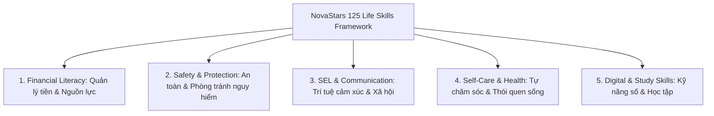
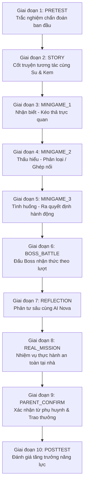

# 02. SƯ PHẠM, THIẾT KẾ GAME & MÔ HÌNH NỘI DUNG (Pedagogy, Game Design & Content Model)

> **Mã Tài Liệu Hợp Nhất**: `NS-CANONICAL-PRD-02`  
> **Phiên Bản**: `v2.1.0` (Cập nhật đồng bộ chuẩn NLAS 10 Giai đoạn & Schema LessonZeroPackage)  
> **Nguồn Tri Thức**: `wiki/00_CORE/`, `wiki/01_DOMAINS/`, `client/src/components/lesson/TenStageLessonRunner.tsx`, `extracted_skills.json`.  
> **Trạng Thái**: CANONICAL LIVING SPECIFICATION

---

## 1. KHUNG 125 KỸ NĂNG CỐT LÕI (5 Domains & 125 Skills for Grades 1 - 5)

Toàn bộ chương trình giáo dục tiểu học được phân bổ thành **5 Miền Năng Lực** bao phủ **125 Kỹ Năng Cụ Thể** từ Lớp 1 đến Lớp 5:



### 1.1. Miền 1: Giáo Dục Tài Chính & Quản Lý Nguồn Lực (`DOM-FIN`)
- **Lớp 1 (6-7t)**: Nhận biết mệnh giá tiền Việt Nam, phân biệt Cần (Need) vs. Muốn (Want), thói quen nuôi heo đất.
- **Lớp 2 (7-8t)**: Nguồn gốc của tiền từ lao động, kỹ năng mua hàng nhận tiền thối, bảo quản đồ dùng học tập.
- **Lớp 3 (8-9t)**: Lập kế hoạch chi tiêu tuần, so sánh giá khi đi siêu thị cùng mẹ, giá trị của tiết kiệm dài hạn.
- **Lớp 4 (9-10t)**: Khái niệm ngân sách cá nhân 3 hũ (Tiêu dùng - Tiết kiệm - Chia sẻ), nhận biết quảng cáo bán hàng.
- **Lớp 5 (10-11t)**: Tư duy kinh doanh nhỏ (bán đồ thủ công), nguyên lý tiết kiệm sinh lời, đạo đức sử dụng tiền.

### 1.2. Miền 2: An Toàn Bản Thân & Phòng Tránh Nguy Hiểm (`DOM-SAF`)
- **Lớp 1 (6-7t)**: Quy tắc 5 ngón tay (Vùng riêng tư - Safe Touch), ghi nhớ số điện thoại khẩn cấp (113, 114, 115), xử lý khi bị lạc.
- **Lớp 2 (7-8t)**: An toàn điện gia dụng (không chạm tay ướt), an toàn giao thông đi bộ sang đường, kỹ năng từ chối người lạ.
- **Lớp 3 (8-9t)**: Kỹ năng thoát hiểm hỏa hoạn (bò sát sàn, khăn ẩm), sơ cứu vết trầy xước và bỏng nhẹ, an toàn sông nước.
- **Lớp 4 (9-10t)**: Phòng chống xâm hại và bạo lực học đường, an toàn khi ở nhà một mình, nhận biết nguy cơ thời tiết xấu (sấm sét).
- **Lớp 5 (10-11t)**: Kỹ năng sơ cứu nâng cao (hóc dị vật Heimlich, băng bó), phòng tránh tệ nạn xã hội, tự bảo vệ bản thân khi đi dã ngoại.

### 1.3. Miền 3: Trí Tuệ Cảm Xúc & Kỹ Năng Xã Hội SEL (`DOM-SEL`)
- **Lớp 1 (6-7t)**: Nhận diện 4 cảm xúc cơ bản (Vui, Buồn, Giận, Sợ), kỹ năng chào hỏi lễ phép, chia sẻ đồ chơi.
- **Lớp 2 (7-8t)**: Kỹ thuật hít thở hạ hỏa cơn giận, lắng nghe người khác nói, kỹ năng xin lỗi và cảm ơn chân thành.
- **Lớp 3 (8-9t)**: Thấu cảm (đặt mình vào vị trí bạn bè), làm việc nhóm hòa thuận, nhận diện và đối phó với lời trêu chọc.
- **Lớp 4 (9-10t)**: Giải quyết mâu thuẫn bằng đàm phán ôn hòa, kỹ năng thuyết trình tự tin trước đám đông, tôn trọng sự khác biệt.
- **Lớp 5 (10-11t)**: Lãnh đạo bản thân và đội nhóm, đối diện với áp lực bạn bè (Peer Pressure), nuôi dưỡng lòng trắc ẩn và giúp đỡ cộng đồng.

### 1.4. Miền 4: Tự Chăm Sóc Bản Thân & Thói Quen Sống Khỏe (`DOM-CARE`)
- **Lớp 1 (6-7t)**: Rửa tay 6 bước chuẩn y tế, tự đánh răng sáng/tối, tự mặc quần áo và mang giày dép.
- **Lớp 2 (7-8t)**: Tự dọn dẹp góc học tập, phân loại rác thải tại nguồn, thói quen uống đủ nước và ăn rau xanh.
- **Lớp 3 (8-9t)**: Tự chuẩn bị cặp sách theo thời khóa biểu, gấp chăn màn và dọn giường ngủ, bảo vệ mắt và cột sống khi ngồi học.
- **Lớp 4 (9-10t)**: Tự chuẩn bị bữa phụ dinh dưỡng đơn giản, sơ cứu cảm nắng và côn trùng cắn, vệ sinh cá nhân tuổi tiền dậy thì.
- **Lớp 5 (10-11t)**: Quản lý thời gian biểu cá nhân (Pomodoro trẻ em), rèn luyện thể thao hàng ngày, tự lập chăm sóc bản thân khi bố mẹ vắng nhà.

### 1.5. Miền 5: Kỹ Năng Số & Phương Pháp Học Tập Thế Kỷ 21 (`DOM-DIG`)
- **Lớp 1 (6-7t)**: Tư thế ngồi máy tính đúng, quy tắc thời gian màn hình 20-20-20, không tự ý bấm link lạ.
- **Lớp 2 (7-8t)**: Bảo mật mật khẩu gia đình, tìm kiếm thông tin học tập có sự giám sát, vẽ sơ đồ tư duy cơ bản.
- **Lớp 3 (8-9t)**: Nhận diện tin giả và lừa đảo trực tuyến cơ bản, kỹ năng ghi chép bài học hiệu quả (Note-taking), ứng xử lịch sự trên mạng.
- **Lớp 4 (9-10t)**: Phòng chống bắt nạt mạng (Cyberbullying), sử dụng AI hỗ trợ học tập đúng cách (không gian lận), kỹ năng lập kế hoạch ôn thi.
- **Lớp 5 (10-11t)**: Xây dựng dấu chân số tích cực (Digital Footprint), tư duy phản biện khi đọc tin tức mạng, phương pháp tự học và nghiên cứu đề tài nhỏ.

---

## 2. QUY CHUẨN KIẾN TRÚC BÀI HỌC 10 GIAI ĐOẠN (NLAS 10-Stage Architecture)

Trình chạy bài học [`TenStageLessonRunner.tsx`](file:///c:/Users/Nova/.gemini/antigravity/scratch/apptieuhoc/client/src/components/lesson/TenStageLessonRunner.tsx) vận hành chu trình 10 giai đoạn sư phạm tuần tự:



### Bảng Đặc Tả 10 Giai Đoạn
| STT | Giai Đoạn | Thời Lượng | Bản Chất Sư Phạm & Gameplay |
| :--- | :--- | :---: | :--- |
| **1** | `PRETEST` | 1.0 phút | 2-3 câu hỏi ngắn khảo sát mức độ nhận biết ban đầu của trẻ trước khi học. |
| **2** | `STORY` | 1.5 phút | Truyện tranh tương tác; Su & Kem gặp tình huống khó khăn cần bé hỗ trợ ($\le 25$ từ/thoại). |
| **3** | `MINIGAME_1` | 1.0 phút | Mini-game nhận diện trực quan: Kéo thả vật phẩm, tìm điểm bất thường. |
| **4** | `MINIGAME_2` | 1.0 phút | Mini-game phân loại: Thả vào 2 thùng (Đúng vs Sai, Cần vs Muốn, An toàn vs Nguy hiểm). |
| **5** | `MINIGAME_3` | 1.0 phút | Thử thách tình huống mô phỏng: Chọn hành động tối ưu để vượt qua chướng ngại vật. |
| **6** | `BOSS_BATTLE`| 1.5 phút | Đấu Boss theo lượt (3-5 HP); Avatar tung đòn Năng lực khi bé chỉ ra lỗi sai của Boss. |
| **7** | `REFLECTION` | 1.0 phút | Hội thoại 1-1 với AI Nova (chữ hoặc giọng nói) để gọi tên cảm xúc và rút ra bài học. |
| **8** | `REAL_MISSION`| Ngoài app | Nhận 1 nhiệm vụ thực tế nhỏ tại nhà (kiểm tra ổ cắm, dọn bàn, tự pha nước ấm...). |
| **9** | `PARENT_CONFIRM`| 1-Click | Phụ huynh kiểm tra việc làm của con, bấm xác nhận trên app để mở khóa Huy hiệu Vàng. |
| **10**| `POSTTEST` | 1.0 phút | 2-3 câu hỏi tổng kết đo lường mức độ tiến bộ so với Pretest ban đầu. |

---

## 3. MASTER JSON SCHEMA: `LessonZeroPackage` (Content Model Schema)

Tất cả các bài học sinh ra hoặc nạp vào Client đều phải tuân thủ nghiêm ngặt TypeScript Interface & JSON Schema dưới đây:

```typescript
export interface LessonZeroPackage {
  lesson_id: string;        // e.g. "NS-LES-00101" (Regex: ^NS-LES-[0-9]{5}$)
  competency_id: string;    // e.g. "COMP-SAF-FIRE-001" (Regex: ^COMP-[A-Z]{3}-[A-Z]{3}-[0-9]{3}$)
  title: string;            // Tiêu đề ngắn gọn <= 80 ký tự
  domain: 'financial' | 'safety' | 'sel' | 'self_care' | 'digital';
  grade_level: 1 | 2 | 3 | 4 | 5;
  estimated_duration_minutes: number; // 6.0 - 10.0 phút
  stages: [
    PretestStage,
    StoryStage,
    Minigame1Stage,
    Minigame2Stage,
    Minigame3Stage,
    BossBattleStage,
    ReflectionStage,
    RealMissionStage,
    ParentConfirmStage,
    PosttestStage
  ];
}
```

### Các Hằng Số Giới Hạn Sư Phạm Cốt Lõi:
- `MAX_WORDS_PER_SPEECH = 25`: Tuyệt đối không viết câu dài gây mỏi mắt cho trẻ.
- `MAX_CHOICES_PER_QUESTION = 3`: Tối đa 3 lựa chọn để trẻ không bị quá tải nhận thức.
- `ZERO_HP_PENALTY = true`: Trả lời sai không bị trừ mạng hay điểm số.
- `PASS_MASTERY_ACCURACY = 0.80`: Đạt $\ge 80\%$ để đạt chuẩn năng lực.
