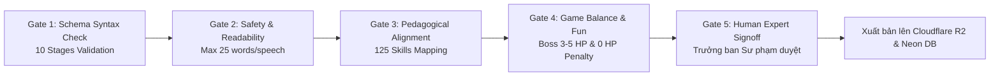

# 03. HỆ THỐNG SẢN XUẤT AI, VẬN HÀNH & TỪ ĐIỂN THUẬT NGỮ (AI Systems, Operations & Master Glossary)

> **Mã Tài Liệu Hợp Nhất**: `NS-CANONICAL-PRD-03`  
> **Phiên Bản**: `v2.1.0` (Cập nhật đồng bộ Pipeline nạp tri thức Modular Wiki 3-File Rule)  
> **Nguồn Tri Thức**: `wiki/INDEX.md`, `wiki/00_CORE/`, `wiki/01_DOMAINS/`, `wiki/02_TEMPLATES/`, `content-pipeline/`.  
> **Trạng Thái**: CANONICAL LIVING SPECIFICATION

---

## 1. QUY TẮC NẠP TRI THỨC MODULAR WIKI CHO AI (The 3-File Context Loading Protocol)

Để đảm bảo AI sinh bài học đạt độ chính xác $100\%$ về sư phạm và cấu trúc mà không gây tràn cửa sổ ngữ cảnh (Context Window Overflow), quy trình bắt buộc AI Agent chỉ nạp **đúng 3 file tri thức**:

```mermaid
graph TD
    subgraph Core Tri Thức Bắt Buộc [3 Files Nạp Cho AI]
        F1[1. wiki/00_CORE/nlas_10_stages.md<br/>Đặc tả chuẩn 10 giai đoạn bài học]
        F2[2. wiki/01_DOMAINS/{domain}.md<br/>Tri thức chuyên sâu kỹ năng lớp 1-5]
        F3[3. wiki/02_TEMPLATES/prompt_generate_lesson.md<br/>System Prompt & JSON Schema Template]
    end
    
    Core Tri Thức Bắt Buộc --> AI_GEN[Gemini / AI Generator Model]
    AI_GEN --> OUT[10-Stage Lesson JSON Package]
```

### Lợi Ích Của Quy Tắc 3-File:
- **Tiết kiệm $85\%$ chi phí Token**: Giữ ngữ cảnh tập trung, không nạp tài liệu thừa.
- **Tránh ảo giác (Zero Hallucination)**: AI bám sát chính xác các mục tiêu kỹ năng theo từng khối lớp từ `wiki/01_DOMAINS/`.
- **Đầu ra chuẩn xác 100%**: JSON sinh ra khớp hoàn toàn với `LessonZeroPackage` interface.

---

## 2. PIPELINE SẢN XUẤT & 5 CỔNG DUYỆT CHẤT LƯỢNG (AIPS & 5 Review Gates)

Mỗi gói bài học 10 giai đoạn sau khi sinh ra phải đi qua **5 Cổng Kiểm Duyệt Tuần Tự**:



### Chi Tiết Tiêu Chí 5 Cổng Duyệt:
1. **Gate 1: Kiểm Tra Cú Pháp Schema (Tự Động)**:
   - Đủ đúng 10 giai đoạn (`PRETEST` $\rightarrow$ `POSTTEST`).
   - `lesson_id` khớp regex `^NS-LES-[0-9]{5}$`.
   - `competency_id` khớp regex `^COMP-[A-Z]{3}-[A-Z]{3}-[0-9]{3}$`.
2. **Gate 2: An Toàn & Độ Đọc (Tự Động)**:
   - 100% lời thoại $\le 25$ từ/câu.
   - Quét từ khóa độc hại, phân biệt đối xử, bạo lực hoặc không an toàn cho trẻ nhỏ.
3. **Gate 3: Khớp Nối Sư Phạm (Tự Động)**:
   - Nội dung câu hỏi khớp chính xác với chuẩn kỹ năng của lớp (Grade 1 đến 5) được quy định trong `wiki/01_DOMAINS/`.
   - Tối đa 3 lựa chọn cho mỗi câu hỏi.
4. **Gate 4: Cân Bằng Gameplay & Độ Thân Thiện (Tự Động)**:
   - Thử sai an toàn: Không trừ điểm số sinh mệnh khi trẻ chọn sai.
   - Boss Battle có từ 3 đến 5 lượt đánh rõ ràng; lời giải thích mang tính xây dựng.
5. **Gate 5: Chuyên Gia Giáo Dục Ký Duyệt (Human-in-the-Loop)**:
   - Chuyên gia xem trước trực quan trên dashboard `project_knowledge_wiki_review.html` và bấm duyệt xuất bản.

---

## 3. TỪ ĐIỂN THUẬT NGỮ CHUẨN TOÀN HỆ THỐNG (Master Glossary)

| Mã Thuật Ngữ | Thuật Ngữ | Định Nghĩa Chuẩn |
| :--- | :--- | :--- |
| `TERM-NLAS-001` | **NLAS 10-Stage** | Kiến trúc bài học chuẩn hóa 10 giai đoạn từ Chẩn đoán $\rightarrow$ Cốt truyện $\rightarrow$ 3 Minigames $\rightarrow$ Boss $\rightarrow$ Phản tư $\rightarrow$ Nhiệm vụ thực tế $\rightarrow$ Phụ huynh $\rightarrow$ Posttest. |
| `TERM-AI-001` | **AIPS** | AI Production System - Nhà máy tự động hóa sản xuất nội dung bài học đa tác nhân. |
| `TERM-CORE-001` | **LessonZeroPackage** | Định dạng gói dữ liệu JSON hoàn chỉnh của 1 bài học 10 giai đoạn tuân thủ schema hệ thống. |
| `TERM-GAM-001` | **Star Shards (Mảnh Sao)** | Đơn vị tiền tệ ảo đạt được qua nỗ lực học tập và duy trì chuỗi học, dùng mở khóa trang phục và phụ kiện cho thú cưng. |
| `TERM-EDU-001` | **PVCMR** | Parent-Verified Competency Mastery Rate - Chỉ số Sao Bắc Đẩu đo lường tỷ lệ nhiệm vụ đời thực được phụ huynh xác thực trên mỗi MAU. |
| `TERM-SEL-001` | **SEL** | Social Emotional Learning - Giáo dục trí tuệ cảm xúc và kỹ năng xã hội theo chuẩn CASEL. |
| `TERM-SAF-001` | **Safe Failure** | Nguyên tắc thiết kế trò chơi không trừng phạt trẻ khi làm sai, chỉ cung cấp giàn giáo hỗ trợ từng bước. |
