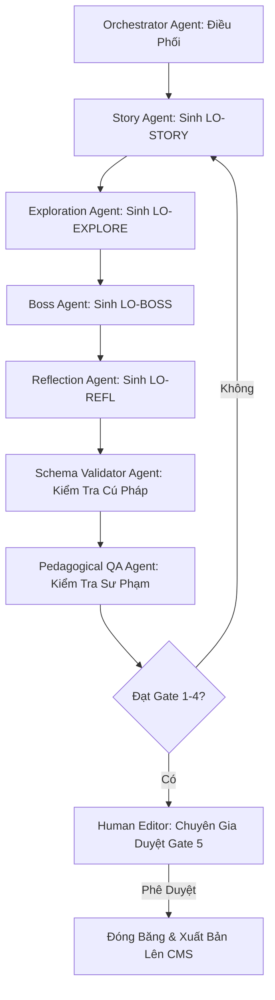
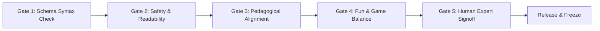

# 03. HỆ THỐNG SẢN XUẤT AI, VẬN HÀNH & TỪ ĐIỂN THUẬT NGỮ (AI Systems, Operations & Master Glossary)

> **Mã Tài Liệu Hợp Nhất**: `NS-CANONICAL-PRD-03`  
> **Nguồn Hợp Nhất Từ V2**: `06_AI/` (`aips_framework.md`, `acs_standard.md`, `aiob_blueprint.md`, `agent_registry/`), `08_OPERATIONS/` (`content_factory_sop.md`, `qa_framework.md`, `deployment_protocols.md`), `09_LIBRARY/`, `10_GLOSSARY/` (`master_glossary.md`).  
> **Trạng Thái**: CANONICAL FROZEN (Bản Chuẩn Hóa V2.0.0)

---

## 1. HỆ THỐNG SẢN XUẤT NỘI DUNG TỰ ĐỘNG (AIPS - AI Production System)

AIPS là nhà máy sản xuất nội dung quy mô lớn, kết hợp giữa mạng lưới đa tác nhân AI chuyên biệt (Multi-Agent System) và các chuyên gia giáo dục con người (Human-in-the-Loop) để tạo ra $10,000+$ bài học chuẩn sư phạm.

### Pipeline Sản Xuất Đa Tác Nhân (AIPS Pipeline)


### 3 Trụ Cột Cốt Lõi Của AIPS
1. **Chuyên Môn Hóa Tác Nhân (Multi-Agent Specialization)**: Mỗi tác nhân chỉ chịu trách nhiệm đúng 1 phần việc (Story, Puzzle, Boss, QA) thay vì dùng 1 prompt đơn lẻ khổng lồ.
2. **Ép Buộc Ràng Buộc Schema (Schema-Enforced Generation)**: Mọi đầu ra bắt buộc phải validate thành công qua Zod / JSON Schema.
3. **Cổng Kiểm Duyệt Quyết Định Luận (Deterministic Review Gates)**: 4 cổng tự động bằng AI + 1 cổng duyệt cuối cùng của chuyên gia giáo dục.

---

## 2. CHUẨN HỢP ĐỒNG TÁC NHÂN AI (ACS - Agent Contract Standard)

Mọi tác nhân AI trong hệ thống đều phải tuân thủ bản đặc tả hợp đồng chuẩn (ACS Spec):

```yaml
agent_contract:
  id: "NS-AI-AGNT-XXX"
  name: "Tên Tác Nhân"
  role: "Mô tả vai trò hệ thống của tác nhân"
  version: "1.0.0"
  model_tier: "PRO" # Tùy chọn: FLASH_LITE, FLASH, PRO
  
context_loading:
  required_pages:
    - "NS-XXX-001"
  optional_pages:
    - "NS-YYY-001"
  forbidden_pages:
    - "NS-ZZZ-001"

inputs:
  schema: "JSON / Zod Schema cho dữ liệu đầu vào"

outputs:
  schema: "JSON / Zod Schema cho dữ liệu đầu ra"

quality_rubric:
  metrics:
    - name: "Schema Validity"
      weight: 0.4
    - name: "Grade Readability"
      weight: 0.3
    - name: "Pedagogical Alignment"
      weight: 0.3
```

### Danh Mục Các Tác Nhân Cốt Lõi (Agent Registry)
1. **Story Agent (`NS-AI-AGNT-001`)**: Chuyên gia sáng tác kịch bản, lời thoại nhân vật $\le 25$ từ, tạo tình huống nan giải (Dilemma).
2. **Boss Agent (`NS-AI-AGNT-002`)**: Thiết kế trận đấu trùm tổng hợp, cơ chế tính sát thương HP động và lựa chọn chiến thuật.
3. **Assessment Agent (`NS-AI-AGNT-003`)**: Thiết kế câu hỏi chẩn đoán Pre-test, Post-test và phân tích năng lực theo thang đo Bloom.

---

## 3. QUY TRÌNH VẬN HÀNH NHÀ MÁY & 5 CỔNG DUYỆT CHẤT LƯỢNG (Content Factory SOP & Review Gates)

Mỗi gói bài học bắt buộc phải vượt qua **5 Cổng Duyệt Chất Lượng** tuần tự trước khi được gắn nhãn `FROZEN` và phát hành:



- **Gate 1: Kiểm Tra Cú Pháp Schema (AI Tự Động)**: Kiểm tra cấu trúc JSON khớp $100\%$ với Content Model; từ chối nếu thiếu trường hoặc sai định dạng.
- **Gate 2: Đánh Giá An Toàn & Độ Đọc (AI Tự Động)**: Đo chỉ số độ đọc Flesch-Kincaid theo đúng lứa tuổi Lớp 1-5; quét từ ngữ cấm, định kiến giới tính hay bạo lực.
- **Gate 3: Khớp Nối Mục Tiêu Sư Phạm (AI Tự Động)**: Xác minh câu hỏi đo lường chính xác mã năng lực mục tiêu (`COMP-XXX`); giàn giáo hỗ trợ đúng quy chuẩn.
- **Gate 4: Cân Bằng Trò Chơi & Độ Vui (AI Tự Động)**: Đánh giá độ khó trận đấu Boss, tính đa dạng của lựa chọn và thời lượng hoàn thành chuẩn 6–10 phút.
- **Gate 5: Chuyên Gia Sư Phạm Phê Duyệt (Human-in-the-Loop)**: Ký duyệt cuối cùng bởi Trưởng ban Nội dung/Sư phạm trước khi bấm nút deploy tự động lên hệ thống.

---

## 4. QUY TRÌNH PHÁT HÀNH & KIỂM THỬ TRIỂN KHAI (Deployment Protocols)

- **Kiểm Thử Môi Trường Staging**: Tự động chạy bộ kiểm thử giao diện Playwright E2E trên 4 giả lập thiết bị (iPhone, Pixel, iPad).
- **Phát Hành Cắt Lớp (Canary Rollout)**: Mở bài học mới cho $10\%$ người dùng thử nghiệm trước khi mở toàn diện $100\%$.
- **Cơ Chế Khôi Phục Tức Thì (Instant Rollback)**: Tự động hoàn tác về phiên bản trước nếu tỷ lệ hoàn thành bài học giảm đột ngột dưới $70\%$.

---

## 5. TỪ ĐIỂN THUẬT NGỮ TOÀN HỆ THỐNG (Master Central Glossary)

Bảng thuật ngữ chuẩn hóa áp dụng thống nhất trên toàn bộ hệ thống NovaStars:

| Mã Thuật Ngữ | Thuật Ngữ | Định Nghĩa Chuẩn | Miền Áp Dụng |
| :--- | :--- | :--- | :--- |
| `TERM-AI-001` | **ACS (Agent Contract Standard)** | Tiêu chuẩn đặc tả vai trò, mô hình, giới hạn ngữ cảnh, JSON schema đầu vào/đầu ra và rubric chất lượng cho 1 Agent. | AI Systems |
| `TERM-AI-002` | **AIPS (AI Production System)** | Nhà máy sản xuất nội dung đa tác nhân điều phối tự động hóa giữa AI và con người. | AI Systems |
| `TERM-GAM-001` | **Boss Challenge** | Thử thách tổng hợp ở Stage 3/6 của bài học, đánh giá năng lực tích hợp qua cơ chế mini-game chiến đấu với Boss ảo. | Game / Pedagogy |
| `TERM-EDU-001` | **Competency Package** | Gói học phần hoàn chỉnh gồm 5-8 năng lực nguyên tử tạo thành 1 cột mốc kỹ năng. | Education |
| `TERM-EDU-002` | **Experience OS** | Khung tâm lý học giáo dục mô hình hóa đường cong cảm xúc và chu trình 4 pha chuyển đổi trạng thái của trẻ. | Education |
| `TERM-OPS-001` | **Freeze Gate** | Trạng thái phê duyệt chính thức (Gate 1 đến Gate 5) khóa bài học không cho chỉnh sửa thêm trước khi phát hành. | Operations |
| `TERM-EDU-003` | **NLAS (Lesson Architecture System)** | Hệ điều hành sư phạm hiến định cấu trúc bài học 4-10 giai đoạn (Hook, Exploration, Boss, Reflection). | Education |
| `TERM-GAM-002` | **Star Shards (Mảnh Sao)** | Đơn vị tiền tệ ảo đạt được qua nỗ lực học tập và duy trì chuỗi học, dùng mở khóa trang phục cho thú cưng. | Game Economy |
| `TERM-SEL-001` | **SEL (Social Emotional Learning)** | Giáo dục trí tuệ cảm xúc và kỹ năng xã hội theo chuẩn quốc tế CASEL. | Curriculum |
