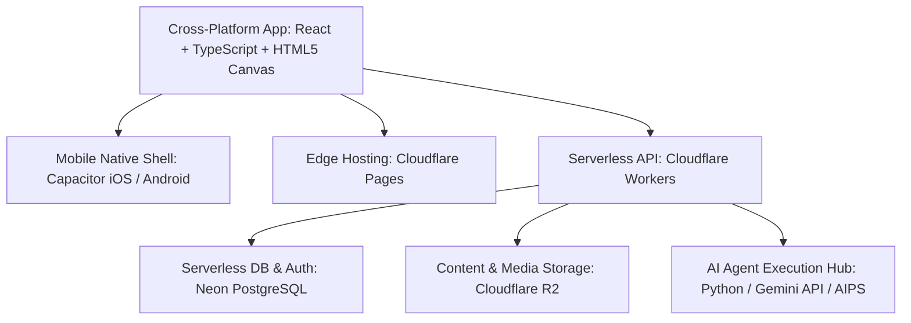
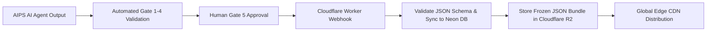

# 04. KIẾN TRÚC KỸ THUẬT & NHẬT KÝ QUYẾT ĐỊNH ADR (Technical Architecture & Decision Records)

> **Mã Tài Liệu Hợp Nhất**: `NS-CANONICAL-PRD-04`  
> **Nguồn Hợp Nhất Từ V2**: `07_ENGINEERING/` (`technical_architecture.md`, `cms_specifications.md`), `11_ADR/` (`adr_index.md`, `records/ADR-0001` đến `ADR-0005`).  
> **Trạng Thái**: CANONICAL FROZEN (Bản Chuẩn Hóa V2.0.0)

---

## 1. KIẾN TRÚC NỀN TẢNG KỸ THUẬT (Technical Platform Architecture v2.0.0)

NovaStars vận hành trên mô hình kiến trúc **Web-First Cross-Platform SPA**, đóng gói ứng dụng di động qua **Capacitor v6**, lưu trữ cơ sở dữ liệu trên **Neon Serverless PostgreSQL** và phân phối toàn cầu qua hệ sinh thái **Cloudflare Edge**.

### Sơ Đồ Kiến Trúc Hệ Thống (System Infrastructure Map)

### Các Thành Phần Nền Tảng Cốt Lõi
1. **Client App**: Ứng dụng Single Page Application (SPA) xây dựng trên **React 18 + TypeScript + Vite + Tailwind CSS**, tích hợp engine **HTML5 Canvas 2D + Web Audio Synthesizer** chạy mượt mà 60 FPS. Quản lý trạng thái bằng **Zustand** (XP, Stars, Cài đặt âm thanh, Tiến độ bài học).
2. **Mobile Native Shell (Capacitor)**: Bộ đóng gói **Capacitor v6** xuất bản file cài đặt cho iOS và Android, hỗ trợ truy cập phần cứng native: Rung xúc giác (`@capacitor/haptics`), Khóa hướng màn hình dọc (`@capacitor/screen-orientation`), Lưu trữ cục bộ (`@capacitor/preferences`).
3. **Edge Hosting & API Gateway**: **Cloudflare Pages** phân phối tĩnh siêu tốc toàn cầu, kết hợp **Cloudflare Workers** xử lý API serverless không độ trễ (Zero Cold Start).
4. **Cơ Sở Dữ Liệu & Xác Thực**: **Neon Serverless PostgreSQL** truy xuất qua `@neondatabase/serverless` trên giao thức WebSockets/HTTP, hỗ trợ branch cơ sở dữ liệu cho môi trường Staging/Production và cơ chế Auth cho học sinh/phụ huynh.
5. **Lưu Trữ & Phân Phối Đối Tượng (Object Storage)**: **Cloudflare R2** lưu trữ các gói bài học đóng băng (Frozen JSON bundles), âm thanh và hình ảnh với chi phí băng thông tải về $0 (Zero Egress Fees).
6. **Nhà Máy Sản Xuất Nội Dung AI (AIPS)**: Điều phối sinh, kiểm thử và đẩy các gói bài học đã duyệt thẳng lên Cloudflare R2 và Neon DB.

---

## 2. ĐẶC TẢ HEADLESS CMS & CLOUDFLARE R2 PIPELINE (CMS Specifications)

### Luồng Đóng Băng & Xuất Bản Bài Học

### Hợp Đồng API Nội Dung (Cloudflare Workers Endpoints)
- `GET /api/v1/lessons/{lesson_id}`: Trả về gói bài học JSON từ bộ nhớ đệm Cloudflare R2 Cache.
- `GET /api/v1/competencies`: Trả về cây danh mục 125 năng lực trực tiếp từ Neon DB.
- `POST /api/v1/content/webhook/freeze`: Tiếp nhận gói bài học đã qua Gate 5, lưu bản ghi vào Neon DB và tải bundle JSON lên Cloudflare R2.

---

## 3. NHẬT KÝ QUYẾT ĐỊNH KIẾN TRÚC (Architecture Decision Records - ADR)

### Bảng Chỉ Mục Các Quyết Định Đã Phê Duyệt (ADR Registry)

| Mã ADR | Tiêu Đề Quyết Định | Trạng Thái | Người Phê Duyệt | Ngày Ban Hành |
| :--- | :--- | :--- | :--- | :--- |
| **ADR-0001** | Tiêu chuẩn bắt buộc YAML Front Matter Metadata | `APPROVED` | Chief Knowledge Architect | 2026-08-04 |
| **ADR-0002** | Chính sách tri thức nguyên tử & Không trùng lặp | `APPROVED` | Chief Knowledge Architect | 2026-08-04 |
| **ADR-0003** | Tối ưu hóa cửa sổ ngữ cảnh & Bản đồ nạp tài liệu | `APPROVED` | Chief Knowledge Architect | 2026-08-04 |
| **ADR-0004** | Chiến lược quản trị phiên bản SemVer cho tài liệu | `APPROVED` | Chief Knowledge Architect | 2026-08-04 |
| **ADR-0005** | Chuyển đổi Tech Stack sang React + TS, Capacitor, Neon DB & Cloudflare | `ACCEPTED` | Chief Technology Officer | 2026-08-20 |

---

### Chi Tiết Từng Quyết Định Kiến Trúc

#### 📌 ADR-0001: Tiêu Chuẩn Metadata YAML Front Matter Bắt Buộc
- **Bối cảnh**: Hệ thống tài liệu phân tán cần được máy học và AI Agent phân tích có cấu trúc.
- **Quyết định**: Mọi file Markdown trong hệ thống phải có phần đầu chứa YAML metadata: `id`, `title`, `domain`, `status`, `version`, `authority: CANONICAL`, `depends_on`, `used_by`.

#### 📌 ADR-0002: Chính Sách Tri Thức Nguyên Tử (Atomic Knowledge & Zero Duplication)
- **Bối cảnh**: Tránh tình trạng một định nghĩa bị diễn giải khác nhau ở nhiều file.
- **Quyết định**: Mỗi khái niệm chỉ được định nghĩa tại một file duy nhất (Single Source of Truth); các tài liệu khác chỉ được dẫn link tham chiếu (`depends_on`).

#### 📌 ADR-0003: Bản Đồ Nạp Ngữ Cảnh Tối Ưu Cho AI (Context Window Loading Maps)
- **Bối cảnh**: Nạp toàn bộ tài liệu dự án vượt quá giới hạn token của LLM và gây loãng context.
- **Quyết định**: Thiết lập đồ thị phụ thuộc (`depends_on`) để AI Agent chỉ cần nạp đúng các node liên quan trực tiếp đến tác vụ hiện tại.

#### 📌 ADR-0004: Chiến Lược Quản Trị Phiên Bản SemVer
- **Bối cảnh**: Đảm bảo tính tương thích ngược khi nâng cấp tài liệu và schemas.
- **Quyết định**: Áp dụng chuẩn `MAJOR.MINOR.PATCH` cho toàn bộ tài liệu kiến trúc và JSON Schemas. Thay đổi breaking bắt buộc tăng Major version (`X.0.0`).

#### 📌 ADR-0005: Chuyển Đổi Tech Stack Sang React + Capacitor + Neon DB + Cloudflare
- **Bối cảnh**: Đề xuất ban đầu dùng Flutter/Unity kết hợp Go Backend cồng kềnh, kích thước file cài đặt lớn ($>80\text{MB}$), khó bảo trì trên web và tốn chi phí server.
- **Quyết định**: 
  1. Frontend chuyển sang **React 18 + TypeScript + Vite + Tailwind CSS + HTML5 Canvas 2D**.
  2. Mobile đóng gói qua **Capacitor v6** (kích thước app $<15\text{MB}$, hỗ trợ đầy đủ Haptics).
  3. Cơ sở dữ liệu chuyển sang **Neon Serverless PostgreSQL** (hỗ trợ branch dữ liệu tức thì).
  4. Lưu trữ & CDN chuyển sang **Cloudflare Pages + Workers + Cloudflare R2** ($0 chi phí egress).
- **Hệ quả tích cực**: Giảm $80\%$ dung lượng app, đạt tốc độ khung hình 60 FPS, dùng chung 1 ngôn ngữ TypeScript/SQL từ client tới server.
