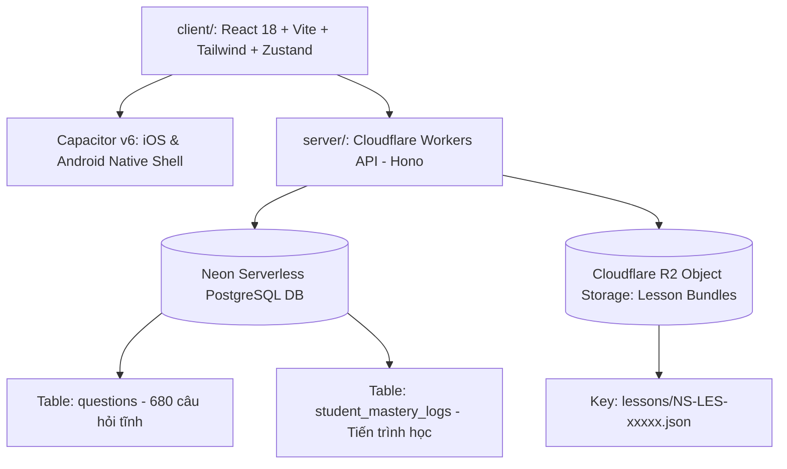

# 04. KIẾN TRÚC KỸ THUẬT & NHẬT KÝ QUYẾT ĐỊNH ADR (Technical Architecture & Decision Records)

> **Mã Tài Liệu Hợp Nhất**: `NS-CANONICAL-PRD-04`  
> **Phiên Bản**: `v2.1.0` (Cập nhật đồng bộ kiến trúc React 18 + Capacitor + Cloudflare Workers Hono + Neon DB)  
> **Nguồn Tri Thức**: `client/src/`, `server/src/`, `11_ADR/records/`.  
> **Trạng Thái**: CANONICAL LIVING SPECIFICATION

---

## 1. KIẾN TRÚC NỀN TẢNG KỸ THUẬT THỰC TẾ (Technical Architecture Map)

Hệ thống NovaStars vận hành trên mô hình kiến trúc **Full-Stack TypeScript & Serverless Edge**:

---

## 2. CHI TIẾT CÁC THÀNH PHẦN HỆ THỐNG (Component Specifications)

### 2.1. Frontend Client App (`client/`)
- **Công nghệ**: **React 18 + TypeScript + Vite + Tailwind CSS + Lucide Icons**.
- **Quản lý trạng thái**: **Zustand** ([`useGameStore.ts`](file:///c:/Users/Nova/.gemini/antigravity/scratch/apptieuhoc/client/src/stores/useGameStore.ts)) lưu trữ:
  - `coins`, `starShards`, `currentStreak`, `userAge`, `userGrade`.
  - `activeLesson`: Trạng thái và dữ liệu bài học đang chạy.
- **Trình Chạy Bài Học**: [`TenStageLessonRunner.tsx`](file:///c:/Users/Nova/.gemini/antigravity/scratch/apptieuhoc/client/src/components/lesson/TenStageLessonRunner.tsx) điều phối mượt mà 10 giai đoạn từ Pretest đến Posttest.
- **Game Engine**: HTML5 Canvas 2D tương tác vật lý trong [`CanvasMiniGame.tsx`](file:///c:/Users/Nova/.gemini/antigravity/scratch/apptieuhoc/client/src/components/game/CanvasMiniGame.tsx).
- **Mobile Native Shell**: **Capacitor v6** hỗ trợ rung phản hồi Haptics, khóa màn hình dọc, và lưu trữ offline preferences. Dung lượng app cài đặt $<15\text{MB}$.

### 2.2. Backend Serverless API (`server/`)
- **Công nghệ**: **Hono Framework** trên **Cloudflare Workers**.
- **Cơ sở dữ liệu**: **Neon Serverless PostgreSQL** truy xuất qua `@neondatabase/serverless` với độ trễ $<50\text{ms}$.
- **Lưu trữ đối tượng**: **Cloudflare R2 Bucket** lưu trữ các gói bài học đóng băng (Frozen JSON) với chi phí băng thông tải về $0 (Zero Egress Fees).

### 2.3. Chi Tiết Các Endpoints REST API Hoạt Động
- `GET /health`: Kiểm tra trạng thái máy chủ và môi trường.
- `GET /api/v1/questions`: Truy vấn ngân hàng câu hỏi từ Neon DB (hỗ trợ lọc theo `domainId` và `grade`).
- `POST /api/v1/progress`: Ghi nhận kết quả làm bài của học sinh vào bảng `student_mastery_logs`.
- `GET /api/v1/content/:packageId`: Lấy gói bài học JSON từ bộ nhớ đệm Cloudflare R2 (`lessons/{packageId}.json`).
- `POST /api/v1/content/upload`: Đẩy gói bài học JSON mới đã qua duyệt lên Cloudflare R2.

---

## 3. NHẬT KÝ QUYẾT ĐỊNH KIẾN TRÚC (Architecture Decision Records - ADR)

| Mã ADR | Tiêu Đề Quyết Định | Trạng Thái | Người Phê Duyệt | Tác Động Hệ Thống |
| :--- | :--- | :--- | :--- | :--- |
| **ADR-0001** | Tiêu chuẩn bắt buộc YAML Front Matter Metadata | `APPROVED` | Knowledge Architect | Đảm bảo máy học và AI Agent đọc được metadata tài liệu. |
| **ADR-0002** | Chính sách tri thức nguyên tử (Single Source of Truth) | `APPROVED` | Knowledge Architect | Không trùng lặp định nghĩa, chỉ dẫn link tham chiếu. |
| **ADR-0003** | Tối ưu hóa cửa sổ ngữ cảnh (Context Window 3-File Rule) | `APPROVED` | AI Architect | AI Agent chỉ nạp 3 file tri thức từ `wiki/` khi sinh bài học. |
| **ADR-0004** | Chiến lược quản trị phiên bản SemVer (`v2.1.0`) | `APPROVED` | Tech Lead | Tương thích ngược toàn bộ API và JSON Schemas. |
| **ADR-0005** | Chuyển đổi Tech Stack sang React + Capacitor + Neon DB + Cloudflare | `ACCEPTED` | CTO | Giảm $80\%$ dung lượng app, đạt 60 FPS, dùng 1 ngôn ngữ TypeScript từ client tới server. |
