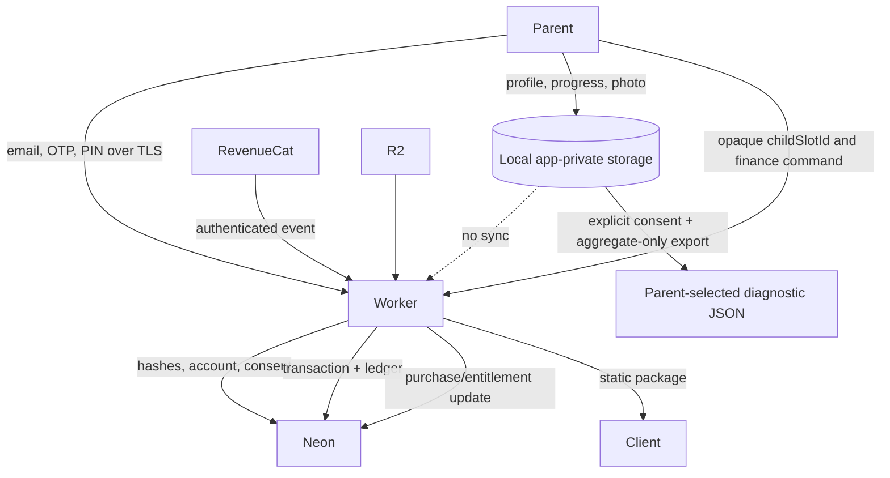

# Parent Zone data inventory and log-redaction policy

Version: 1.0 — 2026-08-22

## Data inventory

| Data class | Examples | Location | Sent over network | Retention/deletion |
|---|---|---|---|---|
| Local child profile | Local ID, display name, cosmetic grade, avatar | localStorage/app storage | No | Parent deletes profile or clears app data |
| Local learning state | Answers, mastery, location progress, missions, screen-time events | localStorage/app storage | No | Parent deletes locally; reinstall/clear removes it |
| Local child media | Photo, flag, decorative signature | App-private native files; IndexedDB preview | No | Parent deletes profile/media; explicit encrypted export may include it |
| Parent guide state | Search/filter, read/listen state, conversation suggestions | Bundled catalog/local UI state | No | App update or local clear |
| Local diagnostic export | Aggregate counts/totals for profile count, usage categories/extensions, activity types, mission states/rewards; consent timestamp and random per-export report ID | User-selected JSON file; native cache only while Share sheet is open | No automatic upload | Native cache copy deleted immediately; parent controls any saved/shared copy |
| Parent identity | Normalized email, account status | Neon `parent_accounts` | Yes, through Worker only | Account closure replaces email and revokes sessions |
| Authentication | PIN verifier/salt, OTP hash/status, session token hashes, rate-limit counters | Neon | Yes, TLS through Worker | OTP/session expiry; revoked on logout/delete; operational cleanup policy applies |
| Consent | Policy version, service/marketing scope, accepted flag/time | Neon `consent_receipts` | Yes | Retained as compliance evidence until account-policy deletion permits removal |
| Finance handle | Opaque `childSlotId`; no child identity | Neon | Yes | Slot closes when local profile is removed; financial records retained per accounting policy |
| Wallet/ledger | Parent vault, child balance, ledger reason/amount/reference | Neon | Yes | Append-only financial evidence; account closure does not rewrite history |
| Purchases/subscriptions | Provider event ID, product, transaction ID, entitlement/status/time | Neon | RevenueCat → Worker | Retained for reconciliation/accounting policy |
| Security audit | Action, result, request ID, allowlisted IDs/counts | Neon | Generated by Worker | Security retention policy; never stores request bodies/secrets |
| Lesson content | Static question/lesson packages | Neon/R2 | Read-only download | Content lifecycle policy; no child data |

`childSlotId` is deliberately an opaque financial mapping. The server schema must not add child name, grade, birthday, photo, school, answer, progress or usage columns.

## Data flows

## Log-redaction policy

### Never log

- PIN, OTP, demo password, access/refresh tokens, authorization headers or encryption passwords/keys.
- Neon URLs, Hyperdrive connection strings, webhook/admin secrets or raw environment values.
- Child names, grades, photos/media bytes, answers, progress, screen-time history or complete backups.
- Diagnostic exports with raw events, per-child rows, profile IDs, names, titles, scores, answers or media; only the documented aggregate schema is allowed.
- Full email addresses, IP addresses, raw request/response bodies or RevenueCat payloads.

### Allowed structured fields

- Server-generated `requestId`.
- Action name and result (`success`, `failure`, `denied`).
- Internal parent UUID when required for security investigation.
- Opaque child slot UUID, SKU, numeric amount, provider event type, duplicate flag and aggregate mismatch count.
- Stable machine error code; public error message must not reveal whether an account exists.

### Handling rules

1. Audit metadata is an explicit allowlist at each call site; never spread an input object into logs.
2. Unexpected errors use `asErrorMessage` only in server-controlled logs and return generic `INTERNAL_ERROR` externally.
3. Rate-limit responses omit email and IP. Validation errors expose field paths, not submitted values.
4. Request IDs from clients must match the restricted format and length or are replaced with a UUID.
5. Any temporary diagnostic logging requires a ticket, expiry date and privacy review; it must be disabled in release builds.

## Network-inspection release check

Create/edit/switch/delete a child profile, complete a lesson, trigger screen-time controls, add a photo and export/import a backup while capturing traffic. Fail the release if any request contains child profile fields, answers/progress/usage, media bytes or backup plaintext. Auth and finance requests may contain only the fields defined by the Parent Zone OpenAPI contract.
