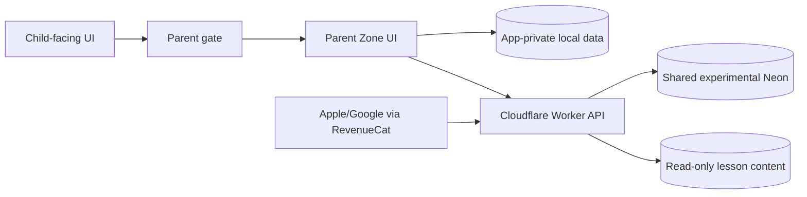

# Parent Zone threat model

Version: 1.0 — 2026-08-22

## Assets and trust boundaries

Protected assets are the parent account, PIN/session tokens, parent diamond vault, child wallet balances, purchases/subscriptions, local child profiles/media and encrypted backups.

Trust boundaries:

The client device is not trusted for finance. RevenueCat payloads are untrusted until authenticated and validated. Neon and Worker secrets never cross into the client bundle.

## Threat register

| ID | Threat | Control in MVP | Verification/evidence | Residual risk |
|---|---|---|---|---|
| T-01 | Child bypasses Parent Zone | Parent gate; re-auth for sensitive actions; lock on app background; profile switch only from parent context | Parent-gate unit tests and mobile E2E | Device owner can inspect a demo build; demo passwords are intentionally weak until Product removes them |
| T-02 | Local state tampering grants diamonds | Server-authoritative wallets; production bundle has no wallet setter/debug path; local diamond migration strips untrusted values | production-safety scan, wallet tests | Offline demo state is not a financial source of truth |
| T-03 | PIN brute force | Six-digit server PIN, salted/peppered verifier, progressive lockout, constant-time checks, fresh-PIN requirement | auth service tests | Demo review passwords remain intentionally guessable outside strict builds |
| T-04 | OTP abuse/account enumeration | Normalized email, hashed OTP, consume-once transaction, expiry/resend window, email and IP rate limits, redacted errors | auth/rate-limit tests | Email delivery reputation remains operational work |
| T-05 | Session theft/replay | Short-lived access token, rotated refresh token, revocation on logout/delete, native secure storage, browser session storage | refresh/session tests | Compromised rooted devices remain out of scope |
| T-06 | IDOR across parents/children | Every wallet/slot query is scoped by authenticated `parentId`; child slot IDs are validated UUIDs | wallet service tests | New endpoints must preserve ownership predicates |
| T-07 | Duplicate reward or purchase | Required idempotency keys, unique constraints and transactional row locks | wallet concurrency/idempotency tests | Client retry UX may show pending until refresh |
| T-08 | Webhook forgery/replay/out-of-order event | Constant-time bearer secret check, strict payload schema, unique event/transaction keys, event-time ordering, reversal guards | RevenueCat ordering/replay tests | Provider outage requires reconciliation |
| T-09 | Negative or inconsistent wallet balance | Database checks, locked transactions, double-entry-like transaction groups, reconciliation report | wallet and reconciliation tests | Manual reconciliation is privileged operational work |
| T-10 | Backup theft/offline guessing | AES-GCM authenticated encryption, PBKDF2-derived key, no password persistence, corrupt/wrong-password rejection | backup unit tests | Security depends on parent passphrase strength |
| T-11 | Malicious/corrupt backup overwrites data | Parse/decrypt/schema validation, preview, staging and rollback-on-failure | backup restore tests | Very large files need native-device stress testing |
| T-12 | Child photo leaks through network/logs | App-private/IndexedDB media only, explicit local export, data-boundary scan, log policy below | media tests and network inspection gate | OS-level compromise is out of scope |
| T-13 | Secret/PII leakage in logs | Structured allowlisted audit metadata; generic external errors; no request-body logging | app HTTP tests and redaction policy | Third-party platform logs require release review |
| T-14 | Unauthorized admin upload/reconciliation | Separate `/api/v1/admin/*`, constant-time admin secret, no public write route | app route tests | Shared admin secret rotation remains operational work |
| T-15 | Pilot diagnostic export leaks child data | Aggregate allowlist schema, explicit consent, fresh re-auth, no auto-upload, native temporary-file cleanup | secret-probe unit tests and downloaded-file E2E on five viewports | Parent-controlled saved/shared copy leaves the app sandbox by design |

## Abuse cases to re-test before enabling IAP

1. Replay the same store event with identical and conflicting payloads.
2. Deliver refund/reversal before purchase credit and after a newer subscription event.
3. Double-click reward, item and diamond purchases across concurrent requests.
4. Close a child slot while reward/item operations are in flight.
5. Use another parent's child slot ID with a valid session.
6. Restore a backup from another account/device and verify preview/binding behavior.

## Acceptance rule

An unresolved Critical/High threat blocks `parent_iap`. Medium risks need an owner and explicit acceptance. Demo-password risk is accepted only for experimental review builds and must never pass the production configuration gate.
