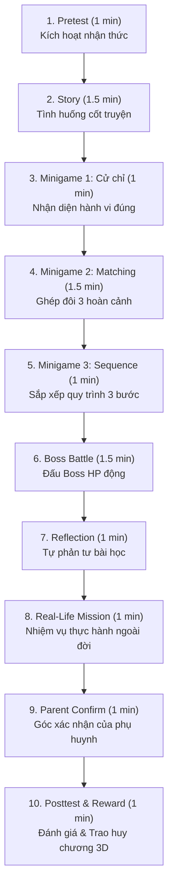

# Quy Chuẩn Bài Học 10 Giai Đoạn (NLAS 10-Stage Engine)

> **Mục tiêu**: Định nghĩa cấu trúc, mục đích sư phạm, dạng tương tác gameplay và thời lượng chuẩn của từng màn chơi trong 1 bài học NovaStars (Tổng thời gian học: 6 – 10 phút).

---

## 1. Bản Đồ 10 Giai Đoạn Bài Học (Lesson Lifecycle)

---

## 2. Chi Tiết Từng Giai Đoạn (Stage-by-Stage Specifications)

### Giai Đoạn 1: Đánh Giá Ban Đầu (`pretest`)
- **Mục tiêu sư phạm**: Đánh giá kiến thức nền có sẵn (Prior Knowledge) của trẻ.
- **Cấu trúc**: 1 câu hỏi tình huống thực tế + 4 lựa chọn (A, B, C, D) + 1 giải thích sư phạm (`explanation`).
- **Luật**: Chọn đúng $\rightarrow$ Rung Haptic Success + Sang bài. Chọn sai $\rightarrow$ Rung Haptic Error + Hướng dẫn đọc lại.

### Giai Đoạn 2: Cốt Truyện Phiêu Lưu (`story`)
- **Mục tiêu sư phạm**: Tạo sự đồng cảm (Empathy) và bối cảnh hóa bài học qua câu chuyện của nhân vật bé (Su/Kem/Bi) và Linh vật Sao Nova.
- **Cấu trúc**: 3–4 lượt đối thoại ngắn ($\le 25$ từ/lượt) $\rightarrow$ Đưa ra tình huống khó xử (Dilemma) $\rightarrow$ 2 lựa chọn hành vi (`choices`).

### Giai Đoạn 3: Trò Chơi 1 - Chọn Cử Chỉ Đúng (`minigame_drag`)
- **Mục tiêu sư phạm**: Nhận biết và chọn lọc các hành vi/cử chỉ đúng đắn vào ô "Bí Kíp".
- **Cấu trúc**: 4 thẻ cử chỉ (2 thẻ đúng `isCorrect: true`, 2 thẻ gây nhiễu `isCorrect: false`).
- **Luật**: Bé chạm chọn đủ 2 thẻ đúng thì tự động chuyển sang giai đoạn 4.

### Giai Đoạn 4: Trò Chơi 2 - Ghép Đôi Hoàn Cảnh (`minigame_match`)
- **Mục tiêu sư phạm**: Rèn luyện khả năng áp dụng kỹ năng vào từng đối tượng/hoàn cảnh cụ thể.
- **Cấu trúc**: 3 cặp ghép (`pairs`): Cột trái là hoàn cảnh (Thầy cô, Bạn bè, Người thân); Cột phải là câu nói/hành động tương ứng.
- **Luật**: Chạm 1 ô trái + 1 ô phải. Đúng $\rightarrow$ Khóa màu xanh + Haptic Success. Hoàn thành 3/3 cặp $\rightarrow$ Chuyển màn.

### Giai Đoạn 5: Trò Chơi 3 - Sắp Xếp Quy Trình Chuẩn (`minigame_sequence`)
- **Mục tiêu sư phạm**: Hình thành tư duy thuật toán và quy trình từng bước (Step-by-step procedure).
- **Cấu trúc**: 3 bước hành động bị xáo trộn vị trí (`steps` với `correctOrder: 1, 2, 3`).
- **Cơ chế tương tác**: **Tap-to-Swap** (chạm 2 thẻ bất kỳ để hoán đổi chỗ) hoặc bấm phím mũi tên Lên/Xuống $\rightarrow$ Bấm nút *"Xác Nhận Thứ Tự 3 Bước"*.

### Giai Đoạn 6: Thử Thách Boss Đảo (`boss`)
- **Mục tiêu sư phạm**: Kiểm tra năng lực tổng hợp (Synthesis) qua trận đấu kịch tính với Boss ảo.
- **Cấu trúc**: Tên Boss (`bossName`), Thanh máu HP (100 HP), Tình huống cao trào, và 2-3 lựa chọn chiến thuật.
- **Luật**: Chọn đúng $\rightarrow$ Boss mất HP, hiệu ứng nảy sáng và âm thanh chiến thắng.

### Giai Đoạn 7: Phản Tư & Bài Học (`reflection`)
- **Mục tiêu sư phạm**: Đúc kết ý nghĩa nhận thức (Metacognition) và cảm xúc tích cực của trẻ.
- **Cấu trúc**: 1 câu hỏi suy ngẫm + 3 lựa chọn thể hiện tinh thần tự tin, tự giác, tích cực.

### Giai Đoạn 8: Nhiệm Vụ Đời Thực (`challenge`)
- **Mục tiêu sư phạm**: Cầu nối từ thế giới ảo sang hành động thực tế ngoài đời sống (Transfer of Learning).
- **Cấu trúc**: 1 thẻ nhiệm vụ rõ ràng (`missionText`) + 1 lời nhắc ngắn gọn (`guideText`) + Nút CTA *"Em Sẵn Sàng Thực Hành! 🚀"*.

### Giai Đoạn 9: Góc Đồng Hành Cùng Phụ Huynh (`parent_confirm`)
- **Mục tiêu sư phạm**: Thu hút gia đình tham gia vào quá trình rèn luyện kỹ năng của con, tạo bằng chứng hành vi (Evidence).
- **Cấu trúc**: Lời nhắn gửi ba mẹ (`parentPrompt`) + Nút bấm xác nhận *"Bố/Mẹ Xác Nhận Bé Đã Làm Tốt!"*.

### Giai Đoạn 10: Đánh Giá Sau Bài & Trao Huy Chương (`posttest`)
- **Mục tiêu sư phạm**: Đánh giá kết quả học tập (Summative Assessment) và kích thích động lực học tiếp.
- **Cấu trúc**: 1 câu hỏi Post-test + Trao phần thưởng: Điểm XP (e.g. +100 XP), Ngôi sao (3 Stars), Huy chương 3D (`badgeName`, `badgeIcon`) + Bắn pháo hoa Confetti.
